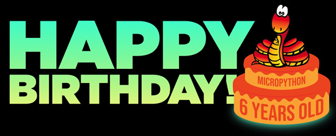
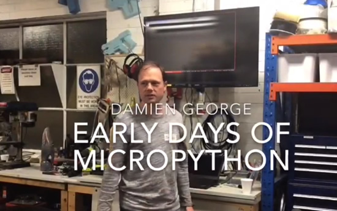
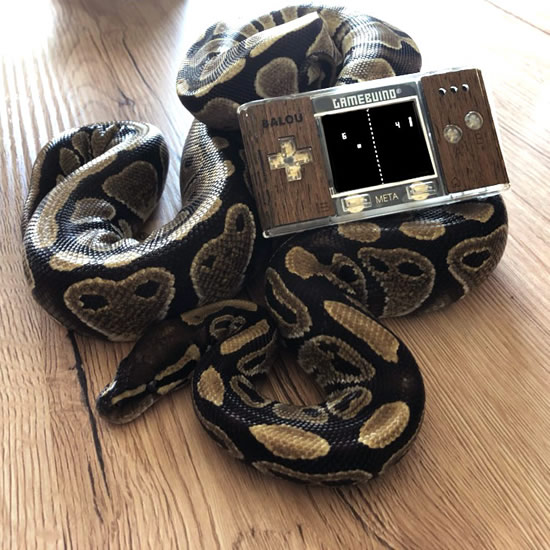
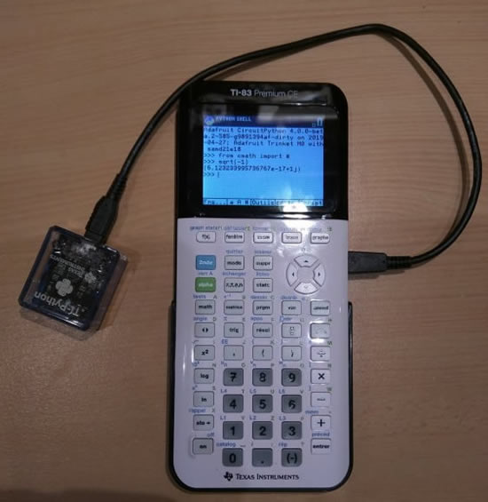
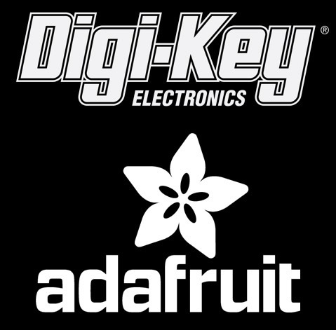
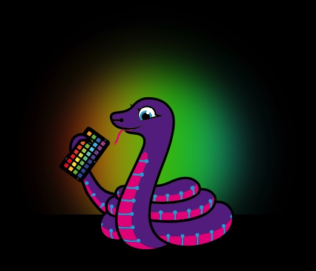

## Happy 6th Birthday MicroPython!

We celebrated MicroPython's 6th birthday on April 29th! Here are some important milestone dates we checked with the creator, Damien!

- 29th April 2013: first line of code written (in private, before anyone knew about it, before it was even called Micro-Python)
- 17th Sept 2013: first code running on a microcontroller, on the very first prototype of the pyboard
- 2nd Oct 2013: register micropython.org
- 4th Oct 2013: first commit in what is now the main repository
- late Dec 2013: source code up on GitHub
- 21st June 2014: last of the Kickstarter rewards sent out (for the first Kickstarter)

The Early Days of MicroPython - [YouTube](https://youtu.be/NBAqOYYW6vM).

>_April 29, 2019 is the sixth 'birthday' of MicroPython. At the April Melbourne Meetup, Damien George, creator of MicroPython, delves into his archives and shows the earliest code and notes about the goals of the language. The material pre-dates the first git commit! Listen in as Damien reveals how and why the language began and evolved. It's a nice way to celebrate MicroPython's sixth birthday!_

[In newsletter #8 from MicroPython, Damien published](https://forum.micropython.org/viewtopic.php?f=19&t=6356) some never-before-seen details about the start of MicroPython.

Here is an excerpt from the initial notes. The title is "Python board" and the date is 29 April 2013:

Python board                                        29/4/2013

The smallest, cheapest python.

A piece of hardware that is small and cheap, runs python scripts, and has good low-level access to hardware.  If we can do it with a single chip, that would keep it small and cheap.  Need then something with a large amount of flash and a decent amount of RAM, that also is cheap enough.  Atmel SAM's have order 1MiB flash and 128KiB SRAM, for around $10 one-off.

Main features:
* Implements Python 3 core language.
* Flash presents as a flash drive with vfat filesystem.
* Put python scripts on flash and it runs them (maybe have a (multicolour?) led that flashes on error and writes a "core" dump to the flash).  This led can also double as a user output led.
* Can run multiple scripts on once.

Our strength would be small, cheap, simple, easy to replicate.

Can have a range of boards with different features.  But all must be basically compatible and capable of running the same
scripts.

Happy Birthday MicroPython! Thank you Damien for creating something special and open!

## Adafruit PyBadge for CircuitPython

It's here! What's the size of a credit card and can run CircuitPython? That's right, it's the [Adafruit PyBadge!](https://www.adafruit.com/product/4200) We wanted to see how much we could cram into a 3 3⁄8 × 2 1⁄8 inch rounded rectangle, to make an all-in-one dev board with a lot of possibilities, and this is what we came up with.

The PyBadge is a compact board, like we said, it's credit card sized. It's powered by our favorite chip, the ATSAMD51, with 512KB of flash and 192KB of RAM. We add 2 MB of QSPI flash for file storage, handy for images, fonts, sounds, or game assets.

On the front you get a 1.8" 160x128 color TFT display with dimmable backlight - we have fast DMA support for drawing so updates are incredibly fast. There's also 8 silicone-top buttons, they are clicky but have a soft button top so they're nice and grippy. The buttons are arranged to mimic a gaming handheld, with a d-pad, 2 menu-select buttons and 2 fire-action buttons. There's also 5 NeoPixel LEDs to dazzle or track activity.

On the back we have a full Feather-compatible header socket set, so you can plug in any FeatherWing to expand the capabilities of the PyBadge. There's also 3 STEMMA connectors - two 3-pin with ADC/PWM capability and one 4-pin that connects to I2C - you can use this for Grove sensors as well.

## CircuitPython snakes its way to wearables!

_Wearable Tech Projects_, from the makers of HackSpace magazine, is a [164-page book](https://hackspace.raspberrypi.org/features/wearable-tech-projects) packed with projects for the fashionable electronics enthusiast, with more than 30 projects which will blink, flash, and spark joy in your life. You’ll discover new techniques for working with fabric, find out about the best microcontrollers for your projects, and learn the basics of CircuitPython, the language developed at Adafruit for physical computing. There’s no ‘Hello, World!’ or computer theory here; this is all about practical results and making unique, fascinating things to wear - [Wearable Tech Projects](https://store.rpipress.cc/products/wearable-tech-projects-2019), & [PDF](https://magazines-static.raspberrypi.org/issues/full_pdfs/000/000/073/original/Wearable_Tech_Projects.pdf).

## Python is available on Gamebuino

[Code with Python at Gamebuino!](https://gamebuino.com/fr/news/coder-en-python-des-maintenant) The first workshop: [Discover programming in Python](https://gamebuino.com/academy/workshop/discover-python-programming) was created and published by Sylvain, member of the Gamebuino team - [gamebuino.com/academy=(https://gamebuino.com/academy/workshop/discover-python-programming)

## Need a Lift?

MOAR CircuitPython hardware! [Adafruit Metro M4 Express AirLift (WiFi)](https://www.adafruit.com/product/4000) - Lite is here! Give your next project a lift with AirLift - our witty name for the ESP32 co-processor that graces this Metro M4. You already know about the Adafruit Metro M4 featuring the Microchip ATSAMD51, with it's 120MHz Cortex M4 with floating point support. With a train-load of FLASH and RAM, your code will be fast and roomy. And what better way to improve it than to add wireless? Now cooked in directly on board, you get a certified WiFi module that can handle all your TLS and socket needs, it even has root certificates pre-loaded.

## News from around the web!

TI Planet has a review (translated) of the new TI-Python for the TI-83 Python Premimum Calculator which happens to use CircuitPython. _"The implementation Python the plugin TI-Python for your TI-83 Premium CE is richer than the competition in terms of number of modules."_ - [tiplanet.org](https://tiplanet.org/forum/viewtopic.php?t=22544&p=241902)

Progress on the game boy: able to turn the screen on and off during vblank from CircuitPython - [Twitter](https://twitter.com/tannewt/status/1120831876766109697).

Real-time 3D on the PewPew with MicroPython on ESP8266 - [Twitter](https://twitter.com/isziaui/status/1122519819180548096).

[MicroPython and the Internet of Things, Part I: Welcome](https://blog.miguelgrinberg.com/post/micropython-and-the-internet-of-things-part-i-welcome) by Miguel Grinberg & [YouTube](https://youtu.be/2GGddh7XqQA).

VGA Controller, PS/2 Keyboard Controller, Graphics Library, Game Engine and ANSI/VT Terminal for the ESP32 - [Twitter](https://twitter.com/ESP32net/status/1096478668430471170).

7-Segment-like display using MicroPython - [YouTube](https://youtu.be/KJNYFrzUo4I).

pygame 1.9.6 released - [pygame.org](https://www.pygame.org/news/2019/4/pygame-1-9-6-released-with-a-few-regression-bug-fixes)

Creating a GUI Application for NASA’s API with wxPython - [MouseVsPython](https://www.blog.pythonlibrary.org/2019/04/18/creating-a-gui-application-for-nasas-api-with-wxpython/).

What do companies expect from Python devs in 2019? - [cvcompiler.com](https://cvcompiler.com/blog/what-do-companies-expect-from-python-devs-in-2019/)

Need a small keyboard? Build your own! - [Hackaday](https://hackaday.com/2019/04/23/reaction-video-build-your-own-custom-fortnite-controller-for-a-raspberry-pi/).

The WIRED Guide to Open Source Software - [WIRED](https://www.wired.com/story/wired-guide-open-source-software/).

#ICYDNCI What was the most popular, most clicked link, in [last week's newsletter?](https://www.adafruitdaily.com/2019/04/23/new-edublocks-new-python-powered-boards-and-stellar-reviews-of-pyportal-python-adafruit-circuitpython-circuitpython-micropython-thepsf-adafruit/) [EduBlocks, Making the transition from Blocks to Python easier](https://edublocks.org/).

## Made with Mu

Programming MIDI with CircuitPython Trinket and the Mu editor at Moogfest - [Twitter](https://twitter.com/llanga/status/1121808964558127104).

## New Learn Guides!

[PyPortal Phillips Hue Lighting Controller](https://learn.adafruit.com/pyportal-philips-hue-lighting-controller) from [Brent Rubell](https://learn.adafruit.com/users/brubell)

## Updated Guides - Now With More Python!

**You can use CircuitPython libraries on Raspberry Pi!** We're updating all of our CircuitPython guides to show how to wire up sensors to your Raspberry Pi, and load the necessary CircuitPython libraries to get going using them with Python. We'll be including the updates here so you can easily keep track of which sensors are ready to go. Check it out!

Keep checking back for more updated guides!

## CircuitPython Libraries!

[{:width="418px"}](https://github.com/adafruit/Adafruit_CircuitPython_Bundle/releases/latest)

CircuitPython support for hardware continues to grow. We are adding support for new sensors and breakouts all the time, as well as improving on the drivers we already have. As we add more libraries and update current ones, you can keep up with all the changes right here!

For the latest drivers, download the [Adafruit CircuitPython Library Bundle](https://github.com/adafruit/Adafruit_CircuitPython_Bundle/releases/latest).

If you'd like to contribute, CircuitPython libraries are a great place to start. Have an idea for a new driver? File an issue on [CircuitPython](https://github.com/adafruit/circuitpython/issues)! Interested in helping with current libraries? Check out [this GitHub issue on CircuitPython](https://github.com/adafruit/circuitpython/issues/1246) for an overview of the State of the CircuitPython Libraries, updated each week. We've included open issues from the library issue lists, and details about repo-level issues that need to be addressed. We have a guide on [contributing to CircuitPython with Git and Github](https://learn.adafruit.com/contribute-to-circuitpython-with-git-and-github) if you need help getting started. You can also find us in the #circuitpython channel on the [Adafruit Discord](https://adafru.it/discord). Feel free to contact Kattni (@kattni) with any questions.

You can check out this [list of all the CircuitPython libraries and drivers available](https://github.com/adafruit/Adafruit_CircuitPython_Bundle/blob/master/circuitpython_library_list.md). 

The current number of CircuitPython libraries is **155**!

**New Libraries!**

Here's this week's new CircuitPython libraries:

* [Adafruit CircuitPython LPS35HW](https://github.com/adafruit/Adafruit_CircuitPython_LPS35HW)
* [Adafruit CircuitPython HX8357](https://github.com/adafruit/Adafruit_CircuitPython_HX8357)
* [Adafruit CircuitPython ILI9341](https://github.com/adafruit/Adafruit_CircuitPython_ILI9341)
* [Adafruit CircuitPython SSD1331](https://github.com/adafruit/Adafruit_CircuitPython_SSD1331)
* [Adafruit CircuitPython SSD1351](https://github.com/adafruit/Adafruit_CircuitPython_SSD1351)
* [Adafruit CircuitPython ST7735](https://github.com/adafruit/Adafruit_CircuitPython_ST7735)
* [Adafruit CircuitPython ST7735R](https://github.com/adafruit/Adafruit_CircuitPython_ST7735R)
* [Adafruit CircuitPython ST7789](https://github.com/adafruit/Adafruit_CircuitPython_ST7789)
* [Adafruit CircuitPython Hue](https://github.com/adafruit/Adafruit_CircuitPython_Hue)

**Updated Libraries!**

Here's this week's updated CircuitPython libraries:

* [Adafruit CircuitPython ESP32SPI](https://github.com/adafruit/Adafruit_CircuitPython_ESP32SPI)
* [Adafruit CircuitPython MIDI](https://github.com/adafruit/Adafruit_CircuitPython_MIDI)
* [Adafruit CircuitPython BLE](https://github.com/adafruit/Adafruit_CircuitPython_BLE)
* [Adafruit CircuitPython PyPortal](https://github.com/adafruit/Adafruit_CircuitPython_PyPortal)

**PyPI Download Stats!**

We've written a special library called Adafruit Blinka that makes it possible to use CircuitPython Libraries on [Raspberry Pi and other compatible single-board computers](https://learn.adafruit.com/circuitpython-on-raspberrypi-linux/). Adafruit Blinka and all the CircuitPython libraries have been deployed to PyPI for super simple installation on Linux! Here are the top 10 CircuitPython libraries downloaded from PyPI in the last week, including the total downloads for those libraries:

| Library                                     | Last Week   | Total |   
|:-------                                     |:--------:   |:-----:|   
| Adafruit-Blinka                             | 1699        | 29774 |   
| Adafruit_CircuitPython_Register             | 347         | 4599 |    
| Adafruit_CircuitPython_NeoPixel             | 289         | 4608 |    
| Adafruit_CircuitPython_Motor                | 267         | 2802 |    
| Adafruit_CircuitPython_PCA9685              | 267         | 2429 |    
| Adafruit_CircuitPython_BusDevice            | 216         | 9883 |    
| Adafruit_CircuitPython_ServoKit             | 175         | 1984 |    
| Adafruit_CircuitPython_CharLCD              | 134         | 8387 |    
| Adafruit_CircuitPython_MotorKit             | 134         | 2024 |    
| Adafruit_CircuitPython_framebuf             | 110         | 840 |     

## Upcoming events!

Open Hacking 129 - Fun with CircuitPython - Saturday, May 4, 2019Dj hosted by Dj W HackWimbledon. Making, creating and illuminating is what HackWimbledon is about and thats what we do at HackWimbledon sessions. This time round they have a theme - CircuitPython - [MeetUp](https://www.meetup.com/HackWimbledon/events/260971328/).

## Digi-Key + Adafruit @ PyCon!

PyCon 2019 returns May 1–9, 2019 to Cleveland, OH – with talks, tutorials, sprints, and more! 

Big news! Digi-Key and Adafruit have teamed up for PyCon 2019 so every attendee (about 4,000!) will receive a [SPECIAL EDITION Circuit Playground Express](https://youtu.be/ZMx6qB-7z9U), running … CircuitPython.

This effort is to get Python on hardware to the most folks out there, at the events that bring people together.

This is just one of many efforts we’re teaming up with Digi-Key to continue to fuel all the developers from beginners to pro, using Python on microcontrollers.

What else is happening? The CircuitPython team will be running several Open Spaces sessions (as they did last year), showing how to use CircuitPython on the Digi-Key / Adafruit PyCon special edition Circuit Playground Express. We’ll have extra addons to play with also: potentiometers, NeoPixel strips, and servos. The team will be running a CircuitPython Sprint for several days to work on CircuitPython libraries and CircuitPython core code. BYOMUSB “Bring your own Micro USB” cables, we’ll have some to borrow during the sprints/sessions, as well as some USB C adapters, good idea to bring one too!

The PyCon 2019 conference, which will take place in Cleveland, is the largest annual gathering for the community using and developing the open-source Python programming language. It is produced and underwritten by the Python Software Foundation, the 501(c)(3) nonprofit organization dedicated to advancing and promoting Python. Through PyCon, the PSF advances its mission of growing the international community of Python programmers.

Scott will be leading a talk at the **Python Language Summit, History of CircuitPython**. The Python Language Summit is an event for the developers of Python implementations (CPython, PyPy, Jython, and so on) to share information, discuss our shared problems, and — hopefully — solve them - [pycon.org/2019/events/language-summit](https://us.pycon.org/2019/events/language-summit/)

We will have a lot more updates, stay tuned to the [Adafruit blog](https://blog.adafruit.com/category/circuitpython/), [Twitter](https://twitter.com/adafruit), [Discord](http://adafru.it/discord), and more!

## Latest releases

CircuitPython's stable release is [#.#.#](https://github.com/adafruit/circuitpython/releases/latest) and its unstable release is [#.#.#-##.#](https://github.com/adafruit/circuitpython/releases). New to CircuitPython? Start with our [Welcome to CircuitPython Guide](https://learn.adafruit.com/welcome-to-circuitpython).

[2019####](https://github.com/adafruit/Adafruit_CircuitPython_Bundle/releases/latest) is the latest CircuitPython library bundle.

[v#.#.#](https://micropython.org/download) is the latest MicroPython release. Documentation for it is [here](http://docs.micropython.org/en/latest/pyboard/).

[#.#.#](https://www.python.org/downloads/) is the latest Python release. The latest pre-release version is [#.#.#](https://www.python.org/download/pre-releases/).

[1177 Stars](https://github.com/adafruit/circuitpython/stargazers) Like CircuitPython? [Star it on GitHub!](https://github.com/adafruit/circuitpython)

## circuitpython.org updates!

Downloads are now available from [circuitpython.org](https://circuitpython.org)! This site makes it much easier to select the correct file and language for your board. The downloads page is [here](https://circuitpython.org/downloads). Here are the latest boards added! **There are 53+ boards!**

## Call for help – CircuitPython messaging to other languages!

We [posted on the Adafruit blog](https://blog.adafruit.com/2018/08/15/help-bring-circuitpython-messaging-to-other-languages-circuitpython/) about bringing CircuitPython messaging to other languages, one of the exciting features of CircuitPython 4.x is translated control and error messages. Native language messages will help non-native English speakers understand what is happening in CircuitPython even though the Python keywords and APIs will still be in English. If you would like to help, [please post](https://github.com/adafruit/circuitpython/issues/1098) to the main issue on GitHub and join us on [Discord](https://adafru.it/discord).

We made this graphic with translated text, we could use your help with that to make sure we got the text right, please check out the text in the image – if there is anything we did not get correct, please let us know. Dan sent me this [handy site too](http://helloworldcollection.de/#Human).

## jobs.adafruit.com

[jobs.adafruit.com](https://jobs.adafruit.com/) has returned and folks are posting their skills (including CircuitPython) and companies are looking for talented makers to join their companies - from Digi-Key, to Hackaday, Microcenter, Raspberry Pi and more. Not sure how to use the jobs board? We now have a video! - [YouTube](https://youtu.be/5tjzGarsBEM).

## 11,927 thanks!

The Adafruit Discord community, where we do all our CircuitPython development in the open, reached over 11,927 humans, thank you! Join today! [https://adafru.it/discord](https://adafru.it/discord)

## Updates to awesome-circuitpython

We updated [awesome-circuitpython](https://github.com/adafruit/awesome-circuitpython/), the comprehensive, currated collection of all things CircuitPython - [GitHub](https://github.com/adafruit/awesome-circuitpython/).

This week we have, or are in the process of, updating the boards in the hardware list as well as additonal news items.

## ICYMI - In case you missed it

The wonderful world of Python on hardware! This is our first video-newsletter-podcast that we’ve started! The news comes from the Python community, Discord, Adafruit communities and more. It’s part of the weekly newsletter, then we have a segment on ASK an ENGINEER and this is the video slice from that! The complete Python on Hardware weekly VideoCast [playlist is here](https://www.youtube.com/playlist?list=PLjF7R1fz_OOXRMjM7Sm0J2Xt6H81TdDev). 

This video podcast is on [iTunes](https://itunes.apple.com/us/podcast/python-on-hardware/id1451685192?mt=2), [YouTube](https://www.youtube.com/playlist?list=PLjF7R1fz_OOXRMjM7Sm0J2Xt6H81TdDev), [IGTV (Instagram TV](https://www.instagram.com/adafruit/channel/)), and [XML](https://itunes.apple.com/us/podcast/python-on-hardware/id1451685192?mt=2).

[Weekly community chat on Adafruit Discord server CircuitPython channel - Audio / Podcast edition](https://itunes.apple.com/us/podcast/circuitpython-weekly-meeting/id1451685016) - Audio from the Discord chat space for CircuitPython, meetings are usually Mondays at 2pm ET, this is the audio version on [iTunes](https://itunes.apple.com/us/podcast/circuitpython-weekly-meeting/id1451685016), Pocket Casts, [Spotify](https://adafru.it/spotify), and [XML feed](https://adafruit-podcasts.s3.amazonaws.com/circuitpython_weekly_meeting/audio-podcast.xml).

## Contribute!

The CircuitPython Weekly Newsletter is a CircuitPython community-run newsletter emailed every Tuesday. The complete [archives are here](https://www.adafruitdaily.com/category/circuitpython/). It highlights the latest CircuitPython related news from around the web including Python and MicroPython developments. To contribute, edit next week's draft [on GitHub](https://github.com/adafruit/circuitpython-weekly-newsletter/tree/gh-pages/_drafts) and [submit a pull request](https://help.github.com/articles/editing-files-in-your-repository/) with the changes. Join our [Discord](https://adafru.it/discord) or [post to the forum](https://forums.adafruit.com/viewforum.php?f=60) for any further questions.
