Feature story text here
update title

## CircuitPython at Pycon with Microsoft!

[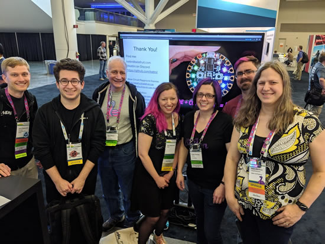](https://twitter.com/nnja/status/1124425657377873920)

[Nina Zakharenko / @nnja](https://twitter.com/nnja/status/1124425657377873920) -
>_Thank you so much @adafruit and @kattni for teaching an incredible hands on workshop at the #Microsoft booth today. It was fantastic_

## How it's made - thousands of Digi-Key & Adafruit CircuitPython powered Circuit Playgrounds for PyCon 2019 in Cleveland, Ohio

[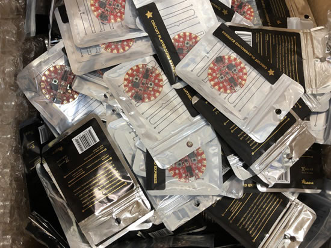](https://blog.adafruit.com/2019/05/02/how-its-made-the-thousands-of-digikey-adafruit-circuit-playgrounds-for-pycon-2019-in-cleveland-ohio-pycon2019-pycon/)

[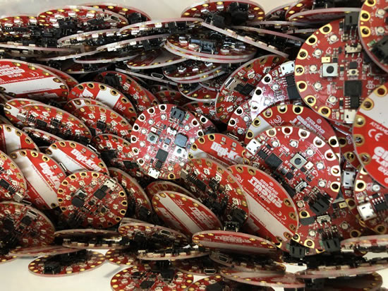](https://blog.adafruit.com/2019/05/02/how-its-made-the-thousands-of-digikey-adafruit-circuit-playgrounds-for-pycon-2019-in-cleveland-ohio-pycon2019-pycon/)

[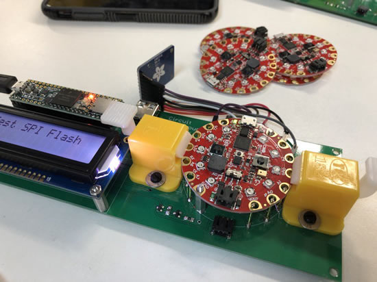](https://blog.adafruit.com/2019/05/02/how-its-made-the-thousands-of-digikey-adafruit-circuit-playgrounds-for-pycon-2019-in-cleveland-ohio-pycon2019-pycon/)

[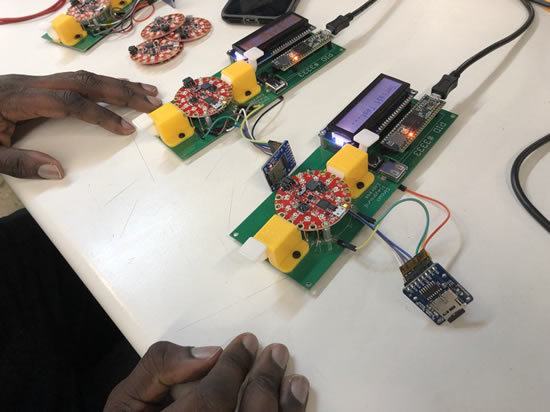](https://blog.adafruit.com/2019/05/02/how-its-made-the-thousands-of-digikey-adafruit-circuit-playgrounds-for-pycon-2019-in-cleveland-ohio-pycon2019-pycon/)

[PyCon 2019](https://us.pycon.org/2019/) is happening right now and here are some of the photos (and [video](https://youtu.be/jdoelAIf8Nk)) of how Adafruit made and sent thousands of Circuit Playground Express devices, special Digi-Key + Adafruit edition, all running CircuitPython. Getting them to PyCon with the special edition code, firmware, on time, and on budget was a unique challenge and the team did it! Thank you so much Digi-Key for helping to make this happen for all the PyCon attendees!

[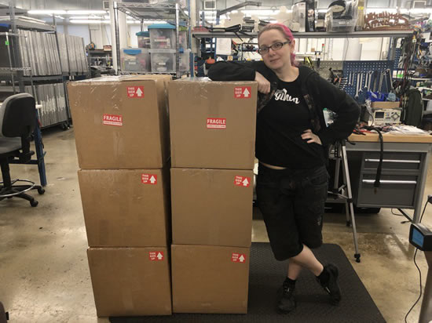](https://blog.adafruit.com/2019/05/02/how-its-made-the-thousands-of-digikey-adafruit-circuit-playgrounds-for-pycon-2019-in-cleveland-ohio-pycon2019-pycon/)

*2 LAUs (Ladyada Units).*

## CircuitPython for Gamebuino

[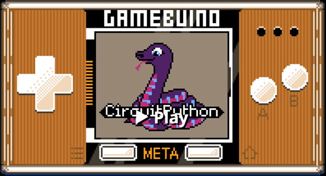](https://gamebuino.com/creations/circuitpython-for-gamebuino)

In progress [0.0.5 update](https://gamebuino.com/community/topic/circuit-python-for-gamebuino#c19151), guides, and more: CircuitPython for Gamebuino - [gamebuino.com](https://gamebuino.com/creations/circuitpython-for-gamebuino).

## CircuitPython snakes its way to Crowd Supply – For the Greater Goods

[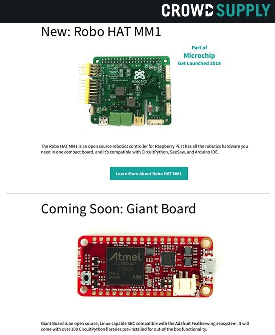](https://www.crowdsupply.com/)

The [latest Crowd Supply newsletter](https://www.crowdsupply.com/) arrived and they’re both CircuitPython powered!

>_[The Robotics Masters Robo HAT MM1](https://www.crowdsupply.com/robotics-masters/robo-hat-mm1) is an open source robotics controller board for Raspberry Pi. It removes the initial barriers to starting any robotics project by providing all the hardware you need in one simple, easy-to-use form factor. The board is also compatible with Jetson Nano and can even be used standalone. The Robo HAT MM1 removes the need for a PWM driver, external power, or voltage regulators, and adds additional functionality. Wide compatibility with many open source software libraries such as CircuitPython, SeeSaw, and Arduino IDE means that you can use Robo HAT MM1 in the way that works best for your specific project. The hardware schematics and software will be fully available and open source._

>_[The Giant Board](https://www.crowdsupply.com/groboards/giant-board) will come with over 100 CircuitPython libraries pre-installed and support many popular FeatherWings. Linux drivers interface directly with the Ethernet and LCD FeatherWings, and they can be easily enabled or disabled via a simple text file. Most FeatherWings will work out of the box with Adafruit’s CircuitPython example code._

## PyPortal giveaway

[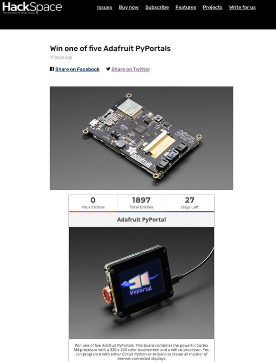](https://hsmag.cc/win)

HackSpace is giving PyPortals, you have about 30 days left to enter! - [hsmag.cc/win](https://hsmag.cc/win)

## CircuitPython activity book for the TI-83 Premium Calculator

[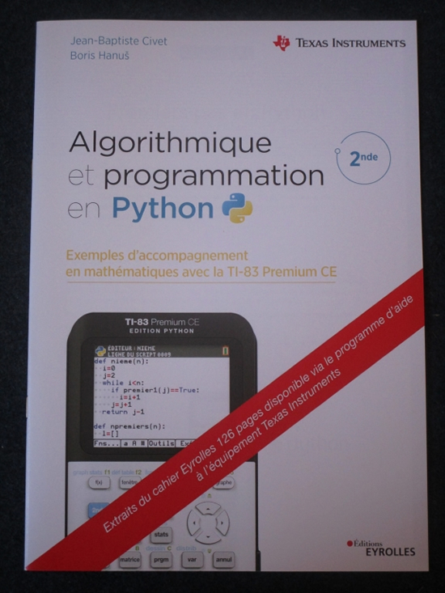](https://tiplanet.org/forum/viewtopic.php?t=22573&p=242076)

[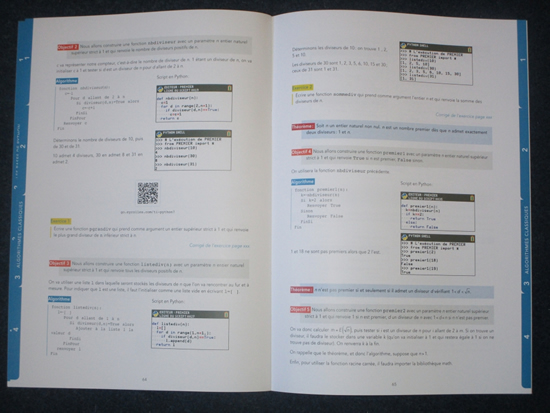](https://tiplanet.org/forum/viewtopic.php?t=22573&p=242076)

[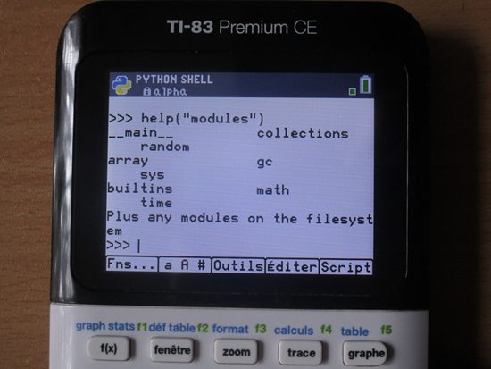](https://tiplanet.org/forum/viewtopic.php?t=22573&p=242076)

CircuitPython is shipping on the Texas Instruments TI-83 Premium calculator and the amazing community over on TI-Planet consistently have the scoop, photos, and details on all things Python on calculators. Here's what is included in the upcoming booklet, translated from French - [tiplanet.org](https://tiplanet.org/forum/viewtopic.php?t=22573&p=242076) via [Twitter](https://twitter.com/tiplanetnews/status/1124626362071838720).

>_The booklet is organized in 4 chapters: First steps in Python: Deals with both models for programming Python, TI-83 Premium CE with external module TI-Python and TI-83 Premium CE Python Edition, with the necessary updates or connections as the case may be. Also discusses the operation of the applicationPyadaptr or Python dedicated, and guide step by step in the writing of his first function. The basics of Python: Present here the language Python with his main instructions to the high school program (conditional, loops, lists ...) each time accompanied by examples as well as his writing in indentation. Classic algorithms: Here is the programming of classical algorithms (prime numbers, PGCD, PPCM, roots of a polynomial ...). Go further with the algorithmic: Proposes to think outside the box around three projects, the first dealing with affine cryptography._

## News from around the web!

[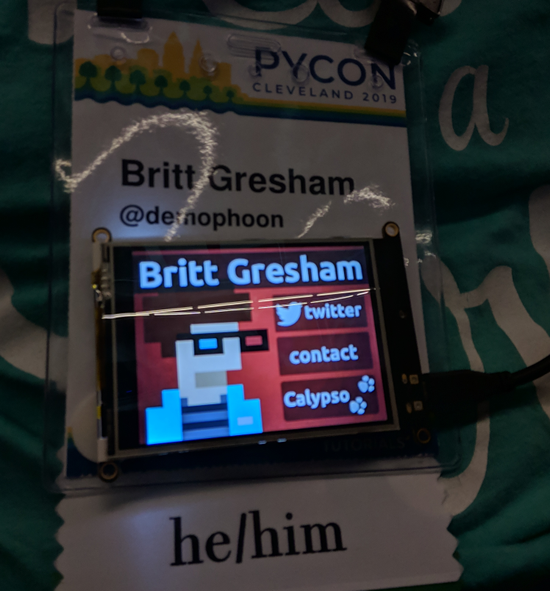](https://github.com/demophoon/pyportal-badge)

Britt got tired of fumbling around with business cards at conferences, solution? Create an interactive digital business card instead using CircuitPython and PyPortal - [GitHub](https://github.com/demophoon/pyportal-badge).

[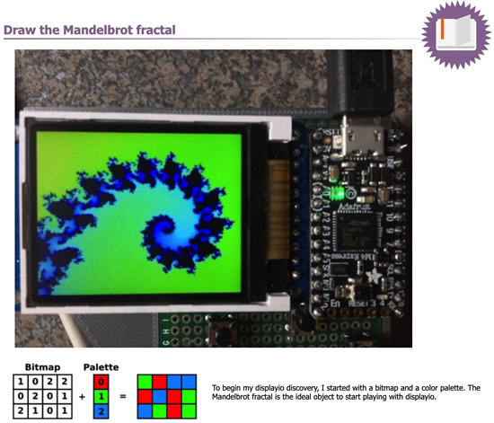](https://lecluseo.scenari-community.org/CircuitPython/co/g_mandelbrot.html)

[Make things smart with Python](https://lecluseo.scenari-community.org/CircuitPython/co/g_mandelbrot.html), draw the Mandelbrot fractal with CircuitPython.

[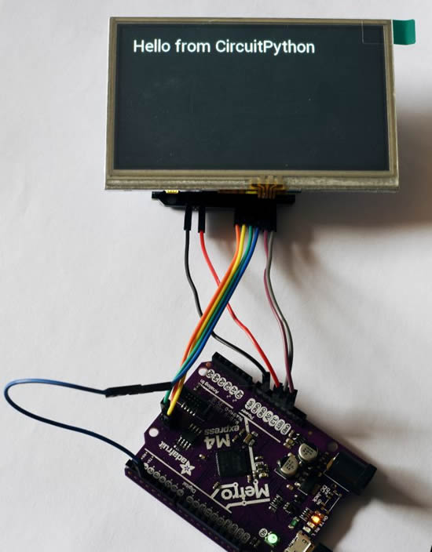](https://excamera.com/sphinx/index.html)

[Excamera Labs](https://excamera.com/sphinx/index.html) newsletter features some kind words about CircuitPython! Thanks James!

>_The CircuitPython development environment is brilliantly simple. You just copy the source files onto the 2 Megabyte USB drive, and CircuitPython detects that they have changed and auto-reloads them. This is so much easier than the Arduino, and it’s even easier than MicroPython itself, which (as far as I know) doesn’t support auto-reload._

Sandbox for "CircuitPython for Gamebuino" - [GitHub](https://gist.github.com/sugarflower/067d66e986c6b69e17f552f0e5ab7b29).

[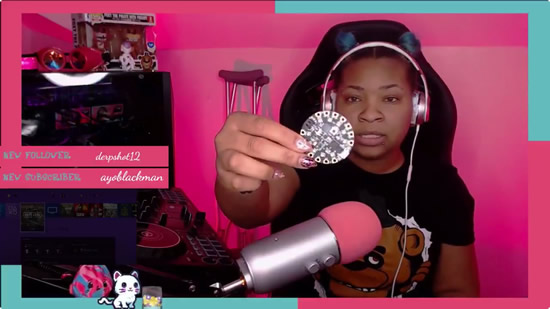](https://twitter.com/MetaDevGirl/status/1124111472332869632)

Jeseekia [@MetaDevGirl](https://twitter.com/MetaDevGirl)'s unboxing and review of the Circuit Playground Express featuring CircuitPython - [Twitter](https://twitter.com/MetaDevGirl/status/1124111472332869632).

[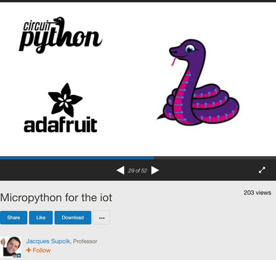](https://www.slideshare.net/jacquessupcik/micropython-for-the-iot)

Presentation of MicroPython during the 16th Fribourg Linux Seminar by Jacques Supcik, Professor - [Slides](https://www.slideshare.net/jacquessupcik/micropython-for-the-iot) via [Twitter](https://twitter.com/openhwsw/status/1123958648429076486).

Pyxel is a retro game engine for Python. Thanks to its simple specifications inspired by retro gaming consoles, such as only 16 colors can be displayed and only 4 sounds can be played back at the same time, you can feel free to enjoy making pixel art style games - [GitHub](https://github.com/kitao/pyxel).

Choosing a faster JSON library for Python by [Itamar Turner-Trauring](https://pythonspeed.com/articles/faster-json-library/).

Announcing JupyterHub 1.0 - [blog.jupyter.org](https://blog.jupyter.org/announcing-jupyterhub-1-0-8fff78acad7f)

[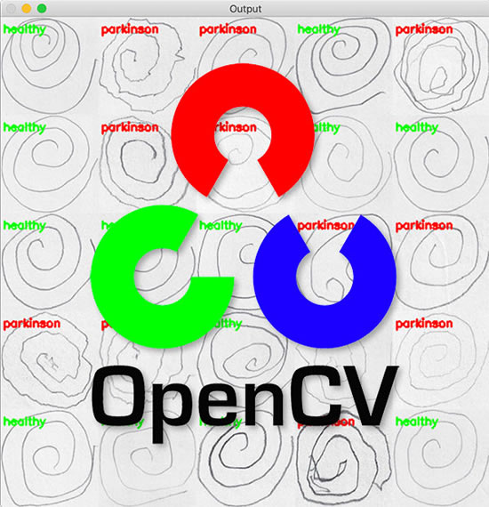](https://www.pyimagesearch.com/2019/04/29/detecting-parkinsons-disease-with-opencv-computer-vision-and-the-spiral-wave-test/)

[Detecting Parkinson’s Disease with OpenCV](https://www.pyimagesearch.com/2019/04/29/detecting-parkinsons-disease-with-opencv-computer-vision-and-the-spiral-wave-test/), Computer Vision, and the Spiral/Wave Test by Adrian Rosebrock.

#ICYDNCI What was the most popular, most clicked link, in [Happy 6th Birthday MicroPython! Python for wearables, and need a lift?](https://www.adafruitdaily.com/2019/04/30/happy-6th-birthday-micropython-python-for-wearables-and-need-a-lift-python-adafruit-circuitpython-circuitpython-micropython-thepsf-adafruit/)? [CircuitPython.org Downloads](https://circuitpython.org/downloads)!

## Made with Mu

Why Mu? Mu tries to make it as easy as possible to get started with programming but aims to help you graduate to "real" development tools soon after. Everything in Mu is the "real thing" but presented in as simple and obvious way possible. It's like the toddling stage in learning to walk: you're finding your feet and once you're confident, you should move on and explore! Put simply, Mu aims to foster autonomy. Try out Mu today! - [codewith.mu](https://codewith.mu/)

## Coming soon

## New Learn Guides!

## Updated Guides - Now With More Python!

**You can use CircuitPython libraries on Raspberry Pi!** We're updating all of our CircuitPython guides to show how to wire up sensors to your Raspberry Pi, and load the necessary CircuitPython libraries to get going using them with Python. We'll be including the updates here so you can easily keep track of which sensors are ready to go. Check it out!

[title](url)

## CircuitPython Libraries!

[{:width="418px"}](https://github.com/adafruit/Adafruit_CircuitPython_Bundle/releases/latest)

CircuitPython support for hardware continues to grow. We are adding support for new sensors and breakouts all the time, as well as improving on the drivers we already have. As we add more libraries and update current ones, you can keep up with all the changes right here!

For the latest drivers, download the [Adafruit CircuitPython Library Bundle](https://github.com/adafruit/Adafruit_CircuitPython_Bundle/releases/latest).

If you'd like to contribute, CircuitPython libraries are a great place to start. Have an idea for a new driver? File an issue on [CircuitPython](https://github.com/adafruit/circuitpython/issues)! Interested in helping with current libraries? Check out [this GitHub issue on CircuitPython](https://github.com/adafruit/circuitpython/issues/1246) for an overview of the State of the CircuitPython Libraries, updated each week. We've included open issues from the library issue lists, and details about repo-level issues that need to be addressed. We have a guide on [contributing to CircuitPython with Git and Github](https://learn.adafruit.com/contribute-to-circuitpython-with-git-and-github) if you need help getting started. You can also find us in the #circuitpython channel on the [Adafruit Discord](https://adafru.it/discord). Feel free to contact Kattni (@kattni) with any questions.

You can check out this [list of all the CircuitPython libraries and drivers available](https://github.com/adafruit/Adafruit_CircuitPython_Bundle/blob/master/circuitpython_library_list.md). 

The current number of CircuitPython libraries is **###**!

**New Libraries!**

Here's this week's new CircuitPython libraries:

* [library](url)

**Updated Libraries!**

Here's this week's updated CircuitPython libraries:

* [library](url)

**PyPI Download Stats!**

We've written a special library called Adafruit Blinka that makes it possible to use CircuitPython Libraries on [Raspberry Pi and other compatible single-board computers](https://learn.adafruit.com/circuitpython-on-raspberrypi-linux/). Adafruit Blinka and all the CircuitPython libraries have been deployed to PyPI for super simple installation on Linux! Here are the top 10 CircuitPython libraries downloaded from PyPI in the last week, including the total downloads for those libraries:

KATTNI TABLE HERE

## Upcoming events!

## Latest releases

CircuitPython's stable release is [#.#.#](https://github.com/adafruit/circuitpython/releases/latest) and its unstable release is [#.#.#-##.#](https://github.com/adafruit/circuitpython/releases). New to CircuitPython? Start with our [Welcome to CircuitPython Guide](https://learn.adafruit.com/welcome-to-circuitpython).

[2019####](https://github.com/adafruit/Adafruit_CircuitPython_Bundle/releases/latest) is the latest CircuitPython library bundle.

[v#.#.#](https://micropython.org/download) is the latest MicroPython release. Documentation for it is [here](http://docs.micropython.org/en/latest/pyboard/).

[#.#.#](https://www.python.org/downloads/) is the latest Python release. The latest pre-release version is [#.#.#](https://www.python.org/download/pre-releases/).

[### Stars](https://github.com/adafruit/circuitpython/stargazers) Like CircuitPython? [Star it on GitHub!](https://github.com/adafruit/circuitpython)

## circuitpython.org updates!

[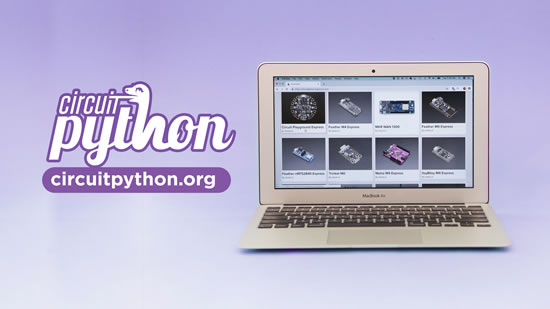](https://circuitpython.org/)

Downloads are now available from [circuitpython.org](https://circuitpython.org)! This site makes it much easier to select the correct file and language for your board. The downloads page is [here](https://circuitpython.org/downloads). Here are the latest boards added! **There are 53+ boards!**

## Call for help – CircuitPython messaging to other languages!

We [posted on the Adafruit blog](https://blog.adafruit.com/2018/08/15/help-bring-circuitpython-messaging-to-other-languages-circuitpython/) about bringing CircuitPython messaging to other languages, one of the exciting features of CircuitPython 4.x is translated control and error messages. Native language messages will help non-native English speakers understand what is happening in CircuitPython even though the Python keywords and APIs will still be in English. If you would like to help, [please post](https://github.com/adafruit/circuitpython/issues/1098) to the main issue on GitHub and join us on [Discord](https://adafru.it/discord).

We made this graphic with translated text, we could use your help with that to make sure we got the text right, please check out the text in the image – if there is anything we did not get correct, please let us know. Dan sent me this [handy site too](http://helloworldcollection.de/#Human).

## jobs.adafruit.com

[jobs.adafruit.com](https://jobs.adafruit.com/) has returned and folks are posting their skills (including CircuitPython) and companies are looking for talented makers to join their companies - from Digi-Key, to Hackaday, Microcenter, Raspberry Pi and more. Not sure how to use the jobs board? We now have a video! - [YouTube](https://youtu.be/5tjzGarsBEM).

## xx,xxx thanks!

The Adafruit Discord community, where we do all our CircuitPython development in the open, reached over xx,xxx humans, thank you! Join today! [https://adafru.it/discord](https://adafru.it/discord)

## Updates to awesome-circuitpython

We updated [awesome-circuitpython](https://github.com/adafruit/awesome-circuitpython/), the comprehensive, currated collection of all things CircuitPython - [GitHub](https://github.com/adafruit/awesome-circuitpython/).

## ICYMI - In case you missed it

[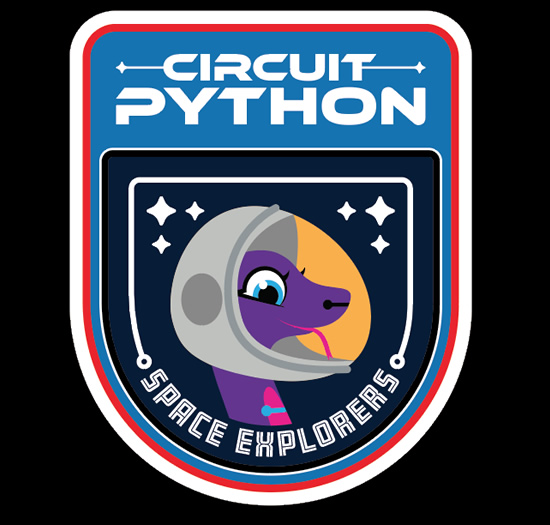](https://www.youtube.com/playlist?list=PLjF7R1fz_OOXRMjM7Sm0J2Xt6H81TdDev)

The wonderful world of Python on hardware! This is our first video-newsletter-podcast that we’ve started! The news comes from the Python community, Discord, Adafruit communities and more. It’s part of the weekly newsletter, then we have a segment on ASK an ENGINEER and this is the video slice from that! The complete Python on Hardware weekly VideoCast [playlist is here](https://www.youtube.com/playlist?list=PLjF7R1fz_OOXRMjM7Sm0J2Xt6H81TdDev). 

This video podcast is on [iTunes](https://itunes.apple.com/us/podcast/python-on-hardware/id1451685192?mt=2), [YouTube](https://www.youtube.com/playlist?list=PLjF7R1fz_OOXRMjM7Sm0J2Xt6H81TdDev), [IGTV (Instagram TV](https://www.instagram.com/adafruit/channel/)), and [XML](https://itunes.apple.com/us/podcast/python-on-hardware/id1451685192?mt=2).

[Weekly community chat on Adafruit Discord server CircuitPython channel - Audio / Podcast edition](https://itunes.apple.com/us/podcast/circuitpython-weekly-meeting/id1451685016) - Audio from the Discord chat space for CircuitPython, meetings are usually Mondays at 2pm ET, this is the audio version on [iTunes](https://itunes.apple.com/us/podcast/circuitpython-weekly-meeting/id1451685016), Pocket Casts, [Spotify](https://adafru.it/spotify), and [XML feed](https://adafruit-podcasts.s3.amazonaws.com/circuitpython_weekly_meeting/audio-podcast.xml).

## Contribute!

The CircuitPython Weekly Newsletter is a CircuitPython community-run newsletter emailed every Tuesday. The complete [archives are here](https://www.adafruitdaily.com/category/circuitpython/). It highlights the latest CircuitPython related news from around the web including Python and MicroPython developments. To contribute, edit next week's draft [on GitHub](https://github.com/adafruit/circuitpython-weekly-newsletter/tree/gh-pages/_drafts) and [submit a pull request](https://help.github.com/articles/editing-files-in-your-repository/) with the changes. Join our [Discord](https://adafru.it/discord) or [post to the forum](https://forums.adafruit.com/viewforum.php?f=60) for any further questions.
