## Make a name (badge) for yourself, with CircuitPython

[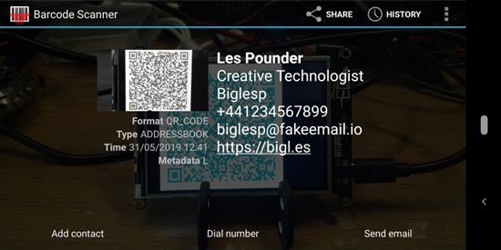](https://bigl.es/friday-fun-circuit-py-fun/)

Here's a fantastic guide on making a name badge with a PyPortal, Mu, and CircuitPython. Les writes -

>_"I go to a fair few events in the year and each time delegates are given a sticker / badge to help everyone identify each other. But I wanted to make something a little more geeky / nerdy / techy! Creating a conference badge that will act as a digital business card. It will have our logo, a picture of us or a project, and then a QR code containing our contact details. Adafruit's PyPortal is an Internet of Things (IoT) device that has WiFi, a 70mm by 50mm 320x240 resolution touchscreen, light sensor, temperature sensor, Neopixel, microSD slot and a speaker.
Powered by an ATSAMD51J20 CPU and with wireless connectivity provided by an ESP32 this is a lot of power in a small board. Smaller than a Pi Zero W and Hyperpixel screen!"_

[Guide, photos](https://bigl.es/friday-fun-circuit-py-fun/), and [Tweets](https://twitter.com/biglesp/status/1134431608390463488).

## Using Python on Windows 10

[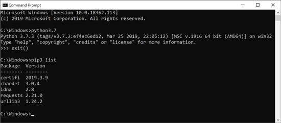](https://learn.adafruit.com/using-python-on-windows-10)

Getting Python on Windows is getting easier with recent Microsoft improvements!

It’s been widely known for many years that Windows is the only mainstream operating system that has not include a Python interpreter out of the box. For many users who are never going to need it, this helps reduce the size and improve the security of the operating system. But for those of us who do would like to use it, Python’s absence has been keenly felt.

With the May 2019 update to Windows 10, there are two methods to get Python 3.7 on your computer. There is a community release of Python 3.7 in the Microsoft Store. This will be the default choice for getting Python if you are looking for an easy install separate than those on the Internet.

Second, every install of Windows starting with the May 2019 update will include python and python3 commands that take you directly to the Python store page.

This tutorial will help you through these options - [learn.adafruit.com](https://learn.adafruit.com/using-python-on-windows-10).

## AirLift FeatherWing – ESP32 WiFi Co-Processor

[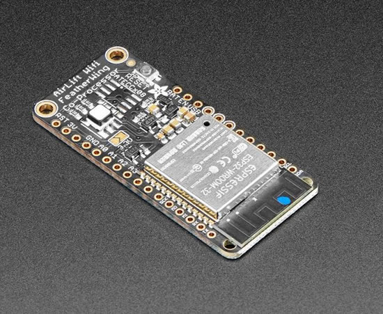](https://learn.adafruit.com/adafruit-airlift-featherwing-esp32-wifi-co-processor-featherwing?view=all#circuitpython)

It's easy to use the Adafruit AirLift breakout with CircuitPython and the Adafruit CircuitPython ESP32SPI module.  This module allows you to easily add WiFi to your project - [learn.adafruit.com](https://learn.adafruit.com/adafruit-airlift-featherwing-esp32-wifi-co-processor-featherwing?view=all#circuitpython).

## Handhelds for developers

There is a lot of handheld devices that will be programmable by developers, beginners, and what could be a new chapter of gaming for more people. [Pixeland](https://pixeland.io/blog/handhelds-for-developers) has a roundup of the current and upcoming devices, PyBadge and PyGamer made the list!

## New MicroPython release: v1.11

[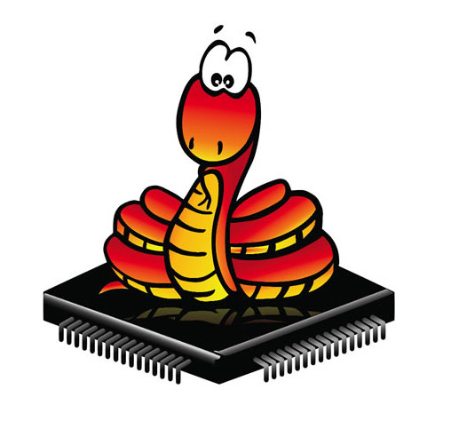](https://github.com/micropython/micropython/releases/tag/v1.11)

Improved mpy format with support for native code, and new JavaScript port - [GitHub](https://github.com/micropython/micropython/releases/tag/v1.11). AND! Here's a roadmap for the Roadmap for next release (v1.11 -> v2.0?) - [GitHub](https://github.com/micropython/micropython/issues/4821).

## News from around the web!

[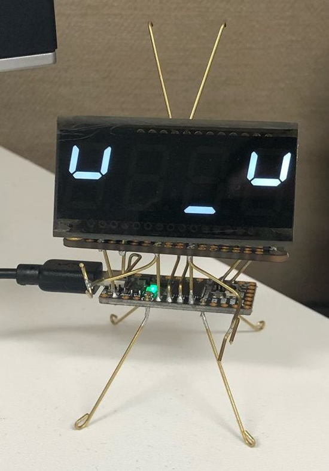](https://hackaday.io/project/165822-circuitpython-7-segment-character-clock)

CircuitPython 7-Segment Character Clock, a desk clock built from a few Adafruit boards & brass rods for structure/connections - [hackaday.io](https://hackaday.io/project/165822-circuitpython-7-segment-character-clock) via [Twitter](https://twitter.com/_ohm51/status/1133220225841655808).

[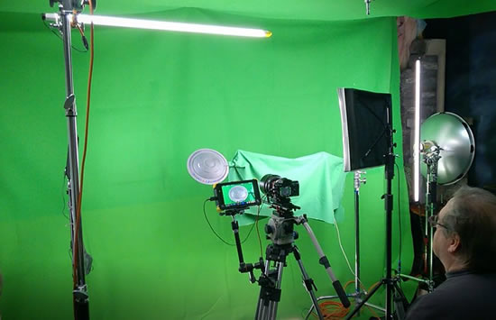](https://twitter.com/CedarGroveMakr/status/1133900963465400321)

CedarGrove is working on a UFO screen test that happens to run CircuitPython for the out-of-this-world lighting - [Twitter](https://twitter.com/CedarGroveMakr/status/1133900963465400321).

[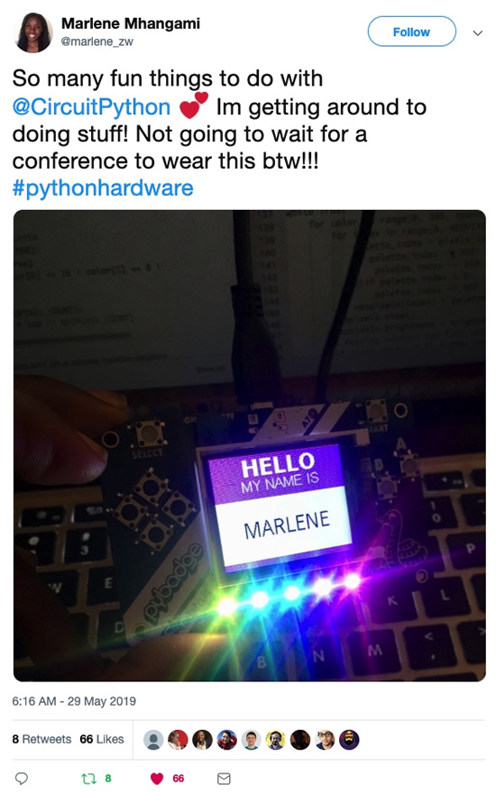](https://twitter.com/marlene_zw/status/1133678383915835392)

More folks are making, and sharing, their name badges with the [CircuitPython powered PyBadge](https://learn.adafruit.com/adafruit-pybadge?view=all). Thanks Marlene! - [Twitter](https://twitter.com/marlene_zw/status/1133678383915835392).

Sean got tired of remembering to save code.py  files across multiple devices, so Sean made made a Visual Studio Task to copy the current file to a connected CircuitPython device - [GitHub](https://gist.github.com/seantibor/6c71cfec8182b4867c7c52bec369e6df), via [Twitter](https://twitter.com/smtibor/status/1134852782920478720).

[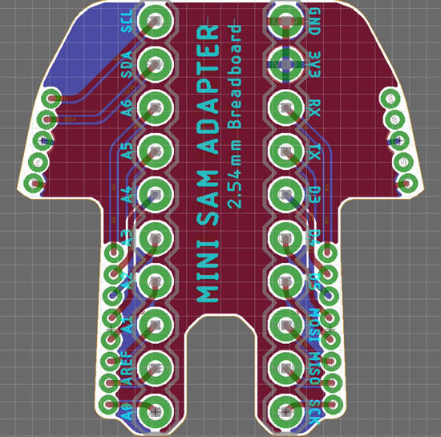](https://twitter.com/bwshockley/status/1135264047262326785)

Cute breadboard adapter for Mini SAM in the works.  DIP spacing. Might be called a 'backpack', but it looks more like a wingsuit - [Twitter](https://twitter.com/bwshockley/status/1135264047262326785).

[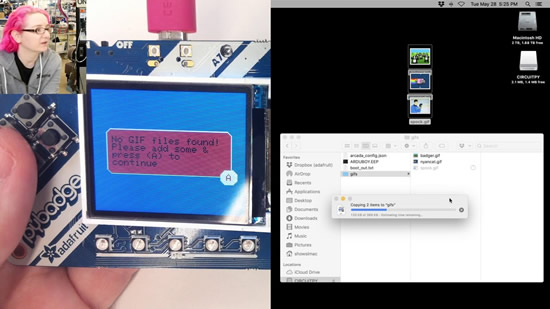](https://youtu.be/0bWba0PU4-g)

Filed under "related news" or just "improving Arduino to make it more like CircuitPython." We now have code that allows an Arduino to show up like a disk drive! YES! IT IS FINALLY HERE! - [YouTube](https://youtu.be/0bWba0PU4-g). Frag and drop files that are stored on SD or SPI Flash over the USB connection. Makes transferring assets like audio files, fonts, images, gifs, datalogs, etc as well as configuration scripts SUPER EASY! Install the Adafruit SAMD 1.5.0 board support package with TinyUSB stack support and the the example code here – [GitHub](https://github.com/adafruit/Adafruit_TinyUSB_Arduino).

Installation procedure for Micropython development under Windows 10 - [GitHub](https://gist.github.com/caseyanderson/6030e04ff59acafa6f016b45ff505c94).

Lachlan and Brian showcase a demo of the new - and unique! - Propeller 2 and how they're running MicroPython on the hardware - [YouTube](https://youtu.be/c3Xa-DOU0D0).

Designing Embedded Systems Using MicroPython - [DesignNews](https://www.designnews.com/continuing-education-center/designing-embedded-systems-using-micro-python?cid=DNTwitter).

[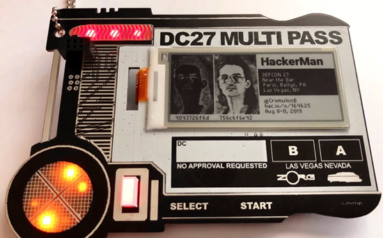](https://www.kickstarter.com/projects/cromulonb/multi-pass-def-con-27-indie-badge?ref=project_build#)

MULTI PASS / DEF CON 27 Indie Badge. A Hackable Indie Badge for DEF CON 27. LEDs, E-Paper Display, WiFi, Rechargeable Battery, and a Python Compatible Platform - [Kickstarter](https://www.kickstarter.com/projects/cromulonb/multi-pass-def-con-27-indie-badge?ref=project_build#).

Learn Flask for Python - [YouTube](https://www.youtube.com/watch?v=Z1RJmh_OqeA).

Sunsetting Python 2 support - [python3statement.org](https://python3statement.org/).

Another Step Toward the End of Moore’s Law. Samsung and TSMC move to 5-nanometer manufacturing - [IEEE.org](https://spectrum.ieee.org/semiconductors/devices/another-step-toward-the-end-of-moores-law)

Automatically Syncing Captions on YouTube Videos by [Aaron Parecki](https://aaronparecki.com/2019/05/27/7/syncing-captions).

Publishing GitHub Pages from Azure Pipelines by [Matt Cooper](https://cloudblogs.microsoft.com/opensource/2019/04/05/publishing-github-pages-from-azure-pipelines/).

Python in Azure Pipelines, Step by Step by [Hynek Schlawack](https://hynek.me/articles/simple-python-azure-pipelines/).

PyInstaller Tutorial - [DevDungeon](https://www.devdungeon.com/content/pyinstaller-tutorial).

Use two-factor auth to improve your PyPI account's security - [Python.org](http://pyfound.blogspot.com/2019/05/use-two-factor-auth-to-improve-your.html).

When Can Electrical Engineers Use Python? Applications for the Python Programming Language - [All About Circuits](https://www.allaboutcircuits.com/technical-articles/python-for-electrical-engineers-applications-of-Python-programming-language/).

How to use the Microsoft Azure Face API to detect emotions from images - [Microsoft Azure](https://medium.com/microsoftazure/using-the-microsoft-face-api-to-create-mario-kart-astrology-9a187cec4f35).

Lack of leadership in open source results in source-available licenses - [TechCrunch](https://techcrunch.com/2019/05/30/lack-of-leadership-in-open-source-results-in-source-available-licenses/).

Milestones in project cards - [GitHub](https://github.blog/changelog/2019-05-30-milestones-in-project-cards/).

The unlikely origins of USB, the port that changed everything - [FactCompany](https://www.fastcompany.com/3060705/an-oral-history-of-the-usb).

UF2 Bootloader: Creating Custom Boards. Want to remove the hassle of using command-line every time you need to upload a new firmware? Now you can - [hackster.io](https://www.hackster.io/wallarug/uf2-bootloader-creating-custom-boards-c9620c).

CircuitPython Weekly May 28th, 2019 [on YouTube](https://www.youtube.com/watch?v=6HtfZ1Hqd2Y&).

#ICYDNCI What was the most popular, most clicked link, in [last week's newsletter](https://www.adafruitdaily.com/2019/05/28/circuitpython-snakes-its-way-to-atom-creating-custom-boards-and-more-python-adafruit-circuitpython-pythonhardware-circuitpython-micropython-thepsf-adafruit/)? [Atom Editor for CircuitPython](https://github.com/jos-b/language-circuitpython)!

## Coming soon

[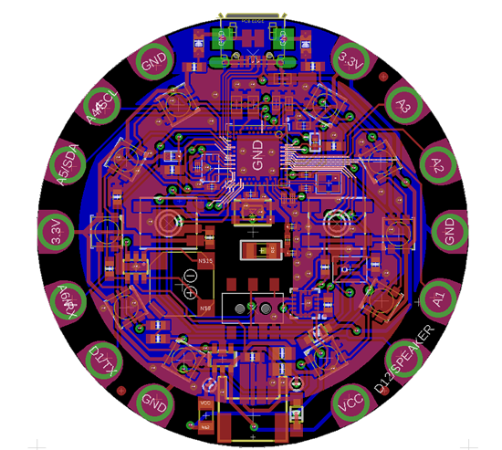](https://www.adafruit.com/new)

Bluetooth low energy CircuitPlayground? MAYBE!

[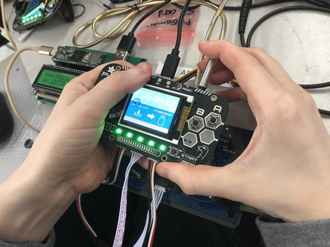](https://www.adafruit.com/new)

[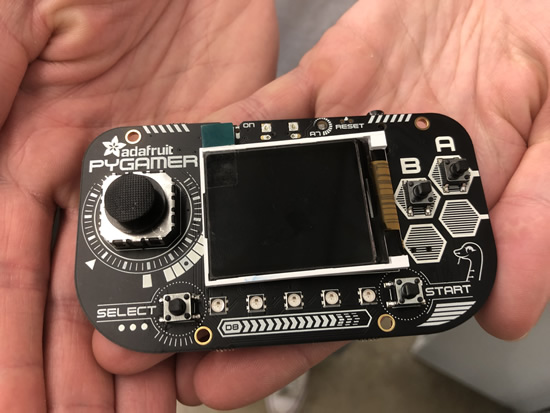](https://www.adafruit.com/new)

[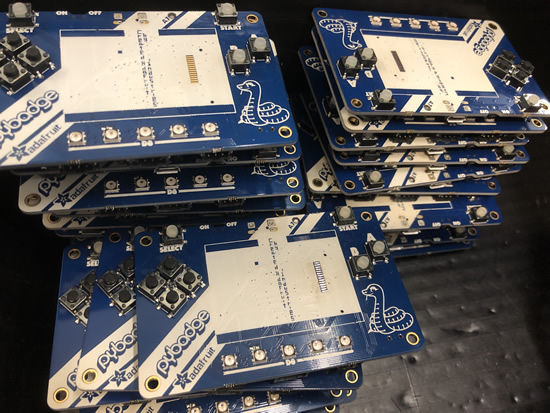](https://www.adafruit.com/new)

As we ramp up for shipping a ton of gaming devices, enjoy the show :)

## New Learn Guides!

[PyPortal IoT Plant Monitor with Microsoft Azure IoT and CircuitPython](https://learn.adafruit.com/using-microsoft-azure-iot-with-circuitpython) from [Brent Rubell](https://learn.adafruit.com/users/brubell)

[Adafruit PyBadge and PyBadge LC](https://learn.adafruit.com/adafruit-pybadge) from [Kattni](https://learn.adafruit.com/users/kattni)

[Introducing Adafruit PyGamer](https://learn.adafruit.com/adafruit-pygamer) from [Kattni](https://learn.adafruit.com/users/kattni)

[PyPortal ISS Tracker](https://learn.adafruit.com/pyportal-iss-tracker) from [Carter Nelson](https://learn.adafruit.com/users/caternuson)

[PyBadge Conference Badge With Unicode Fonts](https://learn.adafruit.com/pybadge-conference-badge-multi-language-unicode-fonts) from [Melissa LeBlanc-Williams](https://learn.adafruit.com/users/MakerMelissa)

## Updated Guides - Now With More Python!

**You can use CircuitPython libraries on Raspberry Pi!** We're updating all of our CircuitPython guides to show how to wire up sensors to your Raspberry Pi, and load the necessary CircuitPython libraries to get going using them with Python. We'll be including the updates here so you can easily keep track of which sensors are ready to go. Check it out!

Keep checking back for more updated guides!

## CircuitPython Libraries!

CircuitPython support for hardware continues to grow. We are adding support for new sensors and breakouts all the time, as well as improving on the drivers we already have. As we add more libraries and update current ones, you can keep up with all the changes right here!

For the latest drivers, download the [Adafruit CircuitPython Library Bundle](https://github.com/adafruit/Adafruit_CircuitPython_Bundle/releases/latest).

If you'd like to contribute, CircuitPython libraries are a great place to start. Have an idea for a new driver? File an issue on [CircuitPython](https://github.com/adafruit/circuitpython/issues)! Interested in helping with current libraries? Check out [this GitHub issue on CircuitPython](https://github.com/adafruit/circuitpython/issues/1246) for an overview of the State of the CircuitPython Libraries, updated each week. We've included open issues from the library issue lists, and details about repo-level issues that need to be addressed. We have a guide on [contributing to CircuitPython with Git and Github](https://learn.adafruit.com/contribute-to-circuitpython-with-git-and-github) if you need help getting started. You can also find us in the #circuitpython channel on the [Adafruit Discord](https://adafru.it/discord). Feel free to contact Kattni (@kattni) with any questions.

You can check out this [list of all the CircuitPython libraries and drivers available](https://github.com/adafruit/Adafruit_CircuitPython_Bundle/blob/master/circuitpython_library_list.md). 

The current number of CircuitPython libraries is **157**!

**New Libraries!**

Here's this week's new CircuitPython libraries:

* [Adafruit_CircuitPython_BD3491FS](https://github.com/adafruit/Adafruit_CircuitPython_BD3491FS)

**Updated Libraries!**

Here's this week's updated CircuitPython libraries:

* [Adafruit_CircuitPython_AzureIoT](https://github.com/adafruit/Adafruit_CircuitPython_AzureIoT)
* [Adafruit_CircuitPython_CharLCD](https://github.com/adafruit/Adafruit_CircuitPython_CharLCD)
* [Adafruit_CircuitPython_ESP32SPI](https://github.com/adafruit/Adafruit_CircuitPython_ESP32SPI)
* [Adafruit_CircuitPython_ImageLoad](https://github.com/adafruit/Adafruit_CircuitPython_ImageLoad)
* [Adafruit_CircuitPython_INA260](https://github.com/adafruit/Adafruit_CircuitPython_INA260)
* [Adafruit_CircuitPython_Motor](https://github.com/adafruit/Adafruit_CircuitPython_Motor)
* [Adafruit_CircuitPython_ST7735](https://github.com/adafruit/Adafruit_CircuitPython_ST7735)
* [Adafruit_CircuitPython_ST7735R](https://github.com/adafruit/Adafruit_CircuitPython_ST7735R)
* [Adafruit_CircuitPython_Waveform](https://github.com/adafruit/Adafruit_CircuitPython_Waveform)

**PyPI Download Stats!**

We've written a special library called Adafruit Blinka that makes it possible to use CircuitPython Libraries on [Raspberry Pi and other compatible single-board computers](https://learn.adafruit.com/circuitpython-on-raspberrypi-linux/). Adafruit Blinka and all the CircuitPython libraries have been deployed to PyPI for super simple installation on Linux! Here are the top 10 CircuitPython libraries downloaded from PyPI in the last week, including the total downloads for those libraries:

| Library                                     | Last Week   | Total |   
|:-------                                     |:--------:   |:-----:|   
| Adafruit-Blinka                             | 2041        | 37126 |   
| Adafruit_CircuitPython_BusDevice            | 1241        | 12384 |   
| Adafruit_CircuitPython_Register             | 355         | 6092 |    
| Adafruit_CircuitPython_NeoPixel             | 338         | 5525 |    
| Adafruit_CircuitPython_MCP230xx             | 287         | 1376 |    
| Adafruit_CircuitPython_PCA9685              | 253         | 3606 |    
| Adafruit_CircuitPython_Motor                | 251         | 4014 |    
| Adafruit_CircuitPython_ServoKit             | 163         | 2897 |    
| Adafruit_CircuitPython_LIS3DH               | 150         | 1733 |    
| Adafruit_CircuitPython_ADS1x15              | 147         | 1923 |    

## Upcoming events!

PyLondinium is back for 2019, with a diverse program of sprints, workshops and talks. We'll be returning to Bloomberg's European HQ in the heart of the City of London, June 14th, 15th, and 16th, 2019 - [pylondinium.org](https://pylondinium.org/)

July, 8 to 14th 2019. The EuroPython conference series was initiated by the European Python community in 2001 and started with EuroPython 2002 in Charleroi, Belgium, as the first major Python conference entirely run by volunteers - [ep2019.europython.eu](https://ep2019.europython.eu/)

Open Source Summit and Embedded Linux Conference, August 21 – 23, 2019 at the Hilton San Diego Bayfront. The Open Source Summit North America combines with Embedded Linux Conference North America (ELC).  ELC has been a vendor-neutral technical conference where developers working on embedded Linux and industrial IoT products and deployments gather for education and collaboration. Open Source Summit brings together developers and open source professionals to collaborate and learn about the latest technologies - [Linux Foundation](https://www.linuxfoundation.org/press-release/2019/05/open-source-summit-to-include-embedded-linux-conference-bring-together-both-technical-and-leadership-programs-under-one-roof/).

PYCON UK 2019 - Cardiff City Hall, Friday 13th to Tuesday 17th September. PyCon UK is back at Cardiff City Hall, for five days of talks, workshops and collaboration. The conference also features a young coders' day, themes dedicated to science and education, and numerous Python-related events - [PyCon UK](https://2019.pyconuk.org/).

micro:bit Live 2019 is coming to BBC MediaCityUK, Greater Manchester, England on October 4-5. This will be the very first annual gathering of the global micro:bit community of educators and partners - [micro:bit](https://microbit.org/en/2019-04-12-microbit-live/).

## Latest releases

CircuitPython's stable release is [#.#.#](https://github.com/adafruit/circuitpython/releases/latest) and its unstable release is [#.#.#-##.#](https://github.com/adafruit/circuitpython/releases). New to CircuitPython? Start with our [Welcome to CircuitPython Guide](https://learn.adafruit.com/welcome-to-circuitpython).

[2019####](https://github.com/adafruit/Adafruit_CircuitPython_Bundle/releases/latest) is the latest CircuitPython library bundle.

[v#.#.#](https://micropython.org/download) is the latest MicroPython release. Documentation for it is [here](http://docs.micropython.org/en/latest/pyboard/).

[#.#.#](https://www.python.org/downloads/) is the latest Python release. The latest pre-release version is [#.#.#](https://www.python.org/download/pre-releases/).

[1255 Stars](https://github.com/adafruit/circuitpython/stargazers) Like CircuitPython? [Star it on GitHub!](https://github.com/adafruit/circuitpython)

## Call for help – CircuitPython messaging to other languages!

We [posted on the Adafruit blog](https://blog.adafruit.com/2018/08/15/help-bring-circuitpython-messaging-to-other-languages-circuitpython/) about bringing CircuitPython messaging to other languages, one of the exciting features of CircuitPython 4.x is translated control and error messages. Native language messages will help non-native English speakers understand what is happening in CircuitPython even though the Python keywords and APIs will still be in English. If you would like to help, [please post](https://github.com/adafruit/circuitpython/issues/1098) to the main issue on GitHub and join us on [Discord](https://adafru.it/discord).

We made this graphic with translated text, we could use your help with that to make sure we got the text right, please check out the text in the image – if there is anything we did not get correct, please let us know. Dan sent me this [handy site too](http://helloworldcollection.de/#Human).

## jobs.adafruit.com is back

[jobs.adafruit.com](https://jobs.adafruit.com/) has returned and folks are posting their skills (including CircuitPython) and companies are looking for talented makers to join their companies - from Digi-Key, to Hackaday, Microcenter, Raspberry Pi and more.

## 12,508 thanks!

The Adafruit Discord community, where we do all our CircuitPython development in the open, reached over 12,508 humans, thank you! Join today! [https://adafru.it/discord](https://adafru.it/discord)

## ICYMI - In case you missed it

[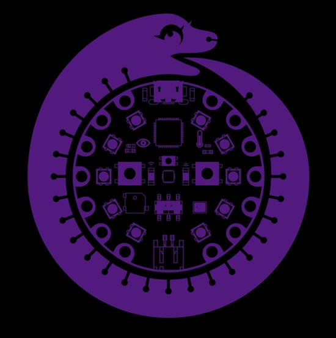](https://www.youtube.com/playlist?list=PLjF7R1fz_OOXRMjM7Sm0J2Xt6H81TdDev)

The wonderful world of Python on hardware! This is our first video-newsletter-podcast that we’ve started! The news comes from the Python community, Discord, Adafruit communities and more. It’s part of the weekly newsletter, then we have a segment on ASK an ENGINEER and this is the video slice from that! The complete Python on Hardware weekly VideoCast [playlist is here](https://www.youtube.com/playlist?list=PLjF7R1fz_OOXRMjM7Sm0J2Xt6H81TdDev). 

This video podcast is on [iTunes](https://itunes.apple.com/us/podcast/python-on-hardware/id1451685192?mt=2), [YouTube](https://www.youtube.com/playlist?list=PLjF7R1fz_OOXRMjM7Sm0J2Xt6H81TdDev), [IGTV (Instagram TV](https://www.instagram.com/adafruit/channel/)), and [XML](https://itunes.apple.com/us/podcast/python-on-hardware/id1451685192?mt=2).

[Weekly community chat on Adafruit Discord server CircuitPython channel - Audio / Podcast edition](https://itunes.apple.com/us/podcast/circuitpython-weekly-meeting/id1451685016) - Audio from the Discord chat space for CircuitPython, meetings are usually Mondays at 2pm ET, this is the audio version on [iTunes](https://itunes.apple.com/us/podcast/circuitpython-weekly-meeting/id1451685016), Pocket Casts, [Spotify](https://adafru.it/spotify), and [XML feed](https://adafruit-podcasts.s3.amazonaws.com/circuitpython_weekly_meeting/audio-podcast.xml).

## Codecademy "Learn Hardware Programming with CircuitPython"

Codecademy, an online interactive learning platform used by more than 45 million people, has teamed up with the leading manufacturer in STEAM electronics, Adafruit Industries, to create a coding course, "Learn Hardware Programming with CircuitPython". The course is now available in the [Codecademy catalog](https://www.codecademy.com/learn/learn-circuitpython?utm_source=adafruit&utm_medium=partners&utm_campaign=circuitplayground&utm_content=pythononhardwarenewsletter).

Python is a highly versatile, easy to learn programming language that a wide range of people, from visual effects artists in Hollywood to mission control at NASA, use to quickly solve problems. But you don’t need to be a rocket scientist to accomplish amazing things with it. This new course introduces programmers to Python by way of a microcontroller — CircuitPython — which is a Python-based programming language optimized for use on hardware.

CircuitPython’s hardware-ready design makes it easier than ever to program a variety of single-board computers, and this course gets you from no experience to working prototype faster than ever before. Codecademy’s interactive learning environment, combined with Adafruit's highly rated Circuit Playground Express, present aspiring hardware hackers with a never-before-seen opportunity to learn hardware programming seamlessly online.

Whether for those who are new to programming, or for those who want to expand their skill set to include physical computing, this course will have students getting familiar with Python and creating incredible projects along the way. By the end, students will have built their own bike lights, drum machine, and even a moisture detector that can tell when it's time to water a plant.

Visit Codecademy to access the [Learn Hardware Programming with CircuitPython](https://www.codecademy.com/learn/learn-circuitpython?utm_source=adafruit&utm_medium=partners&utm_campaign=circuitplayground&utm_content=pythononhardwarenewsletter) course and Adafruit to purchase a [Circuit Playground Express](https://www.adafruit.com/product/3333).

Codecademy has helped more than 45 million people around the world upgrade their careers with technology skills. The company’s online interactive learning platform is widely recognized for providing an accessible, flexible, and engaging experience for beginners and experienced programmers alike. Codecademy has raised a total of $43 million from investors including Union Square Ventures, Kleiner Perkins, Index Ventures, Thrive Capital, Naspers, Yuri Milner and Richard Branson, most recently raising its $30 million Series C in July 2016.

## Contribute!

The CircuitPython Weekly Newsletter is a CircuitPython community-run newsletter emailed every Tuesday. The complete [archives are here](https://www.adafruitdaily.com/category/circuitpython/). It highlights the latest CircuitPython related news from around the web including Python and MicroPython developments. To contribute, edit next week's draft [on GitHub](https://github.com/adafruit/circuitpython-weekly-newsletter/tree/gh-pages/_drafts) and [submit a pull request](https://help.github.com/articles/editing-files-in-your-repository/) with the changes. Join our [Discord](https://adafru.it/discord) or [post to the forum](https://forums.adafruit.com/viewforum.php?f=60) for any further questions.

