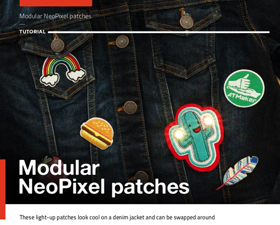
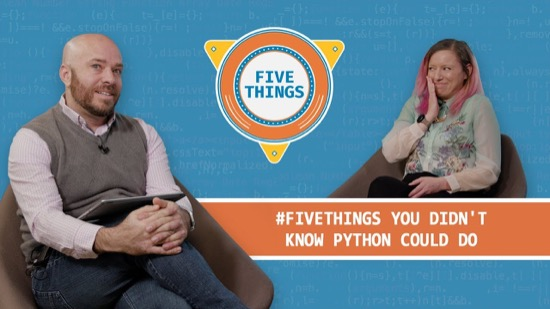
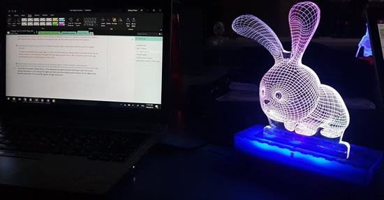
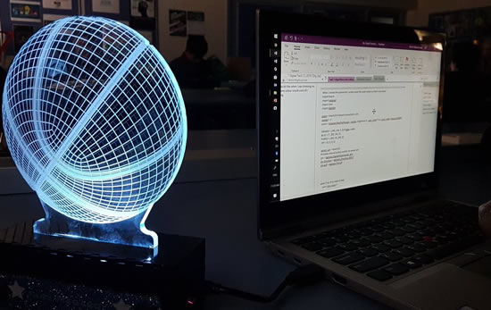
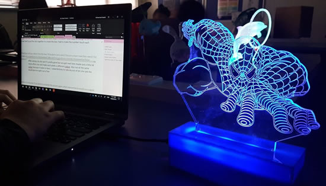
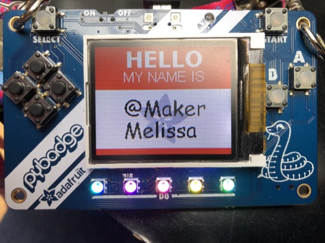
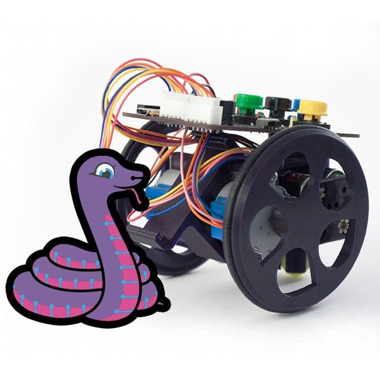
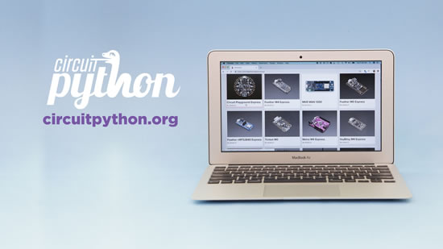

update title

## CircuitPython snakes its way to HackSpace Issue 20!

Ben Everard in HackSpace Magazine writes about using CircuitPython to easily turn an Adafruit Circuit Playground Express educational/multifunction board  into a USB-connected game controller.

>_"We’re going to look at a really simple game inspired by Moon Buggy – an old terminal-based Unix game where you’re driving a buggy across the moon, and have to jump over boulders that litter your path. In our game, we’ll use the ten pixels on a Circuit Playground Express to represent our moon, with red pixels indicating rocks, and white pixels representing our buggy as it drives around this tiny planet. Touching one of the pins will be the only input to the game – it will make the buggy jump for one step. If you hit this, you can clear a rock and keep going, otherwise, you crash out and have to start again."_

It takes less than 50 lines of Python to get this game running, here shown in the Mu editor. See the full write-up in Issue 20 of HackSpace Magazine - [PDF pages 86 to 87](https://magazines-static.raspberrypi.org/issues/full_pdfs/000/000/087/original/HackSpacemagazine20.pdf).

## CircuitPython-powered Modular NeoPixel patches

Also from HackSpace, Modular NeoPixel patches by Sophy Wong -

>_"What could possibly be more amazing than hook-and-loop tape? Conductive hook-and loop tape! That’s right, your favourite fastener is available in a silver-coated version that is perfect for making a modular circuit with custom swappable components. In this tutorial, we’ll use it to create modular NeoPixel patches for a jacket. The microcontroller and battery for this circuit will be located in the jacket, and be connected to the loop side of the hook-and-loop tape. NeoPixel LEDs will be sewn into the removable patches. Whichever patch you slap onto your jacket will light up!"_

A Gemma M0 microcontroller from Adafruit will control the NeoPixels, and we’ll program the Gemma with CircuitPython. You can read Sophy’s full tutorial in Issue 20 of HackSpace Magazine - [PDF pages 96 to 97](https://magazines-static.raspberrypi.org/issues/full_pdfs/000/000/087/original/HackSpacemagazine20.pdf).

## REMINDER! Survey - Programming microcontrollers with Python!

If you can spare a few minutes, the interns at Microsoft Garage in Vancouver need your input for a user testing a new PythonHardware Visual Studio Code plugin – [Microsoft Garage Survey](https://forms.office.com/Pages/ResponsePage.aspx?id=v4j5cvGGr0GRqy180BHbRx50AHoXr3BImxtzTGKK4edUMEJNUUFTUUdGRFhOVUg0N0RBN0paOFJBRy4u).

>_"Hello there, we’re a group of interns at Microsoft Vancouver, working in The Garage! We’re looking for insights into your experience around physical computing projects. As well as your interest in trying out a new method of development for your project – say goodbye to waiting for your code to build and compile inside Arduino IDE with C/C++, Python is here to help! This survey will only take 3 – 5 minutes and your insights are very valuable to us!_"

## #FiveThings You Didn’t Know Python Could Do, Featuring CircutiPython

[Nina Zakharenko](https://twitter.com/nnja) and [Burke Holland](https://twitter.com/burkeholland) on #FiveThings You Didn't Know Python Could Do - [YouTube](https://youtu.be/HNrMjH9Yuv4), featuring CircuitPython:

>_"Python: a large and terrifying snake OR the third most popular programming language. This week, Python (the language, not the snake) aficionado Nina Zakharenko joins us for Five Things that you didn’t know that Python can do. And don’t worry, there are plenty of snake references and even a free potato joke. Also, Burke finds snake facts on the internet and Nina tries her first Goo Goo Cluster."_

## News from around the web!

Tim's students are learning to code using the Adafruit GEMMA with CircuitPython, and turning on the LEDs when it gets dark, amazing results! - [Twitter](https://twitter.com/Nykke_IT/status/1142332605192273920).

Some of the team is at Crowd Supply's event TEARDOWN 2019, Melissa updated the PyBadge for wearin' around! - [Twitter](https://twitter.com/makermelissa/status/1142539144213569536).

[Electronic Cats](https://twitter.com/electronicats/status/1141437577037303808) Escornabot Makech supports CircuitPython! Now available in their store - [Electronic Cats](https://electroniccats.com/producto/escornabot-makech/).

#ICYDNCI What was the most popular, most clicked link, in [last week's newsletter](https://www.adafruitdaily.com/2019/06/18/the-need-for-speed-pewpew-odroid-c2-and-more-python-adafruit-circuitpython-pythonhardware-circuitpython-micropython-thepsf-adafruit/)? [The Microsoft Garage Survey for Python on Hardware and VS Code](https://forms.office.com/Pages/ResponsePage.aspx?id=v4j5cvGGr0GRqy180BHbRx50AHoXr3BImxtzTGKK4edUMEJNUUFTUUdGRFhOVUg0N0RBN0paOFJBRy4u)!

## Coming soon

## New Learn Guides!

[Light Up Prop with Prop-Maker](https://learn.adafruit.com/prop-maker-light-wand) from [Noe and Pedro](https://learn.adafruit.com/users/pixil3d)

[Adabox012](https://learn.adafruit.com/adabox012) from [John Park](https://learn.adafruit.com/users/johnpark)

[CircuitPython Libraries on Linux and Odroid C2](https://learn.adafruit.com/circuitpython-libaries-linux-odroid-c2) from [Melissa LeBlanc-Williams](https://learn.adafruit.com/users/MakerMelissa)

## Updated Guides - Now With More Python!

**You can use CircuitPython libraries on Raspberry Pi!** We're updating all of our CircuitPython guides to show how to wire up sensors to your Raspberry Pi, and load the necessary CircuitPython libraries to get going using them with Python. We'll be including the updates here so you can easily keep track of which sensors are ready to go. Check it out!

Keep checking back for more updated guides!

## CircuitPython Libraries!

CircuitPython support for hardware continues to grow. We are adding support for new sensors and breakouts all the time, as well as improving on the drivers we already have. As we add more libraries and update current ones, you can keep up with all the changes right here!

For the latest drivers, download the [Adafruit CircuitPython Library Bundle](https://github.com/adafruit/Adafruit_CircuitPython_Bundle/releases/latest).

If you'd like to contribute, CircuitPython libraries are a great place to start. Have an idea for a new driver? File an issue on [CircuitPython](https://github.com/adafruit/circuitpython/issues)! Interested in helping with current libraries? Check out [this GitHub issue on CircuitPython](https://github.com/adafruit/circuitpython/issues/1246) for an overview of the State of the CircuitPython Libraries, updated each week. We've included open issues from the library issue lists, and details about repo-level issues that need to be addressed. We have a guide on [contributing to CircuitPython with Git and Github](https://learn.adafruit.com/contribute-to-circuitpython-with-git-and-github) if you need help getting started. You can also find us in the #circuitpython channel on the [Adafruit Discord](https://adafru.it/discord). Feel free to contact Kattni (@kattni) with any questions.

You can check out this [list of all the CircuitPython libraries and drivers available](https://github.com/adafruit/Adafruit_CircuitPython_Bundle/blob/master/circuitpython_library_list.md). 

The current number of CircuitPython libraries is **159**!

**New Libraries!**

Here's this week's new CircuitPython libraries:

 * [Adafruit_CircuitPython_PYOA](https://github.com/adafruit/Adafruit_CircuitPython_PYOA)

**Updated Libraries!**

Here's this week's updated CircuitPython libraries:

 * [Adafruit_CircuitPython_PN532](https://github.com/adafruit/Adafruit_CircuitPython_PN532)
 * [Adafruit_CircuitPython_BME280](https://github.com/adafruit/Adafruit_CircuitPython_BME280)
 * [Adafruit_CircuitPython_MLX90393](https://github.com/adafruit/Adafruit_CircuitPython_MLX90393)
 * [Adafruit_CircuitPython_TSL2561](https://github.com/adafruit/Adafruit_CircuitPython_TSL2561)
 * [Adafruit_CircuitPython_MPL3115A2](https://github.com/adafruit/Adafruit_CircuitPython_MPL3115A2)

**PyPI Download Stats!**

We've written a special library called Adafruit Blinka that makes it possible to use CircuitPython Libraries on [Raspberry Pi and other compatible single-board computers](https://learn.adafruit.com/circuitpython-on-raspberrypi-linux/). Adafruit Blinka and all the CircuitPython libraries have been deployed to PyPI for super simple installation on Linux! Here are the top 10 CircuitPython libraries downloaded from PyPI in the last week, including the total downloads for those libraries:

| Library                                     | Last Week   | Total |   
|:-------                                     |:--------:   |:-----:|   
| Adafruit-Blinka                             | 2286        | 40683 |   
| Adafruit_CircuitPython_BusDevice            | 1371        | 14968 |   
| Adafruit_CircuitPython_Register             | 337         | 6895 |    
| Adafruit_CircuitPython_MCP230xx             | 323         | 2269 |    
| Adafruit_CircuitPython_NeoPixel             | 286         | 6012 |    
| Adafruit_CircuitPython_Motor                | 242         | 4631 |    
| Adafruit_CircuitPython_PCA9685              | 241         | 4155 |    
| Adafruit_CircuitPython_BME280               | 165         | 2163 |    
| Adafruit_CircuitPython_ADS1x15              | 158         | 2282 |    
| Adafruit_CircuitPython_LIS3DH               | 141         | 2054 |  

## Upcoming events!

July, 8 to 14th 2019. The EuroPython conference series was initiated by the European Python community in 2001 and started with EuroPython 2002 in Charleroi, Belgium, as the first major Python conference entirely run by volunteers - [ep2019.europython.eu](https://ep2019.europython.eu/)

**EuroPython 2019 attendees getting CircuitPython-powered PewPew Game Consoles!**

The device was created and designed by [Radomir Dopieralski](https://hackaday.io/deshipu), a long time EuroPython regular and enthusiastic Python device and robotics builder. 

The [PewPew](https://pewpew.rtfd.io/) is a simplified game console, programmable with [CircuitPython](https://circuitpython.rtfd.io/), a variant of MicroPython. It comes with a 64 LED display and a set of small buttons to drive the console. They are looking for attendees to help Radomir with workshops on the PewPew. See more on [the blog post](https://blog.europython.eu/post/185584014022/europython-2019-warning-spoiler-alert) and on the [PewPew workshop page](https://ep2019.europython.eu/events/pewpew-workshops/).

Open Source Summit and Embedded Linux Conference, August 21 – 23, 2019 at the Hilton San Diego Bayfront. The Open Source Summit North America combines with Embedded Linux Conference North America (ELC).  ELC has been a vendor-neutral technical conference where developers working on embedded Linux and industrial IoT products and deployments gather for education and collaboration. Open Source Summit brings together developers and open source professionals to collaborate and learn about the latest technologies - [Linux Foundation](https://www.linuxfoundation.org/press-release/2019/05/open-source-summit-to-include-embedded-linux-conference-bring-together-both-technical-and-leadership-programs-under-one-roof/).

PYCON UK 2019 - Cardiff City Hall, Friday 13th to Tuesday 17th September. PyCon UK is back at Cardiff City Hall, for five days of talks, workshops and collaboration. The conference also features a young coders' day, themes dedicated to science and education, and numerous Python-related events - [PyCon UK](https://2019.pyconuk.org/).

micro:bit Live 2019 is coming to BBC MediaCityUK, Greater Manchester, England on October 4-5. This will be the very first annual gathering of the global micro:bit community of educators and partners - [micro:bit](https://microbit.org/en/2019-04-12-microbit-live/).

## Latest releases

CircuitPython's stable release is [#.#.#](https://github.com/adafruit/circuitpython/releases/latest) and its unstable release is [#.#.#-##.#](https://github.com/adafruit/circuitpython/releases). New to CircuitPython? Start with our [Welcome to CircuitPython Guide](https://learn.adafruit.com/welcome-to-circuitpython).

[2019####](https://github.com/adafruit/Adafruit_CircuitPython_Bundle/releases/latest) is the latest CircuitPython library bundle.

[v#.#.#](https://micropython.org/download) is the latest MicroPython release. Documentation for it is [here](http://docs.micropython.org/en/latest/pyboard/).

[#.#.#](https://www.python.org/downloads/) is the latest Python release. The latest pre-release version is [#.#.#](https://www.python.org/download/pre-releases/).

[1275 Stars](https://github.com/adafruit/circuitpython/stargazers) Like CircuitPython? [Star it on GitHub!](https://github.com/adafruit/circuitpython)

## CircuitPython.org updates!

## Call for help – CircuitPython messaging to other languages!

We [posted on the Adafruit blog](https://blog.adafruit.com/2018/08/15/help-bring-circuitpython-messaging-to-other-languages-circuitpython/) about bringing CircuitPython messaging to other languages, one of the exciting features of CircuitPython 4.x is translated control and error messages. Native language messages will help non-native English speakers understand what is happening in CircuitPython even though the Python keywords and APIs will still be in English. If you would like to help, [please post](https://github.com/adafruit/circuitpython/issues/1098) to the main issue on GitHub and join us on [Discord](https://adafru.it/discord).

We made this graphic with translated text, we could use your help with that to make sure we got the text right, please check out the text in the image – if there is anything we did not get correct, please let us know. Dan sent me this [handy site too](http://helloworldcollection.de/#Human).

## jobs.adafruit.com

[jobs.adafruit.com](https://jobs.adafruit.com/) has returned and folks are posting their skills (including CircuitPython) and companies are looking for talented makers to join their companies - from Digi-Key, to Hackaday, Microcenter, Raspberry Pi and more.

Adafruit is hiring! We're looking for PHP developers in the NYC area! Email: [apply@adafruit.com](mailto:apply@adafruit.com)

## 12,744 thanks!

The Adafruit Discord community, where we do all our CircuitPython development in the open, reached over 12,744 humans, thank you! Join today! [https://adafru.it/discord](https://adafru.it/discord)

Discord now offers "server boosts" we have 11 on our server (level 2), if we get to 50 boosts we get to level 3 and some other good features for the community: +100 emojis for a total of 250, 384 Kbps audio, vanity URL, 100 mb uploads for all members (and all the things we have now, like the server banner). Stop by and boost! [https://adafru.it/discord](https://adafru.it/discord).

## ICYMI - In case you missed it

The wonderful world of Python on hardware! This is our first video-newsletter-podcast that we’ve started! The news comes from the Python community, Discord, Adafruit communities and more. It’s part of the weekly newsletter, then we have a segment on ASK an ENGINEER and this is the video slice from that! The complete Python on Hardware weekly VideoCast [playlist is here](https://www.youtube.com/playlist?list=PLjF7R1fz_OOXRMjM7Sm0J2Xt6H81TdDev). 

This video podcast is on [iTunes](https://itunes.apple.com/us/podcast/python-on-hardware/id1451685192?mt=2), [YouTube](https://www.youtube.com/playlist?list=PLjF7R1fz_OOXRMjM7Sm0J2Xt6H81TdDev), [IGTV (Instagram TV](https://www.instagram.com/adafruit/channel/)), and [XML](https://itunes.apple.com/us/podcast/python-on-hardware/id1451685192?mt=2).

[Weekly community chat on Adafruit Discord server CircuitPython channel - Audio / Podcast edition](https://itunes.apple.com/us/podcast/circuitpython-weekly-meeting/id1451685016) - Audio from the Discord chat space for CircuitPython, meetings are usually Mondays at 2pm ET, this is the audio version on [iTunes](https://itunes.apple.com/us/podcast/circuitpython-weekly-meeting/id1451685016), Pocket Casts, [Spotify](https://adafru.it/spotify), and [XML feed](https://adafruit-podcasts.s3.amazonaws.com/circuitpython_weekly_meeting/audio-podcast.xml).

## Codecademy "Learn Hardware Programming with CircuitPython"

Codecademy, an online interactive learning platform used by more than 45 million people, has teamed up with the leading manufacturer in STEAM electronics, Adafruit Industries, to create a coding course, "Learn Hardware Programming with CircuitPython". The course is now available in the [Codecademy catalog](https://www.codecademy.com/learn/learn-circuitpython?utm_source=adafruit&utm_medium=partners&utm_campaign=circuitplayground&utm_content=pythononhardwarenewsletter).

Python is a highly versatile, easy to learn programming language that a wide range of people, from visual effects artists in Hollywood to mission control at NASA, use to quickly solve problems. But you don’t need to be a rocket scientist to accomplish amazing things with it. This new course introduces programmers to Python by way of a microcontroller — CircuitPython — which is a Python-based programming language optimized for use on hardware.

CircuitPython’s hardware-ready design makes it easier than ever to program a variety of single-board computers, and this course gets you from no experience to working prototype faster than ever before. Codecademy’s interactive learning environment, combined with Adafruit's highly rated Circuit Playground Express, present aspiring hardware hackers with a never-before-seen opportunity to learn hardware programming seamlessly online.

Whether for those who are new to programming, or for those who want to expand their skill set to include physical computing, this course will have students getting familiar with Python and creating incredible projects along the way. By the end, students will have built their own bike lights, drum machine, and even a moisture detector that can tell when it's time to water a plant.

Visit Codecademy to access the [Learn Hardware Programming with CircuitPython](https://www.codecademy.com/learn/learn-circuitpython?utm_source=adafruit&utm_medium=partners&utm_campaign=circuitplayground&utm_content=pythononhardwarenewsletter) course and Adafruit to purchase a [Circuit Playground Express](https://www.adafruit.com/product/3333).

Codecademy has helped more than 45 million people around the world upgrade their careers with technology skills. The company’s online interactive learning platform is widely recognized for providing an accessible, flexible, and engaging experience for beginners and experienced programmers alike. Codecademy has raised a total of $43 million from investors including Union Square Ventures, Kleiner Perkins, Index Ventures, Thrive Capital, Naspers, Yuri Milner and Richard Branson, most recently raising its $30 million Series C in July 2016.

## Contribute!

The CircuitPython Weekly Newsletter is a CircuitPython community-run newsletter emailed every Tuesday. The complete [archives are here](https://www.adafruitdaily.com/category/circuitpython/). It highlights the latest CircuitPython related news from around the web including Python and MicroPython developments. To contribute, edit next week's draft [on GitHub](https://github.com/adafruit/circuitpython-weekly-newsletter/tree/gh-pages/_drafts) and [submit a pull request](https://help.github.com/articles/editing-files-in-your-repository/) with the changes. Join our [Discord](https://adafru.it/discord) or [post to the forum](https://forums.adafruit.com/viewforum.php?f=60) for any further questions.
