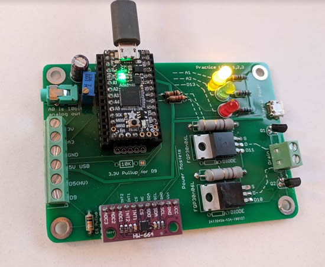
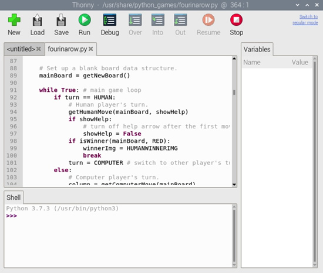

update title

## 6,000 Thanks!

## CircuitPython 4.1.0 Beta 1 Released!

## 2019 Opensource.com summer reading list – FEATURING Getting Started with Adafruit Circuit Playground Express! 

## Raspberry Pi - BLINKA!

## Hanselminutes Technology Podcast by Scott Hanselman - PyPortal

## 293: Skateboard Tricks – Embedded.fm podcast

## Microsoft Garage Survey – Project Pacifica future features for physical computing projects

## Feather takes flight at Seeed Studio with the Grove Shield for Particle Mesh

## News from around the web!

Soldering and programming class in Circuitpython - [GitHub](https://github.com/hydronics2/Circuitpython_February_2019).

Buster – the new version of Raspbian - [raspberrypi.org](https://www.raspberrypi.org/blog/buster-the-new-version-of-raspbian/). And with this version, a default Python IDE.

>_"We’ve been including the excellent Thonny Python development environment in Raspbian for some time now. In this release, it’s now our default Python editor, and to that end, we are no longer including IDLE by default. IDLE has always felt dated and not very pleasant to use, and Thonny is so much nicer that we’d strongly recommend moving to it, if you haven’t already! (If you’d like an alternative to Thonny, the Mu Python IDE is also still available in Recommended Software.)"_

esp32spi_mqtt is a mqtt client compatible with the adafruit_esp32spi library - [GitHub](https://github.com/beachbc/esp32spi_mqtt).

nRF52/nRF51 Fitness Trackers & Smartwatches Reverse Engineered for use as a Wearable Device Development Platform - [GitHub](https://github.com/curtpw/nRF5x-device-reverse-engineering).

Deploying to PythonAnywhere via GitHub by [Aadi Bajpai](https://medium.com/@aadibajpai/deploying-to-pythonanywhere-via-github-6f967956e664).

Employing Wireless Edge Intelligence with Digi XBee MicroPython - [Digi](https://www.digi.com/blog/employing-wireless-edge-intelligence-with-digi-xbee-micropython/).

Explore millions of images on [dockerhub](https://hub.docker.com/search/?type=image).

FreeDOS is an open source DOS-compatible operating system that you can use to play classic DOS games, run legacy business software, or develop embedded systems. Any program that works on MS-DOS should also run on FreeDOS - [freedos.org](https://www.freedos.org/).

Custom Vision - serivce that uses REST API calls to tag images with custom computer vision models - [customvision.ai](https://www.customvision.ai/).

PyRobot is a light weight, high-level interface which provides hardware independent APIs for robotic manipulation and navigation. This repository also contains the low-level stack for LoCoBot, a low cost mobile manipulator hardware platform - [GitHub](https://github.com/facebookresearch/pyrobot).

#ICYDNCI What was the most popular, most clicked link, in [last week's newsletter](https://www.adafruitdaily.com/2019/06/25/choose-your-own-adventure-with-python-on-hardware-python-adafruit-circuitpython-pythonhardware-circuitpython-micropython-thepsf-adafruit/)? [Scott's CircuitPython session at TEARDOWN](https://youtu.be/0mTw9iHcj3Q)!

## Coming soon

## New Learn Guides!

[title](url) from [name](url)

## Updated Guides - Now With More Python!

**You can use CircuitPython libraries on Raspberry Pi!** We're updating all of our CircuitPython guides to show how to wire up sensors to your Raspberry Pi, and load the necessary CircuitPython libraries to get going using them with Python. We'll be including the updates here so you can easily keep track of which sensors are ready to go. Check it out!

[title](url)

## CircuitPython Libraries!

CircuitPython support for hardware continues to grow. We are adding support for new sensors and breakouts all the time, as well as improving on the drivers we already have. As we add more libraries and update current ones, you can keep up with all the changes right here!

For the latest drivers, download the [Adafruit CircuitPython Library Bundle](https://github.com/adafruit/Adafruit_CircuitPython_Bundle/releases/latest).

If you'd like to contribute, CircuitPython libraries are a great place to start. Have an idea for a new driver? File an issue on [CircuitPython](https://github.com/adafruit/circuitpython/issues)! Interested in helping with current libraries? Check out [this GitHub issue on CircuitPython](https://github.com/adafruit/circuitpython/issues/1246) for an overview of the State of the CircuitPython Libraries, updated each week. We've included open issues from the library issue lists, and details about repo-level issues that need to be addressed. We have a guide on [contributing to CircuitPython with Git and Github](https://learn.adafruit.com/contribute-to-circuitpython-with-git-and-github) if you need help getting started. You can also find us in the #circuitpython channel on the [Adafruit Discord](https://adafru.it/discord). Feel free to contact Kattni (@kattni) with any questions.

You can check out this [list of all the CircuitPython libraries and drivers available](https://github.com/adafruit/Adafruit_CircuitPython_Bundle/blob/master/circuitpython_library_list.md). 

The current number of CircuitPython libraries is **###**!

**New Libraries!**

Here's this week's new CircuitPython libraries:

* [library](url)

**Updated Libraries!**

Here's this week's updated CircuitPython libraries:

* [library](url)

**PyPI Download Stats!**

We've written a special library called Adafruit Blinka that makes it possible to use CircuitPython Libraries on [Raspberry Pi and other compatible single-board computers](https://learn.adafruit.com/circuitpython-on-raspberrypi-linux/). Adafruit Blinka and all the CircuitPython libraries have been deployed to PyPI for super simple installation on Linux! Here are the top 10 CircuitPython libraries downloaded from PyPI in the last week, including the total downloads for those libraries:

KATTNI TABLE HERE

## Upcoming events!

July, 8 to 14th 2019. The EuroPython conference series was initiated by the European Python community in 2001 and started with EuroPython 2002 in Charleroi, Belgium, as the first major Python conference entirely run by volunteers - [ep2019.europython.eu](https://ep2019.europython.eu/)

**EuroPython 2019 attendees getting CircuitPython-powered PewPew Game Consoles!**

The device was created and designed by [Radomir Dopieralski](https://hackaday.io/deshipu), a long time EuroPython regular and enthusiastic Python device and robotics builder. 

The [PewPew](https://pewpew.rtfd.io/) is a simplified game console, programmable with [CircuitPython](https://circuitpython.rtfd.io/), a variant of MicroPython. It comes with a 64 LED display and a set of small buttons to drive the console. They are looking for attendees to help Radomir with workshops on the PewPew. See more on [the blog post](https://blog.europython.eu/post/185584014022/europython-2019-warning-spoiler-alert) and on the [PewPew workshop page](https://ep2019.europython.eu/events/pewpew-workshops/). The pew-pew game hardware is here - [GitHub](https://github.com/pewpew-game/hardware-europython2019).

PyOhio is July 27-28, 2019 in Columbus, Ohio! Kattni Rembor will be the opening keynote speaker! PyOhio is a non-profit annual Python community conference held in Columbus, OH. It is free to attend and welcomes anyone with an interest in Python. Content ranges from beginner to advanced and is intended to be relevant to all types of Python users: students, software professionals, scientists, hobbyists, and anyone looking to learn more. There are keynotes, tutorials, talks, sprints, open spaces, lightning talks and more. Registration is now open! [PyOhio](https://www.pyohio.org/2019/)

Open Source Summit and Embedded Linux Conference, August 21 – 23, 2019 at the Hilton San Diego Bayfront. The Open Source Summit North America combines with Embedded Linux Conference North America (ELC).  ELC has been a vendor-neutral technical conference where developers working on embedded Linux and industrial IoT products and deployments gather for education and collaboration. Open Source Summit brings together developers and open source professionals to collaborate and learn about the latest technologies - [Linux Foundation](https://www.linuxfoundation.org/press-release/2019/05/open-source-summit-to-include-embedded-linux-conference-bring-together-both-technical-and-leadership-programs-under-one-roof/).

PYCON UK 2019 - Cardiff City Hall, Friday 13th to Tuesday 17th September. PyCon UK is back at Cardiff City Hall, for five days of talks, workshops and collaboration. The conference also features a young coders' day, themes dedicated to science and education, and numerous Python-related events - [PyCon UK](https://2019.pyconuk.org/).

micro:bit Live 2019 is coming to BBC MediaCityUK, Greater Manchester, England on October 4-5. This will be the very first annual gathering of the global micro:bit community of educators and partners - [micro:bit](https://microbit.org/en/2019-04-12-microbit-live/).

## Latest releases

CircuitPython's stable release is [#.#.#](https://github.com/adafruit/circuitpython/releases/latest) and its unstable release is [#.#.#-##.#](https://github.com/adafruit/circuitpython/releases). New to CircuitPython? Start with our [Welcome to CircuitPython Guide](https://learn.adafruit.com/welcome-to-circuitpython).

[2019####](https://github.com/adafruit/Adafruit_CircuitPython_Bundle/releases/latest) is the latest CircuitPython library bundle.

[v#.#.#](https://micropython.org/download) is the latest MicroPython release. Documentation for it is [here](http://docs.micropython.org/en/latest/pyboard/).

[#.#.#](https://www.python.org/downloads/) is the latest Python release. The latest pre-release version is [#.#.#](https://www.python.org/download/pre-releases/).

[### Stars](https://github.com/adafruit/circuitpython/stargazers) Like CircuitPython? [Star it on GitHub!](https://github.com/adafruit/circuitpython)

## Call for help – CircuitPython messaging to other languages!

We [posted on the Adafruit blog](https://blog.adafruit.com/2018/08/15/help-bring-circuitpython-messaging-to-other-languages-circuitpython/) about bringing CircuitPython messaging to other languages, one of the exciting features of CircuitPython 4.x is translated control and error messages. Native language messages will help non-native English speakers understand what is happening in CircuitPython even though the Python keywords and APIs will still be in English. If you would like to help, [please post](https://github.com/adafruit/circuitpython/issues/1098) to the main issue on GitHub and join us on [Discord](https://adafru.it/discord).

We made this graphic with translated text, we could use your help with that to make sure we got the text right, please check out the text in the image – if there is anything we did not get correct, please let us know. Dan sent me this [handy site too](http://helloworldcollection.de/#Human).

## jobs.adafruit.com

[jobs.adafruit.com](https://jobs.adafruit.com/) has returned and folks are posting their skills (including CircuitPython) and companies are looking for talented makers to join their companies - from Digi-Key, to Hackaday, Microcenter, Raspberry Pi and more.

Adafruit is hiring! We're looking for PHP developers in the NYC area! Email: [apply@adafruit.com](mailto:apply@adafruit.com)

## xxxxx thanks!

The Adafruit Discord community, where we do all our CircuitPython development in the open, reached over 12,744 humans, thank you! Join today! [https://adafru.it/discord](https://adafru.it/discord)

Discord now offers "server boosts" we have 11 on our server (level 2), if we get to 50 boosts we get to level 3 and some other good features for the community: +100 emojis for a total of 250, 384 Kbps audio, vanity URL, 100 mb uploads for all members (and all the things we have now, like the server banner). Stop by and boost! [https://adafru.it/discord](https://adafru.it/discord).

## ICYMI - In case you missed it

The wonderful world of Python on hardware! This is our first video-newsletter-podcast that we’ve started! The news comes from the Python community, Discord, Adafruit communities and more. It’s part of the weekly newsletter, then we have a segment on ASK an ENGINEER and this is the video slice from that! The complete Python on Hardware weekly VideoCast [playlist is here](https://www.youtube.com/playlist?list=PLjF7R1fz_OOXRMjM7Sm0J2Xt6H81TdDev). 

This video podcast is on [iTunes](https://itunes.apple.com/us/podcast/python-on-hardware/id1451685192?mt=2), [YouTube](https://www.youtube.com/playlist?list=PLjF7R1fz_OOXRMjM7Sm0J2Xt6H81TdDev), [IGTV (Instagram TV](https://www.instagram.com/adafruit/channel/)), and [XML](https://itunes.apple.com/us/podcast/python-on-hardware/id1451685192?mt=2).

[Weekly community chat on Adafruit Discord server CircuitPython channel - Audio / Podcast edition](https://itunes.apple.com/us/podcast/circuitpython-weekly-meeting/id1451685016) - Audio from the Discord chat space for CircuitPython, meetings are usually Mondays at 2pm ET, this is the audio version on [iTunes](https://itunes.apple.com/us/podcast/circuitpython-weekly-meeting/id1451685016), Pocket Casts, [Spotify](https://adafru.it/spotify), and [XML feed](https://adafruit-podcasts.s3.amazonaws.com/circuitpython_weekly_meeting/audio-podcast.xml).

## Codecademy "Learn Hardware Programming with CircuitPython"

Codecademy, an online interactive learning platform used by more than 45 million people, has teamed up with the leading manufacturer in STEAM electronics, Adafruit Industries, to create a coding course, "Learn Hardware Programming with CircuitPython". The course is now available in the [Codecademy catalog](https://www.codecademy.com/learn/learn-circuitpython?utm_source=adafruit&utm_medium=partners&utm_campaign=circuitplayground&utm_content=pythononhardwarenewsletter).

Python is a highly versatile, easy to learn programming language that a wide range of people, from visual effects artists in Hollywood to mission control at NASA, use to quickly solve problems. But you don’t need to be a rocket scientist to accomplish amazing things with it. This new course introduces programmers to Python by way of a microcontroller — CircuitPython — which is a Python-based programming language optimized for use on hardware.

CircuitPython’s hardware-ready design makes it easier than ever to program a variety of single-board computers, and this course gets you from no experience to working prototype faster than ever before. Codecademy’s interactive learning environment, combined with Adafruit's highly rated Circuit Playground Express, present aspiring hardware hackers with a never-before-seen opportunity to learn hardware programming seamlessly online.

Whether for those who are new to programming, or for those who want to expand their skill set to include physical computing, this course will have students getting familiar with Python and creating incredible projects along the way. By the end, students will have built their own bike lights, drum machine, and even a moisture detector that can tell when it's time to water a plant.

Visit Codecademy to access the [Learn Hardware Programming with CircuitPython](https://www.codecademy.com/learn/learn-circuitpython?utm_source=adafruit&utm_medium=partners&utm_campaign=circuitplayground&utm_content=pythononhardwarenewsletter) course and Adafruit to purchase a [Circuit Playground Express](https://www.adafruit.com/product/3333).

Codecademy has helped more than 45 million people around the world upgrade their careers with technology skills. The company’s online interactive learning platform is widely recognized for providing an accessible, flexible, and engaging experience for beginners and experienced programmers alike. Codecademy has raised a total of $43 million from investors including Union Square Ventures, Kleiner Perkins, Index Ventures, Thrive Capital, Naspers, Yuri Milner and Richard Branson, most recently raising its $30 million Series C in July 2016.

## Contribute!

The CircuitPython Weekly Newsletter is a CircuitPython community-run newsletter emailed every Tuesday. The complete [archives are here](https://www.adafruitdaily.com/category/circuitpython/). It highlights the latest CircuitPython related news from around the web including Python and MicroPython developments. To contribute, edit next week's draft [on GitHub](https://github.com/adafruit/circuitpython-weekly-newsletter/tree/gh-pages/_drafts) and [submit a pull request](https://help.github.com/articles/editing-files-in-your-repository/) with the changes. Join our [Discord](https://adafru.it/discord) or [post to the forum](https://forums.adafruit.com/viewforum.php?f=60) for any further questions.
