update title

Meeting notes - [Google Docs](https://docs.google.com/document/d/1IITBngDCVEm7zNwnyD_nIUzhZPXSMc4pqRJzFyf0zDs/edit?usp=sharing).

## A speedier CircuitPython gets 10 out of 10 in the latest issue of HackSpace Magazine

[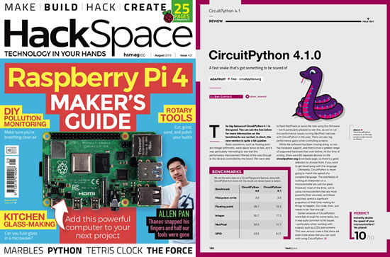](https://blog.adafruit.com/2019/07/19/a-speedier-circuitpython-gets-10-out-of-10-in-the-latest-issue-of-hackspace-magazine-hackspacemag-circuitpython-adafruit/)

A speedier CircuitPython gets **10 out of 10** in the latest issue of [HackSpace Magazine](http://hsmag.cc/CuWiCK), [page 128 in the PDF](https://magazines-static.raspberrypi.org/issues/full_pdfs/000/000/091/original/HackSpaceMagazine21.pdf), [online](https://hackspace.raspberrypi.org/features/circuitpython-4-1-0-review), via [Twitter](https://twitter.com/HackSpaceMag/status/1152230012927561729) –

>_"The big feature of the free software, CircuitPython 4.1. is the speed. You can see the box below for more information on the benchmarks we ran but, in short, the new version is quite a bit quicker. Basic operations, such as floating point and integer arithmetic, were about twice as fast, and it was particularly interesting to see that this performance improvement filtered all the way through to the devices controlled by the board. We were able to flash NeoPixels at twice the rate using this firmware – we’re particularly pleased to see this, as we’ve run into performance issues running NeoPixel matrixes with CircuitPython in the past. There are also big performance gains when controlling screens. While the software has been moving along, so too has hardware support, and there’s now a greater range of supported hardware than ever before. At the time of writing, there were 62 separate devices on the circuitpython.org downloads page, so there’s a great selection to choose from, if you want to get developing with this language."_

We are 100% focused on ease of use, being able to do more in minutes. CircuitPython is a programming language designed to simplify experimenting and learning to code on low-cost microcontroller boards. It makes getting started easier than ever with no upfront desktop downloads needed. Once you get your board set up, open any text editor, and get started editing code. It's that simple. 

**Quick and Easy**

Create a file, edit your code, save the file, and it runs immediately. There is no compiling, no downloading and no uploading needed. 

**Beginner Friendly** 

CircuitPython is designed with education in mind. It's easy to start learning how to code and you get immediate feedback from the board. 

**Easy Code Updates**

Since your code lives on the disk drive, you can edit it whenever you like, you can also keep multiple files around for easy experimentation.

**Serial Console + REPL**

These allow for live feedback from your code and interactive programming.

**File Storage**

The internal storage for CircuitPython makes it great for data-logging, playing audio clips, and otherwise interacting with files. 

**Strong Hardware Support**

There are many libraries and drivers for sensors, breakout boards and other external components. 

However it's also nice that there are significant speed increases too :)

[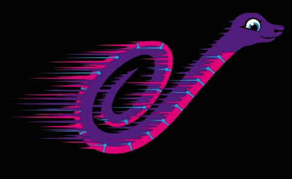](https://blog.adafruit.com/2019/07/19/a-speedier-circuitpython-gets-10-out-of-10-in-the-latest-issue-of-hackspace-magazine-hackspacemag-circuitpython-adafruit/)

Here is the [script used](https://pastebin.com/BAUS82X9) and some additional results!

**pyportal 4.1.0-beta.1, ATSAMD51J20**
* neopixel flicker,4-1-0, 2.951
* 07232019/72319neopixel rainbow,4-1-0, 2.851
* 07232019/72319GPIO on/off benchmark,4-1-0, 2.548
* 07232019/72319integer sum,4-1-0, 3.807
* 07232019/72319integer multi,4-1-0, 4.901
* 07232019/72319float sum,4-1-0, 2.48401
* 07232019/72319float multi,4-1-0, 2.45599
* 07232019/72319float divide multi,4-1-0, 2.521

**hallowing 4.1.0-beta.1, 07232019/72319ATSAMD21G18**
* 07232019/72319neopixel flicker,4-1-0, 12.074
* 07232019/72319neopixel rainbow,4-1-0, 10.607
* 07232019/72319GPIO on/off benchmark,4-1-0, 9.71704
* 07232019/72319integer sum,4-1-0, 17.857
* 07232019/72319integer multi,4-1-0, 23.038
* 07232019/72319float sum,4-1-0, 12.553
* 07232019/72319float multi,4-1-0, 12.642
* 07232019/72319float divide multi,4-1-0, 13.448

**BONUS STAT... here is 4.0.0 before the optimizations we have now for the pyportal...**
* 07232019/72319neopixel flicker,4-0-0, 5.35
* 07232019/72319neopixel rainbow,4-0-0, 5.377
* 07232019/72319GPIO on/off benchmark,4-0-0, 6.21101
* 07232019/72319integer sum,4-0-0, 7.544
* 07232019/72319integer multi,4-0-0, 8.603
* 07232019/72319float sum,4-0-0, 6.173
* 07232019/72319float multi,4-0-0, 6.15599
* 07232019/72319float divide multi,4-0-0, 6.16599

**pyportal 4.1.0-beta.1 vs pyportal 4.0.0**
* 07232019/72319neopixel flicker,4-1-0, 2.951 vs 5.35 = 1.8 times faster
* 07232019/72319neopixel rainbow,4-1-0, 2.851 vs 5.377 = 1.9 times faster
* 07232019/72319GPIO on/off benchmark,4-1-0, 2.548 vs 6.21101 = 2.4 times faster
* 07232019/72319integer sum,4-1-0, 3.807 vs 7.544 = 1.9 times faster
* 07232019/72319integer multi,4-1-0, 4.901 vs 8.603 = 1.8 times faster
* 07232019/72319float sum,4-1-0, 2.48401 vs 6.173 = 2.5 times faster
* 07232019/72319float multi,4-1-0, 2.45599 vs 6.15599 = 2.5 times faster
* 07232019/72319float divide multi,4-1-0, 2.521 vs 6.16599 = 2.4 times faster

## 295 – In the key of lime – Embedded.fm podcast

[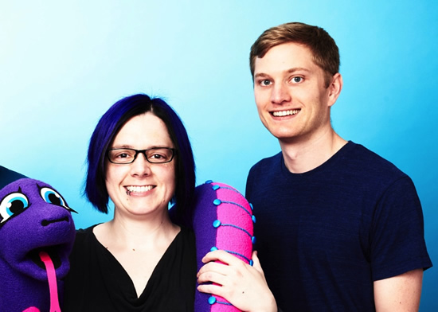](https://embedded.fm/episodes/295)

[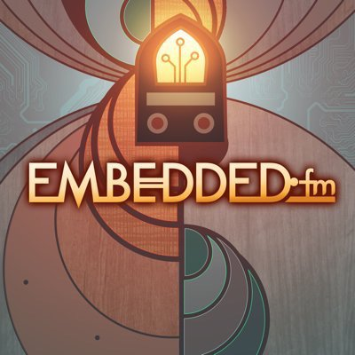](https://embedded.fm/episodes/295)

[295 - In the key of lime - Embedded.fm podcast](https://embedded.fm/episodes/295) -

>_"This week we talk about [CircuitPython](https://circuitpython.org/) ([@CircuitPython](https://twitter.com/CircuitPython)) with [@adafruit](https://twitter.com/adafruit)’s Kattni Rembor ([@kattni](https://twitter.com/kattni)) and Scott Shawcroft ([@tannewt](https://twitter.com/tannewt)). The suggested first board is [CircuitPlayground Express](https://www.adafruit.com/product/3333) with LEDs, sensors, and buttons. CircuitPython is also available for many other boards including the [BLE Feather](https://www.adafruit.com/product/4062) (NRF52832). For a basic introduction take a look at [What is CircuitPython](https://learn.adafruit.com/welcome-to-circuitpython/what-is-circuitpython) and [see some example scripts](https://github.com/adafruit/Adafruit_CircuitPython_CircuitPlayground). To dig a little deeper, check out the many resources in [Awesome CircuitPython](https://github.com/adafruit/awesome-circuitpython/blob/master/README.md). The whole thing is open source so [you can see their code](https://github.com/adafruit/circuitpython). If you are thinking about contributing (or just want some fun chats), get in touch on the CircuitPython channel of the Adafruit Discord server: [adafru.it/discord](https://adafru.it/discord) Many of the language’s design choices favor ease-of-use over ready-for-production. Imagine teaching an intro to programming class without worrying what computers will be used or how to get compilers installed on everyone’s machines before time runs out."_

[Read more](https://embedded.fm/episodes/295), and [listen!](http://traffic.libsyn.com/makingembeddedsystems/embedded-ep295.mp3?download=true)

**Related:**
*   Embedded.fm - [RSS](http://makingembeddedsystems.libsyn.com/rss).
*   Embedded.fm - [iTunes](https://podcasts.apple.com/us/podcast/embedded/id649204115).
*   Embedded.fm - [Spotify](https://open.spotify.com/show/301T4WKFfxXWSiYqUbJsUW?si=mxky_gbnRDmhDl76OYmjUg).
*   Embedded.fm - [libsyn](https://directory.libsyn.com/shows/view/id/makingembeddedsystems).

## 8/8/2019 is CircuitPython day!

Mark your cals' some CircuitPython day events coming up!

Getting started programming microcontrollers with CircuitPython by NYC Resistor - [August 3, 2019](https://www.eventbrite.com/e/getting-started-programming-microcontrollers-with-circuitpython-tickets-63905511104).

CircuitPython Day with the India Linux Users Group Delhi (ILUGD) at the Delhi Technical University for Women - August 4, 2019. [Meetup](https://www.meetup.com/ilugdelhi/events/jkbtdqyzlbnb/) & [Eventbrite](https://www.eventbrite.com/e/circuitpython-day-tickets-63844092399).

8/8/2019 is CircuitPython day! We’re in the planning stages and will have live videos, celebrations, and more for this very snake friendly date! Here's some artwork in our public DropBox CircuitPython folder, check it out - [DropBox](https://www.dropbox.com/sh/cod3wllmyninyn5/AADC6Z5EhEsG18X8WDRMEZuta?dl=0).

If you need to get in touch with us for planning your event and more, email: [circuitpythonday@adafruit.com](mailto:circuitpythonday@adafruit.com)

## Update! iOS 13 beta erases files off drive, resets iPad: FAT12 issue - FIXED, MAYBE!

[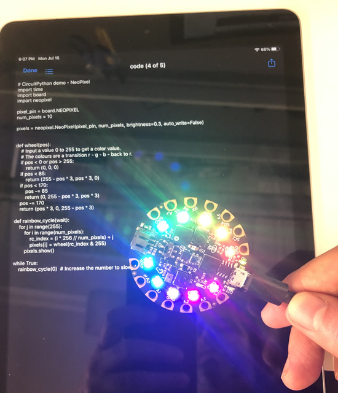](https://blog.adafruit.com/2019/06/25/ios-13-beta-1-erases-files-off-drive-resets-ipad-fat12-issue-it-seems-apple/)

Good news, maybe! It looks like the latest iOS 13 beta fixed the issue of all the files getting deleted when browsing to the file system on the USB drive. We do not know if editing and saving .py files works yet as there are no apps that aware of the external storage. From what we understand that is coming in September of this year. That being said, it's looking REALLY GOOD for opening, editing, and saving, CircuitPython on iOS devices!

## Empowering developers by embedding Python

[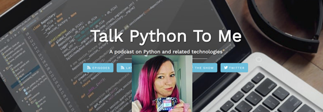](https://talkpython.fm/episodes/show/221/empowering-developers-by-embedding-python)

On the [Talk Python to Me podcast](https://talkpython.fm/episodes/show/221/empowering-developers-by-embedding-python), Michael Kennedy talks to Nina Zakharenko -

>_"How do we get kids excited about programming? Make programming tangible with embedded devices. Did you know that after kids learned to code with the BBC micro:bit, 90% of kids “thought coding was for everyone” and 86% said it made CS topics more interesting? One person doing great work in this space is Nina Zakharenko. She’s here to tell us all about her projects with CircuitPython."_

## CircuitPython snakes its way to SparkFun SerLCD AVR-Based Serial LCD displays

[Gaston](https://twitter.com/Gastonwnc) aka fourstix wrote a CircuitPython library for the [Sparkfun SerLCD AVR-Based Serial LCD displays](https://www.sparkfun.com/search/results?term=SerLCD) - [GitHub](https://github.com/adafruit/CircuitPython_Community_Bundle/pull/23).

## Game Devs of Color Expo: Schomburg Center in Harlem, New York on July 27, 2019. Adafruit is a sponsor

This is the 4th annual Game Devs of Color Expo - an inclusive games expo and conference creating a new normal in games by putting creators of color at the forefront, showing off their games, building conversations, and pushing games forward as an artform - [gamedevsofcolorexpo.com](https://gamedevsofcolorexpo.com/). Follow along on Twitter with the tag [#GDoCExpo](https://twitter.com/search?f=tweets&vertical=default&q=%23GDoCExpo&src=typd). Adafruit is sponsor and look for our CircuitPython-powered open-source indie game hardware at the event!

## News from around the web!

[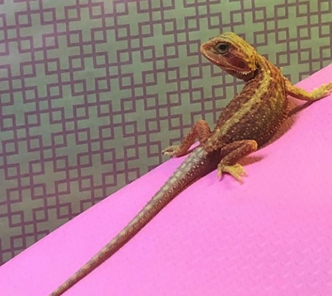](https://www.instagram.com/goosethebeardie/)

[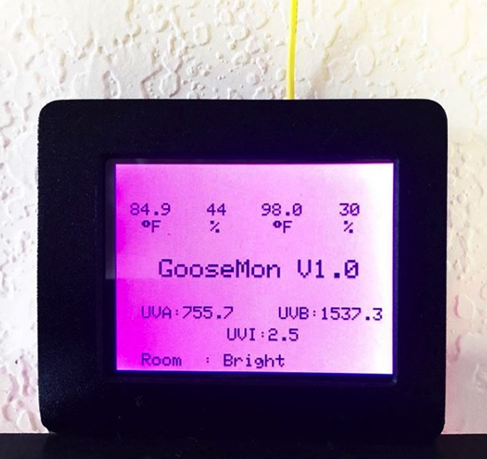](https://www.instagram.com/goosethebeardie/)

Goose the Beardie, a baby bearded dragon has a PyPortal to keep an eye on all the lizard stats - [Instagram](https://www.instagram.com/p/B0CHEG8gbH8/). 

[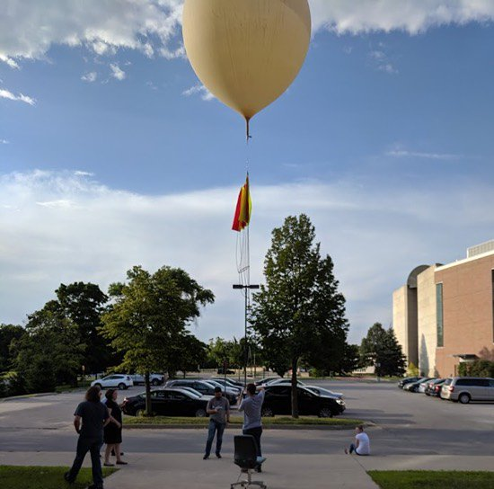](https://youtu.be/HZjKlrW52VM)

Update to the CircuitPython takes flight – Using CircuitPython on High Altitude Balloons post! There is now a video - [YouTube](https://youtu.be/HZjKlrW52VM). Matt’s team is using CircuitPython for on High Altitude Balloons! Their team HABET (High Altitude Balloon Experiments in Technology) is part of a program called Make 2 Innovate. Make To Innovate (M:2:I) is an exciting program in the Department of Aerospace Engineering at Iowa State University which engages students in hands-on projects to augment their understanding of engineering fundamentals - [Adafruit](https://blog.adafruit.com/2019/07/16/circuitpython-takes-flight-using-circuitpython-on-high-altitude-balloons-isuaerospace-circuitpython-circuitpython/).

[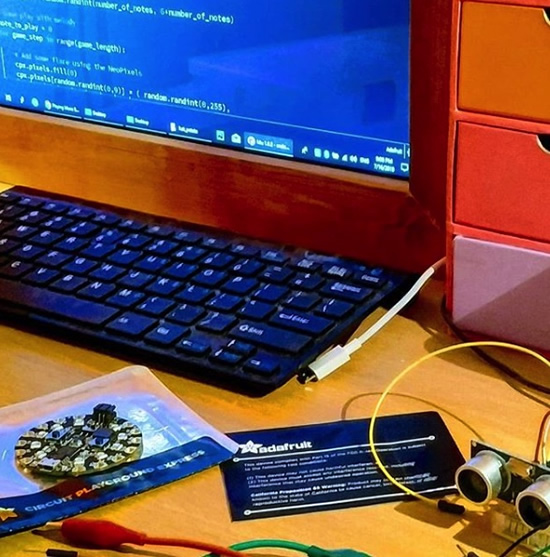](https://www.instagram.com/p/Bz_VJvYpv-V/?igshid=s9iq4j8zls7b)

Kevin's review of CircuitPython - [Instagram](https://www.instagram.com/p/Bz_VJvYpv-V/?igshid=s9iq4j8zls7b).

>_"Compared to Arduino, this Circuit Plaground Express board running CircuitPython is smooth sailing. Not having to compile every time the code is changed, supporting high-level programming language Python, onboard sensors, very well documented and works with Microsoft MakeCode which my 9yo says it's easier than Minecraft."_

[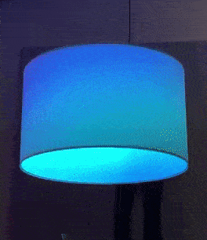](https://www.instagram.com/p/B0EpJ7kj2TN/?igshid=k6tgbs0hm4i6)

[This lamp](https://www.instagram.com/p/B0EpJ7kj2TN/?igshid=k6tgbs0hm4i6) was built with the Adafruit Circuit Playground Express, this lamp uses the sound and light sensors to display a different color gradient. CircuitPython script is available here - [GitHub](https://github.com/jblakeh1/circuit-playground-lamp).

[Scott Hanselman](http://twitter.com/shanselman) visits Adafruit! This was a lot of fun, we've been fans of [THE HANSELMINUTES PODCAST](https://www.hanselminutes.com/) for years, expect to hear some CircuitPython on this video, and an upcoming episode of HANSELMINUTES! Thank you [Scott](https://www.hanselman.com/)! We talk community, artificial pancreases, and more! - [YouTube](https://youtu.be/nsnzgqR8-VI).

[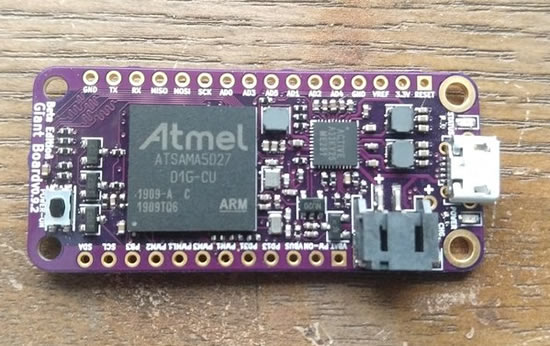](https://www.crowdsupply.com/groboards/giant-board/updates/power-consumption-less-is-more)

Giant Board by Groboards - A single-board computer in the Adafruit Feather form factor, here is a post about ["Power Consumption - Less is More" on Crowd Supply](https://www.crowdsupply.com/groboards/giant-board/updates/power-consumption-less-is-more).

[MicroPython and the Internet of Things, Part I: Welcome](https://blog.miguelgrinberg.com/post/micropython-and-the-internet-of-things-part-i-welcome). [MicroPython and the Internet of Things, Part II: Hello, MicroPython](https://blog.miguelgrinberg.com/post/micropython-and-the-internet-of-things-part-ii-hello-micropython)! And [MicroPython and the Internet of Things, Part III: Building a MicroPython Application](https://blog.miguelgrinberg.com/post/micropython-and-the-internet-of-things-part-iii-building-a-micropython-application). Get them all out on [Miguel's site](https://blog.miguelgrinberg.com/index) & [course](https://courses.miguelgrinberg.com/p/micropython).

Here are the most popular programming languages used by the world’s largest unicorn startups - [GeekWire](https://www.geekwire.com/2019/popular-programming-languages-used-worlds-largest-unicorn-startups/). If you guessed Python is #1, you guessed right!

#ICYDNCI What was the most popular, most clicked link, in [last week's newsletter](https://www.adafruitdaily.com/2019/07/16/circuitpython-takes-flight-all-aboard-with-datum-bluefruit-cpx-and-more-python-adafruit-circuitpython-pythonhardware-circuitpython-micropython-thepsf-adafruit/)? [CircuitPython downloads on CircuitPython.org](https://circuitpython.org/downloads)!

## Made with Mu - Python HyperCard experiment by Nicholas Tollervey

[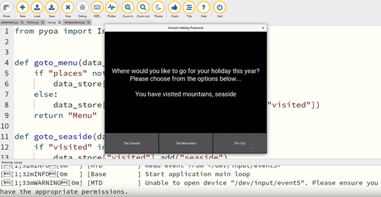](https://youtu.be/CIUQvp2Pnpk)

>_"Inspired by work done by Adafruit for their CircuitPython boards, I've taken their HyperCard based application and turned it into a module that will let beginner developers create GUI based applications that are both simple yet potentially sophisticated. It's early days, and I'm demoing the result of short hacking session."_

[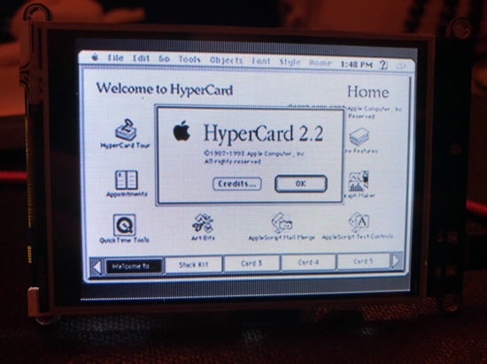](https://youtu.be/CIUQvp2Pnpk)

[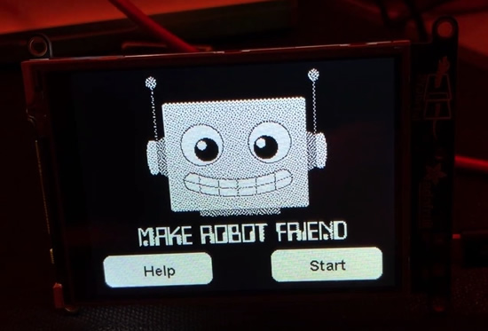](https://youtu.be/CIUQvp2Pnpk)

[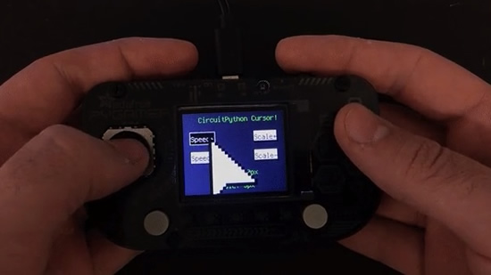](https://youtu.be/CIUQvp2Pnpk)

Python Your Own Adventure - [learn.adafruit.com](https://learn.adafruit.com/circuit-python-choose-you-own-adventure/overview) & PYOA for PyGamer/PyBadge - [Adding Cursor Support to CircuitPython](https://learn.adafruit.com/cursor-for-circuitpython). 

**Related:**

*   Apple’s HyperCard – history and a possible remake - [Adafruit](https://blog.adafruit.com/2019/06/18/apples-hypercard-history-and-a-possible-remake-hypercard-iot-internetofthings-circuitpython-adafruit/).
*   HyperCard Adventures – a classic Mac and HyperCard emulated in-browser - [Adafruit](https://blog.adafruit.com/2019/02/27/hypercard-adventures-a-classic-mac-and-hypercard-emulated-in-browser-apple-mac-hypercard-javascript-vintagecomputing-retrocomputing/).
*   Learn Mac HyperCard via this 1989 educational package - [Adafruit](https://blog.adafruit.com/2018/12/10/learn-mac-hypercard-via-this-1989-educational-package-vintagecomputing-apple-mac-hypercard-internetarchive-vintageapplemac/).
*   How HyperCard inspired a generation of future developers - [Adafruit](https://blog.adafruit.com/2015/01/16/how-hypercard-inspired-a-generation-of-future-developers/).
*   HyperCard! - [Adafruit](https://blog.adafruit.com/2014/06/18/hypercard/).
*   Atkinson Dithering, Live in Processing - [Adafruit](https://blog.adafruit.com/2012/11/14/atkinson-dithering-live-in-processing/).

## Coming soon

[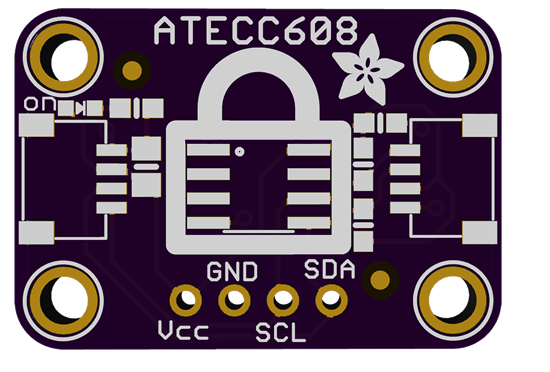](https://www.adafruit.com/new)

[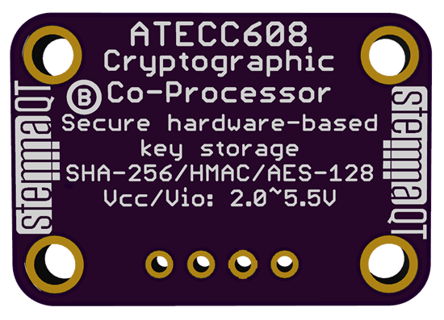](https://www.adafruit.com/new)

stemmaQT cryptographic co-processor.

[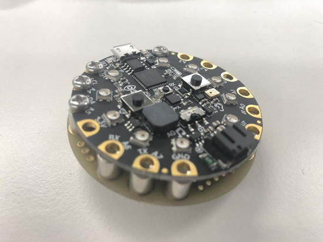](https://www.adafruit.com/new)

[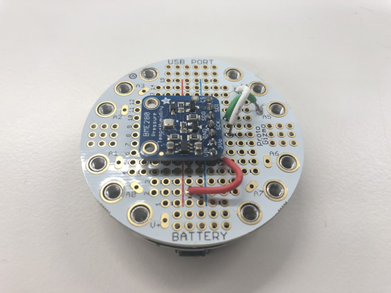](https://www.adafruit.com/new)

Gizmos!

## New Learn Guides!

## Updated Guides - Now With More Python!

**You can use CircuitPython libraries on Raspberry Pi!** We're updating all of our CircuitPython guides to show how to wire up sensors to your Raspberry Pi, and load the necessary CircuitPython libraries to get going using them with Python. We'll be including the updates here so you can easily keep track of which sensors are ready to go. Check it out!

[title](url)

## CircuitPython Libraries!

CircuitPython support for hardware continues to grow. We are adding support for new sensors and breakouts all the time, as well as improving on the drivers we already have. As we add more libraries and update current ones, you can keep up with all the changes right here!

For the latest drivers, download the [Adafruit CircuitPython Library Bundle](https://github.com/adafruit/Adafruit_CircuitPython_Bundle/releases/latest).

If you'd like to contribute, CircuitPython libraries are a great place to start. Have an idea for a new driver? File an issue on [CircuitPython](https://github.com/adafruit/circuitpython/issues)! Interested in helping with current libraries? Check out [this GitHub issue on CircuitPython](https://github.com/adafruit/circuitpython/issues/1246) for an overview of the State of the CircuitPython Libraries, updated each week. We've included open issues from the library issue lists, and details about repo-level issues that need to be addressed. We have a guide on [contributing to CircuitPython with Git and Github](https://learn.adafruit.com/contribute-to-circuitpython-with-git-and-github) if you need help getting started. You can also find us in the #circuitpython channel on the [Adafruit Discord](https://adafru.it/discord). Feel free to contact Kattni (@kattni) with any questions.

You can check out this [list of all the CircuitPython libraries and drivers available](https://github.com/adafruit/Adafruit_CircuitPython_Bundle/blob/master/circuitpython_library_list.md). 

The current number of CircuitPython libraries is **###**!

**New Libraries!**

Here's this week's new CircuitPython libraries:

* [library](url)

**Updated Libraries!**

Here's this week's updated CircuitPython libraries:

* [library](url)

**PyPI Download Stats!**

We've written a special library called Adafruit Blinka that makes it possible to use CircuitPython Libraries on [Raspberry Pi and other compatible single-board computers](https://learn.adafruit.com/circuitpython-on-raspberrypi-linux/). Adafruit Blinka and all the CircuitPython libraries have been deployed to PyPI for super simple installation on Linux! Here are the top 10 CircuitPython libraries downloaded from PyPI in the last week, including the total downloads for those libraries:

KATTNI TABLE HERE

## CircuitPython.org by the numbers

By the numbers: CircuitPython has over [66+ boards supported](https://circuitpython.org/downloads), adding more each week & has [16+ SBC Linux boards supported](https://circuitpython.org/blinka), adding more each day, & over [164+ Libraries](https://circuitpython.org/libraries ), [adding more](https://github.com/adafruit/Adafruit_CircuitPython_Bundle/blob/master/circuitpython_library_list.md) every week!

## Upcoming events!

PyOhio is July 27-28, 2019 in Columbus, Ohio! Kattni Rembor will be the opening keynote speaker! PyOhio is a non-profit annual Python community conference held in Columbus, OH. It is free to attend and welcomes anyone with an interest in Python. Content ranges from beginner to advanced and is intended to be relevant to all types of Python users: students, software professionals, scientists, hobbyists, and anyone looking to learn more. There are keynotes, tutorials, talks, sprints, open spaces, lightning talks and more. Registration is now open! [PyOhio](https://www.pyohio.org/2019/)

Open Source Summit and Embedded Linux Conference, August 21 – 23, 2019 at the Hilton San Diego Bayfront. The Open Source Summit North America combines with Embedded Linux Conference North America (ELC).  ELC has been a vendor-neutral technical conference where developers working on embedded Linux and industrial IoT products and deployments gather for education and collaboration. Open Source Summit brings together developers and open source professionals to collaborate and learn about the latest technologies - [Linux Foundation](https://www.linuxfoundation.org/press-release/2019/05/open-source-summit-to-include-embedded-linux-conference-bring-together-both-technical-and-leadership-programs-under-one-roof/).

PYCON UK 2019 - Cardiff City Hall, Friday 13th to Tuesday 17th September. PyCon UK is back at Cardiff City Hall, for five days of talks, workshops and collaboration. The conference also features a young coders' day, themes dedicated to science and education, and numerous Python-related events - [PyCon UK](https://2019.pyconuk.org/).

micro:bit Live 2019 is coming to BBC MediaCityUK, Greater Manchester, England on October 4-5. This will be the very first annual gathering of the global micro:bit community of educators and partners - [micro:bit](https://microbit.org/en/2019-04-12-microbit-live/).

## 2020 Open Hardware Summit – March 13th 2020, Tishman Auditorium at NYU School of Law, New York

The Open Hardware. In 2020, we will be celebrating tenth anniversary of the Open Hardware Summit. The 2020 Open Hardware Summit will be held Friday, March 13th, 2020 at Tishman Auditorium – NYU School of Law located at 63 5th Ave, New York, NY 10003, USA.

In addition to it being the 10th of the Open Hardware Summit, it's the 20th aniversary of the keyhole logo that evolved to the logo for the Open Source Association as well as the community-made Open-Source Hardware logo.

## Latest releases

CircuitPython's stable release is [#.#.#](https://github.com/adafruit/circuitpython/releases/latest) and its unstable release is [#.#.#-##.#](https://github.com/adafruit/circuitpython/releases). New to CircuitPython? Start with our [Welcome to CircuitPython Guide](https://learn.adafruit.com/welcome-to-circuitpython).

[2019####](https://github.com/adafruit/Adafruit_CircuitPython_Bundle/releases/latest) is the latest CircuitPython library bundle.

[v#.#.#](https://micropython.org/download) is the latest MicroPython release. Documentation for it is [here](http://docs.micropython.org/en/latest/pyboard/).

[#.#.#](https://www.python.org/downloads/) is the latest Python release. The latest pre-release version is [#.#.#](https://www.python.org/download/pre-releases/).

[### Stars](https://github.com/adafruit/circuitpython/stargazers) Like CircuitPython? [Star it on GitHub!](https://github.com/adafruit/circuitpython)

## Call for help – CircuitPython messaging to other languages!

We [posted on the Adafruit blog](https://blog.adafruit.com/2018/08/15/help-bring-circuitpython-messaging-to-other-languages-circuitpython/) about bringing CircuitPython messaging to other languages, one of the exciting features of CircuitPython 4.x is translated control and error messages. Native language messages will help non-native English speakers understand what is happening in CircuitPython even though the Python keywords and APIs will still be in English. If you would like to help, [please post](https://github.com/adafruit/circuitpython/issues/1098) to the main issue on GitHub and join us on [Discord](https://adafru.it/discord).

We made this graphic with translated text, we could use your help with that to make sure we got the text right, please check out the text in the image – if there is anything we did not get correct, please let us know. Dan sent me this [handy site too](http://helloworldcollection.de/#Human).

## jobs.adafruit.com

[jobs.adafruit.com](https://jobs.adafruit.com/) has returned and folks are posting their skills (including CircuitPython) and companies are looking for talented makers to join their companies - from Digi-Key, to Hackaday, Microcenter, Raspberry Pi and more.

Adafruit is hiring! We're looking for [PHP developers in the NYC area](https://jobs.adafruit.com/job/full-time-web-developer-adafruit-nyc/)! Email: [apply@adafruit.com](mailto:apply@adafruit.com)

## 13,205 thanks!

The Adafruit Discord community, where we do all our CircuitPython development in the open, reached over 13,205 humans, thank you! Join today! [https://adafru.it/discord](https://adafru.it/discord)

Discord now offers "server boosts" we have 12 on our server (level 2), if we get to 50 boosts we get to level 3 and some other good features for the community: +100 emojis for a total of 250, 384 Kbps audio, vanity URL, 100 mb uploads for all members (and all the things we have now, like the server banner). Stop by and boost! [https://adafru.it/discord](https://adafru.it/discord).

## ICYMI - In case you missed it

[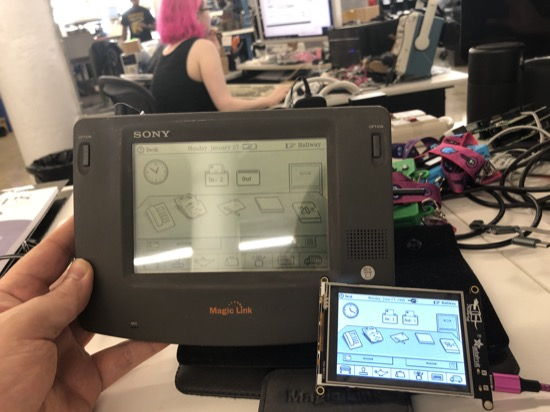](https://www.youtube.com/playlist?list=PLjF7R1fz_OOXRMjM7Sm0J2Xt6H81TdDev)

The wonderful world of Python on hardware! This is our first video-newsletter-podcast that we’ve started! The news comes from the Python community, Discord, Adafruit communities and more. It’s part of the weekly newsletter, then we have a segment on ASK an ENGINEER and this is the video slice from that! The complete Python on Hardware weekly VideoCast [playlist is here](https://www.youtube.com/playlist?list=PLjF7R1fz_OOXRMjM7Sm0J2Xt6H81TdDev). 

This video podcast is on [iTunes](https://itunes.apple.com/us/podcast/python-on-hardware/id1451685192?mt=2), [YouTube](https://www.youtube.com/playlist?list=PLjF7R1fz_OOXRMjM7Sm0J2Xt6H81TdDev), [IGTV (Instagram TV](https://www.instagram.com/adafruit/channel/)), and [XML](https://itunes.apple.com/us/podcast/python-on-hardware/id1451685192?mt=2).

[Weekly community chat on Adafruit Discord server CircuitPython channel - Audio / Podcast edition](https://itunes.apple.com/us/podcast/circuitpython-weekly-meeting/id1451685016) - Audio from the Discord chat space for CircuitPython, meetings are usually Mondays at 2pm ET, this is the audio version on [iTunes](https://itunes.apple.com/us/podcast/circuitpython-weekly-meeting/id1451685016), Pocket Casts, [Spotify](https://adafru.it/spotify), and [XML feed](https://adafruit-podcasts.s3.amazonaws.com/circuitpython_weekly_meeting/audio-podcast.xml).

## Codecademy "Learn Hardware Programming with CircuitPython"

Codecademy, an online interactive learning platform used by more than 45 million people, has teamed up with the leading manufacturer in STEAM electronics, Adafruit Industries, to create a coding course, "Learn Hardware Programming with CircuitPython". The course is now available in the [Codecademy catalog](https://www.codecademy.com/learn/learn-circuitpython?utm_source=adafruit&utm_medium=partners&utm_campaign=circuitplayground&utm_content=pythononhardwarenewsletter).

Python is a highly versatile, easy to learn programming language that a wide range of people, from visual effects artists in Hollywood to mission control at NASA, use to quickly solve problems. But you don’t need to be a rocket scientist to accomplish amazing things with it. This new course introduces programmers to Python by way of a microcontroller — CircuitPython — which is a Python-based programming language optimized for use on hardware.

CircuitPython’s hardware-ready design makes it easier than ever to program a variety of single-board computers, and this course gets you from no experience to working prototype faster than ever before. Codecademy’s interactive learning environment, combined with Adafruit's highly rated Circuit Playground Express, present aspiring hardware hackers with a never-before-seen opportunity to learn hardware programming seamlessly online.

Whether for those who are new to programming, or for those who want to expand their skill set to include physical computing, this course will have students getting familiar with Python and creating incredible projects along the way. By the end, students will have built their own bike lights, drum machine, and even a moisture detector that can tell when it's time to water a plant.

Visit Codecademy to access the [Learn Hardware Programming with CircuitPython](https://www.codecademy.com/learn/learn-circuitpython?utm_source=adafruit&utm_medium=partners&utm_campaign=circuitplayground&utm_content=pythononhardwarenewsletter) course and Adafruit to purchase a [Circuit Playground Express](https://www.adafruit.com/product/3333).

Codecademy has helped more than 45 million people around the world upgrade their careers with technology skills. The company’s online interactive learning platform is widely recognized for providing an accessible, flexible, and engaging experience for beginners and experienced programmers alike. Codecademy has raised a total of $43 million from investors including Union Square Ventures, Kleiner Perkins, Index Ventures, Thrive Capital, Naspers, Yuri Milner and Richard Branson, most recently raising its $30 million Series C in July 2016.

## Contribute!

The CircuitPython Weekly Newsletter is a CircuitPython community-run newsletter emailed every Tuesday. The complete [archives are here](https://www.adafruitdaily.com/category/circuitpython/). It highlights the latest CircuitPython related news from around the web including Python and MicroPython developments. To contribute, edit next week's draft [on GitHub](https://github.com/adafruit/circuitpython-weekly-newsletter/tree/gh-pages/_drafts) and [submit a pull request](https://help.github.com/articles/editing-files-in-your-repository/) with the changes. Join our [Discord](https://adafru.it/discord) or [post to the forum](https://forums.adafruit.com/viewforum.php?f=60) for any further questions.
