Feature story text here

change date

## 8/8/2019 is CircuitPython day!

8/8/2019 is CircuitPython day! This week we'll have live videos, celebrations, and more for this very snake friendly date! Here's some artwork in our public DropBox CircuitPython folder, check it out - [DropBox](https://www.dropbox.com/sh/cod3wllmyninyn5/AADC6Z5EhEsG18X8WDRMEZuta?dl=0).

If you need to get in touch with us for planning your event or sending links/photos post-event, email: [circuitpythonday@adafruit.com](mailto:circuitpythonday@adafruit.com)

CircuitPython day events coming up THIS WEEK!

CircuitPython Day with the India Linux Users Group Delhi (ILUGD) at the Delhi Technical University for Women - August 4, 2019. [Meetup](https://www.meetup.com/ilugdelhi/events/jkbtdqyzlbnb/) & [Eventbrite](https://www.eventbrite.com/e/circuitpython-day-tickets-63844092399).

Over the weekend! Getting started programming microcontrollers with CircuitPython was at NYC Resistor - [August 3, 2019](https://www.eventbrite.com/e/getting-started-programming-microcontrollers-with-circuitpython-tickets-63905511104).

## CircuitPython editing and saving on iOS is here!

[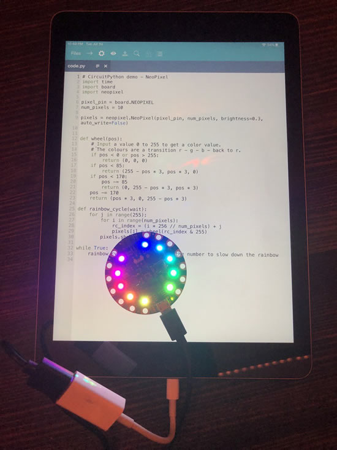](https://blog.adafruit.com/2019/07/30/its-now-possible-to-open-edit-and-save-python-code-on-ios-for-embedded-electronics-plugged-in-circuitpython-usb-devices-apple-ios-circuitpython/)

It’s now possible to open, edit, and save Python code on iOS for embedded electronics plugged in, CircuitPython USB devices. This is a follow up to [our post](https://blog.adafruit.com/2019/06/25/ios-13-beta-1-erases-files-off-drive-resets-ipad-fat12-issue-it-seems-apple/) about Apple’s iOS 13 beta, which is now up to beta 5.

The upcoming [iOS 13](https://www.apple.com/ios/ios-13-preview/) allows iPads (and iPhones) to be more like computers, which means you’ll be able to do computer-like things such as plugging in a USB drive, opening up the Files app in iOS 13 and browsing the files. This is going to be fantastic for folks who want to use an iPad as their full-time desktop replacement, and if you’re a coder it looks like you’ll be able to do things like opening up Python .py files, use IDEs for coding, etc. A lot of schools use iPads, so this means any iPad will be able to be used to code for electronics: if the app can open a text file, it can be used to write Python.

iOS 13 beta 1 had some troubles: it deleted files off some devices that act like USB drives, for example, all the CircuitPython boards. But now the GOOD NEWS: we filed a bug report, and since iOS beta 5 IT IS ALL WORKING! This means any code editor for iOS can be used as a code editor for CircuitPython and you’ll be able to open, edit, and save your code to the device(s) plugged in to the iOS device!

Here’s a quick summary of how to edit a CircuitPython file now on an iPad running iOS 13 beta 5: plug in a CircuitPython board, such as a Circuit Playground Express, select a file on CIRCUITPY, drag or copy/paste the file to “On My iPad”, use an editor to change the file, then delete the original file on CIRCUITPY, copy/paste, share, or drag the file back to CIRCUITPY, giving it a new name, rename and it all saves and runs automatically. It’s awesome. The code editing apps are not aware of this new “USB storage” in iOS 13 yet; when they are (soon), it will be even easier. For now, just use the iOS Files app to move the files around.

Also, iOS 13 beta 5 clearly still has some bugs: you can’t save the file with its original name, so you need to to save with a new name, delete the old file, and rename the new file.

Full post and more - [Adafruit](https://blog.adafruit.com/2019/07/30/its-now-possible-to-open-edit-and-save-python-code-on-ios-for-embedded-electronics-plugged-in-circuitpython-usb-devices-apple-ios-circuitpython/).

And for future-us to do some testing, here is "iPad Pro USB-C hubs- the best, worst, and weirdest options" - [The Verge](https://www.theverge.com/2019/8/2/20750137/apple-ipad-pro-usb-c-hubs-hyperdrive-belkin-satechi-kanex).

## CircuitPython sneks its way to Snek!

[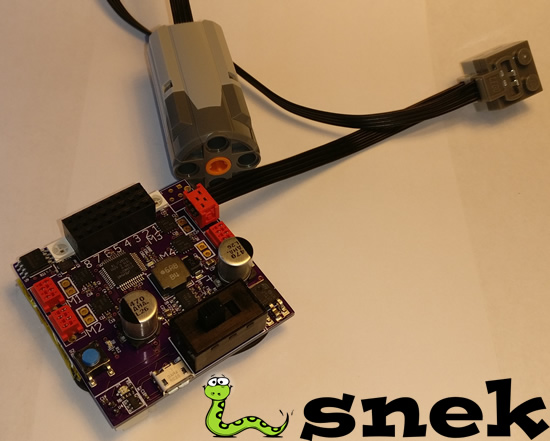](https://circuitpython.org/board/snekboard/)

[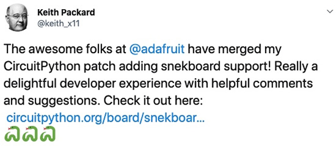](https://circuitpython.org/board/snekboard/)

Snekboard is designed to hook up to Lego Power Functions motors and switches, allowing you to build robots out of Lego and control them with CircuitPython or the simpler snek programming language. Snekboard is 48mm × 48mm, which is the same size as 6 x 6 Lego studs allowing you to build a box out of Lego to hold it attached to your Leo design. It uses a single cell lithium polymer battery that fits under the board and charges over USB while snekboard is being programmed from the host - [circuitpython.org](https://circuitpython.org/board/snekboard/) & [keithhp.com](https://keithp.com/snek/snekboard/)

## CircuitPython snakes its way to DEFCON!

[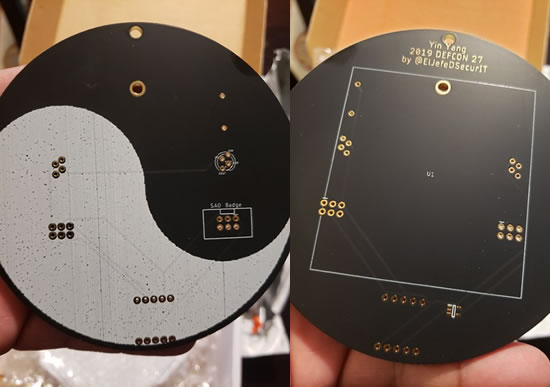](https://twitter.com/ElJefeDSecurIT/status/1157451570721611776)

It's August, it's hot out, time for [DEFCON](https://www.defcon.org/). In recent years "Badge Life" the making of electronic badges for the hacking event, DEFCON, has become really popular. This year we're seeing more and more CircuitPython-compatible badges! - [Twitter](https://twitter.com/ElJefeDSecurIT/status/1157451570721611776). DEFCON happens August 8th to the 12th, we'll post up more on the Adafruit blog and Twitter!

## “RISC architecture is gonna change everything”

_“RISC architecture is gonna change everything”_ …. _“Yah, RISC is good.”_ [Hackers (1995)](https://youtu.be/RL9yCWv7NS0), accurately predicted the future, maybe... Big news! Adafruit joins the RISC-V Foundation! 

[What is RISC-V](https://riscv.org/)?

>_"RISC-V is a free and open ISA enabling a new era of processor innovation through open standard collaboration. Born in academia and research, RISC-V ISA delivers a new level of free, extensible software and hardware freedom on architecture, paving the way for the next 50 years of computing design and innovation."_

[What is the RISC-V Foundation](https://riscv.org/risc-v-foundation/)?

>_"RISC-V (pronounced “risk-five”) is a free and open ISA enabling a new era of processor innovation through open standard collaboration. Founded in 2015, the RISC-V Foundation comprises more than 275 members building the first open, collaborative community of software and hardware innovators powering a new era of processor innovation. Born in academia and research, RISC-V ISA delivers a new level of free, extensible software and hardware freedom on architecture, paving the way for the next 50 years of computing design and innovation. The RISC-V Foundation, a non-profit corporation controlled by its members, directs the future development and drives the adoption of the RISC-V ISA. Members of the RISC-V Foundation have access to and participate in the development of the RISC-V ISA specifications and related HW / SW ecosystem."_

[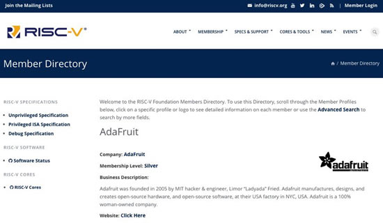](https://blog.adafruit.com/2019/08/02/risc-architecture-is-gonna-change-everything-adafruit-joins-the-risc-v-foundation-risc_v-riscv-adafruit-adafruit/)

Adafruit is a member and listed in the [RISC-V Foundation Members Directory – Adafruit](https://riscv.org/membership/6694/adafruit/).

[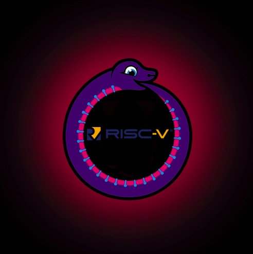](https://blog.adafruit.com/2019/08/02/risc-architecture-is-gonna-change-everything-adafruit-joins-the-risc-v-foundation-risc_v-riscv-adafruit-adafruit/)

We’re excited for open silicon! **If someone is working on a RISC-V microcontroller with built-in USB and a good chunk of RAM please let us know!** We're looking forward to writing _"CircuitPython snakes its way to RISC-V!"_

**Related**

*   Members at a Glance - [RISC-V](https://riscv.org/members-at-a-glance/).

**RISC-V SPECIFICATIONS**

*   [Unprivileged Specification](https://riscv.org/specifications/).
*   [Privileged ISA Specification](https://riscv.org/specifications/privileged-isa).
*   [Debug Specification](https://riscv.org/specifications/debug-specification/).

**RISC-V SOFTWARE**

*   [Software Status](https://riscv.org/software-status/).

**RISC-V CORES**

*   [RISC-V Cores](https://riscv.org/risc-v-cores/).

**RISC-V news and more...**

*   RISC-V [YouTube](https://www.youtube.com/channel/UC5gLmcFuvdGbajs4VL-WU3g).
*   RISC-V [Twitter](https://twitter.com/risc_v).
*   RISC-V [LinkedIn](https://www.linkedin.com/company/risc-v-foundation/).
*   RISC-V [QQ](http://v.qq.com/vplus/d209ebe6bde6ab40d5b0b89a1ce27006).
*   RISC-V [RSS feed.](https://riscv.org/feed/)
*   RISC @ [Adafruit blog search](https://blog.adafruit.com/?s=risc) / [RSS](https://blog.adafruit.com/search/risc/feed/rss2/) & [RISC-V category](https://blog.adafruit.com/category/risc-v/) @ [Adafruit blog / RSS](https://blog.adafruit.com/category/risc-v/feed/).
*   RISC-V [search on hackaday](https://hackaday.com/?s=risc-v) / [RSS](https://hackaday.com/search/risc-v/feed/rss2/).
*   RISC-V search @ [hackster.io](https://blog.hackster.io/search?q=risc-v).
*   RISC-V [google news RSS](https://www.google.com/alerts/feeds/13603317926958052576/14312567271684397982).
*   RISC-V [#riscv Twitter](https://twitter.com/search?q=%23riscv&src=typeahead_click&f=live).
*   RISC-V [#riscv on Instagram](https://www.instagram.com/explore/tags/riscv/).
*   RISC-V on [Reddit](https://www.reddit.com/r/RISCV) / [RSS](https://www.reddit.com/r/RISCV.rss).
*   RISC -V on [eBay](https://www.ebay.com/sch/i.html?_from=R40&_trksid=p2380057.m570.l1313.TR1.TRC0.A0.H0.Xrisc-v.TRS0&_nkw=risc-v&_sacat=0) / [RSS](https://www.ebay.com/sch/i.html?_from=R40&_trksid=p2380057.m570.l1313.TR1.TRC0.A0.H0.Xrisc-v.TRS0&_nkw=risc-v&_sacat=0&_rss=1).
*   RISC -V on [CNX](https://www.cnx-software.com/?s=risc-v) / [RSS Feed](https://www.cnx-software.com/search/risc-v/feed/rss2/)

## News from around the web!

[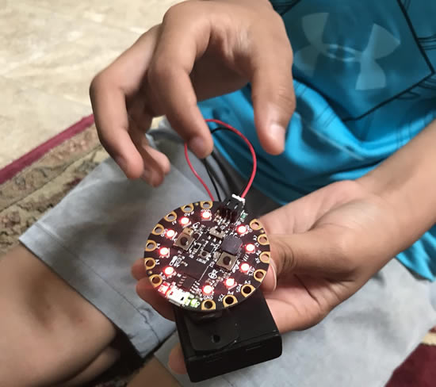](https://twitter.com/danielleboyerr/status/1157677998088368129)

[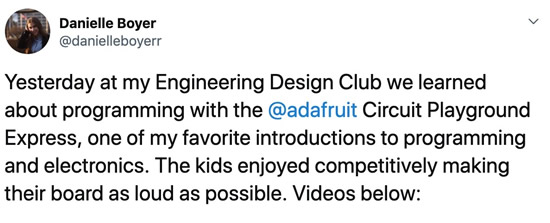](https://twitter.com/danielleboyerr/status/1157677998088368129)

From Daniel's Engineering Design Club, the class learned about programming with the  Circuit Playground Express, one of the favorite introductions to programming and electronics. The kids enjoyed competitively making their board as loud as possible - [Twitter](https://twitter.com/danielleboyerr/status/1157677998088368129).

[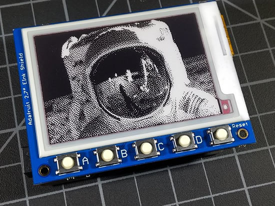](https://twitter.com/cogliano/status/1157485796536082437)

Dan is working on some CircuitPython code to load images onto an ePaper display from a monochrome BMP file - [Twitter](https://twitter.com/cogliano/status/1157485796536082437).

Automated rocket parachute deployment based on accelerometer data with CircuitPython! - [Twitter](https://twitter.com/DrMattWShields/status/1157156196597452806).

[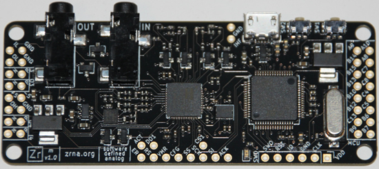](https://zrna.org/)

Zrna hardware realizes the analog circuit you specify in software, in real time. Change any circuit parameter on the fly with an API request, at your lab bench or embedded in-application - [zrna.org](https://zrna.org/)

[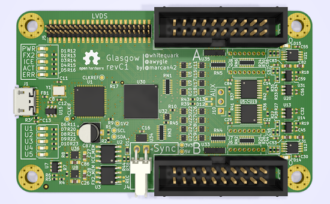](https://github.com/GlasgowEmbedded/Glasgow)

Glasgow is a tool for exploring digital interfaces, aimed at embedded developers, reverse engineers, digital archivists, electronics hobbyists, and everyone else who wants to communicate to a wide selection of digital devices with high reliability and minimum hassle. It can be attached to most devices without additional active or passive components, and includes extensive protection from unexpected conditions and operator error - [GitHub](https://github.com/GlasgowEmbedded/Glasgow).

You can now use API tokens to authenticate with PyPI - [pipy.org](https://pypi.org/help/#apitoken)

specgram.py demo - [GitHub](https://github.com/jamesbowman/gd2-asset/blob/master/pydemo/specgram.py).

[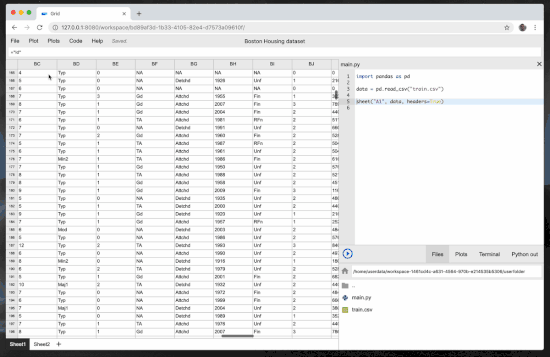](https://hackernoon.com/introducing-grid-studio-a-spreadsheet-app-with-python-to-make-data-science-easier-tdup38f7)

"How I built a spreadsheet app with Python to make data science easier" by Rick Lamers - [hackernoon](https://hackernoon.com/introducing-grid-studio-a-spreadsheet-app-with-python-to-make-data-science-easier-tdup38f7).

[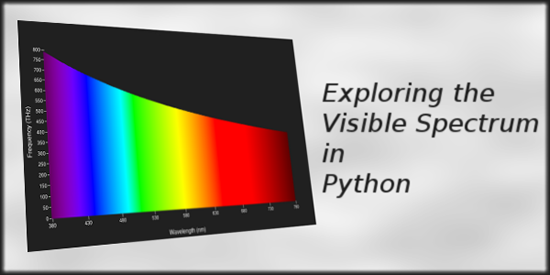](http://www.codedrome.com/exploring-the-visible-spectrum-in-python/)

Exploring the Visible Spectrum in Python - [CodeDrome](http://www.codedrome.com/exploring-the-visible-spectrum-in-python/).

"How to set up a perfect Python project" by Brendan Maginnis - [sourcery.ai](https://sourcery.ai/blog/python-best-practices/)

The [Python community](https://twitter.com/gvanrossum/status/1156984705771683840?s=21) is looking for stories about first-time contribution to Python (or other open source projects for that matter), successful or not - [Twitter](https://twitter.com/TalEinat/status/1156898504884785157).

[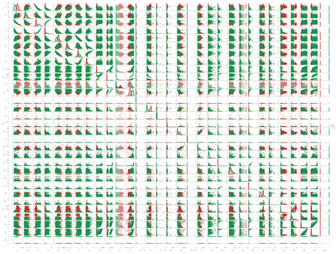](https://medium.com/i-want-to-be-the-very-best/searching-for-pulsars-with-machine-learning-f4db5fa58b3c)

[Searching for Pulsars with Machine Learning](https://medium.com/i-want-to-be-the-very-best/searching-for-pulsars-with-machine-learning-f4db5fa58b3c) by Frank Ceballos.

4 Attempts at Packaging Python as an Executable - [tryexceptpass.org](https://tryexceptpass.org/article/package-python-as-executable/)

[Using Machine Learning To Identify Smartphone Users By The Way They Walk](https://medium.com/dvt-engineering/using-machine-learning-to-identify-smartphone-users-by-the-way-they-walk-17ae574df921) by Steven Wessels.

Windows Terminal Preview v0.3 Release - [devblogs.microsoft.com](https://devblogs.microsoft.com/commandline/windows-terminal-preview-v0-3-release/)

LiveCode is both a language and a framework. It delivers executable native apps with the LiveCode Virtual Machine embedded - [livecode.org](https://livecode.org/). Kinda HyperCard like...

Dark is a holistic programming language, structured editor, and infrastructure, for building backend web services. It's for frontend, backend, and mobile engineers - [Dark](https://darklang.com/).

Detecting Credential Compromise in AWS - [GitHub](https://github.com/Netflix-Skunkworks/aws-credential-compromise-detection).

Metastability is Hard - [xobs.io](https://xobs.io/metastability-is-hard/)

#ICYDNCI What was the most popular, most clicked link, in [last week's newsletter](https://www.adafruitdaily.com/2019/07/30/kattni-keynotes-at-pyohio-circuitpython-snakes-its-way-to-the-stm32-and-more-python-adafruit-circuitpython-pythonhardware-circuitpython-micropython-thepsf-adafruit/)? [Changing Lives through Open Source, Passion and Mentoring](https://www.pyohio.org/2019/presentations/126) - [PyOhio](https://www.pyohio.org), [Kattni Rembor's](https://www.pyohio.org/2019/speakers/233) keynote.

## Made with Mu

Why Mu? Mu tries to make it as easy as possible to get started with programming but aims to help you graduate to "real" development tools soon after. Everything in Mu is the "real thing" but presented in as simple and obvious way possible. It's like the toddling stage in learning to walk: you're finding your feet and once you're confident, you should move on and explore! Put simply, Mu aims to foster autonomy. Try out Mu today! - [codewith.mu](https://codewith.mu/)

## Coming soon

## New Learn Guides!

[Zelda Master Sword](https://learn.adafruit.com/zelda-master-sword) from [Noe and Pedro](https://learn.adafruit.com/users/pixil3d)

[NeoPixel Badge Lanyard with Bluetooth LE](https://learn.adafruit.com/bluetooth-neopixel-badge-lanyard) from [Erin St Blaine](https://learn.adafruit.com/users/firepixie)

[How to add a New Board to the circuitpython.org website](https://learn.adafruit.com/how-to-add-a-new-board-to-the-circuitpython-org-website) from [Melissa LeBlanc-Williams](https://learn.adafruit.com/users/MakerMelissa)

[PyGamer NeoPixel Controller](https://learn.adafruit.com/pygamer-neopixel-controller) from [John Park](https://learn.adafruit.com/users/johnpark)

## Updated Guides - Now With More Python!

**You can use CircuitPython libraries on Raspberry Pi!** We're updating all of our CircuitPython guides to show how to wire up sensors to your Raspberry Pi, and load the necessary CircuitPython libraries to get going using them with Python. We'll be including the updates here so you can easily keep track of which sensors are ready to go. Check it out!

Keep checking back for more updated learn guides!

## CircuitPython Libraries!

CircuitPython support for hardware continues to grow. We are adding support for new sensors and breakouts all the time, as well as improving on the drivers we already have. As we add more libraries and update current ones, you can keep up with all the changes right here!

For the latest drivers, download the [Adafruit CircuitPython Library Bundle](https://github.com/adafruit/Adafruit_CircuitPython_Bundle/releases/latest).

If you'd like to contribute, CircuitPython libraries are a great place to start. Have an idea for a new driver? File an issue on [CircuitPython](https://github.com/adafruit/circuitpython/issues)! Interested in helping with current libraries? Check out [this GitHub issue on CircuitPython](https://github.com/adafruit/circuitpython/issues/1246) for an overview of the State of the CircuitPython Libraries, updated each week. We've included open issues from the library issue lists, and details about repo-level issues that need to be addressed. We have a guide on [contributing to CircuitPython with Git and Github](https://learn.adafruit.com/contribute-to-circuitpython-with-git-and-github) if you need help getting started. You can also find us in the #circuitpython channel on the [Adafruit Discord](https://adafru.it/discord). Feel free to contact Kattni (@kattni) with any questions.

You can check out this [list of all the CircuitPython libraries and drivers available](https://github.com/adafruit/Adafruit_CircuitPython_Bundle/blob/master/circuitpython_library_list.md). 

The current number of CircuitPython libraries is **171**!

**Updated Libraries!**

Here's this week's updated CircuitPython libraries:
 * [Adafruit_CircuitPython_SI5351](https://github.com/adafruit/Adafruit_CircuitPython_SI5351)
 * [Adafruit_CircuitPython_seesaw](https://github.com/adafruit/Adafruit_CircuitPython_seesaw)
 * [Adafruit_CircuitPython_ESP32SPI](https://github.com/adafruit/Adafruit_CircuitPython_ESP32SPI)
 * [Adafruit_CircuitPython_PyPortal](https://github.com/adafruit/Adafruit_CircuitPython_PyPortal)
 * [Adafruit_CircuitPython_Requests](https://github.com/adafruit/Adafruit_CircuitPython_Requests)
 * [Adafruit_CircuitPython_ILI9341](https://github.com/adafruit/Adafruit_CircuitPython_ILI9341)

**PyPI Download Stats!**

We've written a special library called Adafruit Blinka that makes it possible to use CircuitPython Libraries on [Raspberry Pi and other compatible single-board computers](https://learn.adafruit.com/circuitpython-on-raspberrypi-linux/). Adafruit Blinka and all the CircuitPython libraries have been deployed to PyPI for super simple installation on Linux! Here are the top 10 CircuitPython libraries downloaded from PyPI in the last week, including the total downloads for those libraries:

| Library                                     | Last Week   | Total |   
|:-------                                     |:--------:   |:-----:|   
| Adafruit-Blinka                             | 1078        | 42274 |   
| Adafruit_CircuitPython_BusDevice            | 747         | 17739 |   
| Adafruit_CircuitPython_MCP230xx             | 415         | 4319 |    
| Adafruit_CircuitPython_seesaw               | 235         | 1632 |    
| Adafruit_CircuitPython_NeoPixel             | 146         | 6352 |    
| Adafruit_CircuitPython_Register             | 144         | 7516 |    
| Adafruit_CircuitPython_ESP32SPI             | 117         | 1554 |    
| Adafruit_CircuitPython_Motor                | 107         | 5064 |    
| Adafruit_CircuitPython_ServoKit             | 98          | 3603 |    
| Adafruit_CircuitPython_PCA9685              | 90          | 4546 |    

## Upcoming events!

PyBay will be heald August 15-18, 2019 in San Francisco, CA with workshops Thurs-Fri and talks Sat-Sun. Bryan Siepert (@siddacious) will be giving a talk on Saturday titled "Accellerating Driver Developement with CircuitPython"! PyBay is offered by SF Python, a volunteer-run organization dedicated to building a stronger Python developer community. PyBay offers influential speakers presenting crucial technologies to help beginners and seasoned developers alike get up-to-date quickly. Whether you’re interested in web technologies, data, devops, Python internals, or performance, PyBay will help you stay on top of your game. There will be workshops, tutorials, talks, keynotes, open spaces, lightnight talks, a maker happy hour and more! Registration is now open! [PyBay](https://pybay.com/)

Open Source Summit and Embedded Linux Conference, August 21 – 23, 2019 at the Hilton San Diego Bayfront. The Open Source Summit North America combines with Embedded Linux Conference North America (ELC).  ELC has been a vendor-neutral technical conference where developers working on embedded Linux and industrial IoT products and deployments gather for education and collaboration. Open Source Summit brings together developers and open source professionals to collaborate and learn about the latest technologies - [Linux Foundation](https://www.linuxfoundation.org/press-release/2019/05/open-source-summit-to-include-embedded-linux-conference-bring-together-both-technical-and-leadership-programs-under-one-roof/).

PYCON UK 2019 - Cardiff City Hall, Friday 13th to Tuesday 17th September. PyCon UK is back at Cardiff City Hall, for five days of talks, workshops and collaboration. The conference also features a young coders' day, themes dedicated to science and education, and numerous Python-related events - [PyCon UK](https://2019.pyconuk.org/).

[October is Open Hardware Month @ Open Source Hardware Association](https://www.oshwa.org/2019/07/26/october-is-open-hardware-month-2/).

>_"October is Open Hardware Month! Check out the [Open Hardware Month website](http://ohm.oshwa.org/). Host an event, find a local event, or [certify](https://certification.oshwa.org/) your hardware to support Open Source Hardware. We are providing resources and asking you, the community, to host small, local events in the name of open source hardware. Tell us about your October event by f[illing out the form below](https://docs.google.com/forms/d/e/1FAIpQLSfjvJmcRXbpgjRACgY_BbaDzQZRa6wxEcP-xwaBpC0X6mvsPw/viewform). Your event will be featured on [OSHWA’s Open Hardware Month page](http://ohm.oshwa.org/) (provided you have followed OSHWA’s rules listed on the [“Do’s and Don’ts”](http://ohm.oshwa.org/dos-and-donts/) page)."_

[Read more](https://www.oshwa.org/2019/07/26/october-is-open-hardware-month-2/), [Tweet for speakers in 2020](https://twitter.com/ohsummit/status/1154881782677831680), and Open Hardware Month @ [http://ohm.oshwa.org/](http://ohm.oshwa.org/)

micro:bit Live 2019 is coming to BBC MediaCityUK, Greater Manchester, England on October 4-5. This will be the very first annual gathering of the global micro:bit community of educators and partners - [micro:bit](https://microbit.org/en/2019-04-12-microbit-live/).

## Latest releases

CircuitPython's stable release is [#.#.#](https://github.com/adafruit/circuitpython/releases/latest) and its unstable release is [#.#.#-##.#](https://github.com/adafruit/circuitpython/releases). New to CircuitPython? Start with our [Welcome to CircuitPython Guide](https://learn.adafruit.com/welcome-to-circuitpython).

[2019####](https://github.com/adafruit/Adafruit_CircuitPython_Bundle/releases/latest) is the latest CircuitPython library bundle.

[v#.#.#](https://micropython.org/download) is the latest MicroPython release. Documentation for it is [here](http://docs.micropython.org/en/latest/pyboard/).

[#.#.#](https://www.python.org/downloads/) is the latest Python release. The latest pre-release version is [#.#.#](https://www.python.org/download/pre-releases/).

[1331 Stars](https://github.com/adafruit/circuitpython/stargazers) Like CircuitPython? [Star it on GitHub!](https://github.com/adafruit/circuitpython)

## Call for help – CircuitPython messaging to other languages!

We [posted on the Adafruit blog](https://blog.adafruit.com/2018/08/15/help-bring-circuitpython-messaging-to-other-languages-circuitpython/) about bringing CircuitPython messaging to other languages, one of the exciting features of CircuitPython 4.x is translated control and error messages. Native language messages will help non-native English speakers understand what is happening in CircuitPython even though the Python keywords and APIs will still be in English. If you would like to help, [please post](https://github.com/adafruit/circuitpython/issues/1098) to the main issue on GitHub and join us on [Discord](https://adafru.it/discord).

We made this graphic with translated text, we could use your help with that to make sure we got the text right, please check out the text in the image – if there is anything we did not get correct, please let us know. Dan sent me this [handy site too](http://helloworldcollection.de/#Human).

## jobs.adafruit.com

[jobs.adafruit.com](https://jobs.adafruit.com/) has returned and folks are posting their skills (including CircuitPython) and companies are looking for talented makers to join their companies - from Digi-Key, to Hackaday, Microcenter, Raspberry Pi and more.

## 13,*** thanks!

The Adafruit Discord community, where we do all our CircuitPython development in the open, reached over 13,*** humans, thank you! Join today! [https://adafru.it/discord](https://adafru.it/discord)

Discord now offers "server boosts" we have 12 on our server (level 2), if we get to 50 boosts we get to level 3 and some other good features for the community: +100 emojis for a total of 250, 384 Kbps audio, vanity URL, 100 mb uploads for all members (and all the things we have now, like the server banner). Stop by and boost! [https://adafru.it/discord](https://adafru.it/discord).

## ICYMI - In case you missed it

The wonderful world of Python on hardware! This is our first video-newsletter-podcast that we’ve started! The news comes from the Python community, Discord, Adafruit communities and more. It’s part of the weekly newsletter, then we have a segment on ASK an ENGINEER and this is the video slice from that! The complete Python on Hardware weekly VideoCast [playlist is here](https://www.youtube.com/playlist?list=PLjF7R1fz_OOXRMjM7Sm0J2Xt6H81TdDev). 

This video podcast is on [iTunes](https://itunes.apple.com/us/podcast/python-on-hardware/id1451685192?mt=2), [YouTube](https://www.youtube.com/playlist?list=PLjF7R1fz_OOXRMjM7Sm0J2Xt6H81TdDev), [IGTV (Instagram TV](https://www.instagram.com/adafruit/channel/)), and [XML](https://itunes.apple.com/us/podcast/python-on-hardware/id1451685192?mt=2).

[Weekly community chat on Adafruit Discord server CircuitPython channel - Audio / Podcast edition](https://itunes.apple.com/us/podcast/circuitpython-weekly-meeting/id1451685016) - Audio from the Discord chat space for CircuitPython, meetings are usually Mondays at 2pm ET, this is the audio version on [iTunes](https://itunes.apple.com/us/podcast/circuitpython-weekly-meeting/id1451685016), Pocket Casts, [Spotify](https://adafru.it/spotify), and [XML feed](https://adafruit-podcasts.s3.amazonaws.com/circuitpython_weekly_meeting/audio-podcast.xml).

And lastly, we are working up a one-spot destination for all things podcast-able here - [podcasts.adafruit.com](https://podcasts.adafruit.com/)

## Codecademy "Learn Hardware Programming with CircuitPython"

Codecademy, an online interactive learning platform used by more than 45 million people, has teamed up with the leading manufacturer in STEAM electronics, Adafruit Industries, to create a coding course, "Learn Hardware Programming with CircuitPython". The course is now available in the [Codecademy catalog](https://www.codecademy.com/learn/learn-circuitpython?utm_source=adafruit&utm_medium=partners&utm_campaign=circuitplayground&utm_content=pythononhardwarenewsletter).

Python is a highly versatile, easy to learn programming language that a wide range of people, from visual effects artists in Hollywood to mission control at NASA, use to quickly solve problems. But you don’t need to be a rocket scientist to accomplish amazing things with it. This new course introduces programmers to Python by way of a microcontroller — CircuitPython — which is a Python-based programming language optimized for use on hardware.

CircuitPython’s hardware-ready design makes it easier than ever to program a variety of single-board computers, and this course gets you from no experience to working prototype faster than ever before. Codecademy’s interactive learning environment, combined with Adafruit's highly rated Circuit Playground Express, present aspiring hardware hackers with a never-before-seen opportunity to learn hardware programming seamlessly online.

Whether for those who are new to programming, or for those who want to expand their skill set to include physical computing, this course will have students getting familiar with Python and creating incredible projects along the way. By the end, students will have built their own bike lights, drum machine, and even a moisture detector that can tell when it's time to water a plant.

Visit Codecademy to access the [Learn Hardware Programming with CircuitPython](https://www.codecademy.com/learn/learn-circuitpython?utm_source=adafruit&utm_medium=partners&utm_campaign=circuitplayground&utm_content=pythononhardwarenewsletter) course and Adafruit to purchase a [Circuit Playground Express](https://www.adafruit.com/product/3333).

Codecademy has helped more than 45 million people around the world upgrade their careers with technology skills. The company’s online interactive learning platform is widely recognized for providing an accessible, flexible, and engaging experience for beginners and experienced programmers alike. Codecademy has raised a total of $43 million from investors including Union Square Ventures, Kleiner Perkins, Index Ventures, Thrive Capital, Naspers, Yuri Milner and Richard Branson, most recently raising its $30 million Series C in July 2016.

## Contribute!

The CircuitPython Weekly Newsletter is a CircuitPython community-run newsletter emailed every Tuesday. The complete [archives are here](https://www.adafruitdaily.com/category/circuitpython/). It highlights the latest CircuitPython related news from around the web including Python and MicroPython developments. To contribute, edit next week's draft [on GitHub](https://github.com/adafruit/circuitpython-weekly-newsletter/tree/gh-pages/_drafts) and [submit a pull request](https://help.github.com/articles/editing-files-in-your-repository/) with the changes. Join our [Discord](https://adafru.it/discord) or [post to the forum](https://forums.adafruit.com/viewforum.php?f=60) for any further questions.
