- [X] Kattni updates
- [X] change date
- [X] update title
- [X] Feature story
- [X] Update  for images
- [X] All images 550w max only
- [ ] Add community notes as placeholder

## Consumers Should Immediately... Python the Circuit

[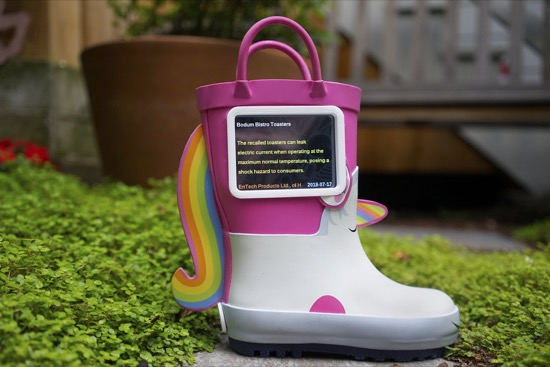](http://www.extrasleepy.com/#/recalled/)

[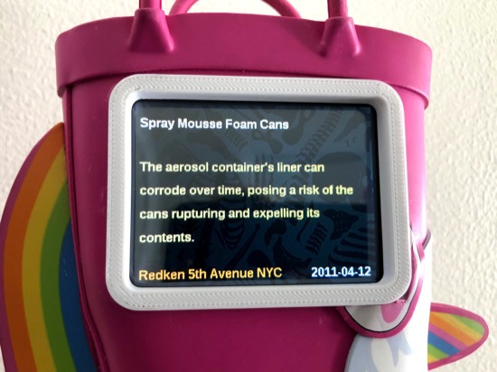](http://www.extrasleepy.com/#/recalled/)

This uses a live data feed from The United States Consumer Product Safety Commission (USCPSC) to randomly display thousands of products recalled for reasons such as fire, electrocution, entrapment, choking and a variety of other unintended dangers. Every two minutes the embedded screen lists the name of the product, the identified danger, the product manufacturer, and the original recall date. The electronics are enclosed in an actual recalled children’s unicorn boot, along with an embedded rechargeable battery, allowing for an uninterrupted stream of recalled products in any location.

This piece uses Adafruit’s Pyportal and CircuitPython - [extrasleepy.com/#/recalled](http://www.extrasleepy.com/#/recalled/) via [Twitter](https://twitter.com/akleindolph/status/1161405450509680640).

## 1,000+ thanks! CircuitPython stickers and more!

[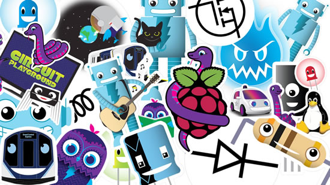](https://itunes.apple.com/us/app/adafruit-stickers/id1291627278?mt=8)

The CircuitPython and Circuit Playground stickers for iOS we recently released has hit 1,000+ downloads already! - [Apple](https://itunes.apple.com/us/app/adafruit-stickers/id1291627278?mt=8). Thank you Trevor and Adabot :)

## What we're working on ...

There are lots of folks who work on CircuitPython or some of the many open-source boards, and open-source code for the community. Here's what Bryan, Dan, and Melissa are up this week!

**All a board' with Bryan**

Byan is working on the CircuitPython driver for the super-cheap yet capable MS301 accelerometer - [GitHub](https://github.com/adafruit/Adafruit_MSA301/blob/master/MSA301-V1.0-ENG.PDF).

Will also starting on the drivers for the APDS-9500 gesture sensor. This one will be a bit of a doozy, but has a lot of potential in its ability to detect directional gestures on the device itself, once we get them working - [PDF](https://www.mouser.com/datasheet/2/678/V02-4584EN_DS_APDS-9500_2016-10-05-1076498.pdf).

[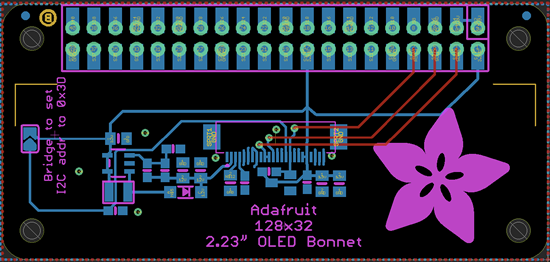](https://www.adafruit.com/new)

[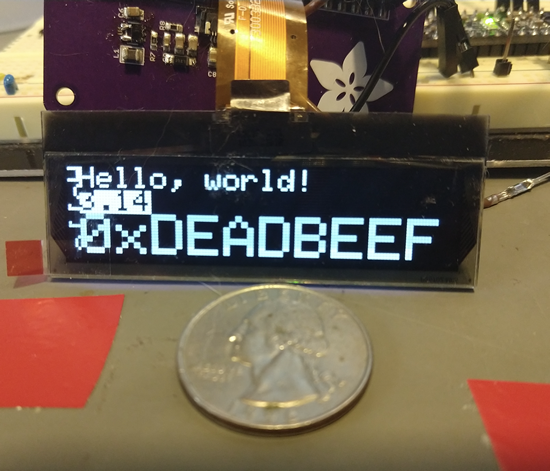](https://www.adafruit.com/new)

The Large OLED Bonnet is coming along as well. This will be a great display with excellent readability due to the high contrast from being an OLED, combined with the larger pixels making for bigger text or images.

[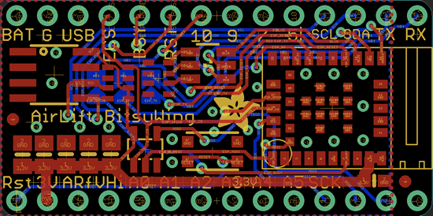](https://www.adafruit.com/new)

Lastly the super cool Airlift "BitsyWing" as we've been calling it should be headed to production soon.

This little helper will help squeeze WiFi and IOT goodness into even smaller places! I'm personally excited to put a bunch of these to use for some home automation tasks.

**CircuitPython Bluetooth Low energy from Dan**

CircuitPython Bluetooth Low energy can:

- be a BLE beacon, including as an iBeacon and an Eddystone beacon.
- be a BLE peripheral, acting both as a server providing services and as a client talking to a server.
- be a BLE central (can scan for peripherals that are advertising and connect to them).
  Currently the Nordic UART Service (NUS) is implemented both for clients and servers.
- pair with a peer device (but not bond, which is remembering pairing).
- connect to a device providing Current Time Service, such as an iPhone, and find out the current date and time.

Support has recently been added for fine-grained control of permissions of Charcteristics and Descriptors.
BLE HID support is current being implemented.

**Maker Melissa makes**

[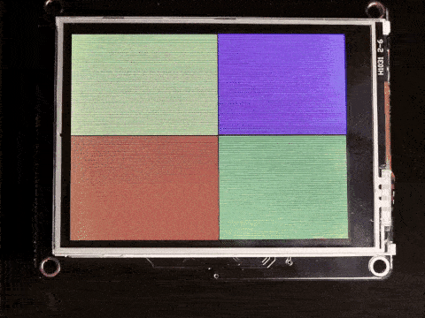](https://learn.adafruit.com/micropython-hardware-ili9341-tft-and-featherwing)

This week Melissa is working on trying to finish up updating the remainder of the display guides with a section on using displayio. Here’s what’s updated so far this week:

* [Adafruit 2.8" and 3.2" Color TFT Touchscreen Breakout v2](https://learn.adafruit.com/adafruit-2-dot-8-color-tft-touchscreen-breakout-v2).
* [2.2" TFT Display](https://learn.adafruit.com/2-2-tft-display).
* [Adafruit 3.5" 320x480 Color TFT Touchscreen Breakout](https://learn.adafruit.com/adafruit-3-5-color-320x480-tft-touchscreen-breakout).
* [Adafruit 1.27" and 1.5" Color OLED Breakout Board](https://learn.adafruit.com/adafruit-1-5-color-oled-breakout-board).
* [0.96" mini Color OLED](https://learn.adafruit.com/096-mini-color-oled).
* [Adafruit 2.4" Color TFT Touchscreen Breakout](https://learn.adafruit.com/adafruit-2-4-color-tft-touchscreen-breakout).
* [CircuitPython Hardware: ILI9341 TFT & FeatherWing](https://learn.adafruit.com/micropython-hardware-ili9341-tft-and-featherwing).

After that, a new guide about a Message Panel that works with preprogrammed messages controlled by a Stream Deck over Adafruit IO.

## CircuitPython.org stickers: Free with orders...

[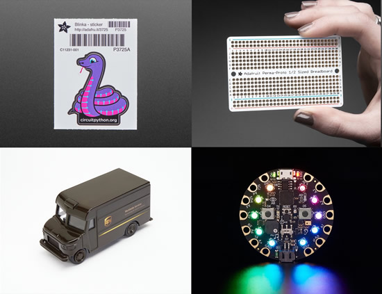](https://www.adafruit.com/free)

We ran out of rulers for CircuitPython day, YAY! They were really popular. SO! We now have CircuitPython stickers for orders $49 or more - [adafruit.com/free](https://www.adafruit.com/free). This is part of celebrating CircuitPython day, all month in August.

## News from around the web!

[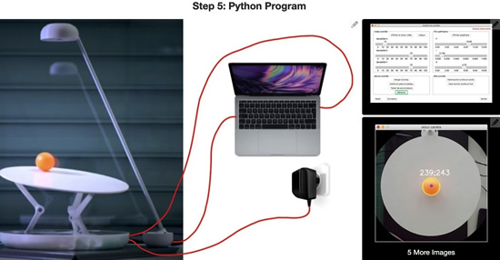](https://github.com/JohanLink/Ball-Balancing-PID-System)

Ball balancing system, made with Python - [Instructables](https://www.instructables.com/id/Ball-Balancing-PID-System/), [GitHub](https://github.com/JohanLink/Ball-Balancing-PID-System), [YouTube](https://youtu.be/57DbEEBF7sE).

[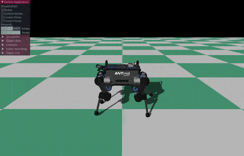](https://github.com/leggedrobotics/raisimLib)

RAISIM, A PHYSICS ENGINE FOR ROBOTICS AND AI RESEARCH - [Github](https://github.com/leggedrobotics/raisimLib).

NVDA, the free and open source Screen Reader for Microsoft Windows - [GitHub](https://github.com/nvaccess/nvda).

[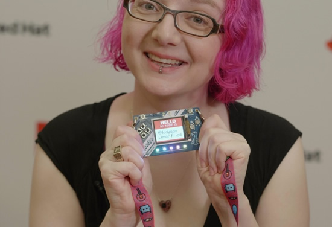](https://www.linux.com/blog/teaching-people-share-technology-adafruit-founder-limor-fried)

Teaching People to Share Technology: Adafruit Founder Limor Fried - [Linux.com](https://www.linux.com/blog/teaching-people-share-technology-adafruit-founder-limor-fried).

_“When we invented the personal computer, we created a new kind of bicycle…a new man-machine partnership…a new generation of entrepreneurs.” Steve Jobs said this and a lot more in 1980 as explored in this annotated twitter thread_ - [Learn By Shipping](https://medium.learningbyshipping.com/bicycle-121262546097).

Speaking of.. [How to make a Mac](https://archive.org/details/softalkv4n06feb1984/page/130), via [Twitter](https://twitter.com/hypertalking/status/1163064269497413632).

Version Museum showcases the visual history of popular websites, operating systems, applications, and games that have shaped our lives. Much like walking through a real-life museum, this site focuses on the design changes of historic versions of technology, rather than just the written history behind it - [Version Museum](https://www.versionmuseum.com/).

The arc of collaboration is long and it bends in the direction of functional workflows - [kwockchain](https://kwokchain.com/2019/08/16/the-arc-of-collaboration/).

PhyWhisperer-USB by NewAE Technology Inc: A hardware-based USB 2.0 monitor & trigger platform, controlled from Python - [Crowd  Supply](https://www.crowdsupply.com/newae/phywhisperer-usb).

Looks like Seeed Studio is working on a an ArduinoCore for the k210 - [GitHub](https://github.com/Seeed-Studio/ArduinoCore-k210).

Inspect PyPI event logs to audit your account's and project's security - [Python Insider](https://pythoninsider.blogspot.com/2019/08/inspect-pypi-event-logs-audit-security.html).

Nvidia CEO says Google is the company’s only customer building its own silicon at scale - [CNBC](https://www.cnbc.com/2019/08/15/nvidia-ceo-google-is-the-only-customer-with-silicon-at-scale.html).

Important PyLadies update - [PyLadies](https://www.pyladies.com/blog/Important-PyLadies-Update/important-pyladies-update/).

Huge Survey of Firmware Finds No Security Gains in 15 Years - [Security Ledger](https://securityledger.com/2019/08/huge-survey-of-firmware-finds-no-security-gains-in-15-years/).

PN532 NFC/RFID Native Python API for your Raspberry Pi - [GitHub](https://github.com/hoanhan101/pn532).

Create A Discord Webhook With Python For Your Bot - [Hackaday](https://hackaday.com/2018/02/15/creating-a-discord-webhook-in-python/).

Discord Transparency Report: Jan 1 — April 1 - [Discord](https://blog.discordapp.com/discord-transparency-report-jan-1-april-1-4f288bf952c9).

Costume Py: CostumePy is a library designed to allow developers to create smart wearable costumes - [GitHub](https://github.com/CodeMaterial/CostumePy).

Code your own 2D shooting gallery in Python - [Wireframe](https://www.raspberrypi.org/blog/code-your-own-2d-shooting-gallery-in-python-wireframe-issue-20/).

Automation Techniques in C++ Reverse Engineering — [Möbius Strip Reverse Engineering](https://www.msreverseengineering.com/blog/2019/8/5/automation-techniques-in-c-reverse-engineering).

[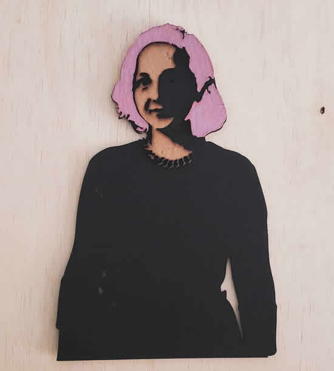](https://www.instagram.com/p/BxacEemjHlX/)

Ladyada, on wood, Brazil - [Instagram](https://www.instagram.com/p/BxacEemjHlX/).

#ICYDNCI What was the most popular, most clicked link, in [last week's newsletter](https://www.adafruitdaily.com/2019/08/13/circuitpython-day-celebrations-python-adafruit-circuitpython-pythonhardware-circuitpython-micropython-thepsf-adafruit/)? [PyCubed: An Open-Source, Radiation-Tested CubeSat Framework Programmable Entirely in Python](https://www.notion.so/PyCubed-4cbfac7e9b684852a2ab2193bd485c4d).

## PyCon AU - MicroPython recap from Matt

[Matt sent these in](https://twitter.com/matt_trentini/status/1161268811690938369) last week after the newsletter went out, so here they are in this week's newsletter. Thank you Matt!

_THE_ Australian event for all things Python, PyCon AU 2019 was a huge success with many diverse and high-quality talks that covered the gamut of Python topics. MicroPython and CircuitPython were _very_ well represented with six talks covering Python on Hardware.

All of the 80+ talks were recorded and published on YouTube - take a look at the [PyCon AU 2019 playlist](https://www.youtube.com/playlist?list=PLs4CJRBY5F1LKqauI3V4E_xflt6Gow611) or [browse the schedule](https://2019.pycon-au.org/schedule/friday/). 

MicroPython Sprints were organised for the Monday and Tuesday and these were well attended with some productive work achieved! Beginners to MicroPython (like [Leo](https://tumblelog.halloleo.net/post/186930271429/i-built-my-first-microcontroller-thing)) were warmly introduced, Damien guided folks to work on a spate of issues, two variants of a C stub generator ([uStubby](https://github.com/pazzarpj/micropython-ustubby) and [MicroPython C Stub Gen](https://gitlab.com/oliver.robson/mpy-c-stub-gen)) were worked on, the [QR Displayer](https://gitlab.com/oliver.robson/micropython-qr-displayer) project was released, a [CI server](https://gitlab.com/alelec/micropython_ci/) was configured to build _all_ (nearly 100!) the officially supported MicroPython variants and ♥️ was expressed with a [micro:bit](https://twitter.com/weatheredpup/status/1158705177613836288)! There was also collaboration with the [Fomu project](https://www.crowdsupply.com/sutajio-kosagi/fomu) and a port of MicroPython was built to run on the RISC-V softcore running on the Fomu FPGA - that lives _inside_ a USB port!

Continue the discussion on the [MicroPython Slack workspace](https://slack-micropython.herokuapp.com/)!

["Goodbye Print Statements, Hello Debugger!"](https://2019.pycon-au.org/talks/goodbye-print-statements-hello-debugger) - Nina Zakharenko. Still debugging your code with print statements? Learn how to level up your ability to troubleshoot complex code situations by using the power of a fully-featured debugger in this talk aimed at all levels of programming ability - [YouTube](https://youtu.be/HHrVBKZLolg).

["What makes Micro:bits different?"](https://2019.pycon-au.org/talks/what-makes-microbits-different) - Jack Reichelt. There’s many different ways to learn to code, and how you start your students’ journey changes what challenges they’ll face.This talk will highlight some of the differences when using Micro:bits, and how to overcome the challenges. [YouTube](https://youtu.be/ZEg0cLKwzF4)

["Using comedy as an excuse to play with python-programmed microcontrollers"](https://2019.pycon-au.org/talks/using-comedy-as-an-excuse-to-play-with-python-programmed-microcontrollers) - Anthony I. Joseph and Debbie Zukerman. Early-career comedians often have difficulties adding electronic props to their acts, due to the high cost of materials and fabrication skills required. This talk will recreate several props used in comedic performances, showing the code and components used. [YouTube](https://youtu.be/6Rv7S_74fck)

["Profiling Pathogens with (micro) Python"](https://2019.pycon-au.org/talks/profiling-athogens-with-micro-python) - Andrew Leech. We’re building professional medical diagnostics equipment with MicroPython. This has come with minimal challenges, many positives and a few surprises! [YouTube](https://youtu.be/YovngSLXoxw)

["It's dark and my lights aren't working (an asyncio success story)"](https://2019.pycon-au.org/talks/its-dark-and-my-lights-arent-working-an-asyncio-success-story) - Jim Mussared. I have invested huge amounts of time in achieving a simple goal – making the lighting in my home “smart”. It’s not ground breaking, nor is it practical or cost effective, but it sure was educational, uses a bunch of Python, and the result makes me (and my family) happy. [YouTube](https://youtu.be/grouP9QfdyA)

["Extending MicroPython: Using C for good!"](https://2019.pycon-au.org/talks/extending-micropython-using-c-for-good) - Matt Trentini. MicroPython is a _fantastic_ environment for embedded development. But it is an interpreted language; what happens when you hit performance limitations? Or want to use a new feature of your microcontroller? We’ll look at how MicroPython can be _extended_ to add features and improve performance. [YouTube](https://youtu.be/fUb3Urw4H-E)

["Micropython Gotchas"](https://2019.pycon-au.org/talks/micropython-gotchas) - Michał Gałka. We all somehow get the feeling that MicroPython is not quite the Python we know. During the talk, I’ll show what the “not quite” actually means. I’ll present a set of different issues I stumbled upon when working with different MicroPython powered boards ranging from memory constraints to API calls. [YouTube](https://youtu.be/93ed-YyOWkc)

## Learning To Program In Python With CodeGrades

Learning To Program In Python With CodeGrades: Episode 224 - [Python Podcast](https://www.pythonpodcast.com/codegrades-learn-to-program-episode-224/).

>_"With the increasing role of software in our world there has been an accompanying focus on teaching people to program. There are numerous approaches that have been attempted to achieve this goal with varying levels of success. Nicholas Tollervey has begun a new effort that blends the approach adopted by musicians and martial artists that uses a series of grades to provide recognition for the achievements of students. In this episode he explains how he has structured the study groups, syllabus, and evaluations to help learners build projects based on their interests and guide their own education while incorporating useful skills that are necessary for a career in software. If you are interested in learning to program, teach others, or act as a mentor then give this a listen and then get in touch with Nicholas to help make this endeavor a success."_

**What is Mu?**

Why Mu? Mu tries to make it as easy as possible to get started with programming but aims to help you graduate to "real" development tools soon after. Everything in Mu is the "real thing" but presented in as simple and obvious way possible. It's like the toddling stage in learning to walk: you're finding your feet and once you're confident, you should move on and explore! Put simply, Mu aims to foster autonomy. Try out Mu today! - [codewith.mu](https://codewith.mu/)

## Coming soon

[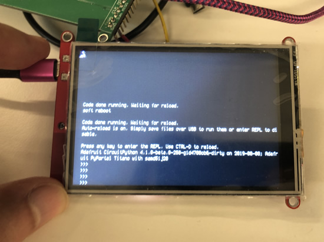](https://www.adafruit.com/new)

[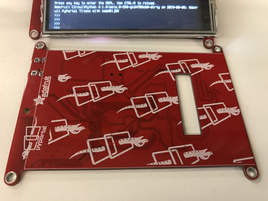](https://www.adafruit.com/new)

[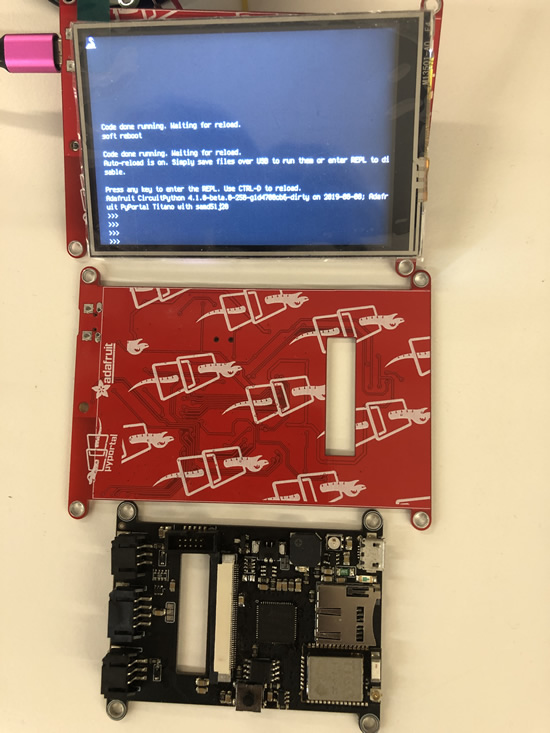](https://www.adafruit.com/new)

A super-big, and super-small PyPortal coming soon!

Circuit Playground Bluefruit testing! How far can it go? - YouTube.

Circuit Playground Bluefruit testing! Who tests the tester? - YouTube.

## New Learn Guides!

[Simon Game for PyRuler and CircuitPython](https://learn.adafruit.com/simon-game-with-pyruler-and-circuitpython) from [Isaac Wellish](https://learn.adafruit.com/users/isaacwellish)

[Daily UV Index PyPortal Display](https://learn.adafruit.com/pyportal-uv-index) from [Dave Astels](https://learn.adafruit.com/users/dastels)

[CircuitPython BLE Controlled NeoPixel Hat](https://learn.adafruit.com/circuitpython-feather-ble-neopixel-hat) from [Noe and Pedro](https://learn.adafruit.com/users/pixil3d)

[Creating Slideshows in CircuitPython](https://learn.adafruit.com/creating-slideshows-in-circuitpython) from [Mike Barela](https://learn.adafruit.com/users/MikeBarela)

## CircuitPython Libraries!

CircuitPython support for hardware continues to grow. We are adding support for new sensors and breakouts all the time, as well as improving on the drivers we already have. As we add more libraries and update current ones, you can keep up with all the changes right here!

For the latest drivers, download the [Adafruit CircuitPython Library Bundle](https://github.com/adafruit/Adafruit_CircuitPython_Bundle/releases/latest).

If you'd like to contribute, CircuitPython libraries are a great place to start. Have an idea for a new driver? File an issue on [CircuitPython](https://github.com/adafruit/circuitpython/issues)! Interested in helping with current libraries? Check out [this GitHub issue on CircuitPython](https://github.com/adafruit/circuitpython/issues/1246) for an overview of the State of the CircuitPython Libraries, updated each week. We've included open issues from the library issue lists, and details about repo-level issues that need to be addressed. We have a guide on [contributing to CircuitPython with Git and Github](https://learn.adafruit.com/contribute-to-circuitpython-with-git-and-github) if you need help getting started. You can also find us in the #circuitpython channel on the [Adafruit Discord](https://adafru.it/discord). Feel free to contact Kattni (@kattni) with any questions.

You can check out this [list of all the CircuitPython libraries and drivers available](https://github.com/adafruit/Adafruit_CircuitPython_Bundle/blob/master/circuitpython_library_list.md). 

The current number of CircuitPython libraries is **171**!

**Updated Libraries!**

Here's this week's updated CircuitPython libraries:

 * [Adafruit_CircuitPython_VCNL4040](https://github.com/adafruit/Adafruit_CircuitPython_VCNL4040)
 * [Adafruit_CircuitPython_SGP30](https://github.com/adafruit/Adafruit_CircuitPython_SGP30)
 * [Adafruit_CircuitPython_ST7789](https://github.com/adafruit/Adafruit_CircuitPython_ST7789)
 * [Adafruit_CircuitPython_CircuitPlayground](https://github.com/adafruit/Adafruit_CircuitPython_CircuitPlayground)
 * [Adafruit_CircuitPython_SSD1331](https://github.com/adafruit/Adafruit_CircuitPython_SSD1331)
 * [Adafruit_CircuitPython_SSD1351](https://github.com/adafruit/Adafruit_CircuitPython_SSD1351)
 * [Adafruit_CircuitPython_ILI9341](https://github.com/adafruit/Adafruit_CircuitPython_ILI9341)
 * [Adafruit_CircuitPython_DS3502](https://github.com/adafruit/Adafruit_CircuitPython_DS3502)
 * [Adafruit_CircuitPython_MiniMQTT](https://github.com/adafruit/Adafruit_CircuitPython_MiniMQTT)
 * [Adafruit_CircuitPython_ST7735R](https://github.com/adafruit/Adafruit_CircuitPython_ST7735R)

**PyPI Download Stats!**

We've written a special library called Adafruit Blinka that makes it possible to use CircuitPython Libraries on [Raspberry Pi and other compatible single-board computers](https://learn.adafruit.com/circuitpython-on-raspberrypi-linux/). Adafruit Blinka and all the CircuitPython libraries have been deployed to PyPI for super simple installation on Linux! Here are the top 10 CircuitPython libraries downloaded from PyPI in the last week, including the total downloads for those libraries:

| Library                                     | Last Week   | Total |   
|:-------                                     |:--------:   |:-----:|   
| Adafruit-Blinka                             | 1047        | 43490 |   
| Adafruit_CircuitPython_BusDevice            | 720         | 18547 |   
| Adafruit_CircuitPython_MCP230xx             | 351         | 5030 |    
| Adafruit_CircuitPython_seesaw               | 153         | 1880 |    
| Adafruit_CircuitPython_Register             | 144         | 7514 |    
| Adafruit_CircuitPython_NeoPixel             | 143         | 6310 |    
| Adafruit_CircuitPython_PCA9685              | 114         | 4630 |    
| Adafruit_CircuitPython_ServoKit             | 114         | 3628 |    
| Adafruit_CircuitPython_Motor                | 110         | 5173 |    
| Adafruit_CircuitPython_NeoTrellis           | 104         | 585 |     

## Upcoming events!

Open Source Summit and Embedded Linux Conference, August 21 – 23, 2019 at the Hilton San Diego Bayfront. The Open Source Summit North America combines with Embedded Linux Conference North America (ELC).  ELC has been a vendor-neutral technical conference where developers working on embedded Linux and industrial IoT products and deployments gather for education and collaboration. Open Source Summit brings together developers and open source professionals to collaborate and learn about the latest technologies - [Linux Foundation](https://www.linuxfoundation.org/press-release/2019/05/open-source-summit-to-include-embedded-linux-conference-bring-together-both-technical-and-leadership-programs-under-one-roof/).

PYCON UK 2019 - Cardiff City Hall, Friday 13th to Tuesday 17th September. PyCon UK is back at Cardiff City Hall, for five days of talks, workshops and collaboration. The conference also features a young coders' day, themes dedicated to science and education, and numerous Python-related events - [PyCon UK](https://2019.pyconuk.org/).

[October is Open Hardware Month @ Open Source Hardware Association](https://www.oshwa.org/2019/07/26/october-is-open-hardware-month-2/).

>_"October is Open Hardware Month! Check out the [Open Hardware Month website](http://ohm.oshwa.org/). Host an event, find a local event, or [certify](https://certification.oshwa.org/) your hardware to support Open Source Hardware. We are providing resources and asking you, the community, to host small, local events in the name of open source hardware. Tell us about your October event by f[illing out the form below](https://docs.google.com/forms/d/e/1FAIpQLSfjvJmcRXbpgjRACgY_BbaDzQZRa6wxEcP-xwaBpC0X6mvsPw/viewform). Your event will be featured on [OSHWA’s Open Hardware Month page](http://ohm.oshwa.org/) (provided you have followed OSHWA’s rules listed on the [“Do’s and Don’ts”](http://ohm.oshwa.org/dos-and-donts/) page)."_

[Read more](https://www.oshwa.org/2019/07/26/october-is-open-hardware-month-2/), [Tweet for speakers in 2020](https://twitter.com/ohsummit/status/1154881782677831680), and Open Hardware Month @ [http://ohm.oshwa.org/](http://ohm.oshwa.org/)

[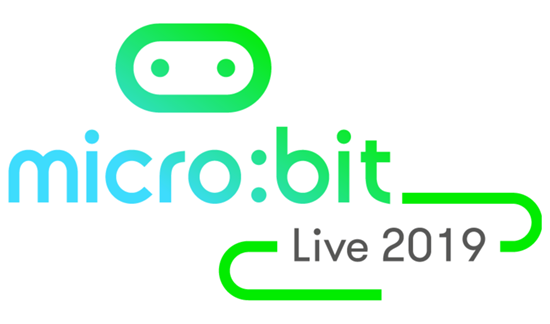](https://microbit.org/en/2019-04-12-microbit-live/)

micro:bit Live 2019 is coming to BBC MediaCityUK, Greater Manchester, England on October 4-5. This will be the very first annual gathering of the global micro:bit community of educators and partners - [micro:bit](https://microbit.org/en/2019-04-12-microbit-live/).

Hackaday Superconference is November 15th, 16th, and 17th in Pasadena CA. The Hackaday Superconference is returning for another 3 full days of technical talks, badge hacking, and hands-on workshops: [Eventbrite](https://www.eventbrite.com/e/hackaday-superconference-2019-tickets-60129236164?aff=0626com
) & [hackaday.io](https://hackaday.io/superconference/)

## Latest releases

CircuitPython's stable release is [#.#.#](https://github.com/adafruit/circuitpython/releases/latest) and its unstable release is [#.#.#-##.#](https://github.com/adafruit/circuitpython/releases). New to CircuitPython? Start with our [Welcome to CircuitPython Guide](https://learn.adafruit.com/welcome-to-circuitpython).

[2019####](https://github.com/adafruit/Adafruit_CircuitPython_Bundle/releases/latest) is the latest CircuitPython library bundle.

[v#.#.#](https://micropython.org/download) is the latest MicroPython release. Documentation for it is [here](http://docs.micropython.org/en/latest/pyboard/).

[#.#.#](https://www.python.org/downloads/) is the latest Python release. The latest pre-release version is [#.#.#](https://www.python.org/download/pre-releases/).

[1352 Stars](https://github.com/adafruit/circuitpython/stargazers) Like CircuitPython? [Star it on GitHub!](https://github.com/adafruit/circuitpython)

## Call for help – CircuitPython messaging to other languages!

We [recently posted on the Adafruit blog](https://blog.adafruit.com/2018/08/15/help-bring-circuitpython-messaging-to-other-languages-circuitpython/) about bringing CircuitPython messaging to other languages, one of the exciting features of CircuitPython 4.x is translated control and error messages. Native language messages will help non-native English speakers understand what is happening in CircuitPython even though the Python keywords and APIs will still be in English. If you would like to help, [please post](https://github.com/adafruit/circuitpython/issues/1098) to the main issue on GitHub and join us on [Discord](https://adafru.it/discord).

We made this graphic with translated text, we could use your help with that to make sure we got the text right, please check out the text in the image – if there is anything we did not get correct, please let us know. Dan sent me this [handy site too](http://helloworldcollection.de/#Human).

## jobs.adafruit.com - Find a dream job, find great candidates!

[jobs.adafruit.com](https://jobs.adafruit.com/) has returned and folks are posting their skills (including CircuitPython) and companies are looking for talented makers to join their companies - from Digi-Key, to Hackaday, Microcenter, Raspberry Pi and more.

## NUMBER thanks!

[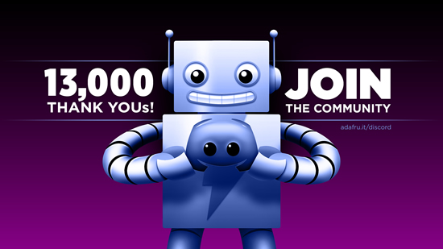](https://adafru.it/discord)

The Adafruit Discord community, where we do all our CircuitPython development in the open, reached over NUMBER humans, thank you! Join today! [https://adafru.it/discord](https://adafru.it/discord)

Discord now offers "server boosts" we have 12 on our server (level 2), if we get to 50 boosts we get to level 3 and some other good features for the community: +100 emojis for a total of 250, 384 Kbps audio, vanity URL, 100 mb uploads for all members (and all the things we have now, like the server banner). Stop by and boost! [https://adafru.it/discord](https://adafru.it/discord).

## ICYMI - In case you missed it

The wonderful world of Python on hardware! This is our first video-newsletter-podcast that we’ve started! The news comes from the Python community, Discord, Adafruit communities and more. It’s part of the weekly newsletter, then we have a segment on ASK an ENGINEER and this is the video slice from that! The complete Python on Hardware weekly VideoCast [playlist is here](https://www.youtube.com/playlist?list=PLjF7R1fz_OOXRMjM7Sm0J2Xt6H81TdDev). 

This video podcast is on [iTunes](https://itunes.apple.com/us/podcast/python-on-hardware/id1451685192?mt=2), [YouTube](https://www.youtube.com/playlist?list=PLjF7R1fz_OOXRMjM7Sm0J2Xt6H81TdDev), [IGTV (Instagram TV](https://www.instagram.com/adafruit/channel/)), and [XML](https://itunes.apple.com/us/podcast/python-on-hardware/id1451685192?mt=2).

[Weekly community chat on Adafruit Discord server CircuitPython channel - Audio / Podcast edition](https://itunes.apple.com/us/podcast/circuitpython-weekly-meeting/id1451685016) - Audio from the Discord chat space for CircuitPython, meetings are usually Mondays at 2pm ET, this is the audio version on [iTunes](https://itunes.apple.com/us/podcast/circuitpython-weekly-meeting/id1451685016), Pocket Casts, [Spotify](https://adafru.it/spotify), and [XML feed](https://adafruit-podcasts.s3.amazonaws.com/circuitpython_weekly_meeting/audio-podcast.xml).

And lastly, we are working up a one-spot destination for all things podcast-able here - [podcasts.adafruit.com](https://podcasts.adafruit.com/)

## Codecademy "Learn Hardware Programming with CircuitPython"

Codecademy, an online interactive learning platform used by more than 45 million people, has teamed up with the leading manufacturer in STEAM electronics, Adafruit Industries, to create a coding course, "Learn Hardware Programming with CircuitPython". The course is now available in the [Codecademy catalog](https://www.codecademy.com/learn/learn-circuitpython?utm_source=adafruit&utm_medium=partners&utm_campaign=circuitplayground&utm_content=pythononhardwarenewsletter).

Python is a highly versatile, easy to learn programming language that a wide range of people, from visual effects artists in Hollywood to mission control at NASA, use to quickly solve problems. But you don’t need to be a rocket scientist to accomplish amazing things with it. This new course introduces programmers to Python by way of a microcontroller — CircuitPython — which is a Python-based programming language optimized for use on hardware.

CircuitPython’s hardware-ready design makes it easier than ever to program a variety of single-board computers, and this course gets you from no experience to working prototype faster than ever before. Codecademy’s interactive learning environment, combined with Adafruit's highly rated Circuit Playground Express, present aspiring hardware hackers with a never-before-seen opportunity to learn hardware programming seamlessly online.

Whether for those who are new to programming, or for those who want to expand their skill set to include physical computing, this course will have students getting familiar with Python and creating incredible projects along the way. By the end, students will have built their own bike lights, drum machine, and even a moisture detector that can tell when it's time to water a plant.

Visit Codecademy to access the [Learn Hardware Programming with CircuitPython](https://www.codecademy.com/learn/learn-circuitpython?utm_source=adafruit&utm_medium=partners&utm_campaign=circuitplayground&utm_content=pythononhardwarenewsletter) course and Adafruit to purchase a [Circuit Playground Express](https://www.adafruit.com/product/3333).

Codecademy has helped more than 45 million people around the world upgrade their careers with technology skills. The company’s online interactive learning platform is widely recognized for providing an accessible, flexible, and engaging experience for beginners and experienced programmers alike. Codecademy has raised a total of $43 million from investors including Union Square Ventures, Kleiner Perkins, Index Ventures, Thrive Capital, Naspers, Yuri Milner and Richard Branson, most recently raising its $30 million Series C in July 2016.

## Contribute!

The CircuitPython Weekly Newsletter is a CircuitPython community-run newsletter emailed every Tuesday. The complete [archives are here](https://www.adafruitdaily.com/category/circuitpython/). It highlights the latest CircuitPython related news from around the web including Python and MicroPython developments. To contribute, edit next week's draft [on GitHub](https://github.com/adafruit/circuitpython-weekly-newsletter/tree/gh-pages/_drafts) and [submit a pull request](https://help.github.com/articles/editing-files-in-your-repository/) with the changes. Join our [Discord](https://adafru.it/discord) or [post to the forum](https://forums.adafruit.com/viewforum.php?f=60) for any further questions.
