- [X] Kattni updates
- [X] change date
- [X] update title
- [X] Feature story
- [X] Update  for images
- [X] All images 550w max only
- [ ] Link "View this email in your browser."

View this email in your browser.

Tues community notes - [Doc](https://docs.google.com/document/d/1r-F78z5lRl91G4kM6VzajSn2i7hdUUyp-jCiegHs7MA/edit?usp=sharing).

## CircuitPython 5.0.0 Alpha 1 Released!

This is alpha release number 1 of CircuitPython 5.0.0. Alpha releases are meant for testing. Download this release from [circuitpython.org](https://circuitpython.org/downloads). Use the [latest stable 4.x release](https://circuitpython.org/downloads) when first starting with CircuitPython. When you find a bug please [check the current known issues](https://github.com/adafruit/circuitpython/issues) and [file an issue](https://github.com/adafruit/circuitpython/issues/new) if something isn't already known. 5.0.0 is the latest major revision of CircuitPython. It features many improvements and enhancements to `displayio`, including grayscale and e-paper displays, extensive additions and changes to BLE support, and PWM audio support.

## ADABOX last week to sign up for the Halloween box!

[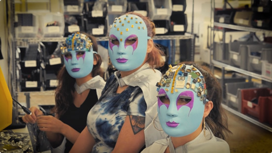](https://www.adafruit.com/adabox_get_started)

This is the last week to sign up for the ADABOX 13, Halloween box. All we can say is that it for-sure has Python on hardware and it will be scary :) JOIN US - [ADABOX.COM](https://www.adafruit.com/adabox_get_started).

## Meet Device Simulator Express

Device Simulator Express, a Microsoft Garage project, built by Garage interns that makes it easier to program the Adafruit Circuit Playground Express in Python / CircuitPython, with or without a physical device!

>_"This summer 16 groups of Garage interns tackled interesting engineering challenges ranging from making apps more accessible to VR solutions for cybersecurity. One of them was sponsored by the Python Tools for AI team and electronics paragon Adafruit to and set out to make programming embedded solutions for IoT devices simpler and more available to a broader audience. Device Simulator Express, a Microsoft Garage project, is a Visual Studio code extension that enables developers to program the Adafruit Circuit Playground Express in CircuitPython, with or without a physical device."_

## CircuitPython snakes its way to Gamebuino

[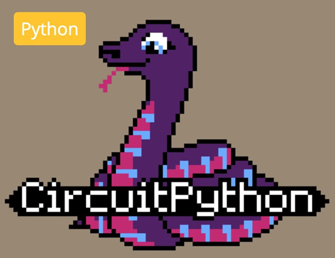](https://community.gamebuino.com/t/bringing-python-to-the-gamebuino-a-developers-blog/945)

[Soru's developer blog post](https://community.gamebuino.com/t/bringing-python-to-the-gamebuino-a-developers-blog/945) about porting CircuitPython to the Gamebuino, and [GitHub repo](https://github.com/Rodot/Gamebuino-Circuitpython).

>_"Soru had already previously heard of MicroPython 1, a python port designed for embedded platform to “fit and run within just 256k of code space and 16k or RAM”. Sounds perfect for the gamebuino, right? So, let’s see if someone already made a port for the Arduino Zero. Why that arduino? Its hardware from a chipset perspective is the same as the gamebuino meta, and it is pretty popular, so there bound to be someone who ported it! And yes, as it turns out adafruit forked MicroPython, creating CircuitPython, and, look and behold, it already has official ports to atmel-samd based bored - including the Arduino Zero!"_

We are hoping the team at Gamebuino merges the changes into mainline and/or pull requests, will make things easier and better for them and the community together!

## MicroPython snakes its way to the cover of micro:mag!

[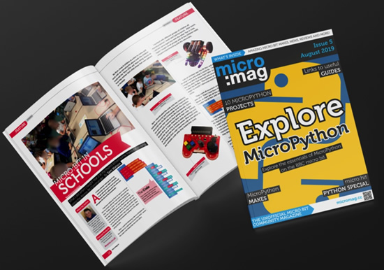](http://go.micromag.cc/issuefivepdf)

[This issue’s cover feature is “Explore MicroPython”](https://micromag.cc/issuefive/). There are lots of MicroPython content this issue, most of the code in this issue is written in MicroPython. For the cover feature, you’ll find some information about MicroPython, tips on which editor to use, useful links/guides and 10 MicroPython mini projects for you to try! - [Download PDF](http://go.micromag.cc/issuefivepdf).

## CircuitPython powered USB hub now in production!

[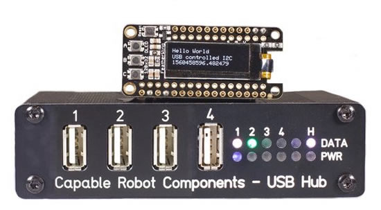](https://www.crowdsupply.com/capable-robot-components/programmable-usb-hub/updates/start-of-production)

With the campaign successful and concluded, the efforts have now transitioned to preparing-for and starting production, read all about it - [Crowd Supply](https://www.crowdsupply.com/capable-robot-components/programmable-usb-hub/updates/start-of-production).

## Preparing Graphics for E-Ink Displays

[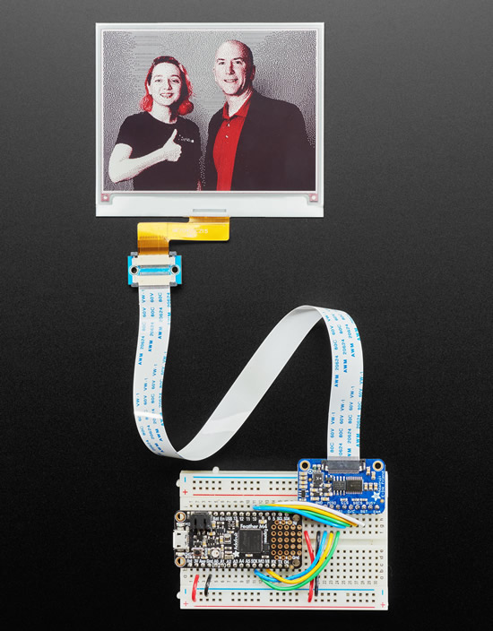](https://learn.adafruit.com/preparing-graphics-for-e-ink-displays?view=all)

[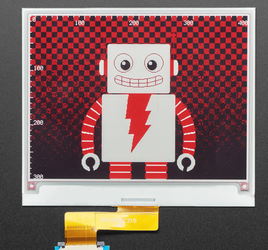](https://learn.adafruit.com/preparing-graphics-for-e-ink-displays?view=all)

Back in the early Macintosh computer days, when the Earth’s crust was still cooling, getting photos and artwork to look presentable on these computers’ 1-bit monochrome displays was something of an art form.

Much of that know-how has fallen by the wayside as screens improved…but with wafer-thin, ultra-low-power 2- and 3-color E-Ink displays appearing everywhere now, a refresher in those techniques is suddenly relevant again, more so with CircuitPython and all the supported displays - [learn.adafruit.com](https://learn.adafruit.com/preparing-graphics-for-e-ink-displays?view=all) & [check out all the latest photos on Flickr](https://www.flickr.com/search/?sort=date-taken-desc&safe_search=1&tags=einkepaper&user_id=35434449%40N08&view_all=1).

## CircuitPython powered 3D printed LoRa remote control

[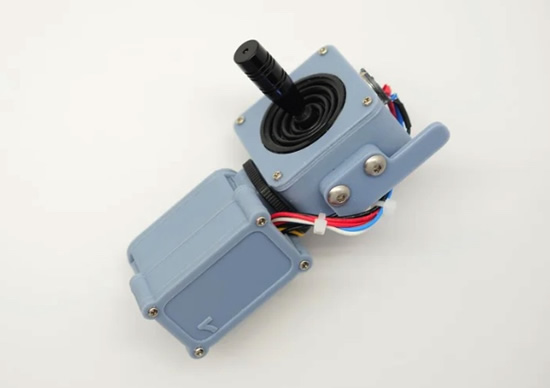](https://www.reddit.com/r/circuitpython/comments/cy3d5m/i_made_a_3d_printed_lora_remote_control_details/eypexi2/)

[back7.co writes](https://www.reddit.com/r/circuitpython/comments/cy3d5m/i_made_a_3d_printed_lora_remote_control_details/eypexi2/) -

>_"I just wrapped up another monthly project and I thought you all would like it. It's a simple LoRa (long range wireless) remote control, intended as a tool to help me do some LoRa-based robots. More on LoRa <a href="https://learn.adafruit.com/lora-and-lorawan-radio-for-raspberry-pi/sending-data-using-a-lora-radio">here</a>. Inside is a simple 2-axis analog joystick and a trigger I found in my parts bin. I think it's from McMaster Carr but I couldn't find it. The board inside is the 900Mhz LoRa M0 Feather from Adafruit running CircuitPython, and there's a micro-usb connector on the end. The Feather shows up as a USB drive and the code runs live & reloads whenever I save the file, so it's a pretty easy way to troubleshoot as I go. More on CircuitPython <a href="https://circuitpython.readthedocs.io/en/4.x/">here</a>. The code is simple and in early form, but is on Github here ( https://github.com/jdoscher/simple_lora_remote ) I designed all the parts in Tinkercad, as I am still far more comfortable there than in Fusion 360. The files on Tinkercad are <a href="https://www.tinkercad.com/things/dGFL00i3tJf-lora-remote-control/edit">here</a> but the build list and parts are also listed on my Thingiverse entry <a href="https://www.thingiverse.com/thing:3839282">here</a>. I'm doing about one project a month or so, and I'm documenting the progress on Instagram through neat photos. I hope you like it! You can see the full series of photos on my Instagram <a href="https://www.instagram.com/back7.co/">here</a>."_

## CircuitPython snakes its way to DragonCon!

Disney Villain armor - Ursula 3D Printed armor. LEDs are NeoPixels and a Gemma M0 programmed in CircuitPython - [Twitter](https://twitter.com/amiedoubleD/status/1168214906988113921).

## What's Bryan, Dan, and Melissa up to?

## News from around the web!

[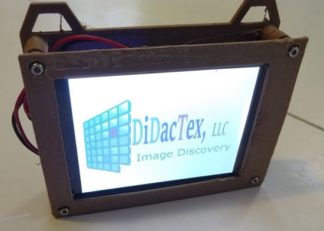](https://github.com/anielsen001/pyportal-sandwich)

Nice case for the PyPortal via [Twitter](https://twitter.com/anielsen001/status/1168269466775576577) - [GitHub](https://github.com/anielsen001/pyportal-sandwich).

Introduction to Circuit Python and the Circuit Playground Express - [GitHub](https://github.com/seawolf42/lessons/tree/master/circuitpython).

## MicroPython on CCCamp2019 Badge

[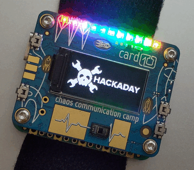](https://card10.badge.events.ccc.de/)

A personal wristband card10badge for the ccccamp2019 and beyond... card10 is pronounced cardio, 10 is binary for 2. Runs MicroPython. This is interesting quote from [Hackaday](https://hackaday.com/2019/08/29/hands-on-cccamp2019-badge-is-a-sensor-playground-not-to-be-mistaken-for-a-watch/):

>_"...MicroPython is the future for embedded electronics. We will always need embedded engineers, but in the same way that electronic design trended away from analog and toward digital, engineer-focused electronics will trend toward higher level languages and I think Python has already managed to vanquish its challengers."_

Micropython API to C libraries, via [Hackaday](https://hackaday.com/2019/08/31/micropython-and-c-play-together-better/) - [littlevgl.com](https://blog.littlevgl.com/2019-08-05/micropython-pure-display-driver#micropython-api-to-any-c-library). 

[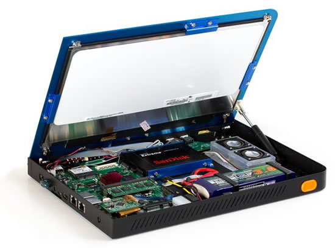](https://www.crowdsupply.com/sutajio-kosagi/novena/updates/novena-five-year-anniversary)

Novena Five-Year Anniversary, there are about 50 units left of the open-source laptop, last chance to buy one - [Crowd Supply](https://www.crowdsupply.com/sutajio-kosagi/novena/updates/novena-five-year-anniversary).

Recreate Super Sprint’s top-down racing in Python - [Raspberry Pi](https://www.raspberrypi.org/blog/recreate-super-sprints-top-down-racing-wireframe-issue-21/).

Industrial and commercial applications are becoming the biggest market for the Raspberry Pi - [IEEE Spectrum](https://spectrum.ieee.org/semiconductors/processors/eben-upton-on-the-raspberry-pis-industrial-crossover-and-why-there-will-never-be-a-pi-9).

M5Stick-V object recognition training service - [v-training.m5stack.com](http://v-training.m5stack.com/).

A curated list of public TEE resources for learning how to reverse-engineer and achieve trusted code execution on ARM devices - [GitHub](https://github.com/enovella/TEE-reversing).

exFAT in the Linux kernel? Yes! - [Microsoft open source blog](https://cloudblogs.microsoft.com/opensource/2019/08/28/exfat-linux-kernel/), and spec.

[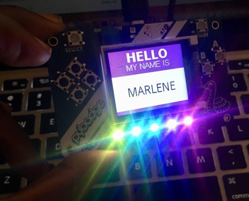](https://realpython.com/interview-marlene-mhangami/)

Python Community Interview With Marlene Mhangami - [Real Python](https://realpython.com/interview-marlene-mhangami/). Marlene is a passionate Pythonista who is not only using tech to facilitate social change and empower Zimbabwean women but is also the chair of the very first [PyCon Africa](https://africa.pycon.org/).

Python 3.8.0b4 is now available for testing - [Python.org](https://www.python.org/downloads/release/python-380b4/).

[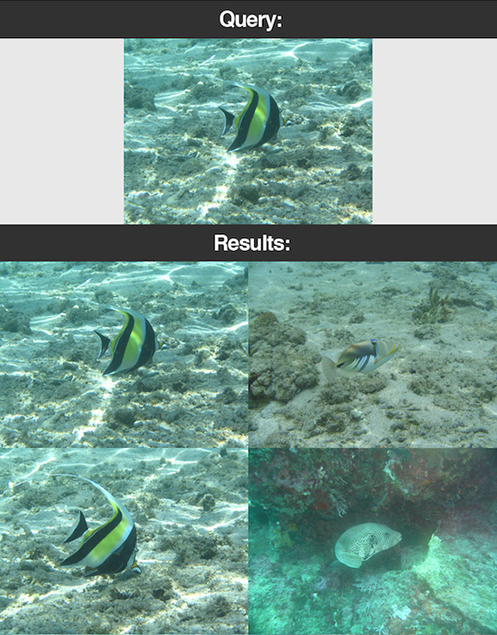](https://www.pyimagesearch.com/2019/08/26/building-an-image-hashing-search-engine-with-vp-trees-and-opencv/)

Building an Image Hashing Search Engine with VP-Trees and OpenCV - [PyImageSearch](https://www.pyimagesearch.com/2019/08/26/building-an-image-hashing-search-engine-with-vp-trees-and-opencv/).

Kiwi PyCon X 2019, Wellington - [YouTube](https://www.youtube.com/playlist?list=PLBGl1tVyiWQQN4evxZ4Tuo-cGVFFTewJH).

#ICYDNCI What was the most popular, most clicked link, in [last week's newsletter](https://link)? [title](url).

## Made with Mu

[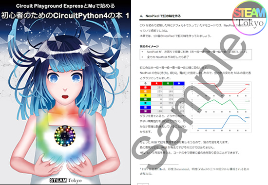](https://twitter.com/AoyamaProd/status/1167612051214102528)

More previews for the upcoming CircuitPython and Mu book! [Twitter](https://twitter.com/AoyamaProd/status/1167612051214102528), and [STEAM Tokyo](https://techbookfest.org/event/tbf07/circle/5645284751179776).

Why Mu? Mu tries to make it as easy as possible to get started with programming but aims to help you graduate to "real" development tools soon after. Everything in Mu is the "real thing" but presented in as simple and obvious way possible. It's like the toddling stage in learning to walk: you're finding your feet and once you're confident, you should move on and explore! Put simply, Mu aims to foster autonomy. Try out Mu today! - [codewith.mu](https://codewith.mu/)

## Coming soon

[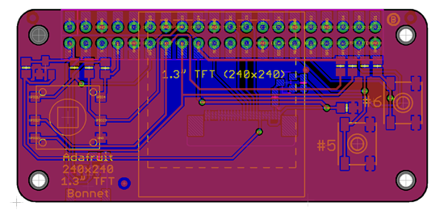](https://www.adafruit.com/new)

TFT bonnet!

[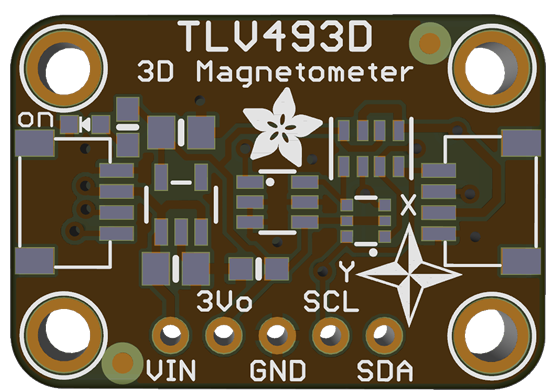](https://www.adafruit.com/new)

[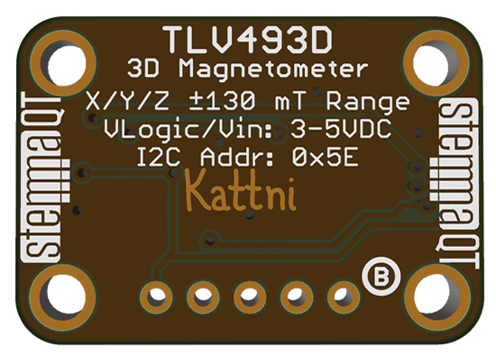](https://www.adafruit.com/new)

TLV493D STEMMA. This TLV493D is a low cost I2C triple-axis magetometer, specifically designed for joysticks but could be used for other magnetic sensing! Kattni did the board layout for this one, and Bryan is writing the CircuitPython library.

BrainCraft board preview! - YouTube.

[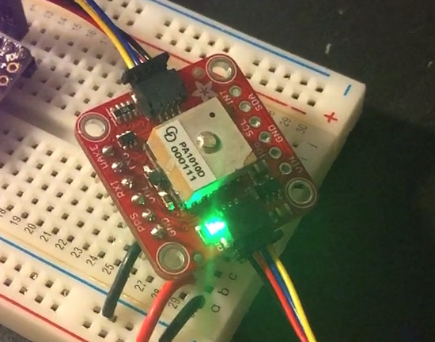]()

The PA1010D miniature GPS with I2C interface. This STEMMA board is this lil 1"x1" GPS board, with UART and I2C support. On the back is the RTC coin battery. The I2C makes it easy to chain an OLED onto the end, and this one is displaying the NMEA sentences. Working great so far! - YouTube.

## New Learn Guides!

[PyPortal IoT Plant Monitor with Google Cloud IoT Core and CircuitPython](https://learn.adafruit.com/pyportal-iot-plant-monitor-with-google-cloud-iot-core-and-circuitpython) from [Brent Rubell](https://learn.adafruit.com/users/brubell)

[Getting Started with Braille Output for CircuitPython REPL](https://learn.adafruit.com/getting-started-braille-output-circuitpython-repl) from [Isaac Wellish](https://learn.adafruit.com/users/isaacwellish)

## Updated Guides - Now With More Python!

**You can use CircuitPython libraries on Raspberry Pi!** We're updating all of our CircuitPython guides to show how to wire up sensors to your Raspberry Pi, and load the necessary CircuitPython libraries to get going using them with Python. We'll be including the updates here so you can easily keep track of which sensors are ready to go. Check it out!

Keep checking back for more updated guides!

## CircuitPython Libraries!

CircuitPython support for hardware continues to grow. We are adding support for new sensors and breakouts all the time, as well as improving on the drivers we already have. As we add more libraries and update current ones, you can keep up with all the changes right here!

For the latest drivers, download the [Adafruit CircuitPython Library Bundle](https://circuitpython.org/libraries).

If you'd like to contribute, CircuitPython libraries are a great place to start. Have an idea for a new driver? File an issue on [CircuitPython](https://github.com/adafruit/circuitpython/issues)! Interested in helping with current libraries? Check out [this GitHub issue on CircuitPython](https://github.com/adafruit/circuitpython/issues/1246) for an overview of the State of the CircuitPython Libraries, updated each week. We've included open issues from the library issue lists, and details about repo-level issues that need to be addressed. We have a guide on [contributing to CircuitPython with Git and Github](https://learn.adafruit.com/contribute-to-circuitpython-with-git-and-github) if you need help getting started. You can also find us in the #circuitpython channel on the [Adafruit Discord](https://adafru.it/discord). Feel free to contact Kattni (@kattni) with any questions.

You can check out this [list of all the CircuitPython libraries and drivers available](https://github.com/adafruit/Adafruit_CircuitPython_Bundle/blob/master/circuitpython_library_list.md). 

The current number of CircuitPython libraries is **178**!

**New Libraries!**

Here's this week's new CircuitPython libraries:

 * [Adafruit_CircuitPython_GC_IOT_Core](https://github.com/adafruit/Adafruit_CircuitPython_GC_IOT_Core)
 * [Adafruit_CircuitPython_TLV493D](https://github.com/adafruit/Adafruit_CircuitPython_TLV493D)

**Updated Libraries!**

Here's this week's updated CircuitPython libraries:

 * [Adafruit_CircuitPython_MPL3115A2](https://github.com/adafruit/Adafruit_CircuitPython_MPL3115A2)
 * [Adafruit_CircuitPython_VCNL4010](https://github.com/adafruit/Adafruit_CircuitPython_VCNL4010)
 * [Adafruit_CircuitPython_MMA8451](https://github.com/adafruit/Adafruit_CircuitPython_MMA8451)
 * [Adafruit_CircuitPython_VEML6075](https://github.com/adafruit/Adafruit_CircuitPython_VEML6075)
 * [Adafruit_CircuitPython_VL6180X](https://github.com/adafruit/Adafruit_CircuitPython_VL6180X)
 * [Adafruit_CircuitPython_LSM303](https://github.com/adafruit/Adafruit_CircuitPython_LSM303)
 * [Adafruit_CircuitPython_MLX90614](https://github.com/adafruit/Adafruit_CircuitPython_MLX90614)
 * [Adafruit_CircuitPython_AdafruitIO](https://github.com/adafruit/Adafruit_CircuitPython_AdafruitIO)
 * [Adafruit_CircuitPython_DS1307](https://github.com/adafruit/Adafruit_CircuitPython_DS1307)
 * [Adafruit_CircuitPython_MCP230xx](https://github.com/adafruit/Adafruit_CircuitPython_MCP230xx)
 * [Adafruit_CircuitPython_PCF8523](https://github.com/adafruit/Adafruit_CircuitPython_PCF8523)
 * [Adafruit_CircuitPython_BoardTest](https://github.com/adafruit/Adafruit_CircuitPython_BoardTest)
 * [Adafruit_CircuitPython_DS3231](https://github.com/adafruit/Adafruit_CircuitPython_DS3231)
 * [Adafruit_CircuitPython_IS31FL3731](https://github.com/adafruit/Adafruit_CircuitPython_IS31FL3731)
 * [Adafruit_CircuitPython_AMG88xx](https://github.com/adafruit/Adafruit_CircuitPython_AMG88xx)
 * [Adafruit_CircuitPython_SI4713](https://github.com/adafruit/Adafruit_CircuitPython_SI4713)
 * [Adafruit_CircuitPython_PN532](https://github.com/adafruit/Adafruit_CircuitPython_PN532)
 * [Adafruit_CircuitPython_LIS3DH](https://github.com/adafruit/Adafruit_CircuitPython_LIS3DH)
 * [Adafruit_CircuitPython_ESP32SPI](https://github.com/adafruit/Adafruit_CircuitPython_ESP32SPI)
 * [Adafruit_CircuitPython_Requests](https://github.com/adafruit/Adafruit_CircuitPython_Requests)
 * [Adafruit_CircuitPython_MiniMQTT](https://github.com/adafruit/Adafruit_CircuitPython_MiniMQTT)

**PyPI Download Stats!**

We've written a special library called Adafruit Blinka that makes it possible to use CircuitPython Libraries on [Raspberry Pi and other compatible single-board computers](https://learn.adafruit.com/circuitpython-on-raspberrypi-linux/). Adafruit Blinka and all the CircuitPython libraries have been deployed to PyPI for super simple installation on Linux! Here are the top 10 CircuitPython libraries downloaded from PyPI in the last week, including the total downloads for those libraries:

| Library                                     | Last Week   | Total |   
|:-------                                     |:--------:   |:-----:|   
| Adafruit-Blinka                             | 1362        | 45686 |   
| Adafruit_CircuitPython_BusDevice            | 1002        | 20270 |   
| Adafruit_CircuitPython_MCP230xx             | 326         | 5787 |    
| Adafruit_CircuitPython_Register             | 187         | 7646 |    
| Adafruit_CircuitPython_ESP32SPI             | 146         | 1710 |    
| Adafruit_CircuitPython_NeoPixel             | 141         | 6400 |    
| Adafruit_CircuitPython_Motor                | 127         | 5328 |    
| Adafruit_CircuitPython_PCA9685              | 121         | 4753 |    
| Adafruit_CircuitPython_ServoKit             | 115         | 3728 |    
| Adafruit_CircuitPython_MotorKit             | 94          | 2640 |    

## Upcoming events!

PYCON UK 2019 - Cardiff City Hall, Friday 13th to Tuesday 17th September. PyCon UK is back at Cardiff City Hall, for five days of talks, workshops and collaboration. The conference also features a young coders' day, themes dedicated to science and education, and numerous Python-related events - [PyCon UK](https://2019.pyconuk.org/).

[October is Open Hardware Month @ Open Source Hardware Association](https://www.oshwa.org/2019/07/26/october-is-open-hardware-month-2/).

>_"October is Open Hardware Month! Check out the [Open Hardware Month website](http://ohm.oshwa.org/). Host an event, find a local event, or [certify](https://certification.oshwa.org/) your hardware to support Open Source Hardware. We are providing resources and asking you, the community, to host small, local events in the name of open source hardware. Tell us about your October event by f[illing out the form below](https://docs.google.com/forms/d/e/1FAIpQLSfjvJmcRXbpgjRACgY_BbaDzQZRa6wxEcP-xwaBpC0X6mvsPw/viewform). Your event will be featured on [OSHWA’s Open Hardware Month page](http://ohm.oshwa.org/) (provided you have followed OSHWA’s rules listed on the [“Do’s and Don’ts”](http://ohm.oshwa.org/dos-and-donts/) page)."_

[Read more](https://www.oshwa.org/2019/07/26/october-is-open-hardware-month-2/), [Tweet for speakers in 2020](https://twitter.com/ohsummit/status/1154881782677831680), and Open Hardware Month @ [http://ohm.oshwa.org/](http://ohm.oshwa.org/)

micro:bit Live 2019 is coming to BBC MediaCityUK, Greater Manchester, England on October 4-5. This will be the very first annual gathering of the global micro:bit community of educators and partners - [micro:bit](https://microbit.org/en/2019-04-12-microbit-live/).

PyCon DE & PyData Berlin // October 9 - 13 2019. Main conference, 3 days of talks and workshops
More than 100 sessions dedicated to PyData (artificial intelligence, machine learning, ethics...) and Python topics (programming, DevOps, Web, Django...) - [de.pycon.org](https://de.pycon.org/).

[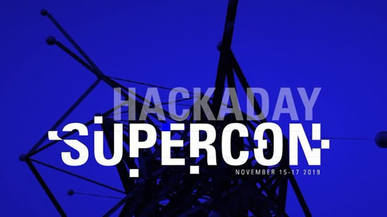](https://hackaday.io/superconference/)

Hackaday Superconference is November 15th, 16th, and 17th in Pasadena CA. The Hackaday Superconference is returning for another 3 full days of technical talks, badge hacking, and hands-on workshops: [Eventbrite](https://www.eventbrite.com/e/hackaday-superconference-2019-tickets-60129236164?aff=0626com
) & [hackaday.io](https://hackaday.io/superconference/)

## Latest releases

CircuitPython's stable release is [#.#.#](https://github.com/adafruit/circuitpython/releases/latest) and its unstable release is [#.#.#-##.#](https://github.com/adafruit/circuitpython/releases). New to CircuitPython? Start with our [Welcome to CircuitPython Guide](https://learn.adafruit.com/welcome-to-circuitpython).

[2019####](https://github.com/adafruit/Adafruit_CircuitPython_Bundle/releases/latest) is the latest CircuitPython library bundle.

[v#.#.#](https://micropython.org/download) is the latest MicroPython release. Documentation for it is [here](http://docs.micropython.org/en/latest/pyboard/).

[#.#.#](https://www.python.org/downloads/) is the latest Python release. The latest pre-release version is [#.#.#](https://www.python.org/download/pre-releases/).

[1372 Stars](https://github.com/adafruit/circuitpython/stargazers) Like CircuitPython? [Star it on GitHub!](https://github.com/adafruit/circuitpython)

## Call for help – CircuitPython messaging to other languages!

We [recently posted on the Adafruit blog](https://blog.adafruit.com/2018/08/15/help-bring-circuitpython-messaging-to-other-languages-circuitpython/) about bringing CircuitPython messaging to other languages, one of the exciting features of CircuitPython 4.x is translated control and error messages. Native language messages will help non-native English speakers understand what is happening in CircuitPython even though the Python keywords and APIs will still be in English. If you would like to help, [please post](https://github.com/adafruit/circuitpython/issues/1098) to the main issue on GitHub and join us on [Discord](https://adafru.it/discord).

We made this graphic with translated text, we could use your help with that to make sure we got the text right, please check out the text in the image – if there is anything we did not get correct, please let us know. Dan sent me this [handy site too](http://helloworldcollection.de/#Human).

## jobs.adafruit.com - Find a dream job, find great candidates!

[jobs.adafruit.com](https://jobs.adafruit.com/) has returned and folks are posting their skills (including CircuitPython) and companies are looking for talented makers to join their companies - from Digi-Key, to Hackaday, Microcenter, Raspberry Pi and more.

## NUMBER thanks!

The Adafruit Discord community, where we do all our CircuitPython development in the open, reached over NUMBER humans, thank you! Join today! [https://adafru.it/discord](https://adafru.it/discord)

Discord now offers "server boosts". We have 12 on our server (level 2) and if we get to 50 boosts we get to level 3 and some other good features for the community: +100 emojis for a total of 250, 384 Kbps audio, vanity URL, 100 mb uploads for all members (and all the things we have now, like the server banner). Stop by and boost! [https://adafru.it/discord](https://adafru.it/discord).

## ICYMI - In case you missed it

The wonderful world of Python on hardware! This is our first video-newsletter-podcast that we’ve started! The news comes from the Python community, Discord, Adafruit communities and more. It’s part of the weekly newsletter, then we have a segment on ASK an ENGINEER and this is the video slice from that! The complete Python on Hardware weekly videocast [playlist is here](https://www.youtube.com/playlist?list=PLjF7R1fz_OOXRMjM7Sm0J2Xt6H81TdDev). 

This video podcast is on [iTunes](https://itunes.apple.com/us/podcast/python-on-hardware/id1451685192?mt=2), [YouTube](https://www.youtube.com/playlist?list=PLjF7R1fz_OOXRMjM7Sm0J2Xt6H81TdDev), [IGTV (Instagram TV](https://www.instagram.com/adafruit/channel/)), and [XML](https://itunes.apple.com/us/podcast/python-on-hardware/id1451685192?mt=2).

[Weekly community chat on Adafruit Discord server CircuitPython channel - Audio / Podcast edition](https://itunes.apple.com/us/podcast/circuitpython-weekly-meeting/id1451685016) - Audio from the Discord chat space for CircuitPython, meetings are usually Mondays at 2pm ET, this is the audio version on [iTunes](https://itunes.apple.com/us/podcast/circuitpython-weekly-meeting/id1451685016), Pocket Casts, [Spotify](https://adafru.it/spotify), and [XML feed](https://adafruit-podcasts.s3.amazonaws.com/circuitpython_weekly_meeting/audio-podcast.xml).

And lastly, we are working up a one-spot destination for all things podcast-able here - [podcasts.adafruit.com](https://podcasts.adafruit.com/)

## Codecademy "Learn Hardware Programming with CircuitPython"

Codecademy, an online interactive learning platform used by more than 45 million people, has teamed up with the leading manufacturer in STEAM electronics, Adafruit Industries, to create a coding course, "Learn Hardware Programming with CircuitPython". The course is now available in the [Codecademy catalog](https://www.codecademy.com/learn/learn-circuitpython?utm_source=adafruit&utm_medium=partners&utm_campaign=circuitplayground&utm_content=pythononhardwarenewsletter).

Python is a highly versatile, easy to learn programming language that a wide range of people, from visual effects artists in Hollywood to mission control at NASA, use to quickly solve problems. But you don’t need to be a rocket scientist to accomplish amazing things with it. This new course introduces programmers to Python by way of a microcontroller — CircuitPython — which is a Python-based programming language optimized for use on hardware.

CircuitPython’s hardware-ready design makes it easier than ever to program a variety of single-board computers, and this course gets you from no experience to working prototype faster than ever before. Codecademy’s interactive learning environment, combined with Adafruit's highly rated Circuit Playground Express, present aspiring hardware hackers with a never-before-seen opportunity to learn hardware programming seamlessly online.

Whether for those who are new to programming, or for those who want to expand their skill set to include physical computing, this course will have students getting familiar with Python and creating incredible projects along the way. By the end, students will have built their own bike lights, drum machine, and even a moisture detector that can tell when it's time to water a plant.

Visit Codecademy to access the [Learn Hardware Programming with CircuitPython](https://www.codecademy.com/learn/learn-circuitpython?utm_source=adafruit&utm_medium=partners&utm_campaign=circuitplayground&utm_content=pythononhardwarenewsletter) course and Adafruit to purchase a [Circuit Playground Express](https://www.adafruit.com/product/3333).

Codecademy has helped more than 45 million people around the world upgrade their careers with technology skills. The company’s online interactive learning platform is widely recognized for providing an accessible, flexible, and engaging experience for beginners and experienced programmers alike. Codecademy has raised a total of $43 million from investors including Union Square Ventures, Kleiner Perkins, Index Ventures, Thrive Capital, Naspers, Yuri Milner and Richard Branson, most recently raising its $30 million Series C in July 2016.

## Contribute!

The CircuitPython Weekly Newsletter is a CircuitPython community-run newsletter emailed every Tuesday. The complete [archives are here](https://www.adafruitdaily.com/category/circuitpython/). It highlights the latest CircuitPython related news from around the web including Python and MicroPython developments. To contribute, edit next week's draft [on GitHub](https://github.com/adafruit/circuitpython-weekly-newsletter/tree/gh-pages/_drafts) and [submit a pull request](https://help.github.com/articles/editing-files-in-your-repository/) with the changes. Join our [Discord](https://adafru.it/discord) or [post to the forum](https://forums.adafruit.com/viewforum.php?f=60) for any further questions.
