View this email in your browser.

## The Top Programming Languages 2019 - Python tops the charts with a CircuitPython nod!

Python comes in #1 with a nod to Python on hardware! - [IEEE Spectrum](https://spectrum.ieee.org/computing/software/the-top-programming-languages-2019).

>_"Python is having an impact that could not have been anticipated when the language was first released in 1991. The dramatic increase in computing power found in microcontrollers means that embedded versions of Python, such as CircuitPython and MicroPython, are becoming increasingly popular among makers."_

## CircuitPython 5.0.0 Alpha 2 Released!

This is the second alpha release of CircuitPython 5.0.0. Alpha releases are meant for testing. Use the latest stable 4.x release when first starting with CircuitPython - [Adafruit](https://blog.adafruit.com/2019/09/04/circuitpython-5-0-0-alpha-2-released/).

## Machine Learning with Microcontrollers Hack Chat

[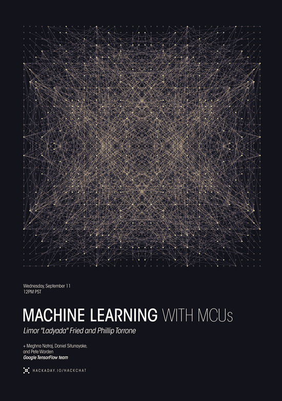](https://hackaday.io/messages/room/2369)

"Ladyada" Fried and pt will host the Hack Chat on Wednesday, September 11, 2019 at noon PDT / 3PM EDT - [Hackaday](https://hackaday.com/2019/09/09/machine-learning-with-microcontrollers-hack-chat/).

[Click here](https://hackaday.io/messages/room/2369) to join - [hackaday.io](https://hackaday.io/messages/room/2369)

We've gotten to the point where a $35 Raspberry Pi can be a reasonable alternative to a traditional desktop or laptop, and microcontrollers in the Arduino ecosystem are getting powerful enough to handle some remarkably demanding computational jobs. But there's still one area where microcontrollers seem to be lagging a bit: machine learning. Sure, there are purpose-built edge-computing SBCs, but wouldn't it be great to be able to run AI models on versatile and ubiquitous MCUs that you can pick up for a couple of bucks? 

We're moving in that direction, and our friends at Adafruit Industries want to stop by the Hack Chat and tell us all about what they're working on. In addition to Ladyada and PT, we'll be joined by Meghna Natraj, Daniel Situnayake, and Pete Warden, all from the Google TensorFlow team. If you've got any interest in edge computing on small form-factor computers, you won't want to miss this chat. Join us, ask your questions about TensorFlow Lite and TensorFlow Lite for Microcontrollers, and see what's possible in machine learning way out on the edge.

## A scary Python powered ADABOX is coming

This is the last week to sign up for the ADABOX 13, Halloween box. All we can say is that it for-sure has Python on hardware and it will be scary :) JOIN US - [ADABOX.COM](https://www.adafruit.com/adabox_get_started).

## CircuitPython snakes its way to the XinaBox Programmable Core

[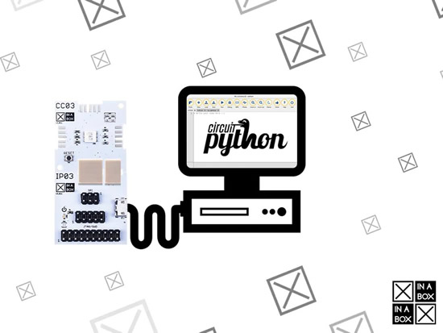](https://www.hackster.io/PragmaticPhil/loading-circuitpython-onto-an-xinabox-programmable-core-544749)

This tutorial will show you how to load an implementation of CircuitPython onto an XinaBox core, then use the Mu Editor to interact with it - [Hackster.io](https://www.hackster.io/PragmaticPhil/loading-circuitpython-onto-an-xinabox-programmable-core-544749)

## News from around the web!

[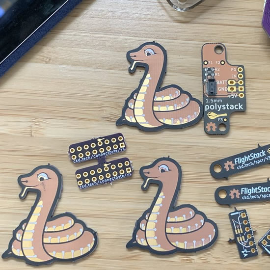](https://twitter.com/tannewt/status/1169755971582693376)

Blinka appears on the "after dark" PCBs from OSH Park - [Twitter](https://twitter.com/tannewt/status/1169755971582693376).

[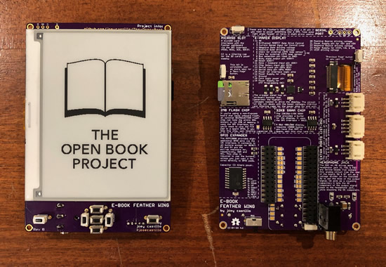](https://blog.hackster.io/the-open-book-an-open-feather-compatible-ebook-2011bffe9ddc)

[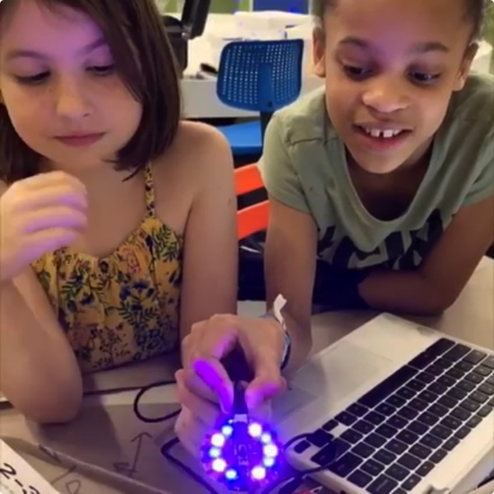](https://www.instagram.com/p/B2G2ckAghso/)

STEM Cell Robotics has a cool vid of some cool kids with Circuit Playground - [Instagram](https://www.instagram.com/p/B2G2ckAghso/).

The Open Book — An Open, Feather-Compatible eBook! - [Hackster.io](https://blog.hackster.io/the-open-book-an-open-feather-compatible-ebook-2011bffe9ddc)

[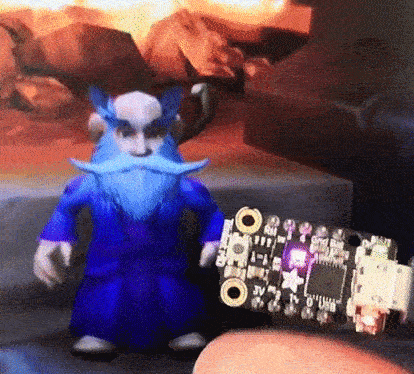](https://www.instagram.com/p/B2Hib1tDi9z/?igshid=ekda71edirbl)

WoW classic anti-AFK tool using the TrinketM0 microcontroller as a HID - [Instagram](https://www.instagram.com/p/B2Hib1tDi9z/?igshid=ekda71edirbl).

[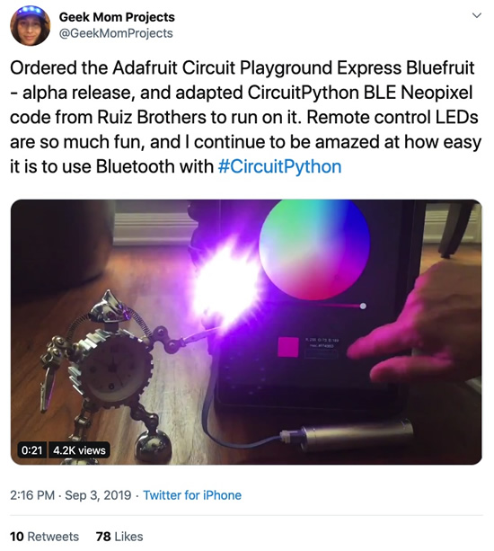](https://twitter.com/GeekMomProjects/status/1168950965883551750)

Thank you Geek Mom Projects! - [Twitter](https://twitter.com/GeekMomProjects/status/1168950965883551750).

Tool to generate native .mpy files from a .elf file - [GitHub](https://github.com/micropython/micropython/pull/5083).

[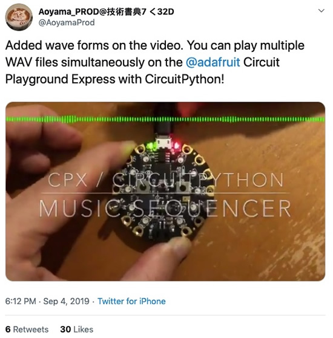](https://twitter.com/AoyamaProd/status/1169372812789735424)

Nice little vid about being able to play WAV files on the Circuit Playground board using CircuitPython - [Twitter](https://twitter.com/AoyamaProd/status/1169372812789735424).

[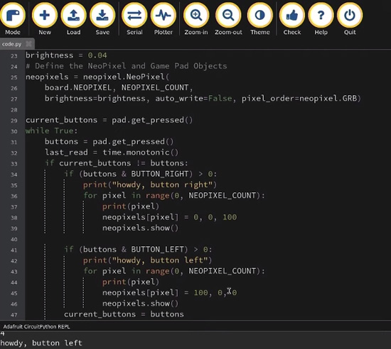](https://youtu.be/RErlKSRqdcI?t=1710)

[SLCPython Sept Meetup 2019](https://www.meetup.com/SLCPython/). In this meetup, Faris will be presenting the magic of a PyBadge using circuitpython - [YouTube](https://youtu.be/RErlKSRqdcI?t=1710).

**“…MicroPython is the future for embedded electronics.”**

[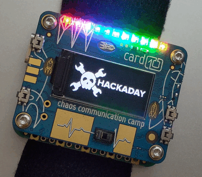](https://blog.adafruit.com/2019/09/02/hackaday-micropython-is-the-future-for-embedded-electronics-wow-hackaday-szczys-micropython-circuitpython-cccamp2019/)

[Hackaday calls it](https://blog.adafruit.com/2019/09/02/hackaday-micropython-is-the-future-for-embedded-electronics-wow-hackaday-szczys-micropython-circuitpython-cccamp2019/) -

>_"…MicroPython is the future for embedded electronics. We will always need embedded engineers, but in the same way that electronic design trended away from analog and toward digital, engineer-focused electronics will trend toward higher level languages and I think Python has already managed to vanquish its challengers.” – Mike Szczys, Editor in Chief, HACKADAY._

[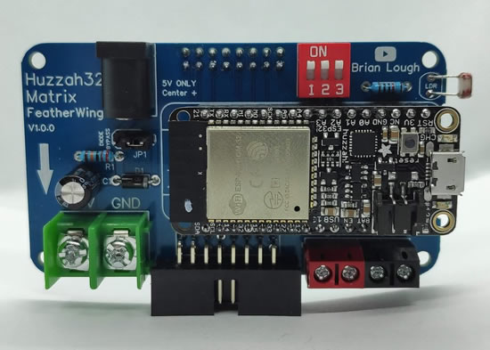](https://www.tindie.com/products/brianlough/huzzah-32-matrix-featherwing/)

Huzzah 32 Matrix FeatherWing. A FeatherWing for the Adafruit Feather Huzzah 32 ESP32 board that connects to a RGB LED Matrix panel. Designed by Brian Lough - [Tindie](https://www.tindie.com/products/brianlough/huzzah-32-matrix-featherwing/).

[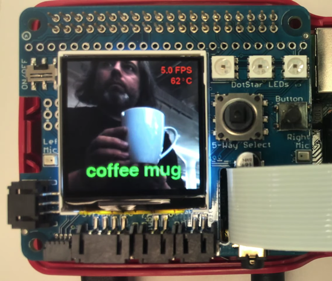](https://blog.hackster.io/more-on-the-new-braincraft-board-from-adafruit-2c52400a3493)

From Hackster, the Braincraft board! _"Available as both a standalone board and as a Raspberry Pi HAT, the Braincraft board was conceived by Adafruit along with Pete Warden, part of the TensorFlow Lite team at Google, who was also involved in the design of the SparkFun Edge board."_

Proof of Concept of ESP32/8266 Wi-Fi vulnerabilties: CVE-2019-12586, CVE-2019-12587, CVE-2019-12588 - [GitHub](https://github.com/Matheus-Garbelini/esp32_esp8266_attacks).

A curated list of awesome MicroPython libraries, frameworks, software and resource - [GitHub](https://github.com/mcauser/awesome-micropython).

Concurrently detect the minimum Python versions needed to run code - [GitHub](https://github.com/netromdk/vermin).

If the iphone was created in the style of apples retro computers - [YouTube](https://www.youtube.com/watch?v=oTxB-ex-2zI).

Some obscure C features - [Pancakes and computers](https://multun.net/obscure-c-features.html).

The [latest IoT newsletter](https://blog.adafruit.com/2019/09/06/adafruit-iot-monthly-adafruit-io-updates-rgb-stream-deck-message-panel-and-more-adafruit-iot-circuitpython-airlift-lorawan-adafruitio-adafruit-circuitpython/) is out!

[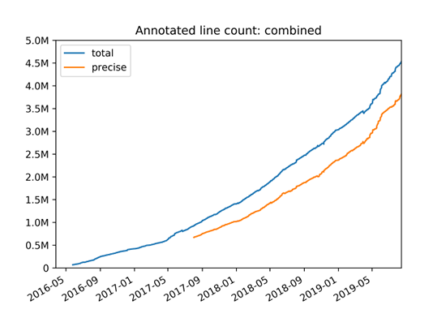](https://blogs.dropbox.com/tech/2019/09/our-journey-to-type-checking-4-million-lines-of-python/)

Our journey to type checking 4 million lines of Python - [Dropbox](https://blogs.dropbox.com/tech/2019/09/our-journey-to-type-checking-4-million-lines-of-python/).

Open Source Hardware Certifications For August 2019 - [Make](https://makezine.com/2019/09/05/open-source-hardware-certifications-for-august-2019/).

[Regex Crossword](https://regexcrossword.com/).

Reach Robotics is closing up shop - [TechCrunch](https://techcrunch.com/2019/09/03/reach-robotics-is-closing-up-shop/).

Google's Engineering Practices documentation, [how to do a code review](https://google.github.io/eng-practices/review/reviewer/) - [GitHub](https://github.com/google/eng-practices).

Looks like AP Circuits is closed - [Reddit](https://www.reddit.com/r/PrintedCircuitBoard/comments/cznjlk/apcircuits_permanently_closed/) via [Twitter](https://twitter.com/mightyohm/status/1169479027893006337).

Daniel Garcia, the originator of FastLED, has passed away - [Reddit](https://www.reddit.com/r/FastLED/comments/czd31f/dan_garcia_passed_away/).

wiringPi, wiringPi GPIO library – deprecated… Lessons for the open-source community - [Adafruit](https://blog.adafruit.com/2019/09/02/wiringpi-wiringpi-gpio-library-deprecated-lessons-for-the-open-source-community-drogon/).

[Hackaday turned 15](https://blog.adafruit.com/2019/09/05/hackaday-turns-15-today-live-video-chat-today-at-8pm-et-hackaday-hackadayio-adafruit/) - [YouTube](https://youtu.be/kMkgwSLj0Uc).

[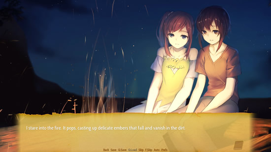](https://renpy.org/)

[Ren'Py](https://renpy.org/), gotta try this out!

>_"Ren'Py is a visual novel engine – used by thousands of creators from around the world – that helps you use words, images, and sounds to tell interactive stories that run on computers and mobile devices. These can be both visual novels and life simulation games. The easy to learn script language allows anyone to efficiently write large visual novels, while its Python scripting is enough for complex simulation games. Ren'Py is open source and free for commercial use."_

There is also a [Ren'Py HyperCard framework too](https://egardepe.itch.io/hypercard).

The Importance of Diversity in Tech - [Adafruit](https://blog.adafruit.com/2019/09/06/the-importance-of-diversity-in-tech-tech-diversity/).

DeepFaceLab is a tool that utilizes machine learning to replace faces in videos - [GitHub](https://github.com/iperov/DeepFaceLab).

AI cheat sheets at [aicheatsheets.com](https://aicheatsheets.com/)

[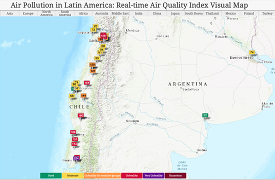](https://towardsdatascience.com/sensing-the-air-quality-5ed5320f7a56)

Sensing the Air Quality, A low-cost IoT Air Quality Monitor based on RaspberryPi 4 - [Towards Data Science](https://towardsdatascience.com/sensing-the-air-quality-5ed5320f7a56).

[The Fry’s Era by Jean-Louis Gassée](https://mondaynote.com/the-frys-era-8709a7e602eb) -

>_"Throughout the 90’s and aughts, Fry’s Electronics was a Silicon Valley institution, a truly aboriginal techie bazaar where geeks could find everything they needed to live in autarky, from logic boards to voltmeters, dried noodles to “nice” clothes for a job interview, magazines, energy bars, mini-fridges… A quarter-century later, Fry’s stores have become sad, pale shadows of their glorious past."_

[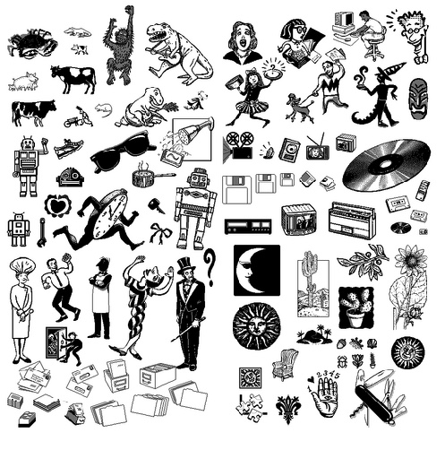](https://egardepe.itch.io/hypercardgraphics)

This [HyperCard graphics pack](https://egardepe.itch.io/hypercardgraphics) is super cool.

#ICYDNCI What was the most popular, most clicked link, in [last week's newsletter](https://www.adafruitdaily.com/2019/09/03/circuitpython-5-is-alive-device-simulator-and-more-python-adafruit-circuitpython-pythonhardware-circuitpython-micropython-thepsf-adafruit/)? [Device Simulator Express, a Microsoft Garage project](https://aka.ms/GetDSX).

PyDev of the Week: Aymeric Augustin on [Mouse vs Python](https://www.blog.pythonlibrary.org/2019/09/09/pydev-of-the-week-aymeric-augustin/).

CircuitPython Weekly for September 3rd, 2019 [on YouTube](https://youtu.be/ScwNldvqgrU) and [on diode.zone](https://diode.zone/videos/watch/74d0efe6-7234-4e96-9a9e-5a149c39e32d)

CircuitPython Weekly for September 9th, 2019 [on YouTube](https://youtu.be/Xtdnj2nSNlU)

## Made with Mu

[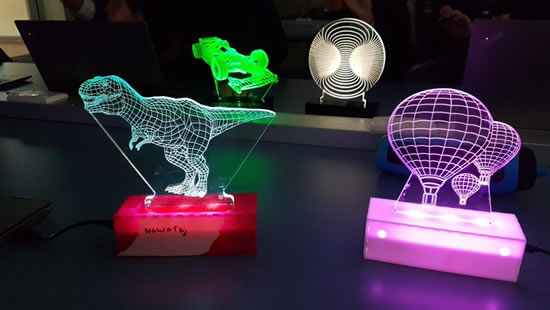](https://twitter.com/Nykke_IT/status/1169542065568436224)

[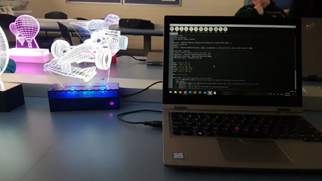](https://twitter.com/Nykke_IT/status/1169542065568436224)

Year 7 students take their finished Digital Technologies projects home - [Twitter](https://twitter.com/Nykke_IT/status/1169542065568436224).

**PyperCard on Android**

[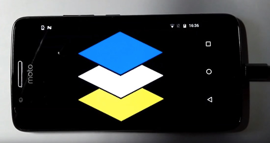](https://www.youtube.com/watch?v=lNyCywCTJCg)

A beginner friendly way to write cross-platform Python GUI apps, including Android. The HyperCard inspired GUI framework, PyperCard, is going mobile! Beginners will compile the apps "in the cloud" via the Mu editor - [YouTube](https://www.youtube.com/watch?v=lNyCywCTJCg).

## Coming soon

[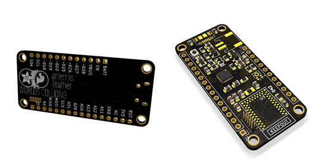](https://twitter.com/idlehandsdev/status/1169606552422146050)

Artemis Feather? Maybe! - [Twitter](https://twitter.com/idlehandsdev/status/1169606552422146050).

**Feather STM32F405 – How did we do?**

[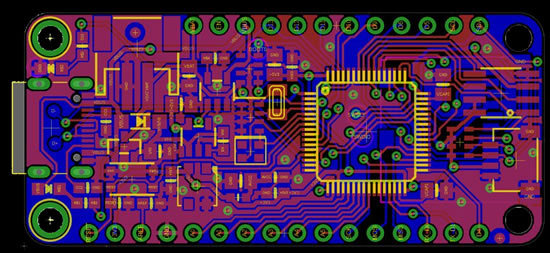](https://blog.adafruit.com/2019/09/04/feather-stm32f405-how-did-we-do-st_world-stm32f405-stm32-stm-adafruit/)

[Updates on our STM32405](https://blog.adafruit.com/2019/09/04/feather-stm32f405-how-did-we-do-st_world-stm32f405-stm32-stm-adafruit/), [previous post](https://blog.adafruit.com/2019/09/07/more-updates-on-the-feather-stm32f405-st_world-stm32f405-stm32-stm/) -

>_"we wanted to make a super fast stm32 based feather and decided to go with the tried and true STM32F405 which is small enough to fit, and super speedy! here’s our first pass at a Feather design – not fully finished (there’s a few more wires to route) but 95% of the way there! please check it out and let us know if you have any suggestions. we put the SD card on the sdio bus, have the two DAC’s on A0 and A1 to match our other feathers, and added some SPI flash (it doesnt seem like the stm32f405 has a qspi peripheral?) it’s 2.0″x0.9″, with USB C and should be compatible with all of our wings."_

## New Learn Guides!

[Adafruit Airlift Bitsy Add-On - ESP32 WiFi Co-Processor](https://learn.adafruit.com/adafruit-airlift-bitsy-add-on-esp32-wifi-co-processor) from [Bryan Siepert](https://learn.adafruit.com/users/siddacious)

[Saving CircuitPython Bitmaps and Screenshots](https://learn.adafruit.com/saving-bitmap-screenshots-in-circuitpython) from [Dave Astels](https://learn.adafruit.com/users/dastels)

## Updated Guides - Now With More Python!

**You can use CircuitPython libraries on Raspberry Pi!** We're updating all of our CircuitPython guides to show how to wire up sensors to your Raspberry Pi, and load the necessary CircuitPython libraries to get going using them with Python. We'll be including the updates here so you can easily keep track of which sensors are ready to go. Check it out!

Keep checking back back for more updated guides!

## CircuitPython Libraries!

CircuitPython support for hardware continues to grow. We are adding support for new sensors and breakouts all the time, as well as improving on the drivers we already have. As we add more libraries and update current ones, you can keep up with all the changes right here!

For the latest drivers, download the [Adafruit CircuitPython Library Bundle](https://circuitpython.org/libraries).

If you'd like to contribute, CircuitPython libraries are a great place to start. Have an idea for a new driver? File an issue on [CircuitPython](https://github.com/adafruit/circuitpython/issues)! Interested in helping with current libraries? Check out [this GitHub issue on CircuitPython](https://github.com/adafruit/circuitpython/issues/1246) for an overview of the State of the CircuitPython Libraries, updated each week. We've included open issues from the library issue lists, and details about repo-level issues that need to be addressed. We have a guide on [contributing to CircuitPython with Git and Github](https://learn.adafruit.com/contribute-to-circuitpython-with-git-and-github) if you need help getting started. You can also find us in the #circuitpython channel on the [Adafruit Discord](https://adafru.it/discord). Feel free to contact Kattni (@kattni) with any questions.

You can check out this [list of all the CircuitPython libraries and drivers available](https://github.com/adafruit/Adafruit_CircuitPython_Bundle/blob/master/circuitpython_library_list.md). 

The current number of CircuitPython libraries is **184**!

**New Libraries!**

Here's this week's new CircuitPython libraries:

 * [Adafruit_CircuitPython_IL91874](https://github.com/adafruit/Adafruit_CircuitPython_IL91874)
 * [Adafruit_CircuitPython_BitmapSaver](https://github.com/adafruit/Adafruit_CircuitPython_BitmapSaver)
 * [Adafruit_CircuitPython_SSD1675](https://github.com/adafruit/Adafruit_CircuitPython_SSD1675)
 * [Adafruit_CircuitPython_SSD1608](https://github.com/adafruit/Adafruit_CircuitPython_SSD1608)
 * [Adafruit_CircuitPython_IL0373](https://github.com/adafruit/Adafruit_CircuitPython_IL0373)
 * [Adafruit_CircuitPython_IL0398](https://github.com/adafruit/Adafruit_CircuitPython_IL0398)
 * [Adafruit_CircuitPython_PCT2075](https://github.com/adafruit/Adafruit_CircuitPython_PCT2075)

**Updated Libraries!**

Here's this week's updated CircuitPython libraries:

 * [Adafruit_CircuitPython_LIDARLite](https://github.com/adafruit/Adafruit_CircuitPython_LIDARLite)
 * [Adafruit_CircuitPython_binascii](https://github.com/adafruit/Adafruit_CircuitPython_binascii)
 * [Adafruit_CircuitPython_ESP_ATcontrol](https://github.com/adafruit/Adafruit_CircuitPython_ESP_ATcontrol)
 * [Adafruit_CircuitPython_DymoScale](https://github.com/adafruit/Adafruit_CircuitPython_DymoScale)
 * [Adafruit_CircuitPython_RFM9x](https://github.com/adafruit/Adafruit_CircuitPython_RFM9x)
 * [Adafruit_CircuitPython_GC_IOT_Core](https://github.com/adafruit/Adafruit_CircuitPython_GC_IOT_Core)
 * [Adafruit_CircuitPython_VL6180X](https://github.com/adafruit/Adafruit_CircuitPython_VL6180X)
 * [Adafruit_CircuitPython_Slideshow](https://github.com/adafruit/Adafruit_CircuitPython_Slideshow)
 * [Adafruit_CircuitPython_CursorControl](https://github.com/adafruit/Adafruit_CircuitPython_CursorControl)

**PyPI Download Stats!**

We've written a special library called Adafruit Blinka that makes it possible to use CircuitPython Libraries on [Raspberry Pi and other compatible single-board computers](https://learn.adafruit.com/circuitpython-on-raspberrypi-linux/). Adafruit Blinka and all the CircuitPython libraries have been deployed to PyPI for super simple installation on Linux! Here are the top 10 CircuitPython libraries downloaded from PyPI in the last week, including the total downloads for those libraries:

| Library                                     | Last Week   | Total |   
|:-------                                     |:--------:   |:-----:|   
| Adafruit-Blinka                             | 1088        | 46199 |   
| Adafruit_CircuitPython_BusDevice            | 701         | 20642 |   
| Adafruit_CircuitPython_MCP230xx             | 369         | 6121 |    
| Adafruit_CircuitPython_NeoPixel             | 132         | 6368 |    
| Adafruit_CircuitPython_ADS1x15              | 101         | 2801 |    
| Adafruit_CircuitPython_Register             | 97          | 7520 |    
| Adafruit_CircuitPython_ServoKit             | 84          | 3718 |    
| Adafruit_CircuitPython_PCA9685              | 81          | 4755 |    
| Adafruit_CircuitPython_BME280               | 81          | 2667 |    
| Adafruit_CircuitPython_Motor                | 80          | 5335 |    

## Upcoming events!

PYCON UK 2019 - Cardiff City Hall, Friday 13th to Tuesday 17th September. PyCon UK is back at Cardiff City Hall, for five days of talks, workshops and collaboration. The conference also features a young coders' day, themes dedicated to science and education, and numerous Python-related events - [PyCon UK](https://2019.pyconuk.org/).

[October is Open Hardware Month @ Open Source Hardware Association](https://www.oshwa.org/2019/07/26/october-is-open-hardware-month-2/).

>_"October is Open Hardware Month! Check out the [Open Hardware Month website](http://ohm.oshwa.org/). Host an event, find a local event, or [certify](https://certification.oshwa.org/) your hardware to support Open Source Hardware. We are providing resources and asking you, the community, to host small, local events in the name of open source hardware. Tell us about your October event by f[illing out the form below](https://docs.google.com/forms/d/e/1FAIpQLSfjvJmcRXbpgjRACgY_BbaDzQZRa6wxEcP-xwaBpC0X6mvsPw/viewform). Your event will be featured on [OSHWA’s Open Hardware Month page](http://ohm.oshwa.org/) (provided you have followed OSHWA’s rules listed on the [“Do’s and Don’ts”](http://ohm.oshwa.org/dos-and-donts/) page)."_

[Read more](https://www.oshwa.org/2019/07/26/october-is-open-hardware-month-2/), [Tweet for speakers in 2020](https://twitter.com/ohsummit/status/1154881782677831680), and Open Hardware Month @ [http://ohm.oshwa.org/](http://ohm.oshwa.org/)

micro:bit Live 2019 is coming to BBC MediaCityUK, Greater Manchester, England on October 4-5. This will be the very first annual gathering of the global micro:bit community of educators and partners - [micro:bit](https://microbit.org/en/2019-04-12-microbit-live/).

PyCon DE & PyData Berlin // October 9 - 13 2019. Main conference, 3 days of talks and workshops. More than 100 sessions dedicated to PyData (artificial intelligence, machine learning, ethics...) and Python topics (programming, DevOps, Web, Django...) - [de.pycon.org](https://de.pycon.org/).

Hackaday Superconference is November 15th, 16th, and 17th in Pasadena, California, USA. The Hackaday Superconference is returning for another 3 full days of technical talks, badge hacking, and hands-on workshops: [Eventbrite](https://www.eventbrite.com/e/hackaday-superconference-2019-tickets-60129236164?aff=0626com
) & [hackaday.io](https://hackaday.io/superconference/)

## Latest releases

CircuitPython's stable release is [4.1.0](https://github.com/adafruit/circuitpython/releases/latest) and its unstable release is [5.0.0-alpha.2](https://github.com/adafruit/circuitpython/releases). New to CircuitPython? Start with our [Welcome to CircuitPython Guide](https://learn.adafruit.com/welcome-to-circuitpython).

[20190909](https://github.com/adafruit/Adafruit_CircuitPython_Bundle/releases/latest) is the latest CircuitPython library bundle.

[v1.11](https://micropython.org/download) is the latest MicroPython release. Documentation for it is [here](http://docs.micropython.org/en/latest/pyboard/).

[3.7.4](https://www.python.org/downloads/) is the latest Python release. The latest pre-release version is [3.8.0b4](https://www.python.org/download/pre-releases/).

[1378 Stars](https://github.com/adafruit/circuitpython/stargazers) Like CircuitPython? [Star it on GitHub!](https://github.com/adafruit/circuitpython)

## Call for help – CircuitPython messaging to other languages!

We [posted on the Adafruit blog](https://blog.adafruit.com/2018/08/15/help-bring-circuitpython-messaging-to-other-languages-circuitpython/) about bringing CircuitPython messaging to other languages, one of the exciting features of CircuitPython 4.x is translated control and error messages. Native language messages will help non-native English speakers understand what is happening in CircuitPython even though the Python keywords and APIs will still be in English. If you would like to help, [please post](https://github.com/adafruit/circuitpython/issues/1098) to the main issue on GitHub and join us on [Discord](https://adafru.it/discord).

We made this graphic with translated text, we could use your help with that to make sure we got the text right, please check out the text in the image – if there is anything we did not get correct, please let us know. Dan sent me this [handy site too](http://helloworldcollection.de/#Human).

## jobs.adafruit.com - Find a dream job, find great candidates!

[jobs.adafruit.com](https://jobs.adafruit.com/) has returned and folks are posting their skills (including CircuitPython) and companies are looking for talented makers to join their companies - from Digi-Key, to Makey Makey, to micro:mag, to Hackaday, Microcenter, Raspberry Pi and more.

## 13,938 thanks!

The Adafruit Discord community, where we do all our CircuitPython development in the open, reached over 13,938 humans, thank you! Join today! [https://adafru.it/discord](https://adafru.it/discord)

## ICYMI - In case you missed it

The wonderful world of Python on hardware! This is our first video-newsletter-podcast that we’ve started! The news comes from the Python community, Discord, Adafruit communities and more. It’s part of the weekly newsletter, then we have a segment on ASK an ENGINEER and this is the video slice from that! The complete Python on Hardware weekly VideoCast [playlist is here](https://www.youtube.com/playlist?list=PLjF7R1fz_OOXRMjM7Sm0J2Xt6H81TdDev). 

This video podcast is on [iTunes](https://itunes.apple.com/us/podcast/python-on-hardware/id1451685192?mt=2), [YouTube](https://www.youtube.com/playlist?list=PLjF7R1fz_OOXRMjM7Sm0J2Xt6H81TdDev), [IGTV (Instagram TV](https://www.instagram.com/adafruit/channel/)), and [XML](https://itunes.apple.com/us/podcast/python-on-hardware/id1451685192?mt=2).

[Weekly community chat on Adafruit Discord server CircuitPython channel - Audio / Podcast edition](https://itunes.apple.com/us/podcast/circuitpython-weekly-meeting/id1451685016) - Audio from the Discord chat space for CircuitPython, meetings are usually Mondays at 2pm ET, this is the audio version on [iTunes](https://itunes.apple.com/us/podcast/circuitpython-weekly-meeting/id1451685016), Pocket Casts, [Spotify](https://adafru.it/spotify), and [XML feed](https://adafruit-podcasts.s3.amazonaws.com/circuitpython_weekly_meeting/audio-podcast.xml).

And lastly, we are working up a one-spot destination for all things podcast-able here - [podcasts.adafruit.com](https://podcasts.adafruit.com/)

## Codecademy "Learn Hardware Programming with CircuitPython"

Codecademy, an online interactive learning platform used by more than 45 million people, has teamed up with the leading manufacturer in STEAM electronics, Adafruit Industries, to create a coding course, "Learn Hardware Programming with CircuitPython". The course is now available in the [Codecademy catalog](https://www.codecademy.com/learn/learn-circuitpython?utm_source=adafruit&utm_medium=partners&utm_campaign=circuitplayground&utm_content=pythononhardwarenewsletter).

Python is a highly versatile, easy to learn programming language that a wide range of people, from visual effects artists in Hollywood to mission control at NASA, use to quickly solve problems. But you don’t need to be a rocket scientist to accomplish amazing things with it. This new course introduces programmers to Python by way of a microcontroller — CircuitPython — which is a Python-based programming language optimized for use on hardware.

CircuitPython’s hardware-ready design makes it easier than ever to program a variety of single-board computers, and this course gets you from no experience to working prototype faster than ever before. Codecademy’s interactive learning environment, combined with Adafruit's highly rated Circuit Playground Express, present aspiring hardware hackers with a never-before-seen opportunity to learn hardware programming seamlessly online.

Whether for those who are new to programming, or for those who want to expand their skill set to include physical computing, this course will have students getting familiar with Python and creating incredible projects along the way. By the end, students will have built their own bike lights, drum machine, and even a moisture detector that can tell when it's time to water a plant.

Visit Codecademy to access the [Learn Hardware Programming with CircuitPython](https://www.codecademy.com/learn/learn-circuitpython?utm_source=adafruit&utm_medium=partners&utm_campaign=circuitplayground&utm_content=pythononhardwarenewsletter) course and Adafruit to purchase a [Circuit Playground Express](https://www.adafruit.com/product/3333).

Codecademy has helped more than 45 million people around the world upgrade their careers with technology skills. The company’s online interactive learning platform is widely recognized for providing an accessible, flexible, and engaging experience for beginners and experienced programmers alike. Codecademy has raised a total of $43 million from investors including Union Square Ventures, Kleiner Perkins, Index Ventures, Thrive Capital, Naspers, Yuri Milner and Richard Branson, most recently raising its $30 million Series C in July 2016.

## Contribute!

The CircuitPython Weekly Newsletter is a CircuitPython community-run newsletter emailed every Tuesday. The complete [archives are here](https://www.adafruitdaily.com/category/circuitpython/). It highlights the latest CircuitPython related news from around the web including Python and MicroPython developments. To contribute, edit next week's draft [on GitHub](https://github.com/adafruit/circuitpython-weekly-newsletter/tree/gh-pages/_drafts) and [submit a pull request](https://help.github.com/articles/editing-files-in-your-repository/) with the changes. Join our [Discord](https://adafru.it/discord) or [post to the forum](https://forums.adafruit.com/viewforum.php?f=60) for any further questions.
