- [ ] update title
- [ ] Link "View this email in your browser."

View this email in your browser.

## Happy Halloween from Chika Iori

Happy Halloween from Chika-chan, the cover character, Chika Iori CircuitPython book for Beginners 1 (Japanese). The [book](https://www.adafruit.com/product/4024) is coming soon to the Adafruit store! - [Twitter](https://twitter.com/AoyamaProd/status/1187702523936665600) & [product page](https://www.adafruit.com/product/4024).

## CircuitPython snakes its way to the Sony Spresense

[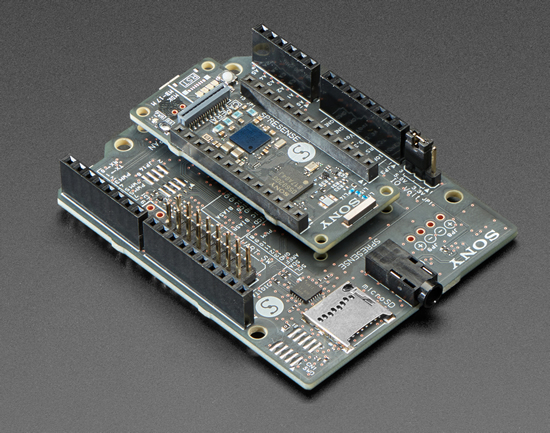]()

Spresense is a compact development board based on Sony’s power-efficient multicore microcontroller CXD5602. 

And now it can run [CircuitPython, thanks to Sony](https://circuitpython.org/board/spresense/).

Features include:

 * Integrated GPS - The embedded GNSS with support for GPS, QZSS and GLONASS enables applications where tracking is required.
 * Hi-res audio output and multi mic inputs - Advanced 192kHz/24 bit audio codec and amplifier for audio output, and support for up to 8 mic input channels.
 * Multicore microcontroller - Spresense is powered by Sony's CXD5602 microcontroller (ARM® Cortex®-M4F × 6 cores), with a clock speed of 156 MHz.
 
**Resources and more:**
 * Sony Developer World - [Spresense](https://developer.sony.com/develop/spresense/).
 * Sony Developer World - [Twitter](@SonyDevWorld).
 * Sony Dev World - [YouTube](https://www.youtube.com/user/SonyXperiaDev/).

## CircuitPython snakes its way to the Arduino Nano 33 BLE Sense

[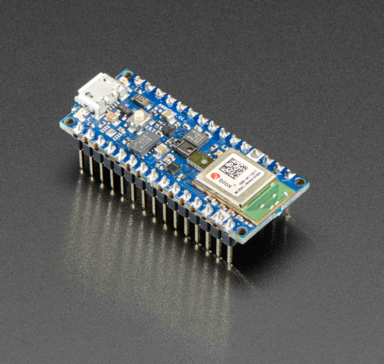](https://circuitpython.org/board/arduino_nano_33_ble/)

The Arduino Nano 33 BLE Sense now runs [CircuitPython](https://circuitpython.org/board/arduino_nano_33_ble/).

This compact and reliable [NANO board](https://circuitpython.org/board/arduino_nano_33_ble/) is built around the NINA B306 module, based on Nordic nRF 52840 and containing a powerful Cortex M4F. Its architecture, has a 9 axis Inertial Measurement Unit (IMU) and a reduced power consumption compared to other same size boards. This allows the design of wearable devices and movement sensing projects that need to communicate to other devices at a close range. Arduino NANO 33 BLE is also ideal for automation projects thanks to the multiprotocol BT 5.0 radio - [CircuitPython.org](https://circuitpython.org/board/arduino_nano_33_ble/).

## Issue 24 – HackSpace magazine: LED matrix modules CircuitPython

## CircuitPython powered Electronic Cats

## Circuit Playground Bluefruit low power tests

[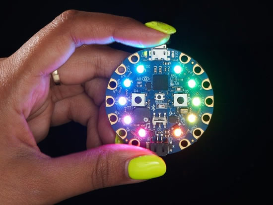](https://blog.adafruit.com/2019/10/25/circuitplayground-bluefruit-low-power-tests-adafruit-bluefruit-arduino-circuitpython/)

[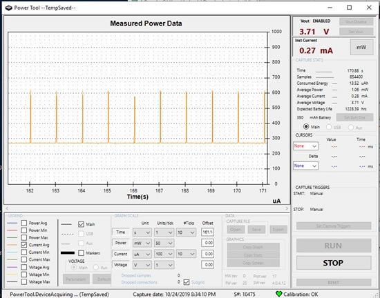](https://blog.adafruit.com/2019/10/25/circuitplayground-bluefruit-low-power-tests-adafruit-bluefruit-arduino-circuitpython/)

Doing some low power testing for a revision of the CircuitPlayground Bluefruit, our prototype has the ability to turn off the neopixels/light/temp/mic sensor in addition to the speaker amp. When we do that, we drop down to 280uA quiescent when we go to sleep, code is about 6mA.

[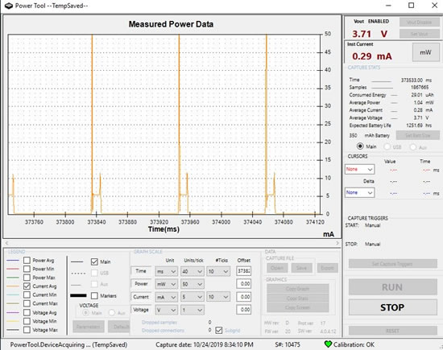](https://blog.adafruit.com/2019/10/25/circuitplayground-bluefruit-low-power-tests-adafruit-bluefruit-arduino-circuitpython/)

Here’s what it looks like when we wake from sleep and enable the neopixels and sensors, hang out for a bit, then go back to sleep. there’s a skinny spike of 50mA, maybe the neopixel PWM circuitry turning on at once?

## CircuitPython snakes its way to the SparkFun Qwiic Micro – SAMD21 Development Board

[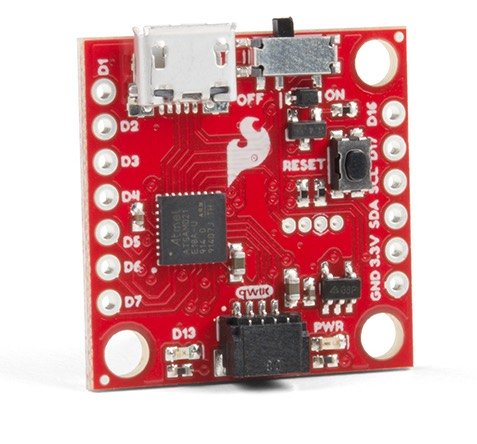](https://blog.adafruit.com/2019/10/24/circuitpython-snakes-its-way-to-the-sparkfun-qwiic-micro-samd21-development-board-sparkfun-circuitpython-adafruit/)

CircuitPython snakes its way to the SparkFun [Qwiic Micro - SAMD21 Development Board](https://www.sparkfun.com/products/15423), [from the guide.](https://learn.sparkfun.com/tutorials/sparkfun-qwiic-micro-samd21e-hookup-guide#circuitpython)..

> _"CircuitPython is Adafruit's version of MicroPython. We like it here at SparkFun because of it's support for the SAMD based microcontrollers. If you're not familiar with CircuitPython then I encourage you to check Adafruit's website for more information. We've provided two different CircuitPython builds for the Qwiic Micro in the Qwiic Micro's hardware repo, one for those of you have soldered the flash chip sold on SparkFun and one for those without flash chip."_

[Learn more](https://learn.sparkfun.com/tutorials/sparkfun-qwiic-micro-samd21e-hookup-guide#circuitpython). Other [SparkFun boards with CircuitPython](https://www.sparkfun.com/search/results?term=circuitpython) ... [SparkFun RedBoard Turbo](https://www.sparkfun.com/products/14812), [SparkFun Pro nRF52840 Mini - Bluetooth Development Board](https://www.sparkfun.com/products/15025), and the [SparkFun LumiDrive LED Driver](https://www.sparkfun.com/products/14779).

## MicroPython, bringing Python to hardware for everyone

[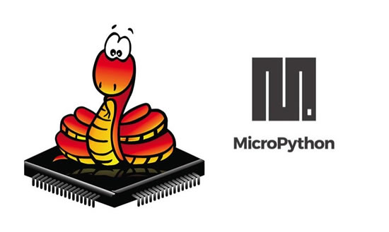](https://blog.adafruit.com/2019/10/22/micropython-bringing-python-to-hardware-for-everyone-ohm2019-oshwa-ohsummit-opensource-opensourcehardware-opensourceorg-micropython-micropython/)

It's open-source hardware month, we've been doing a post every day, all month. One of the posts is all about MicroPyton. We think the next chapter for electronics is Python, from powerful Raspberry Pi computers to low-cost microcontrollers which are able to drive robotics, to running Machine Learning, [the most popular programming language in the world (Python)](https://blog.adafruit.com/2019/09/08/the-top-programming-languages-2019-python-tops-the-charts-with-a-circuitpython-nod-circuitpython-micropython-ieeespectrum-python/) has arrived on hardware, and we have MicroPython and its creator, Damien George, to thank. From the [micropython.org](http://micropython.org/) about page -

> MicroPython is a lean and efficient implementation of the Python 3 programming language that includes a small subset of the Python standard library and is optimised to run on microcontrollers and in constrained environments. The MicroPython pyboard is a compact electronic circuit board that runs MicroPython on the bare metal, giving you a low-level Python operating system that can be used to control all kinds of electronic projects. MicroPython is packed full of advanced features such as an interactive prompt, arbitrary precision integers, closures, list comprehension, generators, exception handling and more. Yet it is compact enough to fit and run within just 256k of code space and 16k of RAM. MicroPython aims to be as compatible with normal Python as possible to allow you to transfer code with ease from the desktop to a microcontroller or embedded system.

There's also a good history of [MicroPython over on Wikipedia](https://en.wikipedia.org/wiki/MicroPython), and [we've posted about some of the early days, history, and its recent 6th birthday...](https://blog.adafruit.com/2019/04/29/happy-6th-birthday-micropython-micropython-micropython/)

> *   29th April 2013: first line of code written (in private, before anyone knew about it, before it was even called Micro-Python)
> *   17th Sept 2013: first code running on a microcontroller, on the very first prototype of the pyboard
> *   2nd Oct 2013: register micropython.org
> *   4th Oct 2013: first commit in what is now the main repository
> *   late Dec 2013: source code up on GitHub
> *   21st June 2014: last of the Kickstarter rewards sent out (for the first Kickstarter)

[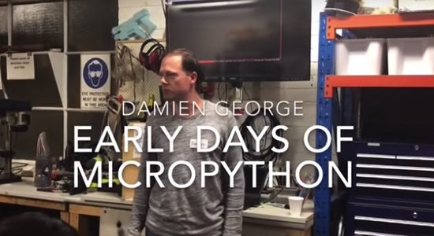](https://youtu.be/NBAqOYYW6vM)

The Early Days of MicroPython - [YouTube](https://youtu.be/NBAqOYYW6vM).

> _"April 29, 2019 is the sixth 'birthday' of MicroPython. At the April Melbourne Meetup, Damien George, creator of MicroPython, delves into his archives and shows the earliest code and notes about the goals of the language. The material pre-dates the first git commit! Listen in as Damien reveals how and why the language began and evolved. It's a nice way to celebrate MicroPython's sixth birthday!"_

[In newsletter #8 from MicroPython, Damien published](https://forum.micropython.org/viewtopic.php?f=19&t=6356) some never-before-seen details about the start of MicroPython.

> Here is an excerpt from the initial notes. The title is "Python board" and the date is 29 April 2013: Python board 29/4/2013 The smallest, cheapest python. A piece of hardware that is small and cheap, runs python scripts, and has good low-level access to hardware. If we can do it with a single chip, that would keep it small and cheap. Need then something with a large amount of flash and a decent amount of RAM, that also is cheap enough. Atmel SAM's have order 1MiB flash and 128KiB SRAM, for around $10 one-off. Main features:
> 
> *   Implements Python 3 core language.
> *   Flash presents as a flash drive with vfat filesystem.
> *   Put python scripts on flash and it runs them (maybe have a (multicolour?) led that flashes on error and writes a "core" dump to the flash). This led can also double as a user output led.
> *   Can run multiple scripts on once.
> 
> Our strength would be small, cheap, simple, easy to replicate. Can have a range of boards with different features. But all must be basically compatible and capable of running the same scripts.

[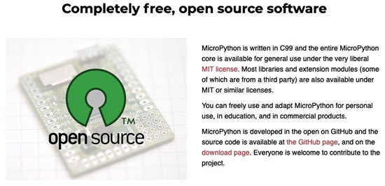](https://github.com/micropython/pyboard)

[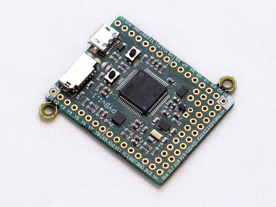](https://github.com/micropython/pyboard)

In addition to the open-source software, [the PyBoard (2013) is open-source hardware](https://github.com/micropython/pyboard). You can learn more about MicroPython and keep up-to-date with developments via the following resources:

*   Subscribe to the [newsletter](http://micropython.org/newsletter).
*   [Read the documentation](http://docs.micropython.org/).
*   Join the community at the [forum](http://forum.micropython.org/).
*   Submit bug reports, and follow and join in development on [GitHub](https://github.com/micropython/micropython).
*   Join the [MicroPython Slack](https://app.slack.com/client/T484S5MA4/C48TVHRQC/details/members).

## A Belated Happy Birthday to MQTT

[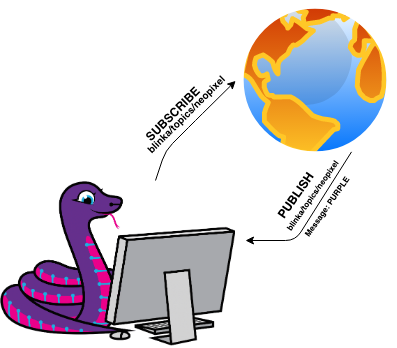](https://blog.adafruit.com/2019/10/22/a-belated-happy-birthday-to-mqtt-iotuesday-mqtt-andysc-ibm-arlennipper/)

MQTT, or message queue telemetry transport, is a protocol for device communication. Using a MQTT library or client you can publish and subscribe to a feed to send and receive feed data.

About 20 years ago, the first version of the MQTT was published. We’re big fans of this stateful, low-bandwidth, pubsub protocol.

CircuitPython has its own MQTT library called MiniMQTT! [We have a guide about it here](https://learn.adafruit.com/mqtt-in-circuitpython). CircuitPython cloud-service provider libraries such as Adafruit IO, Google Cloud IoT Core, and Amazon AWS IoT utilize this library “under-the-hood” - [Adafruit](https://blog.adafruit.com/2019/10/22/a-belated-happy-birthday-to-mqtt-iotuesday-mqtt-andysc-ibm-arlennipper/).

## News from around the web!

WE ONLY HAVE EYE FOR YOU - [YouTube](https://youtu.be/Qcd03YDa22Y).

[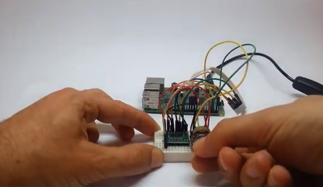](https://youtu.be/FSgLFthpw8A)

Analog input on Raspberry Pi using mcp3008 running on CircuitPython - [YouTube](https://youtu.be/FSgLFthpw8A).

REMINDER: We now have a SmallSats channel on the Adafruit Discord server [adafru.it/smallsats](https://adafru.it/smallsats)

Evolution of the scroll bar - [scrollbars.matoseb.com](https://scrollbars.matoseb.com/)

There is HOPE! HOPE XIII will be at St. John’s University in Queens from July 31st to August 2nd, 2020 - [hope.net](https://www.hope.net/)

#ICYDNCI What was the most popular, most clicked link, in [last week's newsletter](https://www.adafruitdaily.com/2019/10/22/81-boards-blinka-on-amazon-aws-and-more-python-adafruit-circuitpython-pythonhardware-circuitpython-micropython-thepsf-adafruit/)? [Buy One Give One at Adafruit with Black Girls Code](https://www.adafruit.com/product/2599).

[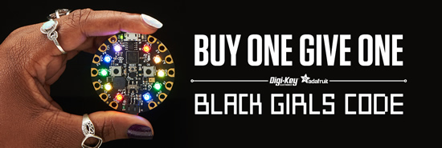](https://www.adafruit.com/product/2599)

Speaking of Black Girls CODE the moment this newsletter arrives, about 11am ET for many of you, we'lll have 100 more "Buy One Give One" thanks to Digi-Key! [Vist the page](https://www.adafruit.com/product/2599) and pick one up!

## Coming soon

## New Learn Guides!

[EZ Make Oven](https://learn.adafruit.com/ez-make-oven) from [Dan Cogliano](https://learn.adafruit.com/users/cogliano)

[Adafruit Mini PiTFT - 135x240 Color TFT Add-on for Raspberry Pi](https://learn.adafruit.com/adafruit-mini-pitft-135x240-color-tft-add-on-for-raspberry-pi) from [Ladyada](https://learn.adafruit.com/users/adafruit2)

[Circuit Playground-O-Phonor](https://learn.adafruit.com/circuit-playground-o-phonor) from [Carter Nelson](https://learn.adafruit.com/users/caternuson)

[Color Remote with Circuit Playground Bluefruit](https://learn.adafruit.com/color-remote-with-circuit-playground-bluefruit) from [John Park](https://learn.adafruit.com/users/johnpark)

## Updated Guides - Now With More Python!

**You can use CircuitPython libraries on Raspberry Pi!** We're updating all of our CircuitPython guides to show how to wire up sensors to your Raspberry Pi, and load the necessary CircuitPython libraries to get going using them with Python. We'll be including the updates here so you can easily keep track of which sensors are ready to go. Check it out!

Keep checking back for more updated guides!

## CircuitPython Libraries!

CircuitPython support for hardware continues to grow. We are adding support for new sensors and breakouts all the time, as well as improving on the drivers we already have. As we add more libraries and update current ones, you can keep up with all the changes right here!

For the latest drivers, download the [Adafruit CircuitPython Library Bundle](https://circuitpython.org/libraries).

If you'd like to contribute, CircuitPython libraries are a great place to start. Have an idea for a new driver? File an issue on [CircuitPython](https://github.com/adafruit/circuitpython/issues)! Interested in helping with current libraries? Check out the [CircuitPython.org Contributing page](https://circuitpython.org/contributing). We've included open pull requests and issues from the libraries, and details about repo-level issues that need to be addressed. We have a guide on [contributing to CircuitPython with Git and Github](https://learn.adafruit.com/contribute-to-circuitpython-with-git-and-github) if you need help getting started. You can also find us in the #circuitpython channel on the [Adafruit Discord](https://adafru.it/discord). Feel free to contact Kattni (@kattni) with any questions.

You can check out this [list of all the CircuitPython libraries and drivers available](https://github.com/adafruit/Adafruit_CircuitPython_Bundle/blob/master/circuitpython_library_list.md). 

The current number of CircuitPython libraries is **193**!

**New Libraries!**

Here's this week's new CircuitPython libraries:

 * [Adafruit_CircuitPython_MPU6050](https://github.com/adafruit/Adafruit_CircuitPython_MPU6050)
 * [Adafruit_CircuitPython_MCP9600](https://github.com/adafruit/Adafruit_CircuitPython_MCP9600)

**Updated Libraries!**

Here's this week's updated CircuitPython libraries:

 * [Adafruit_CircuitPython_AWS_IOT](https://github.com/adafruit/Adafruit_CircuitPython_AWS_IOT)
 * [Adafruit_CircuitPython_BNO055](https://github.com/adafruit/Adafruit_CircuitPython_BNO055)
 * [Adafruit_CircuitPython_EPD](https://github.com/adafruit/Adafruit_CircuitPython_EPD)
 * [Adafruit_CircuitPython_framebuf](https://github.com/adafruit/Adafruit_CircuitPython_framebuf)
 * [Adafruit_CircuitPython_ST7789](https://github.com/adafruit/Adafruit_CircuitPython_ST7789)
 * [Adafruit_CircuitPython_ESP32SPI](https://github.com/adafruit/Adafruit_CircuitPython_ESP32SPI)
 * [Adafruit_CircuitPython_RGB_Display](https://github.com/adafruit/Adafruit_CircuitPython_RGB_Display)
 * [Adafruit_CircuitPython_VEML7700](https://github.com/adafruit/Adafruit_CircuitPython_VEML7700)

**PyPI Download Stats!**

We've written a special library called Adafruit Blinka that makes it possible to use CircuitPython Libraries on [Raspberry Pi and other compatible single-board computers](https://learn.adafruit.com/circuitpython-on-raspberrypi-linux/). Adafruit Blinka and all the CircuitPython libraries have been deployed to PyPI for super simple installation on Linux! Here are the top 10 CircuitPython libraries downloaded from PyPI in the last week, including the total downloads for those libraries:

| Library                                     | Last Week   | Total |   
|:-------                                     |:--------:   |:-----:|   
| Adafruit-Blinka                             | 2005        | 44319 |   
| Adafruit_CircuitPython_BusDevice            | 1148        | 25413 |   
| Adafruit_CircuitPython_MCP230xx             | 403         | 9136 |    
| Adafruit_CircuitPython_LIS3DH               | 343         | 2570 |    
| Adafruit_CircuitPython_BME280               | 325         | 2656 |    
| Adafruit_CircuitPython_BMP280               | 298         | 1458 |    
| Adafruit_CircuitPython_BME680               | 290         | 1172 |    
| Adafruit_CircuitPython_Register             | 231         | 6107 |    
| Adafruit_CircuitPython_NeoPixel             | 213         | 5492 |    
| Adafruit_CircuitPython_ESP32SPI             | 156         | 2194 |    

## Upcoming events!

[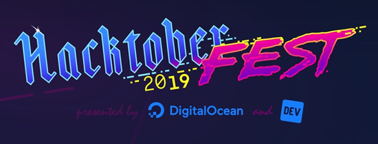](https://hacktoberfest.digitalocean.com)

Hacktoberfest is open to everyone in the global community. Whether you’re a developer, student learning to code, event host, or company of any size, you can help drive growth of open source and make positive contributions to an ever-growing community. All backgrounds and skill levels are encouraged to complete the challenge - [https://hacktoberfest.digitalocean.com](hacktoberfest.digitalocean.com)

[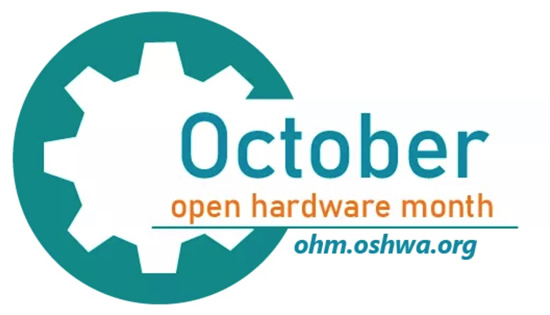](https://www.oshwa.org/2019/07/26/october-is-open-hardware-month-2/)

[October is Open Hardware Month @ Open Source Hardware Association](https://www.oshwa.org/2019/07/26/october-is-open-hardware-month-2/).

>_"October is Open Hardware Month! Check out the [Open Hardware Month website](http://ohm.oshwa.org/). Host an event, find a local event, or [certify](https://certification.oshwa.org/) your hardware to support Open Source Hardware. We are providing resources and asking you, the community, to host small, local events in the name of open source hardware. Tell us about your October event by [filling out the form below](https://docs.google.com/forms/d/e/1FAIpQLSfjvJmcRXbpgjRACgY_BbaDzQZRa6wxEcP-xwaBpC0X6mvsPw/viewform). Your event will be featured on [OSHWA’s Open Hardware Month page](http://ohm.oshwa.org/) (provided you have followed OSHWA’s rules listed on the [“Do’s and Don’ts”](http://ohm.oshwa.org/dos-and-donts/) page)."_

[Read more](https://www.oshwa.org/2019/07/26/october-is-open-hardware-month-2/), [Tweet for speakers in 2020](https://twitter.com/ohsummit/status/1154881782677831680), and Open Hardware Month @ [http://ohm.oshwa.org/](http://ohm.oshwa.org/)

October 28–31, 2019. Be part of the ML revolution. Santa Clara, CA. TensorFlow is powering everything from data centers to edge devices, across industries from finance to advanced healthcare. And now, with TensorFlow 2.0 and the evolving ecosystem of tools and libraries, it’s doing it all so much easier - [TensorFlow World](https://conferences.oreilly.com/tensorflow/tf-ca).

Hackaday Superconference is November 15th, 16th, and 17th in Pasadena, California, USA. The Hackaday Superconference is returning for another 3 full days of technical talks, badge hacking, and hands-on workshops: [Eventbrite](https://www.eventbrite.com/e/hackaday-superconference-2019-tickets-60129236164?aff=0626com
) & [hackaday.io](https://hackaday.io/superconference/)

April 15-23, 2020, Pittsburgh, Pennsylvania - The PyCon 2020 conference, which will take place in Pittsburgh, is the largest annual gathering for the community using and developing the open-source Python programming language. It is produced and underwritten by the Python Software Foundation, the 501(c)(3) nonprofit organization dedicated to advancing and promoting Python. Through PyCon, the PSF advances its mission of growing the international community of Python programmers - [PyCon 2020](https://us.pycon.org/2020/).

## Latest releases

CircuitPython's stable release is [4.1.0](https://github.com/adafruit/circuitpython/releases/latest) and its unstable release is [5.0.0-alpha.4](https://github.com/adafruit/circuitpython/releases). New to CircuitPython? Start with our [Welcome to CircuitPython Guide](https://learn.adafruit.com/welcome-to-circuitpython).

[2019####](https://github.com/adafruit/Adafruit_CircuitPython_Bundle/releases/latest) is the latest CircuitPython library bundle.

[v1.11](https://micropython.org/download) is the latest MicroPython release. Documentation for it is [here](http://docs.micropython.org/en/latest/pyboard/).

[3.8.0](https://www.python.org/downloads/) is the latest Python release.

[1441 Stars](https://github.com/adafruit/circuitpython/stargazers) Like CircuitPython? [Star it on GitHub!](https://github.com/adafruit/circuitpython)

## Call for help – CircuitPython messaging to other languages!

We [recently posted on the Adafruit blog](https://blog.adafruit.com/2018/08/15/help-bring-circuitpython-messaging-to-other-languages-circuitpython/) about bringing CircuitPython messaging to other languages, one of the exciting features of CircuitPython 4.x is translated control and error messages. Native language messages will help non-native English speakers understand what is happening in CircuitPython even though the Python keywords and APIs will still be in English. If you would like to help, [please post](https://github.com/adafruit/circuitpython/issues/1098) to the main issue on GitHub and join us on [Discord](https://adafru.it/discord).

We made this graphic with translated text, we could use your help with that to make sure we got the text right, please check out the text in the image – if there is anything we did not get correct, please let us know. Dan sent me this [handy site too](http://helloworldcollection.de/#Human).

## jobs.adafruit.com - Find a dream job, find great candidates!

[jobs.adafruit.com](https://jobs.adafruit.com/) has returned and folks are posting their skills (including CircuitPython) and companies are looking for talented makers to join their companies - from Digi-Key, to Hackaday, Microcenter, Raspberry Pi and more.

## NUMBER thanks!

The Adafruit Discord community, where we do all our CircuitPython development in the open, reached over NUMBER humans, thank you! Join today! [https://adafru.it/discord](https://adafru.it/discord)

## ICYMI - In case you missed it

[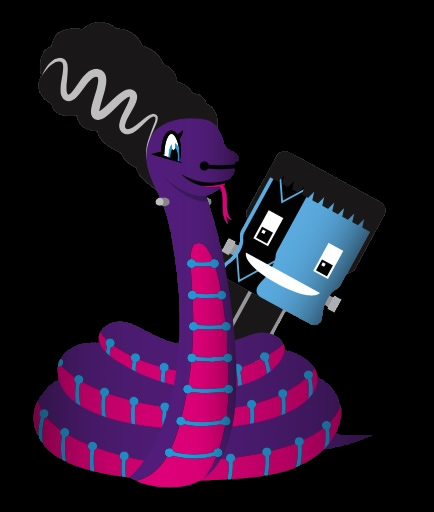](https://www.youtube.com/playlist?list=PLjF7R1fz_OOXRMjM7Sm0J2Xt6H81TdDev)

The wonderful world of Python on hardware! This is our first video-newsletter-podcast that we’ve started! The news comes from the Python community, Discord, Adafruit communities and more. It’s part of the weekly newsletter, then we have a segment on ASK an ENGINEER and this is the video slice from that! The complete Python on Hardware weekly videocast [playlist is here](https://www.youtube.com/playlist?list=PLjF7R1fz_OOXRMjM7Sm0J2Xt6H81TdDev). 

This video podcast is on [iTunes](https://itunes.apple.com/us/podcast/python-on-hardware/id1451685192?mt=2), [YouTube](https://www.youtube.com/playlist?list=PLjF7R1fz_OOXRMjM7Sm0J2Xt6H81TdDev), [IGTV (Instagram TV](https://www.instagram.com/adafruit/channel/)), and [XML](https://itunes.apple.com/us/podcast/python-on-hardware/id1451685192?mt=2).

[Weekly community chat on Adafruit Discord server CircuitPython channel - Audio / Podcast edition](https://itunes.apple.com/us/podcast/circuitpython-weekly-meeting/id1451685016) - Audio from the Discord chat space for CircuitPython, meetings are usually Mondays at 2pm ET, this is the audio version on [iTunes](https://itunes.apple.com/us/podcast/circuitpython-weekly-meeting/id1451685016), Pocket Casts, [Spotify](https://adafru.it/spotify), and [XML feed](https://adafruit-podcasts.s3.amazonaws.com/circuitpython_weekly_meeting/audio-podcast.xml).

And lastly, we are working up a one-spot destination for all things podcast-able here - [podcasts.adafruit.com](https://podcasts.adafruit.com/)

## Codecademy "Learn Hardware Programming with CircuitPython"

Codecademy, an online interactive learning platform used by more than 45 million people, has teamed up with the leading manufacturer in STEAM electronics, Adafruit Industries, to create a coding course, "Learn Hardware Programming with CircuitPython". The course is now available in the [Codecademy catalog](https://www.codecademy.com/learn/learn-circuitpython?utm_source=adafruit&utm_medium=partners&utm_campaign=circuitplayground&utm_content=pythononhardwarenewsletter).

Python is a highly versatile, easy to learn programming language that a wide range of people, from visual effects artists in Hollywood to mission control at NASA, use to quickly solve problems. But you don’t need to be a rocket scientist to accomplish amazing things with it. This new course introduces programmers to Python by way of a microcontroller — CircuitPython — which is a Python-based programming language optimized for use on hardware.

CircuitPython’s hardware-ready design makes it easier than ever to program a variety of single-board computers, and this course gets you from no experience to working prototype faster than ever before. Codecademy’s interactive learning environment, combined with Adafruit's highly rated Circuit Playground Express, present aspiring hardware hackers with a never-before-seen opportunity to learn hardware programming seamlessly online.

Whether for those who are new to programming, or for those who want to expand their skill set to include physical computing, this course will have students getting familiar with Python and creating incredible projects along the way. By the end, students will have built their own bike lights, drum machine, and even a moisture detector that can tell when it's time to water a plant.

Visit Codecademy to access the [Learn Hardware Programming with CircuitPython](https://www.codecademy.com/learn/learn-circuitpython?utm_source=adafruit&utm_medium=partners&utm_campaign=circuitplayground&utm_content=pythononhardwarenewsletter) course and Adafruit to purchase a [Circuit Playground Express](https://www.adafruit.com/product/3333).

Codecademy has helped more than 45 million people around the world upgrade their careers with technology skills. The company’s online interactive learning platform is widely recognized for providing an accessible, flexible, and engaging experience for beginners and experienced programmers alike. Codecademy has raised a total of $43 million from investors including Union Square Ventures, Kleiner Perkins, Index Ventures, Thrive Capital, Naspers, Yuri Milner and Richard Branson, most recently raising its $30 million Series C in July 2016.

## Contribute!

The CircuitPython Weekly Newsletter is a CircuitPython community-run newsletter emailed every Tuesday. The complete [archives are here](https://www.adafruitdaily.com/category/circuitpython/). It highlights the latest CircuitPython related news from around the web including Python and MicroPython developments. To contribute, edit next week's draft [on GitHub](https://github.com/adafruit/circuitpython-weekly-newsletter/tree/gh-pages/_drafts) and [submit a pull request](https://help.github.com/articles/editing-files-in-your-repository/) with the changes. Join our [Discord](https://adafru.it/discord) or [post to the forum](https://forums.adafruit.com/viewforum.php?f=60) for any further questions.
