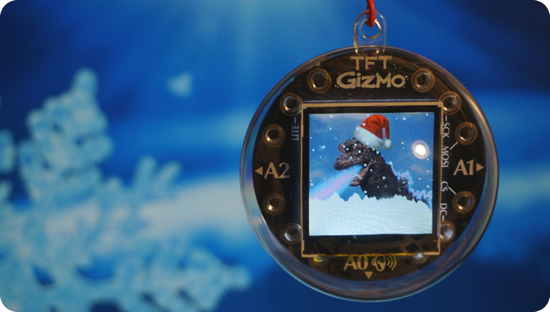
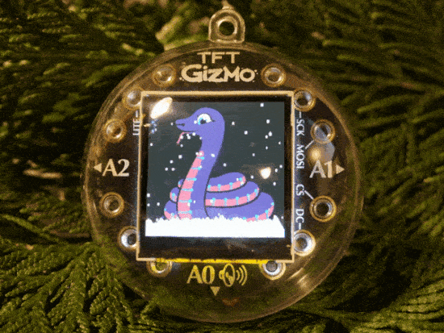
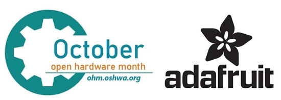
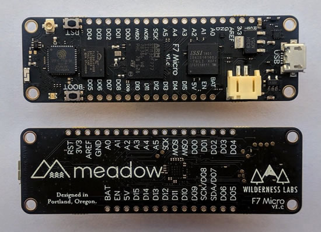
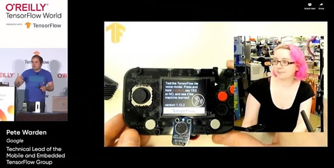
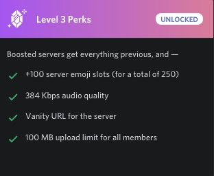

- [ ] update title
- [ ] Feature story
- [ ] Link "View this email in your browser."

View this email in your browser.

## Take Flight with Feather - Hackaday and Digi-Key

The Adafruit Feather is the latest platform for microcontroller development, and companies like Particle, Sparkfun, and Seeed Studios are producing Feather-compatible devices for development and prototyping. Now it’s your turn. Design a board to fit in the Feather ecosystem and we’ll manufacture it. The best project in the Take Flight With Feather contest will be sent off to pick and place machines and head straight to the Digi-Key warehouse!

To get started, take a look at the current [Feather ecosystem](https://learn.adafruit.com/adafruit-feather/community-feathers-wings) and get acquainted with the [GitHub repo filled with examples and tutorials](https://github.com/adafruit/awesome-feather).

For the Take Flight With Feather contest, we’re looking for the cool, the useful, the insane, and the practical. Most of all, we’re looking for manufacturability. Electron savant Lady Ada will be judging each board on the basis of manufacturability, with the best board moving on to the assembly line where it will be stocked at Digi-Key.

**What’s a good design? We’re looking for submissions in the following categories:**

*   The Weirdest Feather — What’s the most ridiculous expansion board you can come up with?
*   You’ll Cut Yourself On That Edge — We’re surrounded with bleeding-edge tech, what’s the coolest use of new technology?
*   Retro Feather — Old tech lives on, but can you design a Feather to interact with it? Is it even possible to build a vampire Ethernet tap or an old acoustically-coupled modem?
*   Assistive Tech — Build a Feather to help others. Use technology to improve lives.
*   Wireless Feather — Add a new wireless technology to the Feather ecosystem.

The winning entry overall will be chosen for manufacturability, and will win a small manufacturing run of 100 boards or less and be stocked at Digi-Key. The number of boards in the manufacturing run will be determined by the winning design. Note: Because of the small run initially, there will be no profit or margin for the first few boards. If the board is well accepted and a larger run is planned, then a longer term business model will be addressed. The 5 winners in the 5 categories above will receive $100 Tindie gift certificates. To get started, start a project on [hackaday.io](http://hackaday.io) and upload your project. Contest runs noon November 1 to noon December 31st. All times are in Pacific Standard Time.

Stop by [hackaday.io for more details](https://hackaday.io/contest/168107-take-flight-with-feather)!

## Circuit Playground TFT Gizmo Snow Globe with CircuitPython

In this guide learn how to use a Circuit Playground Bluefruit along with a TFT Gizmo to create a digital version of a snow globe. It will display customizable snow globe goodness on the TFT. Set a custom background, create custom snow flakes, and of course shake to clear the snow globe and start it all over - [learn.adafruit.com](https://learn.adafruit.com/circuit-playground-tft-gizmo-snow-globe/)

## All 35 posts from Open hardware month in one spot

October 2019 was/is [open-source hardware month](https://ohm.oshwa.org/)! Every single day in October we posted up some open-source stories from the last decade (and more!) about open-source hardware, open-source software, interviews, stats, and more. [Here are all 35 posts in one spot, enjoy](https://blog.adafruit.com/2019/10/31/all-35-posts-from-open-hardware-month-in-one-spot-ohm2019-oshwa-ohsummit-opensource-opensourcehardware-opensourceorg-adafruit/)!

*   [Open source hardware month with Michael Weinberg](https://blog.adafruit.com/2019/10/31/open-source-hardware-month-with-michael-weinberg-mweinberg2d-nyuengelberg-ohm2019-oshwa-ohsummit-opensource-opensourcehardware-opensourceorg/) - Day 31, 10/31/2019.
*   [Hackaday and Hackaday.io communities for open hardware makers](https://blog.adafruit.com/2019/10/31/hackaday-and-hackaday-io-communities-for-open-hardware-makers-hackaday-hackadayio-sophikravitz-supplyframe-hackchats-ohm2019-oshwa-ohsummit-opensource-opensourcehardware-opensourceorg/) - Day 31, 10/31/2019.
*   [Why open hardware needs open software - and more from Wayne Stambaugh of KiCad](https://blog.adafruit.com/2019/10/31/why-open-hardware-needs-open-software-and-more-from-wayne-stambaugh-of-kicad-kicad_pcb-snap_eda-ohm2019-oshwa-ohsummit-opensource-opensourcehardware-opensourceorg/) - Day 31, 10/31/2019.
*   [OSH Park the purple PCBs that fuel open hardware](https://blog.adafruit.com/2019/10/31/osh-park-the-purple-pcbs-that-fuel-open-hardware-oshpark-laen-pdp7-ohm2019-oshwa-ohsummit-opensource-opensourcehardware-opensourceorg/) - Day 31, 10/31/2019.
*   [Open source hardware: The problems and promise](https://blog.adafruit.com/2019/10/31/open-source-hardware-the-problems-and-promise-ohm2019-oshwa-ohsummit-opensource-opensourcehardware-opensourceorg-mjasay-techrepublic/) - Day 31, 10/31/2019.
*   [Crowd Supply - Bringing original, useful, respectful hardware to life](https://blog.adafruit.com/2019/10/30/crowd-supply-bringing-original-useful-respectful-hardware-to-life-crowd_supply-ohm2019-oshwa-ohsummit-opensource-opensourcehardware-opensourceorg/) - Day 30, 10/30/2019
*   [What does Open Source Hardware mean to Tindie?](https://blog.adafruit.com/2019/10/29/what-does-open-source-hardware-mean-to-tindie-tindie-ohm2019-oshwa-ohsummit-opensource-opensourcehardware-opensourceorg/) - Day 29, 10/29/2019.
*   [Talking with Andrew "bunnie" Huang](https://blog.adafruit.com/2019/10/28/talking-with-andrew-bunnie-huang-ohm2019-oshwa-bunniestudios-ohsummit-opensource-opensourcehardware-opensourceorg-adafruit/) - Day 28, 10/28/2019.
*   [DIY Drones, which launched the largest open UAV communities](https://blog.adafruit.com/2019/10/27/diy-drones-worlds-largest-uav-community-diydrones-chr1sa-ohm2019-oshwa-ohsummit-opensource-opensourcehardware-opensourceorg-adafruit/) - Day 27, 10/27/2019.
*   [OLIMEX open-source hardware made in Bulgaria](https://blog.adafruit.com/2019/10/26/olimex-open-source-hardware-made-in-bulgaria-olimex-ohm2019-oshwa-ohsummit-opensource-opensourcehardware-opensourceorg-adafruit/) - Day 26, 10/26/2019.
*   [Electronic Cats – Open hardware made in México](https://blog.adafruit.com/2019/10/25/electronic-cats-open-hardware-made-in-mxico-ohm2019-oshwa-ohsummit-opensource-opensourcehardware-opensourceorg-adafruit-electronicats/) - Day 25, 10/25/2019.
*   [10 years ago we tried to make an open source flash light to make us puke ...](https://blog.adafruit.com/2019/10/24/10-years-ago-we-tried-to-make-an-open-source-flash-light-to-make-us-puke-ohm2019-oshwa-ohsummit-opensource-opensourcehardware-opensourceorg-adafruit-dhsgov-bedazzler/) - Day 24, 10/24/2019.
*   [Evil Mad Scientist Laboratories](https://blog.adafruit.com/2019/10/24/evil-mad-scientist-laboratories-ohm2019-oshwa-ohsummit-opensource-opensourcehardware-opensourceorg-emsl/) - Day 23, 10/23/2019.
*   [MicroPython, bringing Python to hardware for everyone](https://blog.adafruit.com/2019/10/22/micropython-bringing-python-to-hardware-for-everyone-ohm2019-oshwa-ohsummit-opensource-opensourcehardware-opensourceorg-micropython-micropython/) - Day 22, 10/22/2019.
*   [Open Hardware Month Hack Chat at Hackaday.io](https://blog.adafruit.com/2019/10/21/open-hardware-month-hack-chat-at-hackaday-io-ohm2019-oshwa-ohsummit-opensource-opensourcehardware-opensourceorg-mweinberg2d-hackaday-hackadayio/) - Day 21, 10/21/2019.
*   [Parallax Open-source hardware](https://blog.adafruit.com/2019/10/20/parallax-open-source-hardware-ohm2019-oshwa-ohsummit-opensource-opensourcehardware-opensourceorg-parallaxinc/) - Day 20, 10/20/2019.
*   [Growing Your Open Business - A Digital Meetup for Open Hardware Month](https://blog.adafruit.com/2019/10/19/growing-your-open-business-a-digital-meetup-for-open-hardware-month-ohm2019-oshwa-ohsummit-opensource-opensourcehardware-opensourceorg-harriskenny-shawnhymel/) - Day 19, 10/19/2019.
*   [Open-source hardware at the Museum of Modern Art](https://blog.adafruit.com/2019/10/19/open-source-hardware-at-the-museum-of-modern-art-newmoma-momaps1-museummodernart-ohm2019-oshwa-ohsummit-opensource-opensourcehardware-opensourceorg/), posted on 10/19/2019 - Day 18, 10/18/2019.
*   [Open Hardware Licenses CC BY-SA, CERN, TAPR](https://blog.adafruit.com/2019/10/17/open-hardware-licenses-cc-by-sa-cern-tapr-ohm2019-oshwa-ohsummit-opensource-opensourcehardware-opensourceorg-creativecommons-cern/) ... - Day 17, 10/17/2019.
*   [Open Source Hardware Month at SparkFun](https://blog.adafruit.com/2019/10/16/open-source-hardware-month-at-sparkfun-video-sparkfun-ohm2019-oshwa-ohsummit-opensource-opensourcehardware-opensourceorg/) - Day 16, 10/16/2019.
*   [How many Open-Source Prusa 3D printers are there? Posted on 10/19/2019](https://blog.adafruit.com/2019/10/19/how-many-open-source-prusa-3d-printers-are-there-ohm2019-oshwa-ohsummit-opensource-opensourcehardware-opensourceorg-prusa3d/) - Day 15, 10/15/2019.
*   [The RepRap Project Self-Replicating Open-Source 3D Printing](https://blog.adafruit.com/2019/10/14/the-reprap-project-self-replicating-open-source-3d-printing-reprap-reprapltd-adrianbowyer-ohm2019-oshwa-ohsummit-opensource-opensourcehardware-opensourceorg/) - Day 14, 10/13/2019.
*   [The first 2 orders at Adafruit... now up to 2,161,166 orders](https://blog.adafruit.com/2019/10/13/the-first-2-orders-at-adafruit-now-up-to-2161166-orders-adafruit-ohm2019-oshwa-ohsummit-opensource-opensourcehardware-opensourceorg/) - Day 13, 10/13/2019.
*   [Photos of the first Arduino (2005)](https://blog.adafruit.com/2019/10/12/photos-of-the-first-arduino-2005-adafruit-ohm2019-oshwa-ohsummit-opensource-opensourcehardware-opensourceorg-arduino-arduino-wiringproject/) - Day 12, 10/12 2019.
*   [In 2010 there were 13 Open Source Hardware companies that were making $1 million or more](https://blog.adafruit.com/2019/10/11/in-2010-there-were-13-open-source-hardware-companies-that-were-making-1-million-or-more-adafruit-ohm2019-oshwa-ohsummit-opensource-opensourcehardware-oreillymedia-foocamp/)... - Day 11, 10/11/2019
*   [Opening Hardware 2010 at Eyebeam in NYC](https://blog.adafruit.com/2019/10/10/opening-hardware-2010-at-eyebeam-in-nyc-eyebeamnyc-adafruit-ohm2019-oshwa-ohsummit-opensource-opensourcehardware/) - Day 10, 10/10/2019.
*   [The Open Source Gift Guide, the early years](https://blog.adafruit.com/2019/10/10/the-open-source-gift-guide-the-early-years-adafruit-ohm2019-oshwa-ohsummit-opensource-opensourcehardware/) - Day 9, 10/9/2019 (posted it on 10/10/2019, whoops)
*   [Before the iPhone, before the Raspberry Pi, before Amazon Echo Show, there was Chumby](https://blog.adafruit.com/2019/10/08/before-the-iphone-before-the-raspberry-pi-before-amazon-echo-show-there-was-chumby-chumby-chumby-adafruit-ohm2019-oshwa-ohsummit-opensource-opensourcehardware/) - Day 8, 10/8/2019.
*   [Mitch Altman Open-source hardware pioneer](https://blog.adafruit.com/2019/10/07/mitch-altman-open-source-hardware-pioneer-maltman23-adafruit-ohm2019-oshwa-ohsummit-opensource-opensourcehardware-opensourceorg/) - Day 7, 10/7/2019.
*   [The Open Source logo(s)](https://blog.adafruit.com/2019/10/06/the-open-source-logos-adafruit-ohm2019-oshwa-ohsummit-opensource-opensourcehardware-opensourceorg/) - Day 6, 10/6/2019.
*   [Open Source Hardware events all month long, EVENTS!](https://blog.adafruit.com/2019/10/05/open-source-hardware-events-all-month-long-adafruit-ohm2019-oshwa-ohsummit-opensource-opensourcehardware-opensourceorg/) - Day 5, 10/5/2019.
*   [Open Source Hardware Certifications and more!](https://blog.adafruit.com/2019/10/04/open-source-hardware-certifications-and-more-adafruit-ohm2019-oshwa-ohsummit-opensource-opensourcehardware-opensourceorg-mweinberg2d-make-realsexycyborg/) - Day 4, 10/4/2019.
*   [Teuthis Open Source MP3 Player 2001 – Daisy by Raphael Abrams](https://blog.adafruit.com/2019/10/03/teuthis-open-source-mp3-player-2001-daisy-by-raphael-abrams-adafruit-ohm2019-oshwa-ohsummit-opensource-opensourcehardware-opensourceorg-nycresistor/) - Day 3, 10/3/2019.
*   [What is the Open-Source Hardware Definition?](https://blog.adafruit.com/2019/10/02/what-is-the-open-source-hardware-definition-adafruit-ohm2019-oshwa-ohsummit-opensource-opensourcehardware-opensourceorg/) - Day 2, 10/2/2019.
*   [Open hardware summit – Limor “Ladyada” Fried keynote 2010](https://blog.adafruit.com/2019/10/01/open-hardware-summit-limor-ladyada-fried-keynote-2010-adafruit-ohm2019-oshwa-ohsummit-opensource-opensourcehardware-opensourceorg/) - Day 1, 10/1/2019.

## News from around the web!

micropython-ulab is a numpy-like fast vector module for micropython - [GitHub](https://github.com/v923z/micropython-ulab), and [documentation](https://micropython-ulab.readthedocs.io/en/latest/).

Feather takes flight with the Meadow F7 Micro Development Kit – [Wilderness Labs](https://store.wildernesslabs.co/products/meadow-f7).

TensorFlow Lite: Solution for running ML on-device with Pete Warden at TensorFlow World using Adafruit hardware - [YouTube](https://youtu.be/Iv3BJzzk-HE).

HOW TO – Burn bootloader Arduino nano 33 BLE - [djynet](http://djynet.net/?p=969).

#ICYDNCI What was the most popular, most clicked link, in [last week's newsletter](https://www.adafruitdaily.com/2019/10/29/circuitpython-snakes-its-way-to-the-sony-spresense-sparkfun-qwiic-micro-and-arduino-nano-33-ble-sense-python-adafruit-circuitpython-pythonhardware-circuitpython-micropython-thepsf-adafruit/)? [CircuitPython on the SONY Spresense](https://circuitpython.org/board/spresense/).

## Coming soon

## New Learn Guides!

[Circuit Playground Bluefruit Pumpkin with Lights and Sounds](https://learn.adafruit.com/pumpkin-with-circuit-playground-bluefruit) from [Noe and Pedro](https://learn.adafruit.com/users/pixil3d)

## Updated Guides - Now With More Python!

**You can use CircuitPython libraries on Raspberry Pi!** We're updating all of our CircuitPython guides to show how to wire up sensors to your Raspberry Pi, and load the necessary CircuitPython libraries to get going using them with Python. We'll be including the updates here so you can easily keep track of which sensors are ready to go. Check it out!

Keep checking back for more updated guides!

## CircuitPython Libraries!

CircuitPython support for hardware continues to grow. We are adding support for new sensors and breakouts all the time, as well as improving on the drivers we already have. As we add more libraries and update current ones, you can keep up with all the changes right here!

For the latest drivers, download the [Adafruit CircuitPython Library Bundle](https://circuitpython.org/libraries).

If you'd like to contribute, CircuitPython libraries are a great place to start. Have an idea for a new driver? File an issue on [CircuitPython](https://github.com/adafruit/circuitpython/issues)! Interested in helping with current libraries? Check out the [CircuitPython.org Contributing page](https://circuitpython.org/contributing). We've included open pull requests and issues from the libraries, and details about repo-level issues that need to be addressed. We have a guide on [contributing to CircuitPython with Git and Github](https://learn.adafruit.com/contribute-to-circuitpython-with-git-and-github) if you need help getting started. You can also find us in the #circuitpython channel on the [Adafruit Discord](https://adafru.it/discord). Feel free to contact Kattni (@kattni) with any questions.

You can check out this [list of all the CircuitPython libraries and drivers available](https://github.com/adafruit/Adafruit_CircuitPython_Bundle/blob/master/circuitpython_library_list.md). 

The current number of CircuitPython libraries is **193**!

**Updated Libraries!**

Here's this week's updated CircuitPython libraries:

 * [Adafruit_CircuitPython_RGB_Display](https://github.com/adafruit/Adafruit_CircuitPython_RGB_Display)
 * [Adafruit_CircuitPython_VEML7700](https://github.com/adafruit/Adafruit_CircuitPython_VEML7700)
 * [Adafruit_CircuitPython_TestRepo](https://github.com/adafruit/Adafruit_CircuitPython_TestRepo)
 * [Adafruit_CircuitPython_RGBLED](https://github.com/adafruit/Adafruit_CircuitPython_RGBLED)
 * [Adafruit_CircuitPython_ATECC](https://github.com/adafruit/Adafruit_CircuitPython_ATECC)
 * [Adafruit_CircuitPython_PCD8544](https://github.com/adafruit/Adafruit_CircuitPython_PCD8544)

**PyPI Download Stats!**

We've written a special library called Adafruit Blinka that makes it possible to use CircuitPython Libraries on [Raspberry Pi and other compatible single-board computers](https://learn.adafruit.com/circuitpython-on-raspberrypi-linux/). Adafruit Blinka and all the CircuitPython libraries have been deployed to PyPI for super simple installation on Linux! Here are the top 10 CircuitPython libraries downloaded from PyPI in the last week, including the total downloads for those libraries:

| Library                                     | Last Week   | Total |   
|:-------                                     |:--------:   |:-----:|   
| Adafruit-Blinka                             | 1465        | 44284 |   
| Adafruit_CircuitPython_BusDevice            | 694         | 25876 |   
| Adafruit_CircuitPython_MCP230xx             | 260         | 9377 |    
| Adafruit_CircuitPython_Register             | 143         | 5994 |    
| Adafruit_CircuitPython_LIS3DH               | 133         | 2675 |    
| Adafruit_CircuitPython_NeoPixel             | 129         | 5369 |    
| Adafruit_CircuitPython_ServoKit             | 123         | 3239 |    
| Adafruit_CircuitPython_PCA9685              | 114         | 4051 |    
| Adafruit_CircuitPython_framebuf             | 107         | 2177 |    
| Adafruit_CircuitPython_TestRepo             | 100         | 101 |    

## Upcoming events!

Hackaday Superconference is November 15th, 16th, and 17th in Pasadena, California, USA. The Hackaday Superconference is returning for another 3 full days of technical talks, badge hacking, and hands-on workshops: [Eventbrite](https://www.eventbrite.com/e/hackaday-superconference-2019-tickets-60129236164?aff=0626com
) & [hackaday.io](https://hackaday.io/superconference/)

April 15-23, 2020, Pittsburgh, Pennsylvania - The PyCon 2020 conference, which will take place in Pittsburgh, is the largest annual gathering for the community using and developing the open-source Python programming language. It is produced and underwritten by the Python Software Foundation, the 501(c)(3) nonprofit organization dedicated to advancing and promoting Python. Through PyCon, the PSF advances its mission of growing the international community of Python programmers - [PyCon 2020](https://us.pycon.org/2020/).

## Latest releases

CircuitPython's stable release is [4.1.0](https://github.com/adafruit/circuitpython/releases/latest) and its unstable release is [5.0.0-alpha.4](https://github.com/adafruit/circuitpython/releases). New to CircuitPython? Start with our [Welcome to CircuitPython Guide](https://learn.adafruit.com/welcome-to-circuitpython).

[2019####](https://github.com/adafruit/Adafruit_CircuitPython_Bundle/releases/latest) is the latest CircuitPython library bundle.

[v1.11](https://micropython.org/download) is the latest MicroPython release. Documentation for it is [here](http://docs.micropython.org/en/latest/pyboard/).

[3.8.0](https://www.python.org/downloads/) is the latest Python release. The latest pre-release version is [#.#.#](https://www.python.org/download/pre-releases/).

[1448 Stars](https://github.com/adafruit/circuitpython/stargazers) Like CircuitPython? [Star it on GitHub!](https://github.com/adafruit/circuitpython)

## Call for help – CircuitPython messaging to other languages!

We [recently posted on the Adafruit blog](https://blog.adafruit.com/2018/08/15/help-bring-circuitpython-messaging-to-other-languages-circuitpython/) about bringing CircuitPython messaging to other languages, one of the exciting features of CircuitPython 4.x is translated control and error messages. Native language messages will help non-native English speakers understand what is happening in CircuitPython even though the Python keywords and APIs will still be in English. If you would like to help, [please post](https://github.com/adafruit/circuitpython/issues/1098) to the main issue on GitHub and join us on [Discord](https://adafru.it/discord).

We made this graphic with translated text, we could use your help with that to make sure we got the text right, please check out the text in the image – if there is anything we did not get correct, please let us know. Dan sent me this [handy site too](http://helloworldcollection.de/#Human).

## jobs.adafruit.com - Find a dream job, find great candidates!

[jobs.adafruit.com](https://jobs.adafruit.com/) has returned and folks are posting their skills (including CircuitPython) and companies are looking for talented makers to join their companies - from Digi-Key, to Hackaday, Microcenter, Raspberry Pi and more.

## 14,758 thanks!

The Adafruit Discord community, where we do all our CircuitPython development in the open, reached over 14,758 humans, thank you! Join today! [https://adafru.it/discord](https://adafru.it/discord)

Discord now offers "server boosts". We have 12 on our server (level 2) and if we get to 50 boosts we get to level 3 and some other good features for the community: +100 emojis for a total of 250, 384 Kbps audio, vanity URL, 100 mb uploads for all members (and all the things we have now, like the server banner). Stop by and boost! [https://adafru.it/discord](https://adafru.it/discord).

## ICYMI - In case you missed it

The wonderful world of Python on hardware! This is our first video-newsletter-podcast that we’ve started! The news comes from the Python community, Discord, Adafruit communities and more. It’s part of the weekly newsletter, then we have a segment on ASK an ENGINEER and this is the video slice from that! The complete Python on Hardware weekly videocast [playlist is here](https://www.youtube.com/playlist?list=PLjF7R1fz_OOXRMjM7Sm0J2Xt6H81TdDev). 

This video podcast is on [iTunes](https://itunes.apple.com/us/podcast/python-on-hardware/id1451685192?mt=2), [YouTube](https://www.youtube.com/playlist?list=PLjF7R1fz_OOXRMjM7Sm0J2Xt6H81TdDev), [IGTV (Instagram TV](https://www.instagram.com/adafruit/channel/)), and [XML](https://itunes.apple.com/us/podcast/python-on-hardware/id1451685192?mt=2).

[Weekly community chat on Adafruit Discord server CircuitPython channel - Audio / Podcast edition](https://itunes.apple.com/us/podcast/circuitpython-weekly-meeting/id1451685016) - Audio from the Discord chat space for CircuitPython, meetings are usually Mondays at 2pm ET, this is the audio version on [iTunes](https://itunes.apple.com/us/podcast/circuitpython-weekly-meeting/id1451685016), Pocket Casts, [Spotify](https://adafru.it/spotify), and [XML feed](https://adafruit-podcasts.s3.amazonaws.com/circuitpython_weekly_meeting/audio-podcast.xml).

And lastly, we are working up a one-spot destination for all things podcast-able here - [podcasts.adafruit.com](https://podcasts.adafruit.com/)

## Codecademy "Learn Hardware Programming with CircuitPython"

Codecademy, an online interactive learning platform used by more than 45 million people, has teamed up with the leading manufacturer in STEAM electronics, Adafruit Industries, to create a coding course, "Learn Hardware Programming with CircuitPython". The course is now available in the [Codecademy catalog](https://www.codecademy.com/learn/learn-circuitpython?utm_source=adafruit&utm_medium=partners&utm_campaign=circuitplayground&utm_content=pythononhardwarenewsletter).

Python is a highly versatile, easy to learn programming language that a wide range of people, from visual effects artists in Hollywood to mission control at NASA, use to quickly solve problems. But you don’t need to be a rocket scientist to accomplish amazing things with it. This new course introduces programmers to Python by way of a microcontroller — CircuitPython — which is a Python-based programming language optimized for use on hardware.

CircuitPython’s hardware-ready design makes it easier than ever to program a variety of single-board computers, and this course gets you from no experience to working prototype faster than ever before. Codecademy’s interactive learning environment, combined with Adafruit's highly rated Circuit Playground Express, present aspiring hardware hackers with a never-before-seen opportunity to learn hardware programming seamlessly online.

Whether for those who are new to programming, or for those who want to expand their skill set to include physical computing, this course will have students getting familiar with Python and creating incredible projects along the way. By the end, students will have built their own bike lights, drum machine, and even a moisture detector that can tell when it's time to water a plant.

Visit Codecademy to access the [Learn Hardware Programming with CircuitPython](https://www.codecademy.com/learn/learn-circuitpython?utm_source=adafruit&utm_medium=partners&utm_campaign=circuitplayground&utm_content=pythononhardwarenewsletter) course and Adafruit to purchase a [Circuit Playground Express](https://www.adafruit.com/product/3333).

Codecademy has helped more than 45 million people around the world upgrade their careers with technology skills. The company’s online interactive learning platform is widely recognized for providing an accessible, flexible, and engaging experience for beginners and experienced programmers alike. Codecademy has raised a total of $43 million from investors including Union Square Ventures, Kleiner Perkins, Index Ventures, Thrive Capital, Naspers, Yuri Milner and Richard Branson, most recently raising its $30 million Series C in July 2016.

## Contribute!

The CircuitPython Weekly Newsletter is a CircuitPython community-run newsletter emailed every Tuesday. The complete [archives are here](https://www.adafruitdaily.com/category/circuitpython/). It highlights the latest CircuitPython related news from around the web including Python and MicroPython developments. To contribute, edit next week's draft [on GitHub](https://github.com/adafruit/circuitpython-weekly-newsletter/tree/gh-pages/_drafts) and [submit a pull request](https://help.github.com/articles/editing-files-in-your-repository/) with the changes. Join our [Discord](https://adafru.it/discord) or [post to the forum](https://forums.adafruit.com/viewforum.php?f=60) for any further questions.
