- [ ] Link "View this email in your browser."

View this email in your browser.

## Arm AIoT Dev Summit December 2 – 3, 2019!

Arm AIoT Dev Summit, Mountain View, California, December 2 – 3, 2019. The Arm AIoT Dev Summit is a developer-focused conference that provides a platform for you to exchange knowledge, discuss real-world use cases and solutions, and get hands-on with expert-led, deep-dive training and workshops. 

[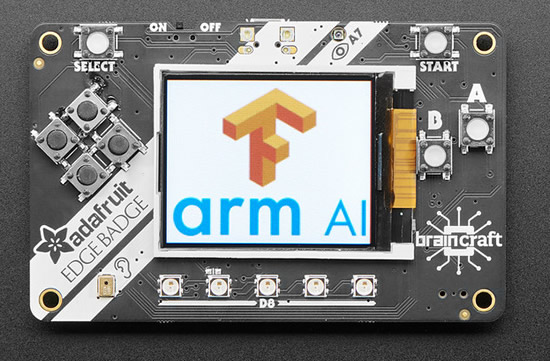](http://arm.com/AIoT-Dev-Summit)

Adafruit hardware will be there!

Along with like-minded developers, data scientists, and innovators, you will experience technologies enabling the Internet of Things (IoT), Artificial Intelligence (AI) and robotics. Get your hands on free hardware worth up to $500 [arm.com/AIoT-Dev-Summit](http://arm.com/AIoT-Dev-Summit)

**Fun things to do with the EDGE BADGE!**

*   TensorFlow Lite for EdgeBadge Quickstart - [Adafruit Learning System](https://learn.adafruit.com/tensorflow-lite-for-edgebadge-kit-quickstart).
*   Sine Wave Demo for EDGE BADGE - [Adafruit Learning System](https://learn.adafruit.com/tensorflow-lite-for-edgebadge-kit-quickstart/sine-wave-demo).
*   Play animated GIFs on the EDGE BADGE - [Adafruit Learning System](https://learn.adafruit.com/pyportal-animated-gif-display/quickstart).
*   NES Emulator for EDGE BADGE - [Adafruit Learning System](https://learn.adafruit.com/nes-emulator-for-arcada/quickstart).
*   AND it of course works with [MakeCode Arcade](https://arcade.makecode.com/)!

## Hackaday SuperCon recap!

Text.

## Sophi Kravitz keynote speaker – 2020 Open Hardware Summit

[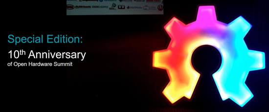](https://2020.oshwa.org/speakers/)

Sophi Kravitz keynote speaker – 2020 Open Hardware Summit –

>_"Sophi Kravitz is equal parts electronics engineer, playground ride designer, and artist. She works as the Director of Product at Supplyframe where she builds partnerships that bring the hardware community closer together. Recently, she put together short videos about the Badgelife phenomenon and Hardware Security. Her next project is a video on chip counterfeiting. As a main instigator of the Hackaday Superconference, she also champions many initiatives around gender equality and works behind the scenes on Hackaday.io. Her first conference talk was at OHS 2013, and she has attended all but one of the summits since."_

[Read more](https://2020.oshwa.org/speakers/).

## Explore Hardware (old and new) with CircuitPython

Scott presented about CircuitPython on GameBoys at the University of Washington in Bothell - [YouTube](https://youtu.be/NMKm5Zj31jU). This is recorded from his laptop during the presentation. Slides are available here - [GitHub](https://github.com/tannewt/presentations/blob/master/20191112-uwbothell/uwbothell-presentation.pdf).

## Take Flight with Feather - Hackaday and Digi-Key

The Adafruit Feather is the latest platform for microcontroller development, and companies like Particle, Sparkfun, and Seeed Studios are producing Feather-compatible devices for development and prototyping. Now it’s your turn. Design a board to fit in the Feather ecosystem and we’ll manufacture it. The best project in the Take Flight With Feather contest will be sent off to pick and place machines and head straight to the Digi-Key warehouse!

To get started, take a look at the current [Feather ecosystem](https://learn.adafruit.com/adafruit-feather/community-feathers-wings) and get acquainted with the [GitHub repo filled with examples and tutorials](https://github.com/adafruit/awesome-feather).

For the Take Flight With Feather contest, we’re looking for the cool, the useful, the insane, and the practical. Most of all, we’re looking for manufacturability. Electron savant Lady Ada will be judging each board on the basis of manufacturability, with the best board moving on to the assembly line where it will be stocked at Digi-Key.

**What’s a good design? We’re looking for submissions in the following categories:**

*   The Weirdest Feather — What’s the most ridiculous expansion board you can come up with?
*   You’ll Cut Yourself On That Edge — We’re surrounded with bleeding-edge tech, what’s the coolest use of new technology?
*   Retro Feather — Old tech lives on, but can you design a Feather to interact with it? Is it even possible to build a vampire Ethernet tap or an old acoustically-coupled modem?
*   Assistive Tech — Build a Feather to help others. Use technology to improve lives.
*   Wireless Feather — Add a new wireless technology to the Feather ecosystem.

The winning entry overall will be chosen for manufacturability, and will win a small manufacturing run of 100 boards or less and be stocked at Digi-Key. The number of boards in the manufacturing run will be determined by the winning design. Note: Because of the small run initially, there will be no profit or margin for the first few boards. If the board is well accepted and a larger run is planned, then a longer term business model will be addressed. The 5 winners in the 5 categories above will receive $100 Tindie gift certificates. To get started, start a project on [hackaday.io](http://hackaday.io) and upload your project. Contest runs noon November 1 to noon December 31st. All times are in Pacific Standard Time.

**Entries so far!**

There are over 25+ entries so far, from what we were told this contest has had the most entries, the fastest, for hackaday.io contests! Here they are in order of [how they are listed on the hackaday.io contest site](https://hackaday.io/submissions/take-flight-with-feather/list).

*   [PoE-FeatherWing](https://hackaday.io/project/168356-poe-featherwing). Like the Adafruit Ethernet FeatherWing, but with Power over Ethernet built-in! by Patrick Van OosterwijckPatrick Van Oosterwijck.
*   [SpiderWing](https://hackaday.io/project/19921-spiderwing) - Spider robot powered by Adafruit Feather boards and MicroPython by de∫hipu.
*   [u-blox ZED-F9P GPS Featherwing](https://hackaday.io/project/168499-u-blox-zed-f9p-gps-featherwing). A GPS Featherwing for the Adafruit Feather, using a high-precision GPS module from u-blox by sirmylesavery.
*   [MAX3421E FeatherWing](https://hackaday.io/project/161845-max3421e-featherwing) by davedarko.
*   [Cedar Grove RoverWing](https://hackaday.io/project/168481-cedar-grove-roverwing). A stackable, LiPo-powered interface for connecting the Adafruit Trinket M0 to the Feather ecosystem by Cedar.
*   [Keyboard FeatherWing](https://hackaday.io/project/165450-keyboard-featherwing). A FeatherWing with a LCD, BB Q10 keyboard and a 5-way button by arturo182.
*   [AD9833 Waveform Generator FeatherWing](https://hackaday.io/project/168261-ad9833-waveform-generator-featherwing). A frequency-precise sine/square/triangle waveform generator on a FeatherWing-compatible board by Cedar.
*   [u-blox SAM-M8Q GPS Featherwing](https://hackaday.io/project/168430-u-blox-sam-m8q-gps-featherwing). A GPS Featherwing for the Adafruit Feather, using a GPS module from u-blox. No external antenna required! by sirmylesavery.
*   [PewPew FeatherWing](https://hackaday.io/project/21578-pewpew-featherwing). A shield for Adafruit Feather boards with buttons and a LED matrix display, for simple games by de∫hipu.
*   [Feather Wing Isolated MOSFET driver](https://hackaday.io/project/168465-feather-wing-isolated-mosfet-driver). Drive MOSFET with proper signal and power isolation with any Feather boards by Dr.Stone.
*   [CNC FeatherWing](https://hackaday.io/project/167082-cnc-featherwing). A Feather-compatible CNC control board, requires Pololu stepper motor drivers by arturo182.
*   [Kick Tic Tac Toe](https://hackaday.io/project/113966-kick-tic-tac-toe). Practice penalties on wall, accurate your shot, shout out in the hall! by manaschhabra.
*   [Quadcopter FeatherWing for Huzzah32](https://hackaday.io/project/168441-quadcopter-featherwing-for-huzzah32). Let Huzzah32 fly by Iman.
*   [NeoPixel_HD Feather Wing](https://hackaday.io/project/168448-neopixelhd-feather-wing). Add-On Wing for Adafruit's feather boards - With a maximized number of neoPixels: A 22x9 RGB LED Matrix by Alex.
*   [KeyWing](https://hackaday.io/project/168395-keywing). A FeatherWing with three keyboard keys by de∫hipu.
*   [Sensing and display FeatherWing](https://hackaday.io/project/168308-sensing-and-display-featherwing). E-ink display with humidity, temperature, and airflow measurement with analog input terminal block & Grove header by CaptMcAllister.
*   [Pressure sensor shield for Feather](https://hackaday.io/project/168329-pressure-sensor-shield-for-feather). Pressure and temperature sensor with LED for pressure range indication. This fixture logs the pressure and temperature at a given time by Vikram Seshadri.
*   [OctoSonar FeatherWing](https://hackaday.io/project/168309-octosonar-featherwing). Drive 8 HC-SR04 Ultrasonic sensors from your Feather project by Alastair Young.
*   [RECORD Feather Wing](https://hackaday.io/project/168480-record-feather-wing). A simple Feather Wing for recording audio from an internal or external mic to an SD card by Asher Gomez.
*   [Battery FeatherWing](https://hackaday.io/project/21605-battery-featherwing). A shield for powering Adafruit Feather board by de∫hipu.
*   [GameWing](https://hackaday.io/project/168257-gamewing). This hack is a wing board for the Adafruit Huzzah32 providing game controller connectors, analog audio and video by bitluni.
*   [Gesture FeatherWing](https://hackaday.io/project/165011-gesture-featherwing). A daughterboard with a capacitive gesture sensor for the Adafruit Feather boards by de∫hipu.
*   [The GearsNGenes ADS1115 FeatherWing](https://hackaday.io/project/168276-the-gearsngenes-ads1115-featherwing). A device to enable more fun and experiments in circuit analysis by gearsNgenes.
*   [Cedar Grove Robot Friend FeatherWing](https://hackaday.io/project/168428-cedar-grove-robot-friend-featherwing). A passive FeatherWing adapter for stacking an Adafruit PyBadge or PyGamer onto a Crickit FeatherWing by Cedar.

Stop by [hackaday.io for more details](https://hackaday.io/contest/168107-take-flight-with-feather)!

## European Astro Pi Challenge - Python in space

[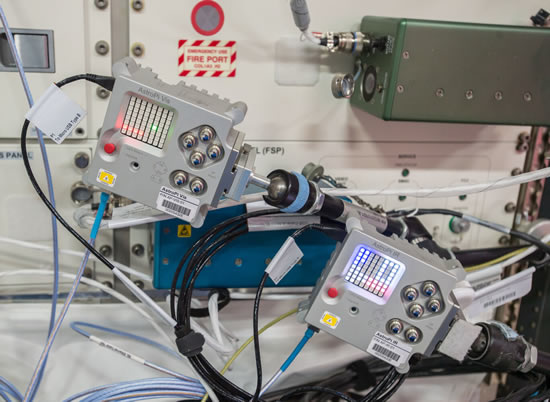](https://www.esa.int/Education/AstroPI/423_Teams_selected_for_phase_2_of_Astro_Pi_Mission_Space_Lab_2019_2020)

There were 545 entries from 23 countries for the European Astro Pi Challenge: Mission Space Lab! The 423 selected teams now get to write code for science experiments to be run on Astro Pis Ed and Izzy on the International Space Station! [esa.int](https://www.esa.int/Education/AstroPI/423_Teams_selected_for_phase_2_of_Astro_Pi_Mission_Space_Lab_2019_2020)

## News from around the web!

Articulated ears, Mog, Spaceballs style, made with Adafruit - [Twitter](https://twitter.com/resplendr/status/1195060466638176256).

[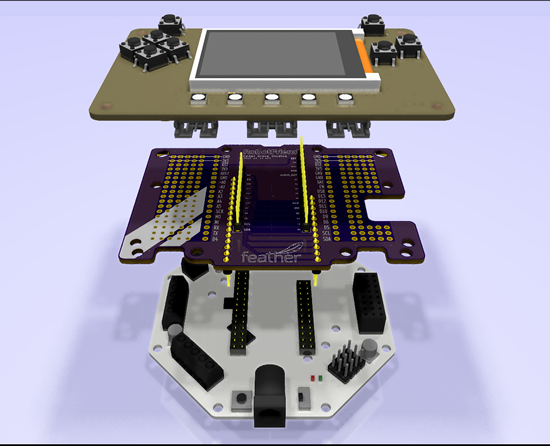](https://hackaday.io/project/168428-cedar-grove-robot-friend-featherwing)

Cedar Grove Robot Friend FeatherWing. A passive FeatherWing adapter for stacking an Adafruit PyBadge or PyGamer onto a Crickit FeatherWing - [hackaday.io](https://hackaday.io/project/168428-cedar-grove-robot-friend-featherwing)

[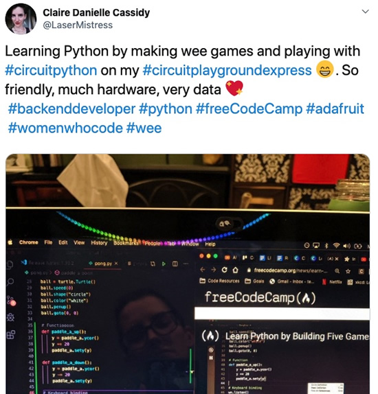](https://twitter.com/LaserMistress/status/1194315965309153280)

Claire is learning Python by making games and playing with CircuitPython _"So friendly, much hardware, very data"_ - [Twitter](https://twitter.com/LaserMistress/status/1194315965309153280).

Fabric coated with latex, Adafruit electronics - [Twitter](https://twitter.com/kuristinaakos/status/1195097631510450176).

[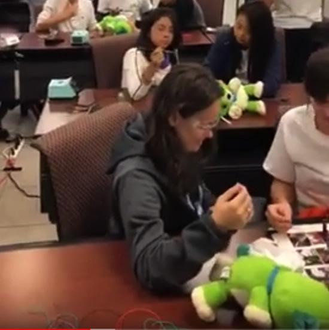](https://www.youtube.com/watch?v=5pz_72mZIpU)

[Bill from AT Makers](http://atmakers.org/) spent the day with GRiP, WECE, SHPE, Roaring Riptide and other groups adapting toys for Christmas on the University of Florida campus - [YouTube](https://www.youtube.com/watch?v=5pz_72mZIpU).

Prototype of Nightstalker goggles made with NeoPixels - [Instagram](https://www.instagram.com/p/B43QlZtHs-I/?igshid=fv5mgbj2li6d).

[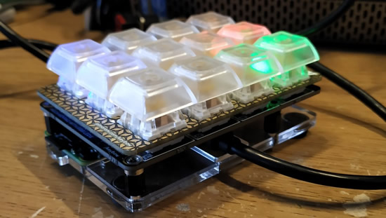](https://bigl.es/friday-fun-custom-obs-controller/)

OBS is ace, but it has SOOOO many things that it can do and when you are recording a video you need quick access to key features and so a custom controller is needed! - [bigl.es](https://bigl.es/friday-fun-custom-obs-controller/)

[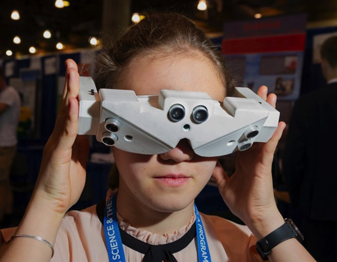](https://www.nationalgeographic.com/science/2019/10/girls-in-science-feature/)

For girls in science, the time is now. Programs in science, technology, engineering, and math are boosting a new generation of female students—and countering some familiar barriers to success - [National Geographic](https://www.nationalgeographic.com/science/2019/10/girls-in-science-feature/).

New SAMD51 [errata](https://www.microchip.com/mymicrochip/NotificationDetails.aspx?pcn=SYST-14HMIU815) and [PDF](https://www.microchip.com/mymicrochip/filehandler.aspx?ddocname=en599588). The change from previous errata doc is that they added that VREF temperature sensors are not supported (we did sorta get them to work, but not with the specified reference voltages).

Also there is now a Rev D of the silicon which does fix some of the other errata. They talk about EFP vs non-EFP versions: I haven't been able to figure out what "EFP" is.

Giant analog CO2 meter sweeps away doubt, [Instructables](https://www.instructables.com/id/Giant-Analog-CO2-Meter/) via [Hackaday](https://hackaday.com/2019/11/14/giant-analog-co2-meter-sweeps-away-doubt/).

MicroPython asyncio support coming soon - [GitHub](https://github.com/micropython/micropython/pull/5332). Looks like pycopy was refactored?

[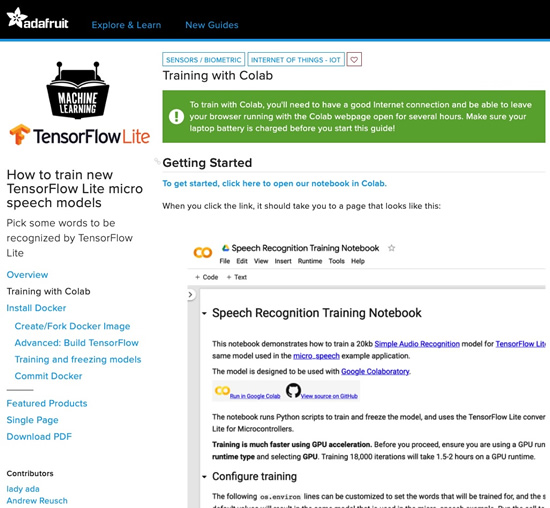](https://learn.adafruit.com/how-to-train-new-tensorflow-lite-micro-speech-models/training-with-colab)

We now have updated the guide to include a Colab script that can train in a webbrowser and upload the final training results to a Google Drive when complete – [learn more at the Adafruit Learning System](https://learn.adafruit.com/how-to-train-new-tensorflow-lite-micro-speech-models/training-with-colab)!

Take the Survey – a project of Nation of Makers, this is the 2019 Survey of Makerspaces, they’re looking for members and leaders of makerspaces (whether they be makerspaces, biospaces, hackerspaces, art spaces, you name it, wherever they are at) to fill out the annual survey so they can continue their work of creating a longitudinal dataset that tells them about the impacts that these spaces are having across the country and around the world - [Survey is here](https://makethedata.org/take-the-survey/).

[Mentorship Minute: Getting Un Stuck](https://anchor.fm/profitablepythonfm/episodes/Mentorship-Minute-Getting-Un-Stuck-e91k95). An episode of Profitable Python by Ben McNeill.

[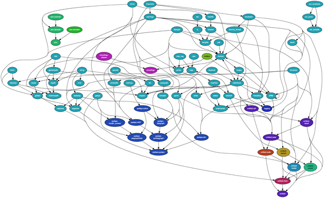](https://julien.danjou.info/dependencies-handling-in-python-automatic-update/)

[Dependencies Handling](https://julien.danjou.info/dependencies-handling-in-python-automatic-update/) in Python by Julien Danjou.

pip cheat sheet: Get to know the most useful pip commands to help you install, manage, and use Python software packages- [PDF](https://opensource.com/sites/default/files/gated-content/cheat_sheet_pip.pdf).

[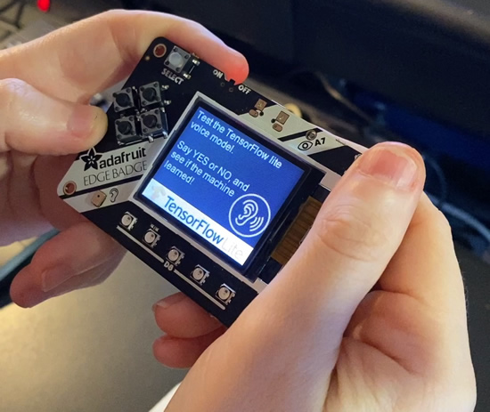](https://youtu.be/vzKFznrlPKM)

Trying out the EdgeBadge with TensorFlow micro speech demo - [YouTube](https://youtu.be/vzKFznrlPKM).

Overwatch Frankenzarya cannon - [Twitter](https://twitter.com/kuristinaakos/status/1194681300344606720).

[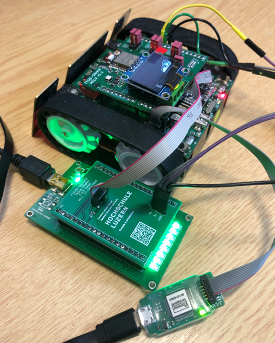](https://mcuoneclipse.com/2019/11/09/open-source-ftdi-ft2232-jtag-and-uart-adapter-board/)

Open Source FTDI FT2232 JTAG and UART Adapter Board - [MCU on Eclipse](https://mcuoneclipse.com/2019/11/09/open-source-ftdi-ft2232-jtag-and-uart-adapter-board/).

Reverse Engineering the iColor Flex Protocol - Back in the early 2000’s–at least a decade before there were Neopixels or WS2812b LEDs–Color Kinetics introduced flexible color changing LED string lights - [BikerGlen](https://bikerglen.com/blog/reverse-engineering-the-icolor-flex-protocol/).

[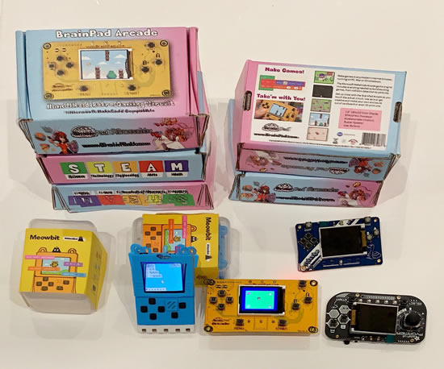](https://inventtolearn.com/dec12/)

Masterclass: Coding and Physical Computing, includes CircuitPython powered hardware, San Francisco, Dec 12th - [Invent to Learn](https://inventtolearn.com/dec12/).

Pwn the ESP32 Forever: Flash Encryption and Sec. Boot Keys Extraction - [LimitedResults](https://limitedresults.com/2019/11/pwn-the-esp32-forever-flash-encryption-and-sec-boot-keys-extraction/). And... Security Advisory concerning fault injection and eFuse protections - [Espressif](https://www.espressif.com/en/news/Security_Advisory_Concerning_Fault_Injection_and_eFuse_Protections).

[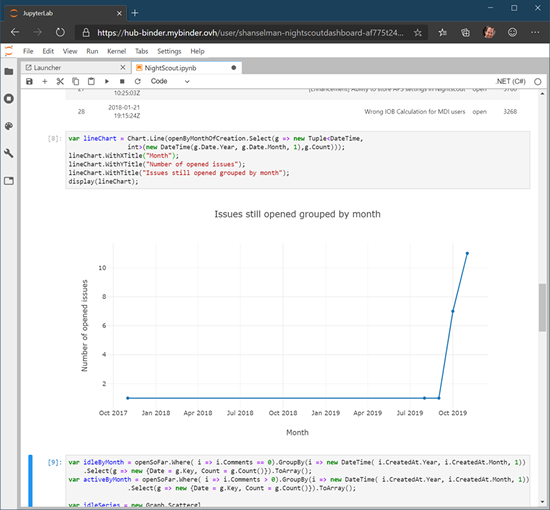](https://www.hanselman.com/blog/AnnouncingNETJupyterNotebooks.aspx)

.NET Jupyter Notebooks - [Scott Hanselman](https://www.hanselman.com/blog/AnnouncingNETJupyterNotebooks.aspx).

[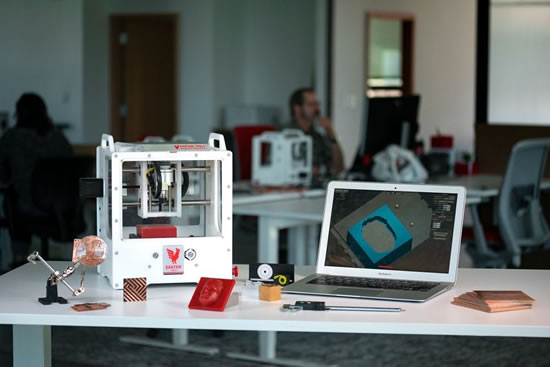](https://blog.adafruit.com/2019/11/15/bantam-tools-celebrating-new-peekskill-new-york-headquarters-with-ribbon-cutting-on-monday-november-18-2019-bantamtools-makerbusiness-bantamtools-cnc-digitalfabrication/)

[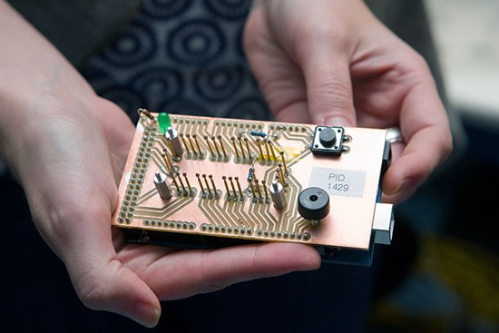](https://blog.adafruit.com/2019/11/15/bantam-tools-celebrating-new-peekskill-new-york-headquarters-with-ribbon-cutting-on-monday-november-18-2019-bantamtools-makerbusiness-bantamtools-cnc-digitalfabrication/)

Bantam Tools celebrating New Peekskill, New York, headquarters ... this is pretty cool, a NY based manufacturing company opening up. We use the Bantam Tools Desktop PCB Milling Machine everyday at [Adafruit](https://blog.adafruit.com/2019/11/15/bantam-tools-celebrating-new-peekskill-new-york-headquarters-with-ribbon-cutting-on-monday-november-18-2019-bantamtools-makerbusiness-bantamtools-cnc-digitalfabrication/).

[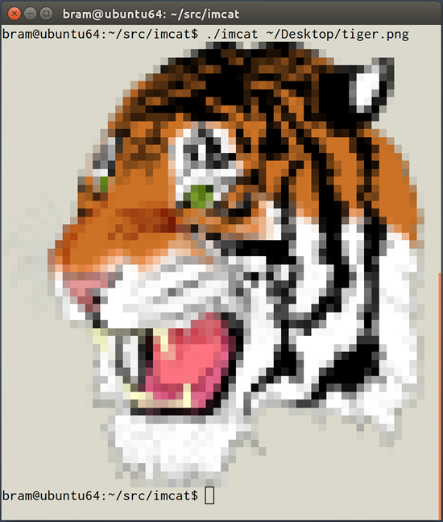](https://github.com/stolk/imcat)

imcat: Show any image in a terminal window - [GitHub](https://github.com/stolk/imcat).

Handy tip: How to Always Copy & Paste Text Without Formatting in Mac - [Makeuseof.com](https://www.makeuseof.com/tag/copy-paste-text-without-formatting-mac/)

[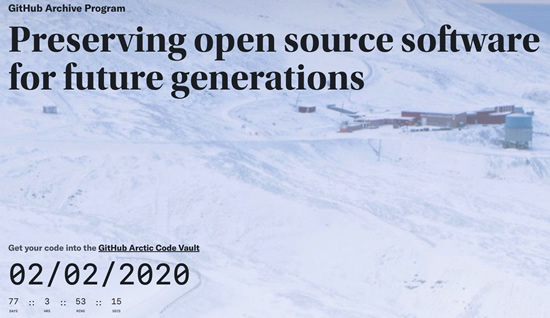](https://archiveprogram.github.com/)

GitHub Archive Program - Preserving open source software for future generations. Get your code into the GitHub Arctic Code Vault by 02/02/2020 - [GitHub](https://archiveprogram.github.com/).

From GitHub Universe - The new search experience gives you high relevance exact match results in your repository, with case sensitivity and whole word match, sign up here - [GitHub](https://github.com/features/code-search-exact-match/signup).

From GitHub Universe - Take the burden off any single contributor and distribute workload evenly across your team with code review assignment. Select round robin or load balance and they'll do the rest. Now available in public beta for users in organizations - [Twitter](https://twitter.com/github/status/1194673101117808653).

From GitHub Universe - GitHub for mobile. Review lines of code, chime in on a design discussion, merge changes, and more - [github.com/mobile](https://github.com/mobile)

[GitHub workflow easter egg](https://github.com/python/bedevere/blob/1cb400aaa8c891b7906b49bd60c9771828ca5cef/bedevere/stage.py#L53): On a PR, after making changes requested by a core dev, instead of writing "I have made the requested changes; please review again", one may instead write "I didn't expect the Spanish Inquisition" - [Twitter](https://twitter.com/TalEinat/status/1194541042810392576).

[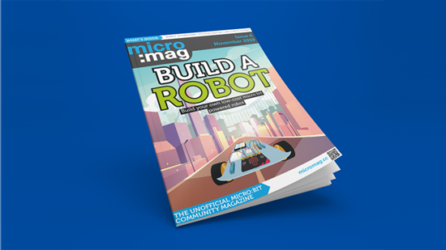](http://go.micromag.cc/issue6)

#ICYDNCI What was the most popular, most clicked link, in [last week's newsletter](https://www.adafruitdaily.com/2019/11/12/see-you-at-supercon-python-2-language-on-github-and-more-python-adafruit-circuitpython-pythonhardware-circuitpython-micropython-thepsf-adafruit/)? [micro:mag Issue #6 - Build a Robot](http://go.micromag.cc/issue6).

PyDev of the Week: Martin Uribe on [Mouse vs Python](https://www.blog.pythonlibrary.org/2019/11/18/pydev-of-the-week-martin-uribe/)

CircuitPython Weekly November 11th, 2019 [on YouTube](https://youtu.be/p9eCuCT6ygo).

## Coming soon

Bluetooth enabled, shake controlled interactive snow globe!  CircuitPython running on the Circuit Playground Bluefruit. Learn Guide coming soon - [Twitter](https://twitter.com/adafruit/status/1195140675425181702).

## New Learn Guides!

[Bluetooth Turtle Bot with CircuitPython and Crickit](https://learn.adafruit.com/bluetooth-turtle-bot-with-circuitpython-and-crickit) from [John Park](https://learn.adafruit.com/users/johnpark)

[No-Solder LED Disco Tie with Bluetooth](https://learn.adafruit.com/no-solder-circuit-playground-bluetooth-disco-tie) from [Collin Cunningham](https://learn.adafruit.com/users/collinmel)

[Musical Walking Stick with CircuitPlayground](https://learn.adafruit.com/musical-cane-walking-stick) from [Dano Wall](https://learn.adafruit.com/users/danowall)

[Quickstart using Adafruit eInk/ePaper displays with CircuitPython](https://learn.adafruit.com/quickstart-using-adafruit-eink-epaper-displays-with-circuitpython) from [Anne Barela](https://learn.adafruit.com/users/AnneBarela)

## Updated Guides - Now With More Python!

**You can use CircuitPython libraries on Raspberry Pi!** We're updating all of our CircuitPython guides to show how to wire up sensors to your Raspberry Pi, and load the necessary CircuitPython libraries to get going using them with Python. We'll be including the updates here so you can easily keep track of which sensors are ready to go. Check it out!

Keep checking back for more updated guides!

## CircuitPython Libraries!

CircuitPython support for hardware continues to grow. We are adding support for new sensors and breakouts all the time, as well as improving on the drivers we already have. As we add more libraries and update current ones, you can keep up with all the changes right here!

For the latest drivers, download the [Adafruit CircuitPython Library Bundle](https://circuitpython.org/libraries).

If you'd like to contribute, CircuitPython libraries are a great place to start. Have an idea for a new driver? File an issue on [CircuitPython](https://github.com/adafruit/circuitpython/issues)! Interested in helping with current libraries? Check out the [CircuitPython.org Contributing page](https://circuitpython.org/contributing). We've included open pull requests and issues from the libraries, and details about repo-level issues that need to be addressed. We have a guide on [contributing to CircuitPython with Git and Github](https://learn.adafruit.com/contribute-to-circuitpython-with-git-and-github) if you need help getting started. You can also find us in the #circuitpython channel on the [Adafruit Discord](https://adafru.it/discord). Feel free to contact Kattni (@kattni) with any questions.

You can check out this [list of all the CircuitPython libraries and drivers available](https://github.com/adafruit/Adafruit_CircuitPython_Bundle/blob/master/circuitpython_library_list.md). 

The current number of CircuitPython libraries is **196**!

**New Libraries!**

Here's this week's new CircuitPython libraries:

 * [Adafruit_CircuitPython_DisplayIO_SSD1305](https://github.com/adafruit/Adafruit_CircuitPython_DisplayIO_SSD1305)

**Updated Libraries!**

Here's this week's updated CircuitPython libraries:

 * [Adafruit_CircuitPython_framebuf](https://github.com/adafruit/Adafruit_CircuitPython_framebuf)
 * [Adafruit_CircuitPython_WS2801](https://github.com/adafruit/Adafruit_CircuitPython_WS2801)
 * [Adafruit_CircuitPython_RGB_Display](https://github.com/adafruit/Adafruit_CircuitPython_RGB_Display)
 * [Adafruit_CircuitPython_SSD1305](https://github.com/adafruit/Adafruit_CircuitPython_SSD1305)

**PyPI Download Stats!**

We've written a special library called Adafruit Blinka that makes it possible to use CircuitPython Libraries on [Raspberry Pi and other compatible single-board computers](https://learn.adafruit.com/circuitpython-on-raspberrypi-linux/). Adafruit Blinka and all the CircuitPython libraries have been deployed to PyPI for super simple installation on Linux! Here are the top 10 CircuitPython libraries downloaded from PyPI in the last week, including the total downloads for those libraries:

| Library                                     | Last Week   | Total |   
|:-------                                     |:--------:   |:-----:|   
| Adafruit-Blinka                             | 1283        | 43174 |   
| Adafruit_CircuitPython_BusDevice            | 718         | 26118 |   
| Adafruit_CircuitPython_MCP230xx             | 249         | 9580 |    
| Adafruit_CircuitPython_NeoPixel             | 174         | 5195 |    
| Adafruit_CircuitPython_Register             | 149         | 5713 |    
| Adafruit_CircuitPython_LIS3DH               | 122         | 2697 |    
| Adafruit_CircuitPython_PCA9685              | 116         | 3870 |    
| Adafruit_CircuitPython_ServoKit             | 110         | 3098 |    
| Adafruit_CircuitPython_PN532                | 108         | 1426 |    
| Adafruit_CircuitPython_Motor                | 101         | 4124 |    

## Upcoming events!

Arm AIoT Dev Summit, Mountain View, California, December 2 – 3, 2019. The Arm AIoT Dev Summit is a developer-focused conference that provides a platform for you to exchange knowledge, discuss real-world use cases and solutions, and get hands-on with expert-led, deep-dive training and workshops - [arm.com/AIoT-Dev-Summit](http://arm.com/AIoT-Dev-Summit)

April 15-23, 2020, Pittsburgh, Pennsylvania, USA - The PyCon 2020 conference, which will take place in Pittsburgh, is the largest annual gathering for the community using and developing the open-source Python programming language. It is produced and underwritten by the Python Software Foundation, the 501(c)(3) nonprofit organization dedicated to advancing and promoting Python. Through PyCon, the PSF advances its mission of growing the international community of Python programmers - [PyCon 2020](https://us.pycon.org/2020/).

## Latest releases

CircuitPython's stable release is [4.1.0](https://github.com/adafruit/circuitpython/releases/latest) and its unstable release is [5.0.0-alpha.5](https://github.com/adafruit/circuitpython/releases). New to CircuitPython? Start with our [Welcome to CircuitPython Guide](https://learn.adafruit.com/welcome-to-circuitpython).

[20191118](https://github.com/adafruit/Adafruit_CircuitPython_Bundle/releases/latest) is the latest CircuitPython library bundle.

[v1.11](https://micropython.org/download) is the latest MicroPython release. Documentation for it is [here](http://docs.micropython.org/en/latest/pyboard/).

[3.8.0](https://www.python.org/downloads/) is the latest Python release.

[1462 Stars](https://github.com/adafruit/circuitpython/stargazers) Like CircuitPython? [Star it on GitHub!](https://github.com/adafruit/circuitpython)

## Call for help – CircuitPython messaging to other languages!

We [recently posted on the Adafruit blog](https://blog.adafruit.com/2018/08/15/help-bring-circuitpython-messaging-to-other-languages-circuitpython/) about bringing CircuitPython messaging to other languages, one of the exciting features of CircuitPython 4.x is translated control and error messages. Native language messages will help non-native English speakers understand what is happening in CircuitPython even though the Python keywords and APIs will still be in English. If you would like to help, [please post](https://github.com/adafruit/circuitpython/issues/1098) to the main issue on GitHub and join us on [Discord](https://adafru.it/discord).

We made this graphic with translated text, we could use your help with that to make sure we got the text right, please check out the text in the image – if there is anything we did not get correct, please let us know. Dan sent me this [handy site too](http://helloworldcollection.de/#Human).

## jobs.adafruit.com - Find a dream job, find great candidates!

[jobs.adafruit.com](https://jobs.adafruit.com/) has returned and folks are posting their skills (including CircuitPython) and companies are looking for talented makers to join their companies - from Digi-Key, to Hackaday, Microcenter, Raspberry Pi and more.

## 14,989 thanks!

The Adafruit Discord community, where we do all our CircuitPython development in the open, reached over 14,989 humans, thank you! Join today! [https://adafru.it/discord](https://adafru.it/discord)

Discord now offers “server boosts”. We have 31 on our server (level 3!), unlocking some good features for the community: +100 emojis for a total of 250, 384 Kbps audio, a vanity URL, 100 mb uploads for all members (and all the things we have now, like the server banner). Stop by and boost [adafru.it/discord](https://adafru.it/discord)!

## ICYMI - In case you missed it

[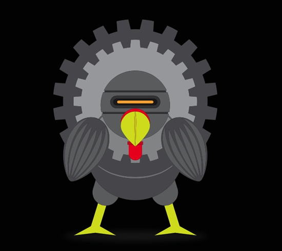](https://www.youtube.com/playlist?list=PLjF7R1fz_OOXRMjM7Sm0J2Xt6H81TdDev)

The wonderful world of Python on hardware! This is our first video-newsletter-podcast that we’ve started! The news comes from the Python community, Discord, Adafruit communities and more. It’s part of the weekly newsletter, then we have a segment on ASK an ENGINEER and this is the video slice from that! The complete Python on Hardware weekly videocast [playlist is here](https://www.youtube.com/playlist?list=PLjF7R1fz_OOXRMjM7Sm0J2Xt6H81TdDev). 

This video podcast is on [iTunes](https://itunes.apple.com/us/podcast/python-on-hardware/id1451685192?mt=2), [YouTube](https://www.youtube.com/playlist?list=PLjF7R1fz_OOXRMjM7Sm0J2Xt6H81TdDev), [IGTV (Instagram TV](https://www.instagram.com/adafruit/channel/)), and [XML](https://itunes.apple.com/us/podcast/python-on-hardware/id1451685192?mt=2).

[Weekly community chat on Adafruit Discord server CircuitPython channel - Audio / Podcast edition](https://itunes.apple.com/us/podcast/circuitpython-weekly-meeting/id1451685016) - Audio from the Discord chat space for CircuitPython, meetings are usually Mondays at 2pm ET, this is the audio version on [iTunes](https://itunes.apple.com/us/podcast/circuitpython-weekly-meeting/id1451685016), Pocket Casts, [Spotify](https://adafru.it/spotify), and [XML feed](https://adafruit-podcasts.s3.amazonaws.com/circuitpython_weekly_meeting/audio-podcast.xml).

And lastly, we are working up a one-spot destination for all things podcast-able here - [podcasts.adafruit.com](https://podcasts.adafruit.com/)

## Codecademy "Learn Hardware Programming with CircuitPython"

Codecademy, an online interactive learning platform used by more than 45 million people, has teamed up with the leading manufacturer in STEAM electronics, Adafruit Industries, to create a coding course, "Learn Hardware Programming with CircuitPython". The course is now available in the [Codecademy catalog](https://www.codecademy.com/learn/learn-circuitpython?utm_source=adafruit&utm_medium=partners&utm_campaign=circuitplayground&utm_content=pythononhardwarenewsletter).

Python is a highly versatile, easy to learn programming language that a wide range of people, from visual effects artists in Hollywood to mission control at NASA, use to quickly solve problems. But you don’t need to be a rocket scientist to accomplish amazing things with it. This new course introduces programmers to Python by way of a microcontroller — CircuitPython — which is a Python-based programming language optimized for use on hardware.

CircuitPython’s hardware-ready design makes it easier than ever to program a variety of single-board computers, and this course gets you from no experience to working prototype faster than ever before. Codecademy’s interactive learning environment, combined with Adafruit's highly rated Circuit Playground Express, present aspiring hardware hackers with a never-before-seen opportunity to learn hardware programming seamlessly online.

Whether for those who are new to programming, or for those who want to expand their skill set to include physical computing, this course will have students getting familiar with Python and creating incredible projects along the way. By the end, students will have built their own bike lights, drum machine, and even a moisture detector that can tell when it's time to water a plant.

Visit Codecademy to access the [Learn Hardware Programming with CircuitPython](https://www.codecademy.com/learn/learn-circuitpython?utm_source=adafruit&utm_medium=partners&utm_campaign=circuitplayground&utm_content=pythononhardwarenewsletter) course and Adafruit to purchase a [Circuit Playground Express](https://www.adafruit.com/product/3333).

Codecademy has helped more than 45 million people around the world upgrade their careers with technology skills. The company’s online interactive learning platform is widely recognized for providing an accessible, flexible, and engaging experience for beginners and experienced programmers alike. Codecademy has raised a total of $43 million from investors including Union Square Ventures, Kleiner Perkins, Index Ventures, Thrive Capital, Naspers, Yuri Milner and Richard Branson, most recently raising its $30 million Series C in July 2016.

## Contribute!

The CircuitPython Weekly Newsletter is a CircuitPython community-run newsletter emailed every Tuesday. The complete [archives are here](https://www.adafruitdaily.com/category/circuitpython/). It highlights the latest CircuitPython related news from around the web including Python and MicroPython developments. To contribute, edit next week's draft [on GitHub](https://github.com/adafruit/circuitpython-weekly-newsletter/tree/gh-pages/_drafts) and [submit a pull request](https://help.github.com/articles/editing-files-in-your-repository/) with the changes. Join our [Discord](https://adafru.it/discord) or [post to the forum](https://forums.adafruit.com/viewforum.php?f=60) for any further questions.
