- [ ] update title
- [ ] Link "View this email in your browser."

View this email in your browser.

## 200 CircuitPython Libraries!

[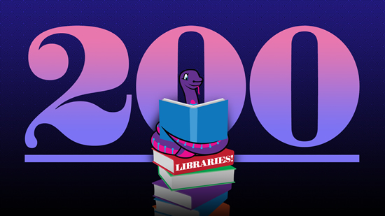](https://github.com/adafruit/Adafruit_CircuitPython_Bundle/blob/master/circuitpython_library_list.md)

The CircuitPython Library Bundle contains all current libraries available for CircuitPython.  CircuitPython libraries are separate files designed to work with CircuitPython code. CircuitPython programs require a lot of information to run. CircuitPython is so simple to use because most of this information is processed in the background and stored in libraries. Some libraries are built into CircuitPython. Others are downloaded and stored on your CIRCUITPY drive in a folder called lib.

The full list of all the CircuitPython libraries contained in the following bundles can be found on the libraries page.

And now there are 200! - [GitHub](https://github.com/adafruit/Adafruit_CircuitPython_Bundle/blob/master/circuitpython_library_list.md) and [circuitpython.org](https://circuitpython.org/libraries)

## CircuitPython snakes its way to Binho!

The [Binho Nova](https://binho.io/) is a Multi-Protocol USB host adapter with support for I2C, SPI, UART, 1-WIRE, SWI protocols all in one slim, robust package, and now it [supports](https://circuitpython.org/blinka/binho_nova/) [CircuitPython BLINKA](https://circuitpython.org/blinka)! - [binho.io](https://support.binho.io/learn-and-grow/binho-+-circuitpython)

## Control a MagicLight Plus Bluetooth Smart Light Bulb with CircuitPython

This module provides Services available on a [MagicLight Plus Bluetooth Smart Light Bulb](https://www.amazon.com/gp/product/B073S1KV4F/) - [GitHub](https://github.com/adafruit/Adafruit_CircuitPython_BLE/pull/40/files).

## CircuitPython Random Number Generator

[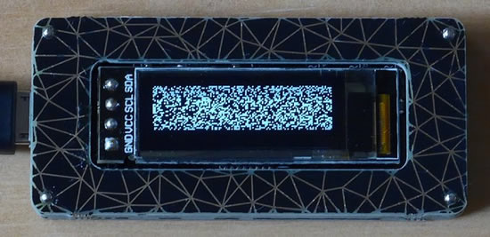](https://github.com/mitsake/rng-pcb/)

This is a CircuitPython based hardware random number generator that uses avalanche noise. Based on the Trinket M0 - [GitHub](https://github.com/mitsake/rng-pcb/), via [Twitter](https://twitter.com/_zak/status/1203088183824502784).

## CircuitPython slithers to the pages of MAKE Magazine!

[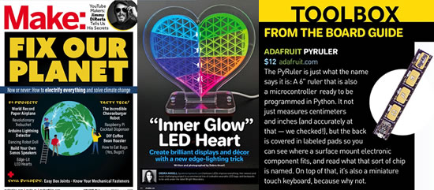](https://makezine.com/)

Make: Vol. 71 FIX OUR PLANET featuring CircuitPython! On page 82 is a CircuitPython powered edge-lit LED heart by Geek Mom Projects. AND! In TOOLBOX, the CircuitPython ruler from Digi-Key and Adafruit! - [Make Magazine](https://makezine.com/).

## ADABOX 14 in the wild

[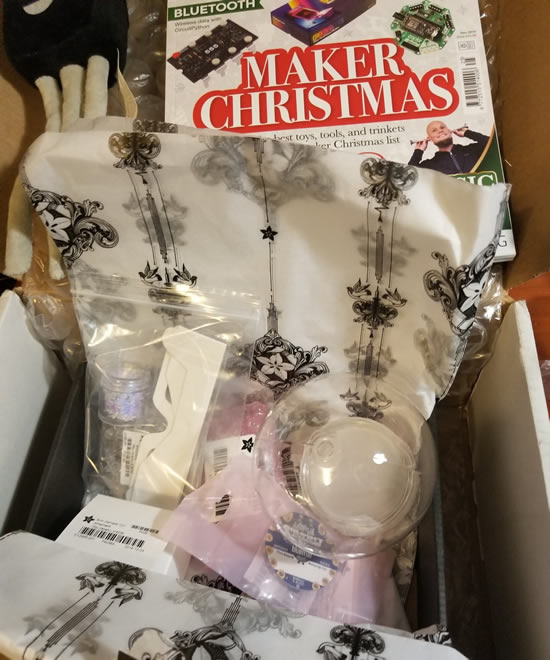](https://twitter.com/danjohnmitchell/status/1203098964125528064)

[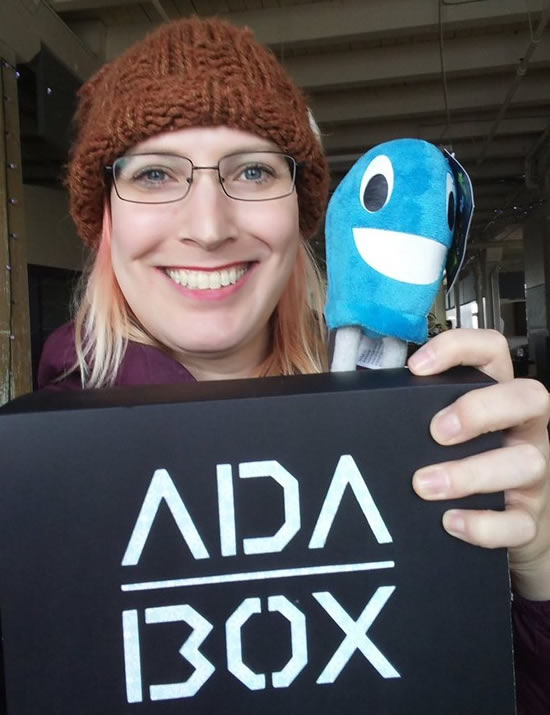](https://twitter.com/itsaddis/status/1203019246902665217)

[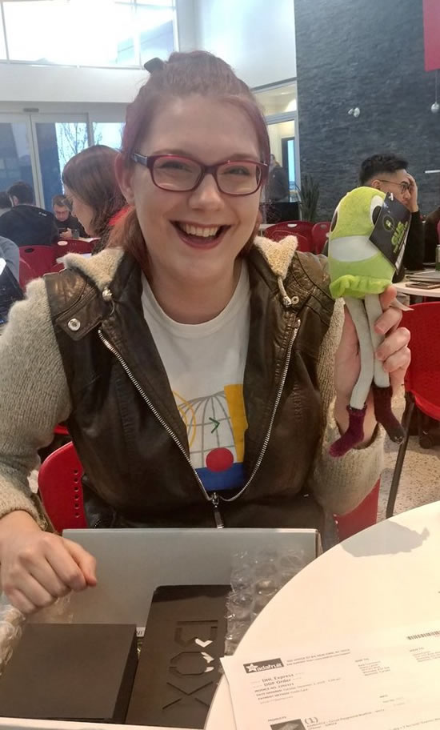](https://twitter.com/artemis_134/status/1203066300718710784)

The CircuitPython powered BTLE ADABOX 14 is making its way to the thousands of people around the world. Thank you so much to everyone who gets an [ADABOX](https://www.adafruit.com/adabox) and the entire team who make it happen, and to Digi-Key and Nordic for making it one of the best ADABOXes yet! - [ADABOX](https://learn.adafruit.com/adabox014?view=all).

## Melbourne MicroPython Meetup

 * November 2019 Melbourne MicroPython Meetup - News Roundup - [YouTube](https://www.youtube.com/watch?v=xzTOXaPgwO0).
 * Natural Sequence or Fabricated - MicroPython-powered art - [YouTube](https://www.youtube.com/watch?v=LVqFETunxK4).
 * LittleFS integration for MicroPython - [YouTube](https://www.youtube.com/watch?v=wkgU4fGP3eY).
 
 add ...
 
https://melbournemicropythonmeetup.github.io/September-2019-Meetup/

https://melbournemicropythonmeetup.github.io/October-2019-Meetup/

## Adafruit joins the LoRa Alliance

[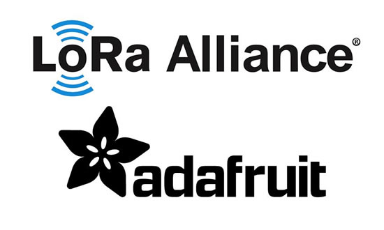](https://lora-alliance.org/about-lora-alliance)

We are thrilled to announce that we have joined the LoRa Alliance! [What is the LoRa Alliance?](https://lora-alliance.org/about-lora-alliance)

>_The LoRa Alliance® is an open, nonprofit association that has grown to more than 500 members since its inception in March 2015, becoming the largest and fastest-growing alliance in the technology sector. Its members closely collaborate and share experiences to promote and drive the success of the LoRaWAN® protocol as the leading open global standard for secure, carrier-grade IoT LPWAN connectivity. With the technical flexibility to address a broad range of IoT applications, both static and mobile, and a certification program to guarantee interoperability, LoRaWAN® has already been deployed by major mobile network operators globally, with continuing wide expansion into 2019 and beyond._

Why did we join?

> _"Humans done a great job of connecting people in dense populations like cities or buildings - WiFi and Cellular are ubiquitous technologies that connect people, machines and sensors. The future is to connect people where-ever they are, and that's where LoRa has so much promise. We think LoRa and LoRaWAN are the best way to solve last-mile connectivity for Industrial and Agricultural IoT"_ - Limor "Ladyada" Fried.

[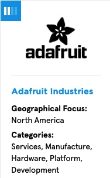](https://lora-alliance.org/member-directory)

Find us in the [Member Directory here](https://lora-alliance.org/member-directory). 

_Ready to learn more?_ There is a plethora of of guides available on the [Adafruit Learning System](https://learn.adafruit.com/search?q=lora) about LoRa/LoRaWAN topics ranging from[ sending packets between radios](https://learn.adafruit.com/lora-and-lorawan-radio-for-raspberry-pi) to [setting up your own decentralized LoRaWAN Network](https://learn.adafruit.com/multi-device-lora-temperature-network). 

[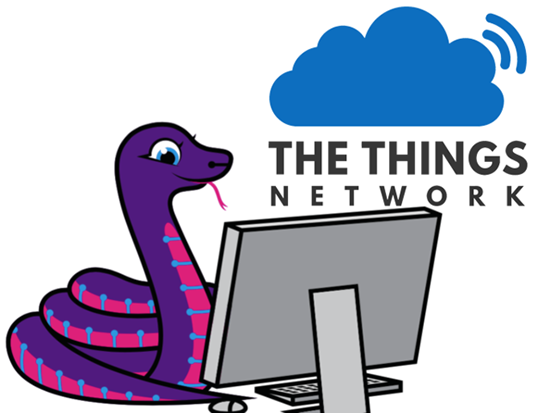](https://learn.adafruit.com/using-lorawan-and-the-things-network-with-circuitpython)

We're not just fans of LoRa, we're also fans of LoRaWAN and The Things Network and have written guides and drivers to simplify joining the Things Network with [CircuitPython](https://learn.adafruit.com/using-lorawan-and-the-things-network-with-circuitpython) hardware.

Here are just a few of the LoRa hardware we manufacture right here in New York City... 

[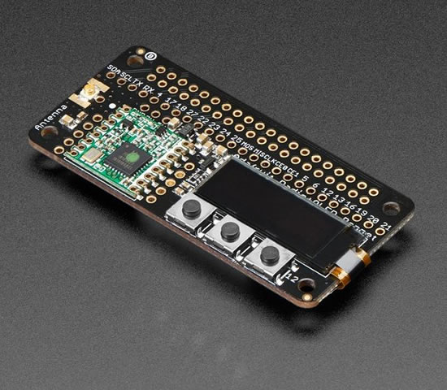](https://www.adafruit.com/product/4074)

[Adafruit LoRa Radio Bonnet with OLED (915MHz/433MHz)](https://www.adafruit.com/product/4074)

Uses Python libraries so you can send or receive LoRa data with other matching modules, send data to a LoRaWAN gateway, or even set up your own single channel LoRaWAN-to-Internet gateways.

[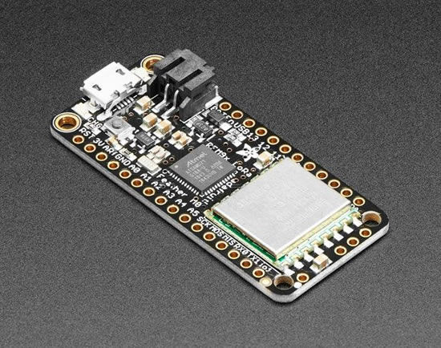](https://www.adafruit.com/?q=Feather%20M0%20RFM9x)

Feather M0 RFM9x - an all-in-one Feathers with an onboard RFM9x radio module cooked in, built-in USB, and battery charging.

[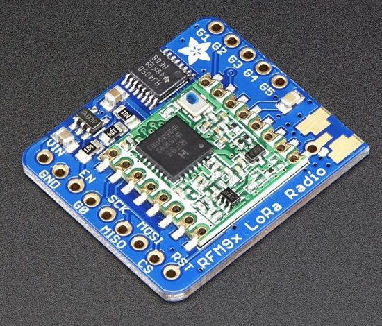](https://www.adafruit.com/product/3072)

If you have a Raspberry Pi, or any CircuitPython-compatible hardware, **you can easily add LoRa/LoRaWAN to your project** using an [Adafruit RFM9x Radio Breakout](https://www.adafruit.com/product/3072) or an [Adafruit LoRa Radio FeatherWing](https://www.adafruit.com/product/3231).

## U-blox NINA B302 running CircuitPython - Portuguese (Smartcore)

https://ninab3-python.blogspot.com/2019/03/nina-b3-e-python.html

https://circuitpython-nina302.blogspot.com/2019/04/programando-ble-no-circuipython-nina.html

https://ninab302-dht22-python.blogspot.com/2019/08/nina-b302-lendo-com-dht22-com.html

https://b302-micropython-analog.blogspot.com/2019/08/lendo-entrada-analogica-nina-b303-com.html

https://ninab302-lcd2x16.blogspot.com/2019/08/acessando-lcd-2x16-com-o-nina-b302-em.html

https://nina-b302-oled-circuitpython.blogspot.com/2019/09/nina-b302-com-oled.html

## News from around the web!

Arturo is using CircuitPython to test [@gregdavill](https://twitter.com/GregDavill) 's LED Cube panels - [Twitter](https://twitter.com/arturo182/status/1202699901769015301).

Out of a class of 500, Becky Button was one of 12 students chosen present a computer science term project! It just happen to be based on CircuitPython! Here’s a clip of the presentation! - [Twitter](https://twitter.com/einsteinunicorn/status/1202782143140814848).

[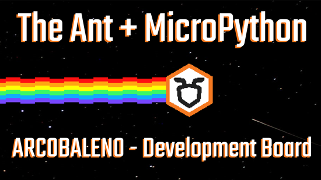](https://forum.micropython.org/viewtopic.php?t=7333)

[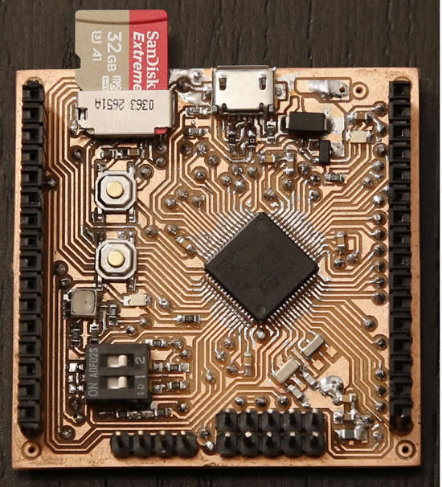](https://forum.micropython.org/viewtopic.php?t=7333)

Over on the [MicroPython forums](https://forum.micropython.org/viewtopic.php?t=7333), the Ant Team posted about their board they made with their milling machine, the Arcobaleno -

>_"We are The Ant Team and we designed a MicroPython compatible board to check the capabilities of our PCB milling machine, The Ant. Likely, we will use our board and MicroPython for future projects, we enjoy using it :) The board is open and shared with the "CC Attribution 3.0 Unported License". This is an image of the Arcobaleno prototype board milled, soldered and tested with MicroPython. In this video and in its description there are all the info about it. And in the Arcobaleno repository you will find all the project files. Thanks to Damien George for creating MicroPython and to all the community that develops and supports it. Tell us what you think about it."_

The Ant + Micropython = ARCOBALENO - [YouTube](https://youtu.be/vV_R-Mp-2kI), [GitHub](https://github.com/The-Ant-Lab/arcobaleno), [BitBucket](https://bitbucket.org/compactpcbmaker/cpcbm/src/master/).

Play BLE Hide & Seek with a Feather and CPX B - [Twitter](https://twitter.com/DavidGlaude/status/1203450247688654848), and [GitHub](https://gist.github.com/dglaude/58581f6e4ac4088e8b1be86d4156fad0).

[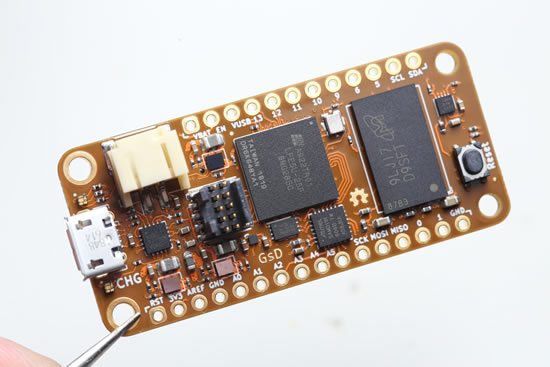](https://github.com/gregdavill/OrangeCrab/)

[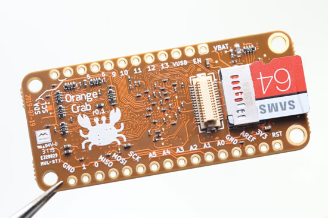](https://github.com/gregdavill/OrangeCrab/)

[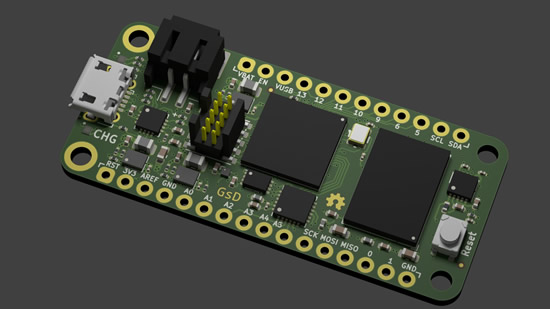](https://github.com/gregdavill/OrangeCrab/)

And! Check out Greg's OrangeCrab r0.1, ECP5 DDR3 memory in a Feather form-factor - [GitHub](https://github.com/gregdavill/OrangeCrab/).

[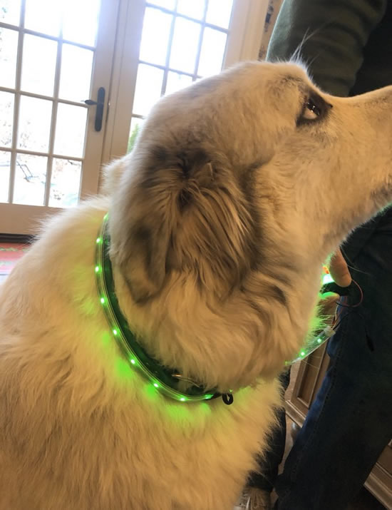](https://twitter.com/gallaugher/status/1202343230651719681)

This dog has a CircuitPython powered dog collar! - [Twitter](https://twitter.com/gallaugher/status/1202343230651719681).

Wirelessly powered NeoPixel ring in resin cube - [Instagram](https://www.instagram.com/p/B5v5CjkFosd/).

[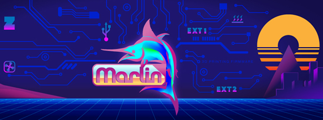](https://blog.adafruit.com/2019/12/07/the-latest-marlin-firmware-2-0-0-supports-adafruit-grand-central-sam5d-marlinfirmware-arduino-adafruit/)

[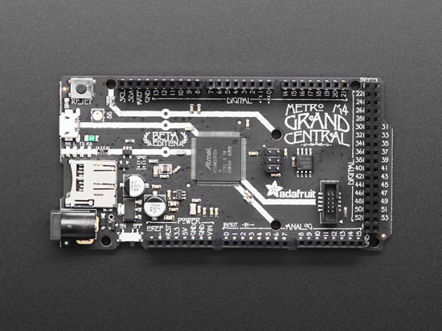](https://blog.adafruit.com/2019/12/07/the-latest-marlin-firmware-2-0-0-supports-adafruit-grand-central-sam5d-marlinfirmware-arduino-adafruit/)

The latest Marlin Firmware 2.0.0 supports Adafruit Grand Central / SAM5D - [Adafruit](https://blog.adafruit.com/2019/12/07/the-latest-marlin-firmware-2-0-0-supports-adafruit-grand-central-sam5d-marlinfirmware-arduino-adafruit/).

Coverage.py is coverage measurement tool for Python. Maintained by [@nedbat](https://twitter.com/nedbat). The artwork is by [@artofbatch](https://t.co/nQyrPkKbTw?amp=1), here's how it came to be, great logo - [Sleepy Snake](https://nedbatchelder.com/blog/201912/sleepy_snake.html).

[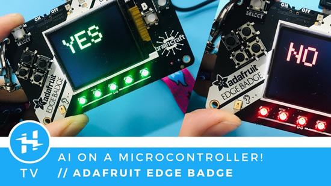](https://youtu.be/57eaxMeo8R4)

Alex from hackster.ion the EDGE BADGE! - [YouTube](https://youtu.be/57eaxMeo8R4).

LoRa Satellite - [YouTube](https://youtu.be/5k0aM-PJzo8).

AWS NASA JPL Space Challenge - Use machine learning to autonomously operate the virtual Open-Source Rover created by NASA’s Jet Propulsion Laboratory (JPL) to explore the surface of Mars - [spacechallenge.tech](https://spacechallenge.tech/)

[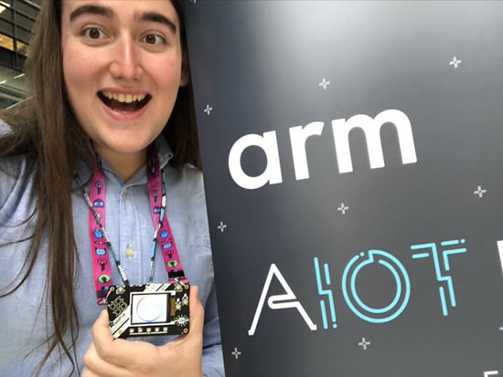](https://twitter.com/Alfred_G_C/status/1202018120732250112)

Speaking of! Alfred was at the Arm IoT summit and in addition to the EDGE BADGE running CircuitPython and [TensorFlow](https://twitter.com/AlessandroDevs/status/1201584158285451266), it can play GIFs :) - [Twitter](https://twitter.com/Alfred_G_C/status/1202018120732250112).

AI Dungeon 2 is a completely AI generated text adventure built with OpenAI's largest GPT-2 model. It's a first of it's kind game that allows you to enter and will react to any action you can imagine - [AI Dungeon](https://colab.research.google.com/github/nickwalton/AIDungeon/blob/master/AIDungeon_2.ipynb).

[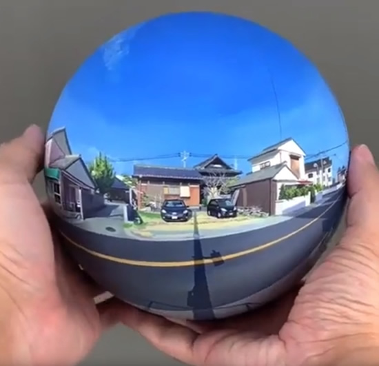](https://youtu.be/_cmHcUkDJP0)

360 degree photo, printed on a sphere - [YouTube](https://youtu.be/_cmHcUkDJP0).

[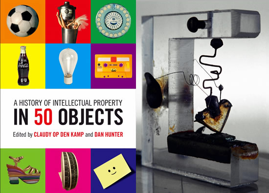](https://www.cambridge.org/us/academic/subjects/law/intellectual-property/history-intellectual-property-50-objects?format=HB)

A History of Intellectual Property in 50 Objects by Claudy Op den Kamp and Dan Hunter - [Cambridge University Press](https://www.cambridge.org/us/academic/subjects/law/intellectual-property/history-intellectual-property-50-objects?format=HB).

#ICYDNCI What was the most popular, most clicked link, in [last week's newsletter](https://www.adafruitdaily.com/2019/12/03/mp3-decoding-circuitpython-snakes-its-way-to-fomu-nxp-and-more-python-adafruit-circuitpython-pythonhardware-circuitpython-micropython-thepsf-adafruit/)? [Native MP3 decoding/playback in CircuitPython](https://youtu.be/4xh_mPaYG3s).

## Take Flight with Feather - Hackaday and Digi-Key

The Adafruit Feather is the latest platform for microcontroller development, and companies like Particle, Sparkfun, and Seeed Studios are producing Feather-compatible devices for development and prototyping. Now it’s your turn. Design a board to fit in the Feather ecosystem and we’ll manufacture it. The best project in the Take Flight With Feather contest will be sent off to pick and place machines and head straight to the Digi-Key warehouse!

To get started, take a look at the current [Feather ecosystem](https://learn.adafruit.com/adafruit-feather/community-feathers-wings) and get acquainted with the [GitHub repo filled with examples and tutorials](https://github.com/adafruit/awesome-feather).

There are over 48+ entries at this time!

Stop by [hackaday.io for more details](https://hackaday.io/contest/168107-take-flight-with-feather)!

## Coming soon

[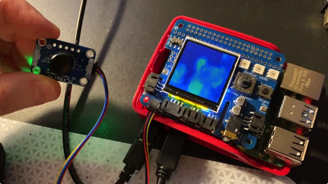](https://youtu.be/LDppCCAsYq0)

Thermal Camera testing with the Braincraft HAT. Want to be like the Predator and have thermal vision? Well, maybe not with the 2 hour dental cleanings. So, instead, DIY thermal vision with this MLX90640 thermal camera with STEMMA QT connector so it plugs right into the BrainCraft HAT. We’re displaying the heatmap output right on the 1.54” TFT. We think this could be useful for training ML/AI models that are looking for ‘heat signatures’… maybe could differentiate between Xenomorphs, Humans, and adorable kittens! - [YouTube](https://youtu.be/LDppCCAsYq0).

## New Learn Guides!

[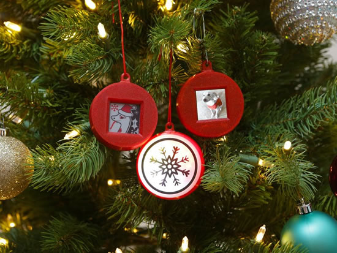](https://learn.adafruit.com/display-ornaments-with-circuit-playground)

[Circuit Playground Gizmo Ornaments](https://learn.adafruit.com/display-ornaments-with-circuit-playground) from [Noe and Pedro](https://learn.adafruit.com/users/pixil3d)

[Ultrasonic Sonar Distance Sensors](https://learn.adafruit.com/ultrasonic-sonar-distance-sensors) from [Kattni](https://learn.adafruit.com/users/kattni)

[Bluefruit Playground Hide and Seek](https://learn.adafruit.com/hide-n-seek-bluefruit-ornament) from [John Park](https://learn.adafruit.com/users/johnpark)

[Adabox014](https://learn.adafruit.com/adabox014) from [John Park](https://learn.adafruit.com/users/johnpark)

## Updated Guides - Now With More Python!

**You can use CircuitPython libraries on Raspberry Pi!** We're updating all of our CircuitPython guides to show how to wire up sensors to your Raspberry Pi, and load the necessary CircuitPython libraries to get going using them with Python. We'll be including the updates here so you can easily keep track of which sensors are ready to go. Check it out!

Keep checking back for more updated guides!

## CircuitPython Libraries!

CircuitPython support for hardware continues to grow. We are adding support for new sensors and breakouts all the time, as well as improving on the drivers we already have. As we add more libraries and update current ones, you can keep up with all the changes right here!

For the latest drivers, download the [Adafruit CircuitPython Library Bundle](https://circuitpython.org/libraries).

If you'd like to contribute, CircuitPython libraries are a great place to start. Have an idea for a new driver? File an issue on [CircuitPython](https://github.com/adafruit/circuitpython/issues)! Interested in helping with current libraries? Check out the [CircuitPython.org Contributing page](https://circuitpython.org/contributing). We've included open pull requests and issues from the libraries, and details about repo-level issues that need to be addressed. We have a guide on [contributing to CircuitPython with Git and Github](https://learn.adafruit.com/contribute-to-circuitpython-with-git-and-github) if you need help getting started. You can also find us in the #circuitpython channel on the [Adafruit Discord](https://adafru.it/discord). Feel free to contact Kattni (@kattni) with any questions.

You can check out this [list of all the CircuitPython libraries and drivers available](https://github.com/adafruit/Adafruit_CircuitPython_Bundle/blob/master/circuitpython_library_list.md). 

The current number of CircuitPython libraries is **198**!

**New Libraries!**

Here's this week's new CircuitPython libraries:

 * [Adafruit_CircuitPython_RPLIDAR](https://github.com/adafruit/Adafruit_CircuitPython_RPLIDAR)
 * [Adafruit_CircuitPython_NeoPixel_SPI](https://github.com/adafruit/Adafruit_CircuitPython_NeoPixel_SPI)
 * [Adafruit_CircuitPython_LSM6DSOX](https://github.com/adafruit/Adafruit_CircuitPython_LSM6DSOX)

**Updated Libraries!**

Here's this week's updated CircuitPython libraries:

 * [Adafruit_CircuitPython_CircuitPlayground](https://github.com/adafruit/Adafruit_CircuitPython_CircuitPlayground)
 * [Adafruit_CircuitPython_DS18X20](https://github.com/adafruit/Adafruit_CircuitPython_DS18X20)
 * [Adafruit_CircuitPython_NeoPixel](https://github.com/adafruit/Adafruit_CircuitPython_NeoPixel)
 * [Adafruit_CircuitPython_Gizmo](https://github.com/adafruit/Adafruit_CircuitPython_Gizmo)
 * [Adafruit_CircuitPython_PyBadger](https://github.com/adafruit/Adafruit_CircuitPython_PyBadger)
 * [Adafruit_CircuitPython_IS31FL3731](https://github.com/adafruit/Adafruit_CircuitPython_IS31FL3731)

**PyPI Download Stats!**

We've written a special library called Adafruit Blinka that makes it possible to use CircuitPython Libraries on [Raspberry Pi and other compatible single-board computers](https://learn.adafruit.com/circuitpython-on-raspberrypi-linux/). Adafruit Blinka and all the CircuitPython libraries have been deployed to PyPI for super simple installation on Linux! Here are the top 10 CircuitPython libraries downloaded from PyPI in the last week, including the total downloads for those libraries:

| Library                                     | Last Week   | Total |   
|:-------                                     |:--------:   |:-----:|   
| Adafruit-Blinka                             | 1682        | 40572 |   
| Adafruit_CircuitPython_BusDevice            | 766         | 24353 |   
| Adafruit_CircuitPython_NeoPixel             | 309         | 4639 |    
| Adafruit_CircuitPython_Register             | 194         | 5112 |    
| Adafruit_CircuitPython_MCP230xx             | 163         | 9643 |    
| Adafruit_CircuitPython_Motor                | 124         | 3583 |    
| Adafruit_CircuitPython_ServoKit             | 124         | 2932 |    
| Adafruit_CircuitPython_PCA9685              | 118         | 3372 |    
| Adafruit_CircuitPython_Thermal_Printer      | 70          | 1411 |    
| Adafruit_CircuitPython_SSD1306              | 64          | 2098 |    

## Upcoming events!

Scott is speaking at [PyCascades](https://2020.pycascades.com/) about Python's Next Decade and Us. It's February 8th and 9th, 2020.

>_"PyCascades is a two-day, single-track Python conference. We previously hosted PyCascades in Vancouver and Seattle. For our third iteration in 2020 we'll be in Portland, Oregon. PyCascades is organized by members of the Python communities in Vancouver, Seattle, and Portland. We aim to bring together Python users and developers from both the Pacific Northwest and around the world."_

April 15-23, 2020, Pittsburgh, Pennsylvania, USA - The PyCon 2020 conference, which will take place in Pittsburgh, is the largest annual gathering for the community using and developing the open-source Python programming language. It is produced and underwritten by the Python Software Foundation, the 501(c)(3) nonprofit organization dedicated to advancing and promoting Python. Through PyCon, the PSF advances its mission of growing the international community of Python programmers - [PyCon 2020](https://us.pycon.org/2020/).

## Latest releases

CircuitPython's stable release is [#.#.#](https://github.com/adafruit/circuitpython/releases/latest) and its unstable release is [#.#.#-##.#](https://github.com/adafruit/circuitpython/releases). New to CircuitPython? Start with our [Welcome to CircuitPython Guide](https://learn.adafruit.com/welcome-to-circuitpython).

[2019####](https://github.com/adafruit/Adafruit_CircuitPython_Bundle/releases/latest) is the latest CircuitPython library bundle.

[v#.#.#](https://micropython.org/download) is the latest MicroPython release. Documentation for it is [here](http://docs.micropython.org/en/latest/pyboard/).

[#.#.#](https://www.python.org/downloads/) is the latest Python release. The latest pre-release version is [#.#.#](https://www.python.org/download/pre-releases/).

[1490 Stars](https://github.com/adafruit/circuitpython/stargazers) Like CircuitPython? [Star it on GitHub!](https://github.com/adafruit/circuitpython)

## Call for help – CircuitPython messaging to other languages!

We [recently posted on the Adafruit blog](https://blog.adafruit.com/2018/08/15/help-bring-circuitpython-messaging-to-other-languages-circuitpython/) about bringing CircuitPython messaging to other languages, one of the exciting features of CircuitPython 4.x is translated control and error messages. Native language messages will help non-native English speakers understand what is happening in CircuitPython even though the Python keywords and APIs will still be in English. If you would like to help, [please post](https://github.com/adafruit/circuitpython/issues/1098) to the main issue on GitHub and join us on [Discord](https://adafru.it/discord).

We made this graphic with translated text, we could use your help with that to make sure we got the text right, please check out the text in the image – if there is anything we did not get correct, please let us know. Dan sent me this [handy site too](http://helloworldcollection.de/#Human).

## jobs.adafruit.com - Find a dream job, find great candidates!

[jobs.adafruit.com](https://jobs.adafruit.com/) has returned and folks are posting their skills (including CircuitPython) and companies are looking for talented makers to join their companies - from Digi-Key, to Hackaday, Microcenter, Raspberry Pi and more.

## 15,539 thanks!

The Adafruit Discord community, where we do all our CircuitPython development in the open, reached over 15,539 humans, thank you! Join today! [https://adafru.it/discord](https://adafru.it/discord)

## ICYMI - In case you missed it

The wonderful world of Python on hardware! This is our first video-newsletter-podcast that we’ve started! The news comes from the Python community, Discord, Adafruit communities and more. It’s part of the weekly newsletter, then we have a segment on ASK an ENGINEER and this is the video slice from that! The complete Python on Hardware weekly videocast [playlist is here](https://www.youtube.com/playlist?list=PLjF7R1fz_OOXRMjM7Sm0J2Xt6H81TdDev). 

This video podcast is on [iTunes](https://itunes.apple.com/us/podcast/python-on-hardware/id1451685192?mt=2), [YouTube](https://www.youtube.com/playlist?list=PLjF7R1fz_OOXRMjM7Sm0J2Xt6H81TdDev), [IGTV (Instagram TV](https://www.instagram.com/adafruit/channel/)), and [XML](https://itunes.apple.com/us/podcast/python-on-hardware/id1451685192?mt=2).

[Weekly community chat on Adafruit Discord server CircuitPython channel - Audio / Podcast edition](https://itunes.apple.com/us/podcast/circuitpython-weekly-meeting/id1451685016) - Audio from the Discord chat space for CircuitPython, meetings are usually Mondays at 2pm ET, this is the audio version on [iTunes](https://itunes.apple.com/us/podcast/circuitpython-weekly-meeting/id1451685016), Pocket Casts, [Spotify](https://adafru.it/spotify), and [XML feed](https://adafruit-podcasts.s3.amazonaws.com/circuitpython_weekly_meeting/audio-podcast.xml).

And lastly, we are working up a one-spot destination for all things podcast-able here - [podcasts.adafruit.com](https://podcasts.adafruit.com/)

## Codecademy "Learn Hardware Programming with CircuitPython"

Codecademy, an online interactive learning platform used by more than 45 million people, has teamed up with the leading manufacturer in STEAM electronics, Adafruit Industries, to create a coding course, "Learn Hardware Programming with CircuitPython". The course is now available in the [Codecademy catalog](https://www.codecademy.com/learn/learn-circuitpython?utm_source=adafruit&utm_medium=partners&utm_campaign=circuitplayground&utm_content=pythononhardwarenewsletter).

Python is a highly versatile, easy to learn programming language that a wide range of people, from visual effects artists in Hollywood to mission control at NASA, use to quickly solve problems. But you don’t need to be a rocket scientist to accomplish amazing things with it. This new course introduces programmers to Python by way of a microcontroller — CircuitPython — which is a Python-based programming language optimized for use on hardware.

CircuitPython’s hardware-ready design makes it easier than ever to program a variety of single-board computers, and this course gets you from no experience to working prototype faster than ever before. Codecademy’s interactive learning environment, combined with Adafruit's highly rated Circuit Playground Express, present aspiring hardware hackers with a never-before-seen opportunity to learn hardware programming seamlessly online.

Whether for those who are new to programming, or for those who want to expand their skill set to include physical computing, this course will have students getting familiar with Python and creating incredible projects along the way. By the end, students will have built their own bike lights, drum machine, and even a moisture detector that can tell when it's time to water a plant.

Visit Codecademy to access the [Learn Hardware Programming with CircuitPython](https://www.codecademy.com/learn/learn-circuitpython?utm_source=adafruit&utm_medium=partners&utm_campaign=circuitplayground&utm_content=pythononhardwarenewsletter) course and Adafruit to purchase a [Circuit Playground Express](https://www.adafruit.com/product/3333).

Codecademy has helped more than 45 million people around the world upgrade their careers with technology skills. The company’s online interactive learning platform is widely recognized for providing an accessible, flexible, and engaging experience for beginners and experienced programmers alike. Codecademy has raised a total of $43 million from investors including Union Square Ventures, Kleiner Perkins, Index Ventures, Thrive Capital, Naspers, Yuri Milner and Richard Branson, most recently raising its $30 million Series C in July 2016.

## Contribute!

The CircuitPython Weekly Newsletter is a CircuitPython community-run newsletter emailed every Tuesday. The complete [archives are here](https://www.adafruitdaily.com/category/circuitpython/). It highlights the latest CircuitPython related news from around the web including Python and MicroPython developments. To contribute, edit next week's draft [on GitHub](https://github.com/adafruit/circuitpython-weekly-newsletter/tree/gh-pages/_drafts) and [submit a pull request](https://help.github.com/articles/editing-files-in-your-repository/) with the changes. Join our [Discord](https://adafru.it/discord) or [post to the forum](https://forums.adafruit.com/viewforum.php?f=60) for any further questions.
