- [ ] update title

- [ ] Link "View this email in your browser."

[View this email]() in your browser.

## CircuitPython 5.0.0 Beta 1 released!

[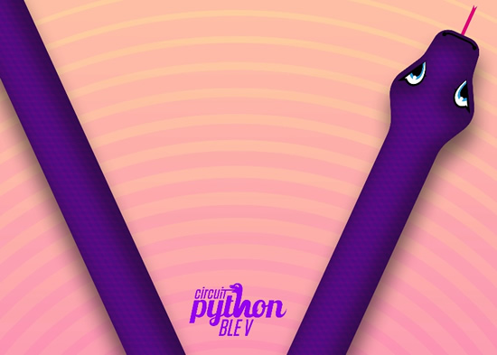](https://github.com/adafruit/circuitpython/releases/tag/5.0.0-beta.1)

5.0.0 is the latest major revision of CircuitPython. It features many improvements and enhancements to displayio, including grayscale OLED and e-paper displays, extensive additions and improvements to BLE support, support for the STM32F4 and Sony Spresense microcontrollers, and PWM audio support - [GitHub](https://github.com/adafruit/circuitpython/releases/tag/5.0.0-beta.1).

## 1,500 thanks CircuitPython stars

[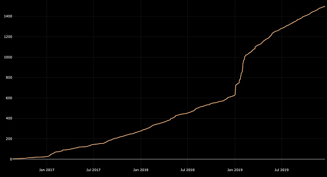](https://github.com/adafruit/circuitpython)

Thanks to everyone in the CircuitPython community, we're up to 1,500 stars! - [GitHub](https://github.com/adafruit/circuitpython).

## CircuitBrains Deluxe, CircuitPython castellated module package

[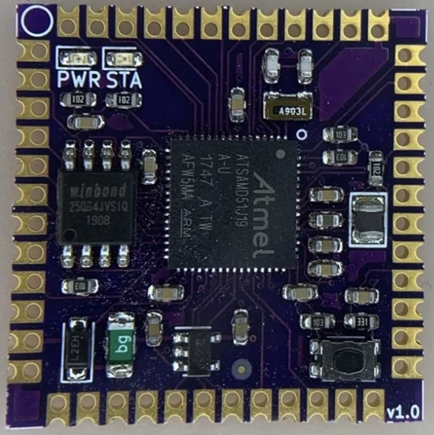](https://kevinneubauer.com/portfolio/circuitbrains-deluxe/)

Kevin's CircuitPython board, CircuitBrains Deluxe, a castellated module package, 1.25 inches (32 mm) square - [CircuitBrains Deluxe](https://kevinneubauer.com/portfolio/circuitbrains-deluxe/), and [Twitter](https://twitter.com/kevinneubauer/status/1204808844293095424).

## Introducing programming using CircuitPython course

[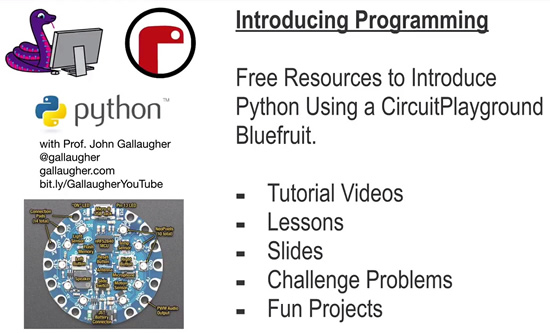](https://twitter.com/gallaugher/status/1205612887999422464)

Professor John Gallaugher is sharing the course content for introducing programming using CircuitPython with the Circuit Playground Bluefruit. [Youtube](https://www.youtube.com/playlist?list=PL9VJ9OpT-IPSsQUWqQcNrVJqy4LhBjPX2), [Google Doc](https://docs.google.com/document/d/1-a36y-Rl_iB49Xy3FBigkoc1RdJGYLSaldjjfoU8v-A/edit), and [slides](https://drive.google.com/drive/folders/1om9P_u7ZVymkK_MpM91CnwvmUGanmrN3).

AND! Rick-rolling a final project? Well done-Dan! One of the 100 projects our students did to 'fun-up' our last two days in class after being given just two CircuitPython sessions, a CPB, and access to the "lab-grab" parts boxes in John's office - [Twitter](https://twitter.com/gallaugher/status/1205907123739254785).

## Serpente is back and the family has expanded

[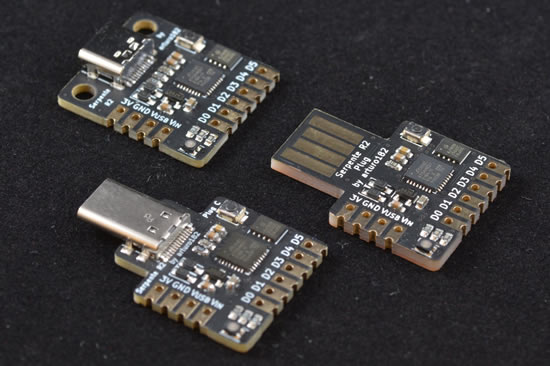](https://www.tindie.com/products/arturo182/serpente-a-tiny-circuitpython-prototyping-board/)

The R2 adds castellated edges, breadboard compatibility, and a new board: male USB Type-C! Still the same SAMD21, 256KB Flash and 32KB RAM, 4MB for files and code, 6 GPIOs. Runs CircuitPython - [Tindie](https://www.tindie.com/products/arturo182/serpente-a-tiny-circuitpython-prototyping-board/).

## Watering plants with BLINKA

[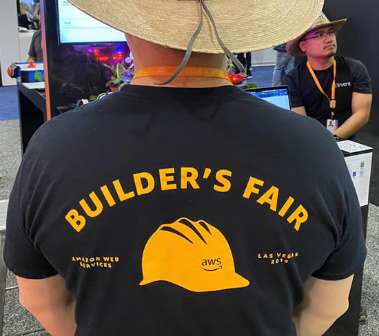](https://github.com/aws-samples/aws-builders-fair-projects/tree/master/reinvent-2019/autoponics/thing-app/sensors)

[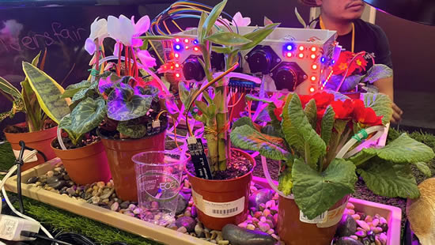](https://github.com/aws-samples/aws-builders-fair-projects/tree/master/reinvent-2019/autoponics/thing-app/sensors)

At AWS re:Invent, AutoPonics - uses AWS services to feed house plants based on hydration levels - [Twitter](https://twitter.com/AWSreInvent/status/1202712798062465024), and [GitHub](https://github.com/aws-samples/aws-builders-fair-projects/tree/master/reinvent-2019/autoponics/thing-app/sensors). Uses BLINKA!

## Python powered Sister Night Goggles from Watchmen

[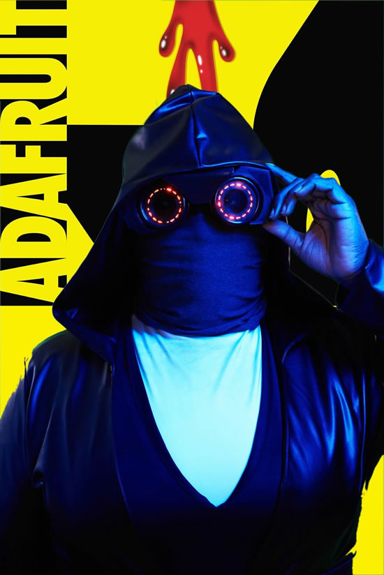](https://youtu.be/CsJ973Ls1KQ)

CircuitPython powered NeoPixel goggles inspired by HBO's television series Watchmen. Control the NeoPixel LED animations with a rotary encoder. Display up to four different modes with control like speed, colors and brightness of the NeoPixels. The 3D printed parts fit over costume goggles and snap fit together! - [learn.adafruit.com](https://learn.adafruit.com/watchmen-sister-night-circuitpython-neopixel-goggles), and [YouTube](https://youtu.be/CsJ973Ls1KQ). [MAKE](https://makezine.com/2019/12/12/create-sister-nights-goggles-from-the-watchmen/), and [hackster.io](https://www.hackster.io/news/make-your-own-led-goggles-inspired-by-watchmen-s-sister-night-5c12c1db0ffb).

## 30,000,000 Raspberry Pi units sold

30,000,000 Raspberry Pi units sold - [latest numbers and more](https://blog.adafruit.com/2019/12/15/30000000-raspberry-pi-sold-latest-market-share-and-more-raspberry_pi-raspberrypi/).

[There were probably 30,000,000 Raspberry Pi sold](https://twitter.com/EbenUpton/status/1205646606504275968?s=19) !

**Previous stats:**

*   [Farnell has now sold 15 MILLION Raspberry Pi units, total Pi units out there? 28+ million](https://blog.adafruit.com/2019/09/26/farnell-has-now-sold-15-million-raspberry-pi-units-total-pi-units-out-there-28-million-latest-market-share-and-more-farnell_avnet-raspberry_pi-raspberrypi/) - September 2019.
*   [25 million + Raspberry Pi computers sold](https://blog.adafruit.com/2019/03/15/25-million-raspberry-pi-computers-sold-raspberry_pi-raspberrypi/) - March 2019.
*   [23 million + Raspberry Pi computers sold](https://blog.adafruit.com/2018/12/21/23-million-raspberry-pi-computers-sold-raspberry_pi-raspberrypi/) - December 2018.
*   [14 and 15 million Raspberry Pis in total](https://blog.adafruit.com/2017/07/19/14-and-15-million-raspberry-pis-in-total-raspberry_pi-raspberrypi/) - July 2017.
*   [5 million Raspberry Pi units](https://blog.adafruit.com/2015/09/23/5-million-raspberry-pi-units-raspberry_pi-raspberrypi/) - September 2015.
*   [3.8 million Raspberry Pi units sold](https://blog.adafruit.com/2014/10/13/3-8-million-raspberry-pi-units-sold-raspberry_pi-raspberrypi/) - October 2014.
*   [Raspberry Pi sales hit three million milestone](https://blog.adafruit.com/2014/06/11/raspberry-pi-sales-hit-three-million-milestone-raspberry_pi-raspberrypi/) - June 2014.
*   [Happy 2nd birthday Raspberry Pi over 2.5 million units](https://blog.adafruit.com/2014/02/28/happy-2nd-birthday-raspberry-pi-over-2-5-million-units-in-the-wild-raspberrypi-raspberry_pi/) - February 2014.
*   [2 million Raspberry Pis as of October 2013](https://blog.adafruit.com/2013/11/17/2-million-raspberry-pis-as-of-october-2013-raspberry_pi-raspberrypi/) - November 2013.
*   [How many Raspberry Pis are there? 1.75 million sold so far – and 1 million made in the UK](https://blog.adafruit.com/2013/10/08/how-many-raspberry-pis-are-there-1-75-million-sold-so-far-and-1-million-made-in-the-uk/) - October 2013.
*   [1 million Raspberry Pis](https://blog.adafruit.com/2013/01/13/1-million-raspberry-pis/) - January 2013.

## Take Flight with Feather - Hackaday and Digi-Key

The Adafruit Feather is the latest platform for microcontroller development, and companies like Particle, Sparkfun, and Seeed Studios are producing Feather-compatible devices for development and prototyping. Now it’s your turn. Design a board to fit in the Feather ecosystem and we’ll manufacture it. The best project in the Take Flight With Feather contest will be sent off to pick and place machines and head straight to the Digi-Key warehouse!

To get started, take a look at the current [Feather ecosystem](https://learn.adafruit.com/adafruit-feather/community-feathers-wings) and get acquainted with the [GitHub repo filled with examples and tutorials](https://github.com/adafruit/awesome-feather).

There are over 54+ entries at this time!

Stop by [hackaday.io for more details](https://hackaday.io/contest/168107-take-flight-with-feather)!

## News from around the web!

[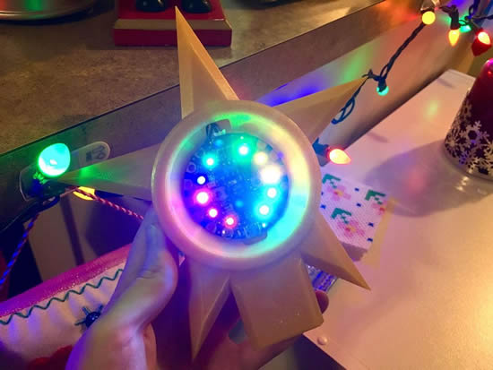](https://www.instagram.com/p/B6A4zDBnzwr/)

[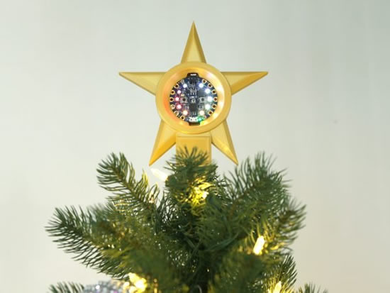](https://www.instagram.com/p/B6A4zDBnzwr/)

CircuitPython, Circuit Playground 3-D printed tree topper - [Instagram](https://www.instagram.com/p/B6A4zDBnzwr/), and [blog post](https://blog.adafruit.com/2019/12/14/circuit-playground-star-tree-topper-via-blitzcitydiy/).

[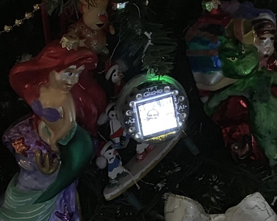](https://twitter.com/nuclear94/status/1206298710277271552)

CircuitPython powered snow globe for the Christmas Tree using ADABOX 14 - [Twitter](https://twitter.com/nuclear94/status/1206298710277271552).

[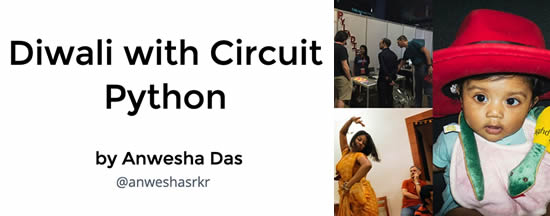](https://anweshadas.in/circuit-python-at-pyconf-hyd/)

CircuitPython at [PyConf Hyderabad](https://anweshadas.in/circuit-python-at-pyconf-hyd/), and [slides](https://slides.com/dascommunity/my-diwali-with-circuit-python).

[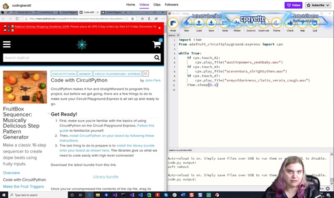](https://www.twitch.tv/videos/520089273)

codingbandit's CircuitPython and Adafruit Circuit Playground Express - Time to De-Stress, Fun stream - [Twitch.tv](https://www.twitch.tv/videos/520089273), and [Twitter](https://twitter.com/careypayette/status/1204802374512103425).

[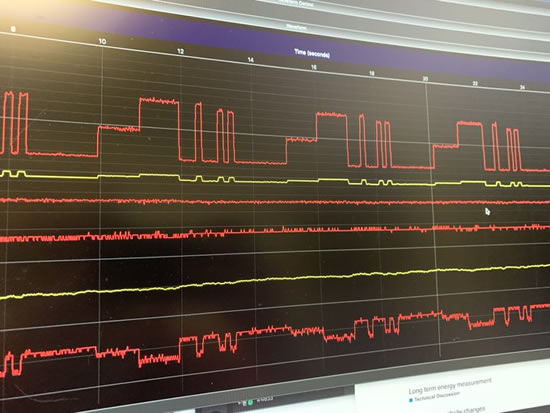](https://twitter.com/tannewt/status/1204681002552942592)

Scot got a [JouleScope](https://www.joulescope.com/), and is using it to test out some power consumption of CircuitPython - [Twitter](https://twitter.com/tannewt/status/1204681002552942592).

[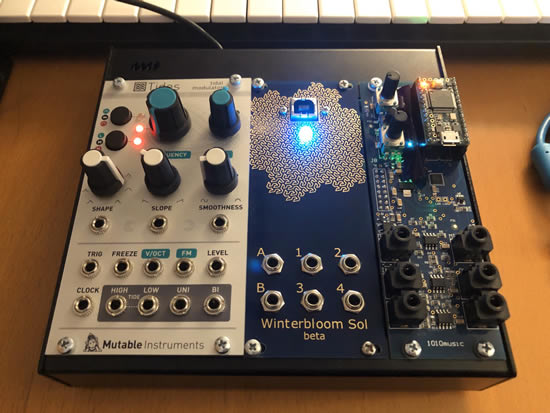](https://twitter.com/johnedgarpark/status/1204461370453835776)

CircuitPython comes to Eurorack, JP is testing - [Twitter](https://twitter.com/johnedgarpark/status/1204461370453835776).

[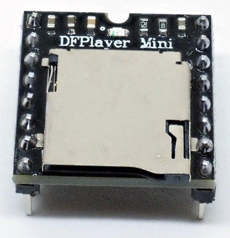](https://github.com/bablokb/circuitpython-dfplayer)

CircuitPython library for the mini-dfplayer, a minimalistic MP3-player available for a few bucks from Ebay, Amazon and other distributors - [GitHub](https://github.com/bablokb/circuitpython-dfplayer).

[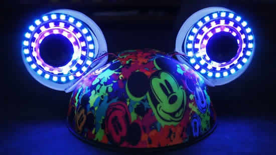](https://www.instagram.com/p/B5_bjUchswK/?utm_source=ig_web_copy_link)

Bluetooth Neopixel LED Mickey Mouse Ears - [Instagram](https://www.instagram.com/p/B5_bjUchswK/?utm_source=ig_web_copy_link).

[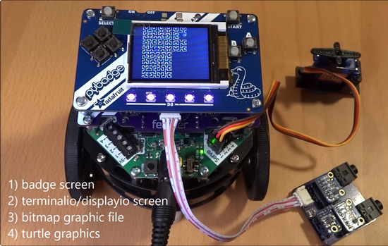](https://youtu.be/_X66NmhzMXI)

Cedar Grove's test of a PyPanel concept with PyBadge, Crickit, and Stemma-connected DAC. Uses standard Adafruit CircuitPython libraries: adafruit_crickit, adafruit_pybadger - [YouTube](https://youtu.be/_X66NmhzMXI), and [Twitter](https://twitter.com/CedarGroveMakr/status/1205185056500674561).

[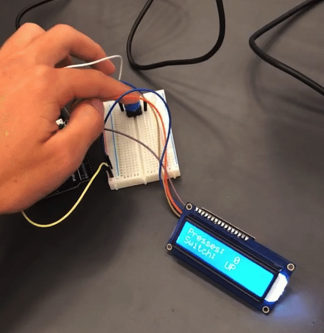](https://github.com/ctucker02/CircuitPython)

Caden has a bunch of great CircuitPython guides on [GitHub](https://github.com/ctucker02/CircuitPython).

BTLE protocol for LED glasses - [qiita.com](https://qiita.com/tnayuki/items/f19764f25cb328c76742), and [on](https://twitter.com/html5test/status/1027846985901072384) [Twitter](https://twitter.com/tnayuki/status/804637008291209216).

[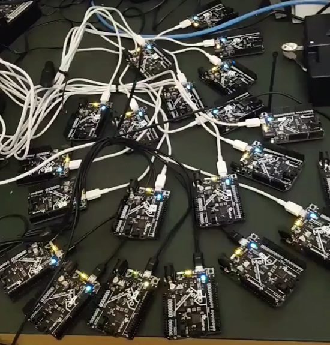](https://twitter.com/timonsku/status/1204557600844664834)

21 METROS, all connected - [Twitter](https://twitter.com/timonsku/status/1204557600844664834).

[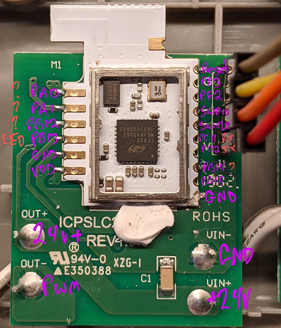](https://github.com/osresearch/micropython/tree/efm32/ports/efm32)

MicroPython port for the Silcon Labs EFM32 - [GitHub](https://github.com/osresearch/micropython/tree/efm32/ports/efm32).

[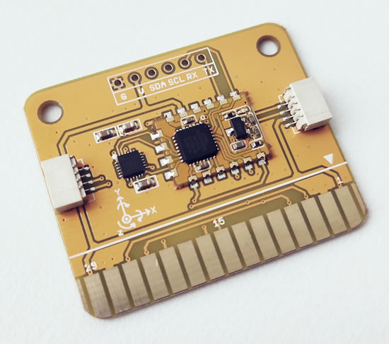](https://docs.longan-labs.cc/cards-system-summary/)

Huh, 'Longan Cards' is an open source development platform developed by Longan Labs. As a plug and play development platform - [longan-labs.com](https://docs.longan-labs.cc/cards-system-summary/), and [docs](https://docs.longan-labs.cc/1011021/).

[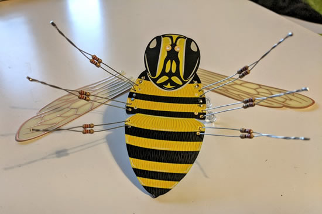](https://github.com/sponsors/saardrimer)

Saar from Boldport has an update, and has opened up GitHub sponsors, we sponsored! - [Boldport](https://mailchi.mp/ee57ba556e92/an-update-from-me?e=79a304a8e1), and [GitHub](https://github.com/sponsors/saardrimer). Saar also works on [PCBmodE](https://github.com/boldport/pcbmode), a circuit board design software written in Python.

Abbott Labs kills free tool that lets you own the blood-sugar data from your glucose monitor, saying it violates copyright law - [BB.net](https://boingboing.net/2019/12/12/they-literally-own-you.html)

[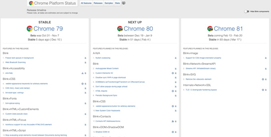](https://www.chromestatus.com/features/schedule)

The Chrome platform status page is neat way to display what is in current release and what is ahead - [chromestatus.com/features/schedule](https://www.chromestatus.com/features/schedule)

Interesting case of Apple vs one of their former chip designers - [PDF](https://regmedia.co.uk/2019/12/11/apple_v_williams_corrected.pdf).

Kinda fun, the same location as Adafruit almost 85 years ago, was also making electronics - [Urban Archive](https://www.urbanarchive.org/sites/R5qB8ofZhyi/VxAokg2wZXA). RADIOS & RADIOTRONS.

Designing a world for all makers - [UPS](https://www.ups.com/us/en/services/knowledge-center/article.page?name=designing-a-world-for-all-makers&kid=art16ef59f2859&articlesource=longitudes).

#ICYDNCI What was the most popular, most clicked link, in [last week's newsletter](https://www.adafruitdaily.com/2019/12/10/200-circuitpython-libraries-binho-ble-and-more-python-adafruit-circuitpython-pythonhardware-circuitpython-micropython-thepsf-adafruit/)? [Binho Nova Multi-Protocol USB Host Adapter](https://binho.io/).

## Coming soon

## New Learn Guides!

[PyPortal Voice Controlled Smart Switch and Time Display](https://learn.adafruit.com/pyportal-voice-controlled-smart-switch-and-time-display) from [Dan Cogliano](https://learn.adafruit.com/users/cogliano)

[Watchmen's Sister Night NeoPixel Goggles](https://learn.adafruit.com/watchmen-sister-night-circuitpython-neopixel-goggles) from [Noe and Pedro](https://learn.adafruit.com/users/pixil3d)

[Circuit Playground TFT Gizmo Dreidel](https://learn.adafruit.com/circuit-playground-tft-gizmo-dreidel) from [Carter Nelson](https://learn.adafruit.com/users/caternuson)

## Updated Guides - Now With More Python!

**You can use CircuitPython libraries on Raspberry Pi!** We're updating all of our CircuitPython guides to show how to wire up sensors to your Raspberry Pi, and load the necessary CircuitPython libraries to get going using them with Python. We'll be including the updates here so you can easily keep track of which sensors are ready to go. Check it out!

[Adafruit MCP9600 I2C Thermocouple Amplifier](https://learn.adafruit.com/adafruit-mcp9600-i2c-thermocouple-amplifier/python-circuitpython)

## CircuitPython Libraries!

CircuitPython support for hardware continues to grow. We are adding support for new sensors and breakouts all the time, as well as improving on the drivers we already have. As we add more libraries and update current ones, you can keep up with all the changes right here!

For the latest drivers, download the [Adafruit CircuitPython Library Bundle](https://circuitpython.org/libraries).

If you'd like to contribute, CircuitPython libraries are a great place to start. Have an idea for a new driver? File an issue on [CircuitPython](https://github.com/adafruit/circuitpython/issues)! Interested in helping with current libraries? Check out the [CircuitPython.org Contributing page](https://circuitpython.org/contributing). We've included open pull requests and issues from the libraries, and details about repo-level issues that need to be addressed. We have a guide on [contributing to CircuitPython with Git and Github](https://learn.adafruit.com/contribute-to-circuitpython-with-git-and-github) if you need help getting started. You can also find us in the #circuitpython channel on the [Adafruit Discord](https://adafru.it/discord). Feel free to contact Kattni (@kattni) with any questions.

You can check out this [list of all the CircuitPython libraries and drivers available](https://github.com/adafruit/Adafruit_CircuitPython_Bundle/blob/master/circuitpython_library_list.md). 

The current number of CircuitPython libraries is **201**!

**New Libraries!**

Here's this week's new CircuitPython libraries:

 * [Adafruit_CircuitPython_NeoPixel_SPI](https://github.com/adafruit/Adafruit_CircuitPython_NeoPixel_SPI)
 * [Adafruit_CircuitPython_LSM6DSOX](https://github.com/adafruit/Adafruit_CircuitPython_LSM6DSOX)
 * [Adafruit_CircuitPython_ICM20649](https://github.com/adafruit/Adafruit_CircuitPython_ICM20649)
 * [Adafruit_CircuitPython_MLX90640](https://github.com/adafruit/Adafruit_CircuitPython_MLX90640)

**Updated Libraries!**

Here's this week's updated CircuitPython libraries:

 * [Adafruit_CircuitPython_DS18X20](https://github.com/adafruit/Adafruit_CircuitPython_DS18X20)
 * [Adafruit_CircuitPython_NeoPixel](https://github.com/adafruit/Adafruit_CircuitPython_NeoPixel)
 * [Adafruit_CircuitPython_Gizmo](https://github.com/adafruit/Adafruit_CircuitPython_Gizmo)
 * [Adafruit_CircuitPython_PyBadger](https://github.com/adafruit/Adafruit_CircuitPython_PyBadger)
 * [Adafruit_CircuitPython_MCP9600](https://github.com/adafruit/Adafruit_CircuitPython_MCP9600)
 * [Adafruit_CircuitPython_BLE](https://github.com/adafruit/Adafruit_CircuitPython_BLE)
 * [Adafruit_CircuitPython_IS31FL3731](https://github.com/adafruit/Adafruit_CircuitPython_IS31FL3731)

**PyPI Download Stats!**

We've written a special library called Adafruit Blinka that makes it possible to use CircuitPython Libraries on [Raspberry Pi and other compatible single-board computers](https://learn.adafruit.com/circuitpython-on-raspberrypi-linux/). Adafruit Blinka and all the CircuitPython libraries have been deployed to PyPI for super simple installation on Linux! Here are the top 10 CircuitPython libraries downloaded from PyPI in the last week, including the total downloads for those libraries:

| Library                                     | Last Week   | Total |   
|:-------                                     |:--------:   |:-----:|   
| Adafruit-Blinka                             | 1936        | 39885 |   
| Adafruit_CircuitPython_BusDevice            | 1022        | 23923 |   
| Adafruit_CircuitPython_NeoPixel             | 355         | 4617 |    
| Adafruit_CircuitPython_Register             | 303         | 5018 |    
| Adafruit_CircuitPython_MCP230xx             | 249         | 9580 |    
| Adafruit_CircuitPython_Motor                | 167         | 3494 |    
| Adafruit_CircuitPython_ServoKit             | 151         | 2938 |    
| Adafruit_CircuitPython_PCA9685              | 138         | 3284 |    
| Adafruit_CircuitPython_IS31FL3731           | 117         | 634 |     
| Adafruit_CircuitPython_seesaw               | 108         | 2479 |    

## Upcoming events!

Scott is speaking at [PyCascades](https://2020.pycascades.com/) about Python's Next Decade and Us. It's February 8th and 9th, 2020.

>_"PyCascades is a two-day, single-track Python conference. We previously hosted PyCascades in Vancouver and Seattle. For our third iteration in 2020 we'll be in Portland, Oregon. PyCascades is organized by members of the Python communities in Vancouver, Seattle, and Portland. We aim to bring together Python users and developers from both the Pacific Northwest and around the world."_

April 15-23, 2020, Pittsburgh, Pennsylvania, USA - The PyCon 2020 conference, which will take place in Pittsburgh, is the largest annual gathering for the community using and developing the open-source Python programming language. It is produced and underwritten by the Python Software Foundation, the 501(c)(3) nonprofit organization dedicated to advancing and promoting Python. Through PyCon, the PSF advances its mission of growing the international community of Python programmers - [PyCon 2020](https://us.pycon.org/2020/).

## Latest releases

CircuitPython's stable release is [4.1.0](https://github.com/adafruit/circuitpython/releases/latest) and its unstable release is [#.#.#-##.#](https://github.com/adafruit/circuitpython/releases). New to CircuitPython? Start with our [Welcome to CircuitPython Guide](https://learn.adafruit.com/welcome-to-circuitpython).

[2019####](https://github.com/adafruit/Adafruit_CircuitPython_Bundle/releases/latest) is the latest CircuitPython library bundle.

[v1.11](https://micropython.org/download) is the latest MicroPython release. Documentation for it is [here](http://docs.micropython.org/en/latest/pyboard/).

[3.8.0](https://www.python.org/downloads/) is the latest Python release.

[1495 Stars](https://github.com/adafruit/circuitpython/stargazers) Like CircuitPython? [Star it on GitHub!](https://github.com/adafruit/circuitpython)

## Call for help – CircuitPython messaging to other languages!

We [recently posted on the Adafruit blog](https://blog.adafruit.com/2018/08/15/help-bring-circuitpython-messaging-to-other-languages-circuitpython/) about bringing CircuitPython messaging to other languages, one of the exciting features of CircuitPython 4.x is translated control and error messages. Native language messages will help non-native English speakers understand what is happening in CircuitPython even though the Python keywords and APIs will still be in English. If you would like to help, [please post](https://github.com/adafruit/circuitpython/issues/1098) to the main issue on GitHub and join us on [Discord](https://adafru.it/discord).

We made this graphic with translated text, we could use your help with that to make sure we got the text right, please check out the text in the image – if there is anything we did not get correct, please let us know. Dan sent me this [handy site too](http://helloworldcollection.de/#Human).

## jobs.adafruit.com - Find a dream job, find great candidates!

[jobs.adafruit.com](https://jobs.adafruit.com/) has returned and folks are posting their skills (including CircuitPython) and companies are looking for talented makers to join their companies - from Digi-Key, to Hackaday, Microcenter, Raspberry Pi and more.

## NUMBER thanks!

The Adafruit Discord community, where we do all our CircuitPython development in the open, reached over NUMBER humans, thank you! Join today! [https://adafru.it/discord](https://adafru.it/discord)

## ICYMI - In case you missed it

[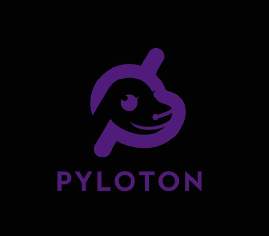](https://www.youtube.com/playlist?list=PLjF7R1fz_OOXRMjM7Sm0J2Xt6H81TdDev)

The wonderful world of Python on hardware! This is our first video-newsletter-podcast that we’ve started! The news comes from the Python community, Discord, Adafruit communities and more. It’s part of the weekly newsletter, then we have a segment on ASK an ENGINEER and this is the video slice from that! The complete Python on Hardware weekly videocast [playlist is here](https://www.youtube.com/playlist?list=PLjF7R1fz_OOXRMjM7Sm0J2Xt6H81TdDev). 

This video podcast is on [iTunes](https://itunes.apple.com/us/podcast/python-on-hardware/id1451685192?mt=2), [YouTube](https://www.youtube.com/playlist?list=PLjF7R1fz_OOXRMjM7Sm0J2Xt6H81TdDev), [IGTV (Instagram TV](https://www.instagram.com/adafruit/channel/)), and [XML](https://itunes.apple.com/us/podcast/python-on-hardware/id1451685192?mt=2).

[Weekly community chat on Adafruit Discord server CircuitPython channel - Audio / Podcast edition](https://itunes.apple.com/us/podcast/circuitpython-weekly-meeting/id1451685016) - Audio from the Discord chat space for CircuitPython, meetings are usually Mondays at 2pm ET, this is the audio version on [iTunes](https://itunes.apple.com/us/podcast/circuitpython-weekly-meeting/id1451685016), Pocket Casts, [Spotify](https://adafru.it/spotify), and [XML feed](https://adafruit-podcasts.s3.amazonaws.com/circuitpython_weekly_meeting/audio-podcast.xml).

And lastly, we are working up a one-spot destination for all things podcast-able here - [podcasts.adafruit.com](https://podcasts.adafruit.com/)

## Codecademy "Learn Hardware Programming with CircuitPython"

Codecademy, an online interactive learning platform used by more than 45 million people, has teamed up with the leading manufacturer in STEAM electronics, Adafruit Industries, to create a coding course, "Learn Hardware Programming with CircuitPython". The course is now available in the [Codecademy catalog](https://www.codecademy.com/learn/learn-circuitpython?utm_source=adafruit&utm_medium=partners&utm_campaign=circuitplayground&utm_content=pythononhardwarenewsletter).

Python is a highly versatile, easy to learn programming language that a wide range of people, from visual effects artists in Hollywood to mission control at NASA, use to quickly solve problems. But you don’t need to be a rocket scientist to accomplish amazing things with it. This new course introduces programmers to Python by way of a microcontroller — CircuitPython — which is a Python-based programming language optimized for use on hardware.

CircuitPython’s hardware-ready design makes it easier than ever to program a variety of single-board computers, and this course gets you from no experience to working prototype faster than ever before. Codecademy’s interactive learning environment, combined with Adafruit's highly rated Circuit Playground Express, present aspiring hardware hackers with a never-before-seen opportunity to learn hardware programming seamlessly online.

Whether for those who are new to programming, or for those who want to expand their skill set to include physical computing, this course will have students getting familiar with Python and creating incredible projects along the way. By the end, students will have built their own bike lights, drum machine, and even a moisture detector that can tell when it's time to water a plant.

Visit Codecademy to access the [Learn Hardware Programming with CircuitPython](https://www.codecademy.com/learn/learn-circuitpython?utm_source=adafruit&utm_medium=partners&utm_campaign=circuitplayground&utm_content=pythononhardwarenewsletter) course and Adafruit to purchase a [Circuit Playground Express](https://www.adafruit.com/product/3333).

Codecademy has helped more than 45 million people around the world upgrade their careers with technology skills. The company’s online interactive learning platform is widely recognized for providing an accessible, flexible, and engaging experience for beginners and experienced programmers alike. Codecademy has raised a total of $43 million from investors including Union Square Ventures, Kleiner Perkins, Index Ventures, Thrive Capital, Naspers, Yuri Milner and Richard Branson, most recently raising its $30 million Series C in July 2016.

## Contribute!

The CircuitPython Weekly Newsletter is a CircuitPython community-run newsletter emailed every Tuesday. The complete [archives are here](https://www.adafruitdaily.com/category/circuitpython/). It highlights the latest CircuitPython related news from around the web including Python and MicroPython developments. To contribute, edit next week's draft [on GitHub](https://github.com/adafruit/circuitpython-weekly-newsletter/tree/gh-pages/_drafts) and [submit a pull request](https://help.github.com/articles/editing-files-in-your-repository/) with the changes. Join our [Discord](https://adafru.it/discord) or [post to the forum](https://forums.adafruit.com/viewforum.php?f=60) for any further questions.
