- [ ] update title

[View this email]() in your browser.

Hi everyone! It's the latest Python for Microcontrollers newsletter brought you by the Python on hardware community! We're on [Discord](https://discord.gg/HYqvREz), [Twitter](https://twitter.com/search?q=circuitpython&src=typed_query&f=live), and for past newsletters - [view them all here](https://www.adafruitdaily.com/category/circuitpython/). If you're reading this on the web, [subscribe to the newsletter here](https://www.adafruitdaily.com/). Let's Get started!

## The Open Hardware Summit 2020 badge is CircuitPython powered... and it's the 100th BOARD!

## Snekboard – An open-hardware python microcontroller for LEGO

[Snekboard - An open-hardware python microcontroller for LEGO](https://www.crowdsupply.com/keith-packard/snekboard), now on Crowd Supply, go back it!

>"_Learn, Teach, Experiment, and Play with Robots Snekboard is an open hardware development board that’s designed to let you hook up to LEGO Power Functions* motors and switches so you can build robots out of LEGO and control them with CircuitPython or the simpler Snek programming language. Snekboard is 48 x 48 mm – the same size as 6 x 6 LEGO studs – so you can easily build a LEGO enclosure for the board and attach it to your creation. It is powered by a 3.7 V, 900 mAh single-cell Lithium Polymer (LiPo) battery that fits under the board and charges over USB while Snekboard is being programmed from the host."_

[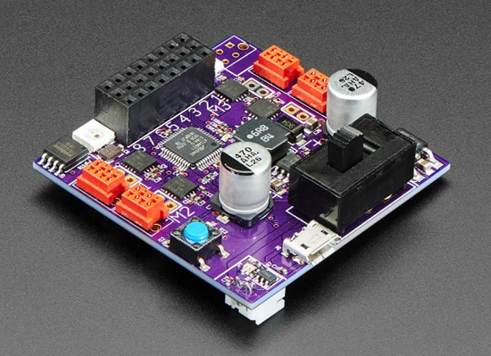](https://www.crowdsupply.com/keith-packard/snekboard)

[Back this project](https://www.crowdsupply.com/keith-packard/snekboard), [read the post](https://www.crowdsupply.com/keith-packard/snekboard/updates/crowdfunding-begins), [check out Keith's site with Snek](https://keithp.com/snek/), and [Twitter](https://twitter.com/keith_x11/with_replies?lang=en). The Snekboard is also on circuitpython.org ([and we took some photos](https://www.flickr.com/search/?user_id=35434449%40N08&view_all=1&text=snek) of the one Keith let us check out!). We are a backer! And have covered [Keith's work on the Adafruit blog](https://blog.adafruit.com/?s=%40keith_x11).

## New design, updates, and more features on circuitpython.org

Text about .org here.

## CircuitPython snakes its way to the Seeeduino XIAO

[The SEEED Seeeduino XIAO](https://www.seeedstudio.com/Seeeduino-XIAO-Arduino-Microcontroller-SAMD21-Cortex-M0+-p-4426.html) is a minimal, low-cost board that uses the Atmel ATSAMD21G18, a 32-bit ARM Cortex-M0+ processor with 256KB flash and 32KB SRAM running at 48MHz. The board is 20 x 17.5mm, and uses a USB-C connector - [circuitpython.org](https://circuitpython.org/board/seeeduino_xiao/)

## Teensy 4 and CircuitPython in the news

[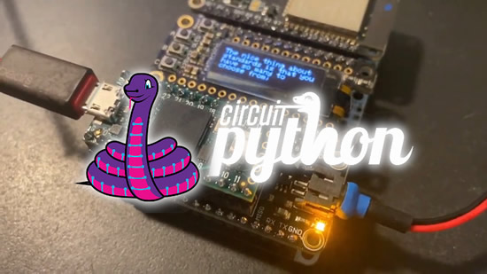](https://hackaday.com/2020/01/14/circuitpython-now-working-on-teensy-4-0/)

A follow up from last week, news made the rounds on [Hackaday](https://hackaday.com/2020/01/14/circuitpython-now-working-on-teensy-4-0/), and [hackster.io](https://www.hackster.io/news/scott-shawcroft-demos-circuitpython-compatibility-on-the-teensy-4-0-development-board-ec3c3d25e698), CircuitPython now works on the Teensy 4.0! AND there is a newer faster build already posted up in less than a week, [check it out](https://forum.pjrc.com/threads/59040-CircuitPython-on-Teensy-4!?p=226879&viewfull=1#post226879)!

## Open Source Spacecraft - Software for Space powered by CircuitPython

[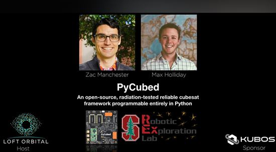](https://www.eventbrite.com/e/open-source-spacecraft-software-for-space-registration-85671256033)

The first meetup, hosted at Loft Orbital in SF will feature a presentation on an open-source Python cubesat framework by Max and KickSat-2 project by Zac from Stanford's Robotic Exploration Lab.  

The hardware and software pitfalls associated with satellite development greatly contribute to the nearly 60% failure rates of initial CubeSat missions. As the role of small satellites in commercial and scientific endeavors evolves beyond an “engineering exercise,” basic aspects of the spacecraft design must be matured and made widely available in order to continue advancing this valuable technology for Space exploration.  

PyCubed: an open-source, radiation-tested CubeSat framework that cost-effectively integrates ADCS, TT&C, C&DH, and EPS into a single PC104-compatible module programmable entirely in Python. PyRCubed addresses many hardware-related failure modes of CubeSats through component and system-level radiation testing, in-depth design and qualification documentation, and on-orbit flight performance from an ongoing LEO mission (KickSat-2). The challenge of mission-ready software development is also mitigated through low-level implementation of the Python programming language via CircuitPython.  

[Project website](https://pycubed.org/), [Rexlab](https://rexlab.stanford.edu/projects/pycubed.html), [KickSat](https://kicksat.github.io/), and [KickSat-2](https://www.nasa.gov/ames/kicksat), [Twitter](https://twitter.com/maholli404/status/1218279117100965890), and [event page](https://www.eventbrite.com/e/open-source-spacecraft-software-for-space-registration-85671256033).

## GitHub Student Developer Pack!

Student info text here.

## News from around the web!

Excellent video, and kind words, about the ItsyBitsy by @AoyamaProd - [Twitter](https://twitter.com/AoyamaProd/status/1218693474007969792).

Jungle Joe & Snakobs Bongo Bananza, A CircuitPython Game - an old school style video game for the Adafruit PyBadge. The game is made with CircuitPython and the stage library to create a Guitar Hero like game. The stage library makes it easy to make classic video games, with helper libraries for sound, sprites and collision detection. The game will also work on other variants of PyBadge hardware, like the PyGamer and the EdgeBadge. The full completed game code with all the assets can be found here - [GitHub](https://github.com/MotherTeresaHS/ICS3U-2019-Group7), [YouTube](https://youtu.be/CeF2XSuUi44), and [ics3u-2019-group7.readthedocs.io](https://ics3u-2019-group7.readthedocs.io/en/latest/#) by [@mrcoxall](https://twitter.com/mrcoxall/status/1217830972659466240)

There's also this cool Egg Collector game, [docs](https://ics3u-2019-group22.readthedocs.io/en/latest/), [GitHub](https://github.com/MotherTeresaHS/ICS3U-2019-Group22), and [YouTube](https://youtu.be/ZaqXX8tEq-s).

[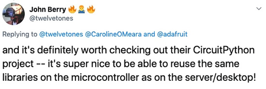](https://twitter.com/twelvetones/status/1217096877486878722)

_"CircuitPython project -- it's super nice to be able to reuse the same libraries on the microcontroller as on the server/desktop!"_ - [Twitter](https://twitter.com/twelvetones/status/1217096877486878722).

NeoPixel Strip Matrix, Animation with NeoSprite, bitmap driven animations - [Adafruit forums](https://forums.adafruit.com/viewtopic.php?f=47&t=161070), [GitHub](https://github.com/aaronaverill/CircuitPython_NeoSprite), and [YouTube](https://youtu.be/KBtatQ6hKQU).

Here's a CircuitPython -> Node+Express -> socket.io -> three.js code project from [@maker_schmitz - Twitter](https://twitter.com/maker_schmitz/status/1217966009270853645).

Starting awesome-stemma! This is the start of a new curated list of awesome Stemma connector resources including Stemma-equipped microcontrollers and breakout boards. Adafruit Stemma is a collection of solderless digital/analog/power/I2C connection standards based on JST PH 3 and 4 pin connectors. For smaller footprint breakout boards, the JST SH 4 pin connector may be used for I2C connections. Stemma equipped boards may be compatible with Seed Studio Grove connectors, SparkFun Qwiic connectors or DFRobot Gravity connectors. Cross-compatibility should be checked before interconnecting Stemma/Stemma QT boards with other manufacturer boards, as there could be connector incompatibilities or voltage issues (with Qwiic boards) - [github.com/adafruit/awesome-stemma](https://github.com/adafruit/awesome-stemma/). And we're still updating [awesome-circuitpython](https://github.com/adafruit/awesome-circuitpython) and [awesome-feather](https://github.com/adafruit/awesome-feather) too.

[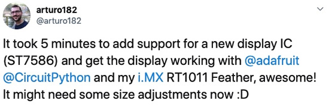](https://twitter.com/arturo182/status/1218577154457382912)

[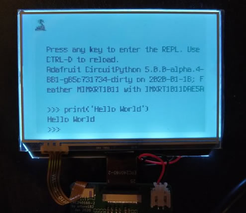](https://twitter.com/arturo182/status/1218577154457382912)

_"It took 5 minutes to add support for a new display.."_ - [Twitter](https://twitter.com/arturo182/status/1218577154457382912).

Nice PewPew M4 casemod - [Twitter](https://twitter.com/isziaui/status/1218643623211868160).

3D printers were made to print Baby Yoda's and Circuit Playground Expresses were made to move them and light them up. THAT IS THE WAY, check out what Andy from Micro Center made - [Twitter](https://twitter.com/microcenter/status/1217894340237893632).

Digi-Key is helping Allie who is headed to a local school to teach 105, 4-5 grade students how to program and use Circuit Playground Express for their computer science interim in February, and to a Library science night in March, which will give 300 more kids a chance to do the same - [Twitter](https://twitter.com/RobotMakerGirl/status/1218173385160654849).

LED Little Black Dress with Sound Reactive Mode and Other Patterns by [Geek Mom Projects](https://twitter.com/GeekMomProjects/status/1218279304309510144). Powered by a Circuit Playground Express Bluefruit - [YouTube](https://youtu.be/2HpK4HF5UF8).

[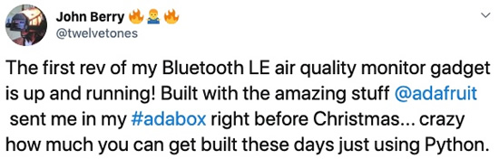](https://twitter.com/twelvetones/status/1217094444450828289)

[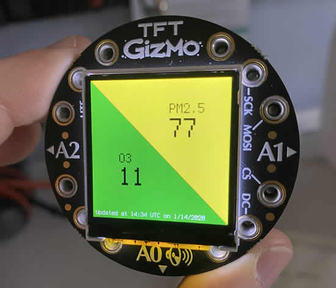](https://twitter.com/twelvetones/status/1217094444450828289)

_"crazy how much you can get built these days just using Python."_ - [Twitter](https://twitter.com/twelvetones/status/1217094444450828289).

Feather M0, Neopixels, 2 servos, and a generous amount of 3D printing by Angela. The companion bots are coming! - [Twitter](https://twitter.com/the_gella/status/1216980805508984832). The tail is a scarf that also holds the power supply.

[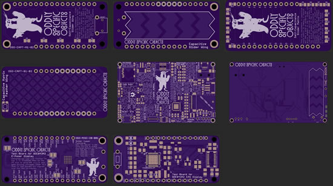](https://twitter.com/josecastillo/status/1218648110764830721)

Nice send off to OSH Park from Joey, two capacitive touch feather things, a tiny book with a tiny SAMD51, plus a board to test out a new E-Paper display - [Twitter](https://twitter.com/josecastillo/status/1218648110764830721).

[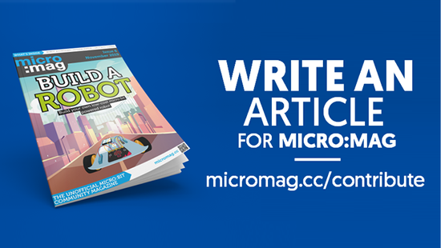](https://micromag.cc/)

[micro:mag is back for 2020](https://micromag.cc/)! The call for articles is now open! Write an article about your awesome micro:bit project, share a news story or even write a tutorial on how to make something - [micromag.cc/contribute](https://micromag.cc/contribute)

Giant light up letters and numbers with NeoPixels! - [Twitter](https://twitter.com/jonwitts/status/1217526256473907200).

Neopixel heart, in resin - [Instagram](https://www.instagram.com/p/B7ZEClqHrZ3/?igshid=i4ykn5jk18nu).

[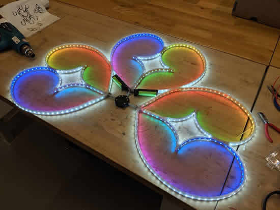](https://www.instagram.com/p/B7RMMRKHG7L/)

3D printing, wireless Neopixels, and more made their debut in Kuwait City - [Instagram](https://www.instagram.com/p/B7RMMRKHG7L/) by [MakerMatty](https://twitter.com/MatejSuchanek). More about [Matt's work here](http://www.maker.matejsuchanek.cz/en/blog/), and [YouTube](https://youtu.be/uNK1-XkPo14).

MAKING ACROSS THE CURRICULUM: Resources & Ideas for Your Adventures in Making. Rob Morrill's site to help inspire teachers from all disciplines - [Making Across the Curriculum](https://sites.google.com/view/making-across-the-curriculum/home) and check out the [projects by class](https://sites.google.com/view/making-across-the-curriculum/project-ideas-by-class?authuser=0).

Good thread on "independent" hosted mailing list services if you're looking for a way to host a mailing list for your community effort or project - [Twitter](https://twitter.com/pdp7/status/1218502180472266752).

[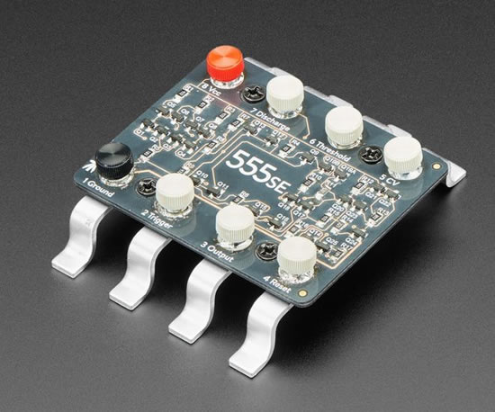](https://embedded.fm/episodes/317)

WHAT DO YOU MEAN BY DISINTEGRATED? Embedded.fm had Evil Mad Scientists Lenore Edman and Windell Oskay on [episode 317](https://embedded.fm/episodes/317).

Update from Prusa: 2019 recap, plans for 2020 and Original Prusa MINI update - [prusaprinters.org](https://blog.prusaprinters.org/2019-recap-plans-for-2020-and-original-prusa-mini-update/). [sifted.eu story on Prusa as well](https://sifted.eu/articles/prusa-research-czech-startup/).

[A Scandal in Bohemia](https://sherlock.paravelinc.com/), a cool interactive immersive Sherlock Holmes story made for the web.

[Slides from the hardwareclub.com hardware report](https://www.hardwareclub.co/pages/hardware-report#slides).

The new Microsoft Edge is out of preview and now available for download - [Windows Blogs](https://blogs.windows.com/windowsexperience/2020/01/15/new-year-new-browser-the-new-microsoft-edge-is-out-of-preview-and-now-available-for-download/).

[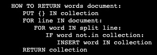](https://en.wikipedia.org/wiki/ABC_(programming_language))

Python history, the ABC Programming Language ... [from Wikipedia](https://en.wikipedia.org/wiki/ABC_(programming_language)):

>_"[ABC](https://homepages.cwi.nl/~steven/abc/) is an imperative general-purpose programming language and programming environment developed at CWI, Netherlands by Leo Geurts, Lambert Meertens, and Steven Pemberton. It is interactive, structured, high-level, and intended to be used instead of BASIC, Pascal, or AWK. It is not meant to be a systems-programming language but is intended for teaching or prototyping. The language had a major influence on the design of the Python programming language; Guido van Rossum, who developed Python, previously worked for several years on the ABC system in the mid 1980s."_

Good interview that is archived too - [The A-Z of Programming Languages](https://web.archive.org/web/20081229095320/http://www.computerworld.com.au/index.php/id%3B66665771).

It's interesting that ABC was intended for teaching or prototyping, Guido did electronics as a hobby, developed Python later, and CircuitPython is REALLY good for teaching and prototyping. Full circle, [here's an interview from 2014](https://medium.com/dropbox-makers/guido-van-rossum-on-finding-his-way-e018e8b5f6b1) -

> **You were an electronics hobbyist before becoming a programmer. How did you get started in electronics?** Okay, we're going waaaay back. I don't know exactly why I got into electronics as a kid. I remember that from the last grade in elementary school and probably through my second year in university, electronics kits and my own designs were one of my big passions. It wasn't always an easy path. In elementary school, I took one of the first projects I built into class as a show and tell project. There was no one who understood what it was or why it was interesting or cared. It's a very vague memory. I just know that I took it in, and it fell flat.

We've tried to cover some historic Python, and Python on hardware efforts too, [tinypy (2008)](https://blog.adafruit.com/2018/12/04/python-on-hardware-history-tinypy/), and [PyMite (2009)](https://blog.adafruit.com/2018/12/03/python-on-hardware-history-pymite-python/).

All in with Python, from the YouTube comments. _"go
I work at a Science Center for kids in Sweden and we decided recently to go all-in on products from you and will teach Python to the slightly older kids!"_

[The year of "No Code?"](https://www.alexhudson.com/2020/01/13/the-no-code-delusion/) - by Alex.

Python GUI Programming - [Real Python](https://realpython.com/learning-paths/python-gui-programming/).

How open source programming can offer opportunities after incarceration - [opensource.com](https://opensource.com/article/20/1/prison-to-python) and [YouTube](https://youtu.be/jNBsrLzHVgM).

[Running Python in the Linux Kernel](https://medium.com/@yon.goldschmidt/running-python-in-the-linux-kernel-7cbcbd44503c) by Yonatan.

Python in Visual Studio Code – [January 2020 Release](https://devblogs.microsoft.com/python/python-in-visual-studio-code-january-2020-release/).

scalene, a high-performance, high-precision CPU and memory profiler for Python - [GitHub](https://github.com/emeryberger/scalene).

[Managing Python Environments](https://www.pluralsight.com/tech-blog/managing-python-environments/) by John.

[Ultimate Setup for Your Next Python Project](https://martinheinz.dev/blog/14) by Martin.

[Optimizing Python Code with ctypes](https://samuelstevens.me/writing/optimizing-python-code-with-ctypes) by Samuel.

Google has a free IT automation with Python professional certificate available, [blog post](https://blog.google/outreach-initiatives/grow-with-google/new-certificate-help-people-grow-careers) and [course](https://www.coursera.org/professional-certificates/google-it-automation):

>_"When Grow with Google launched the IT Support Professional Certificate, we aimed to equip learners around the world with the fundamentals to kickstart careers in information technology. Now, on the program’s two-year anniversary, we’re expanding our IT training offering with the new Google IT Automation with Python Professional Certificate. **Python is now the most in-demand programming language, and more than 530,000 U.S. jobs, including 75,000 entry-level jobs require Python proficiency.** With this new certificate, you can learn Python, Git and IT automation within six months. The program includes a final project where learners will use their new skills to solve a problem they might encounter on the job, like building a web service using automation."_

The (Unofficial) Apple Archive - [applearchive.org](https://www.applearchive.org/?)

[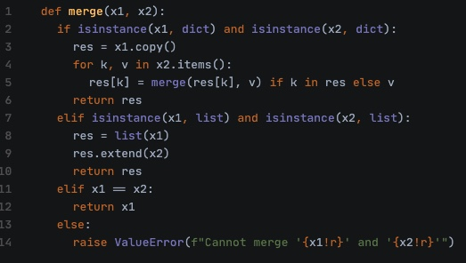](https://www.jetbrains.com/lp/mono/#intro)

[JetBrains Mono’s typeface](https://www.jetbrains.com/lp/mono/#intro) is out, here's what they say about it _"forms are simple and free from unnecessary details. Rendered in small sizes, the text looks crisper. The easier the forms, the faster the eye perceives them and the less effort the brain needs to process them."_

[Looks interesting for retro art, Smear FX](https://codemanu.itch.io/smear-fx) -

>_"Make your animations extra juice by adding some smearing to them! Just a little touch of smear can add a lot of value to animations and makes them feel smoother. Do a jump animation, a weapon swing, item spawn, maybe a logo intro animation, the possibilities are endless!"_

#ICYDNCI What was the most popular, most clicked link, in [last week's newsletter](https://www.adafruitdaily.com/2020/01/14/circuitpython-snakes-its-way-to-teensy-4-0-i-mx-feathers-take-flight-and-more-python-adafruit-circuitpython-circuitpython-micropython-thepsf-adafruit/)? [Slither Into Python: An Introduction to Python for Beginners](https://www.slitherintopython.com/).

## Coming soon

Latest CLUE design sneak preview! - [YouTube](https://youtu.be/x3rbq_yxcYM) and [post](https://blog.adafruit.com/2020/01/18/latest-clue-design-sneak-preview-nordictweets-arduino-microbit_edu-circuitpython-clue/).

[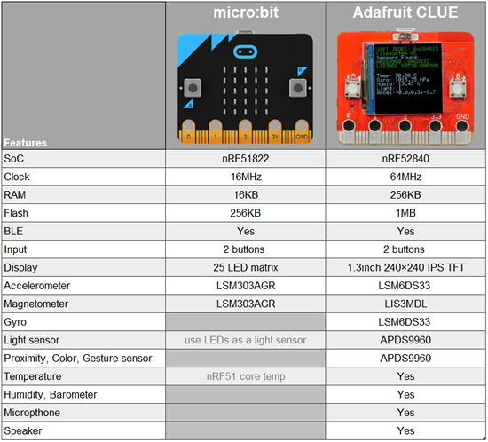](https://twitter.com/AoyamaProd/status/1217588434191011840)

Folks are posting up some comparison details wit the CLUE and micro:bit - [Twitter](https://twitter.com/AoyamaProd/status/1217588434191011840).

AR puppet streaming with Sparky, Circuit Playground Express Bluefruit and more - [YouTube](https://youtu.be/6qv-oSpJhRU).

## New Learn Guides!

[NeoPixel Infinity Cube](https://learn.adafruit.com/neopixel-infinity-cube) from [Noe and Pedro](https://learn.adafruit.com/users/pixil3d)

[MagicLight Bulb Color Mixer with Circuit Playground Bluefruit](https://learn.adafruit.com/magiclight-bulb-mixer) from [John Park](https://learn.adafruit.com/users/johnpark)

[PyPortal 2FA TOTP Authentication Friend](https://learn.adafruit.com/pyportal-2fa-totp-authentication-friend) from [Brent Rubell](https://learn.adafruit.com/users/brubell)

## Updated Guides - Now With More Python!

**You can use CircuitPython libraries on Raspberry Pi!** We're updating all of our CircuitPython guides to show how to wire up sensors to your Raspberry Pi, and load the necessary CircuitPython libraries to get going using them with Python. We'll be including the updates here so you can easily keep track of which sensors are ready to go. Check it out!

Keep checking back for more updated guides!

## CircuitPython Libraries!

CircuitPython support for hardware continues to grow. We are adding support for new sensors and breakouts all the time, as well as improving on the drivers we already have. As we add more libraries and update current ones, you can keep up with all the changes right here!

For the latest drivers, download the [Adafruit CircuitPython Library Bundle](https://circuitpython.org/libraries).

If you'd like to contribute, CircuitPython libraries are a great place to start. Have an idea for a new driver? File an issue on [CircuitPython](https://github.com/adafruit/circuitpython/issues)! Interested in helping with current libraries? Check out the [CircuitPython.org Contributing page](https://circuitpython.org/contributing). We've included open pull requests and issues from the libraries, and details about repo-level issues that need to be addressed. We have a guide on [contributing to CircuitPython with Git and Github](https://learn.adafruit.com/contribute-to-circuitpython-with-git-and-github) if you need help getting started. You can also find us in the #circuitpython channel on the [Adafruit Discord](https://adafru.it/discord). Feel free to contact Kattni (@kattni) with any questions.

You can check out this [list of all the CircuitPython libraries and drivers available](https://github.com/adafruit/Adafruit_CircuitPython_Bundle/blob/master/circuitpython_library_list.md). 

The current number of CircuitPython libraries is **206**!

**New Libraries!**

Here's this week's new CircuitPython libraries:

 * [Adafruit_CircuitPython_LIS3MDL](https://github.com/adafruit/Adafruit_CircuitPython_LIS3MDL)

**Updated Libraries!**

Here's this week's updated CircuitPython libraries:

 * [Adafruit_CircuitPython_SimpleIO](https://github.com/adafruit/Adafruit_CircuitPython_SimpleIO)
 * [Adafruit_CircuitPython_NeoPixel_SPI](https://github.com/adafruit/Adafruit_CircuitPython_NeoPixel_SPI)
 * [Adafruit_CircuitPython_Motor](https://github.com/adafruit/Adafruit_CircuitPython_Motor)
 * [Adafruit_CircuitPython_NeoPixel](https://github.com/adafruit/Adafruit_CircuitPython_NeoPixel)
 * [Adafruit_CircuitPython_Display_Notification](https://github.com/adafruit/Adafruit_CircuitPython_Display_Notification)
 * [Adafruit_CircuitPython_BLE_Apple_Notification_Center](https://github.com/adafruit/Adafruit_CircuitPython_BLE_Apple_Notification_Center)
 * [Adafruit_CircuitPython_BD3491FS](https://github.com/adafruit/Adafruit_CircuitPython_BD3491FS)
 * [Adafruit_CircuitPython_ESP_ATcontrol](https://github.com/adafruit/Adafruit_CircuitPython_ESP_ATcontrol)
 * [Adafruit_CircuitPython_DymoScale](https://github.com/adafruit/Adafruit_CircuitPython_DymoScale)
 * [Adafruit_CircuitPython_AVRprog](https://github.com/adafruit/Adafruit_CircuitPython_AVRprog)
 * [Adafruit_CircuitPython_SharpMemoryDisplay](https://github.com/adafruit/Adafruit_CircuitPython_SharpMemoryDisplay)
 * [Adafruit_CircuitPython_BMP280](https://github.com/adafruit/Adafruit_CircuitPython_BMP280)
 * [Adafruit_CircuitPython_BME680](https://github.com/adafruit/Adafruit_CircuitPython_BME680)
 * [Adafruit_CircuitPython_BME280](https://github.com/adafruit/Adafruit_CircuitPython_BME280)
 * [Adafruit_CircuitPython_PCT2075](https://github.com/adafruit/Adafruit_CircuitPython_PCT2075)
 * [Adafruit_CircuitPython_BluefruitConnect](https://github.com/adafruit/Adafruit_CircuitPython_BluefruitConnect)
 * [Adafruit_CircuitPython_SSD1305](https://github.com/adafruit/Adafruit_CircuitPython_SSD1305)
 * [Adafruit_CircuitPython_MPU6050](https://github.com/adafruit/Adafruit_CircuitPython_MPU6050)
 * [Adafruit_CircuitPython_LSM303DLH_Mag](https://github.com/adafruit/Adafruit_CircuitPython_LSM303DLH_Mag)
 * [Adafruit_CircuitPython_LSM303_Accel](https://github.com/adafruit/Adafruit_CircuitPython_LSM303_Accel)
 * [Adafruit_CircuitPython_RGBLED](https://github.com/adafruit/Adafruit_CircuitPython_RGBLED)
 * [Adafruit_CircuitPython_Touchscreen](https://github.com/adafruit/Adafruit_CircuitPython_Touchscreen)
 * [Adafruit_CircuitPython_Display_Text](https://github.com/adafruit/Adafruit_CircuitPython_Display_Text)
 * [Adafruit_CircuitPython_MIDI](https://github.com/adafruit/Adafruit_CircuitPython_MIDI)
 * [Adafruit_CircuitPython_Fingerprint](https://github.com/adafruit/Adafruit_CircuitPython_Fingerprint)
 * [Adafruit_CircuitPython_Thermistor](https://github.com/adafruit/Adafruit_CircuitPython_Thermistor)
 * [Adafruit_CircuitPython_TrellisM4](https://github.com/adafruit/Adafruit_CircuitPython_TrellisM4)
 * [Adafruit_CircuitPython_SHT31D](https://github.com/adafruit/Adafruit_CircuitPython_SHT31D)
 * [Adafruit_CircuitPython_Slideshow](https://github.com/adafruit/Adafruit_CircuitPython_Slideshow)
 * [Adafruit_CircuitPython_TinyLoRa](https://github.com/adafruit/Adafruit_CircuitPython_TinyLoRa)
 * [Adafruit_CircuitPython_NeoTrellis](https://github.com/adafruit/Adafruit_CircuitPython_NeoTrellis)
 * [Adafruit_CircuitPython_BNO055](https://github.com/adafruit/Adafruit_CircuitPython_BNO055)
 * [Adafruit_CircuitPython_framebuf](https://github.com/adafruit/Adafruit_CircuitPython_framebuf)
 * [Adafruit_CircuitPython_TFmini](https://github.com/adafruit/Adafruit_CircuitPython_TFmini)
 * [Adafruit_CircuitPython_BMP3XX](https://github.com/adafruit/Adafruit_CircuitPython_BMP3XX)
 * [Adafruit_CircuitPython_Trellis](https://github.com/adafruit/Adafruit_CircuitPython_Trellis)
 * [Adafruit_CircuitPython_ILI9341](https://github.com/adafruit/Adafruit_CircuitPython_ILI9341)
 * [Adafruit_CircuitPython_hashlib](https://github.com/adafruit/Adafruit_CircuitPython_hashlib)
 * [Adafruit_CircuitPython_Register](https://github.com/adafruit/Adafruit_CircuitPython_Register)
 * [Adafruit_CircuitPython_ESP32SPI](https://github.com/adafruit/Adafruit_CircuitPython_ESP32SPI)
 * [Adafruit_CircuitPython_GPS](https://github.com/adafruit/Adafruit_CircuitPython_GPS)
 * [Adafruit_CircuitPython_Crickit](https://github.com/adafruit/Adafruit_CircuitPython_Crickit)
 * [Adafruit_CircuitPython_EPD](https://github.com/adafruit/Adafruit_CircuitPython_EPD)
 * [Adafruit_CircuitPython_DotStar](https://github.com/adafruit/Adafruit_CircuitPython_DotStar)
 * [Adafruit_CircuitPython_FancyLED](https://github.com/adafruit/Adafruit_CircuitPython_FancyLED)
 * [Adafruit_CircuitPython_RPLIDAR](https://github.com/adafruit/Adafruit_CircuitPython_RPLIDAR)
 * [Adafruit_CircuitPython_Requests](https://github.com/adafruit/Adafruit_CircuitPython_Requests)
 * [Adafruit_CircuitPython_ImageLoad](https://github.com/adafruit/Adafruit_CircuitPython_ImageLoad)
 * [Adafruit_CircuitPython_MCP230xx](https://github.com/adafruit/Adafruit_CircuitPython_MCP230xx)
 * [Adafruit_CircuitPython_PCA9685](https://github.com/adafruit/Adafruit_CircuitPython_PCA9685)
 * [Adafruit_CircuitPython_ServoKit](https://github.com/adafruit/Adafruit_CircuitPython_ServoKit)
 * [Adafruit_CircuitPython_turtle](https://github.com/adafruit/Adafruit_CircuitPython_turtle)
 * [Adafruit_CircuitPython_LIS3DH](https://github.com/adafruit/Adafruit_CircuitPython_LIS3DH)
 * [Adafruit_CircuitPython_miniQR](https://github.com/adafruit/Adafruit_CircuitPython_miniQR)
 * [Adafruit_CircuitPython_PyPortal](https://github.com/adafruit/Adafruit_CircuitPython_PyPortal)
 * [Adafruit_CircuitPython_MCP9600](https://github.com/adafruit/Adafruit_CircuitPython_MCP9600)
 * [Adafruit_CircuitPython_seesaw](https://github.com/adafruit/Adafruit_CircuitPython_seesaw)
 * [Adafruit_CircuitPython_ADS1x15](https://github.com/adafruit/Adafruit_CircuitPython_ADS1x15)
 * [Adafruit_CircuitPython_RGB_Display](https://github.com/adafruit/Adafruit_CircuitPython_RGB_Display)
 * [Adafruit_CircuitPython_FocalTouch](https://github.com/adafruit/Adafruit_CircuitPython_FocalTouch)
 * [Adafruit_CircuitPython_ICM20649](https://github.com/adafruit/Adafruit_CircuitPython_ICM20649)
 * [Adafruit_CircuitPython_MLX90640](https://github.com/adafruit/Adafruit_CircuitPython_MLX90640)
 * [Adafruit_CircuitPython_MotorKit](https://github.com/adafruit/Adafruit_CircuitPython_MotorKit)
 * [Adafruit_CircuitPython_CircuitPlayground](https://github.com/adafruit/Adafruit_CircuitPython_CircuitPlayground)
 * [Adafruit_CircuitPython_MCP4728](https://github.com/adafruit/Adafruit_CircuitPython_MCP4728)
 * [Adafruit_CircuitPython_FeatherWing](https://github.com/adafruit/Adafruit_CircuitPython_FeatherWing)
 * [Adafruit_CircuitPython_LSM6DS](https://github.com/adafruit/Adafruit_CircuitPython_LSM6DS)
 * [Adafruit_CircuitPython_PyBadger](https://github.com/adafruit/Adafruit_CircuitPython_PyBadger)
 * [Adafruit_CircuitPython_BLE](https://github.com/adafruit/Adafruit_CircuitPython_BLE)
 * [Adafruit_CircuitPython_HT16K33](https://github.com/adafruit/Adafruit_CircuitPython_HT16K33)
 * [Adafruit_Blinka](https://github.com/adafruit/Adafruit_Blinka)

**PyPI Download Stats!**

We've written a special library called Adafruit Blinka that makes it possible to use CircuitPython Libraries on [Raspberry Pi and other compatible single-board computers](https://learn.adafruit.com/circuitpython-on-raspberrypi-linux/). Adafruit Blinka and all the CircuitPython libraries have been deployed to PyPI for super simple installation on Linux! Here are the top 10 CircuitPython libraries downloaded from PyPI in the last week, including the total downloads for those libraries:

| Library                                                | Last Week   | Total |   
|:-------                                                |:--------:   |:-----:|   
| Adafruit-Blinka                                        | 4698        | 42996 |   
| Adafruit_CircuitPython_BusDevice                       | 1351        | 23852 |   
| Adafruit_CircuitPython_NeoPixel                        | 493         | 5556 |    
| Adafruit_CircuitPython_Register                        | 395         | 5191 |    
| Adafruit_CircuitPython_MCP230xx                        | 287         | 8973 |    
| Adafruit_CircuitPython_RGB_Display                     | 159         | 1830 |    
| Adafruit_CircuitPython_HT16K33                         | 148         | 938 |     
| Adafruit_CircuitPython_Motor                           | 137         | 3259 |    
| Adafruit_CircuitPython_PCA9685                         | 129         | 3091 |    
| Adafruit_CircuitPython_seesaw                          | 122         | 2665 |    

## Upcoming events!

Scott is speaking at [PyCascades](https://2020.pycascades.com/) about Python's Next Decade and Us. It's February 8th and 9th, 2020.

>_"PyCascades is a two-day, single-track Python conference. We previously hosted PyCascades in Vancouver and Seattle. For our third iteration in 2020 we'll be in Portland, Oregon. PyCascades is organized by members of the Python communities in Vancouver, Seattle, and Portland. We aim to bring together Python users and developers from both the Pacific Northwest and around the world."_

April 15-23, 2020, Pittsburgh, Pennsylvania, USA - The PyCon 2020 conference, which will take place in Pittsburgh, is the largest annual gathering for the community using and developing the open-source Python programming language. It is produced and underwritten by the Python Software Foundation, the 501(c)(3) nonprofit organization dedicated to advancing and promoting Python. Through PyCon, the PSF advances its mission of growing the international community of Python programmers - [PyCon 2020](https://us.pycon.org/2020/).

## Latest releases

CircuitPython's stable release is [#.#.#](https://github.com/adafruit/circuitpython/releases/latest) and its unstable release is [#.#.#-##.#](https://github.com/adafruit/circuitpython/releases). New to CircuitPython? Start with our [Welcome to CircuitPython Guide](https://learn.adafruit.com/welcome-to-circuitpython).

[2019####](https://github.com/adafruit/Adafruit_CircuitPython_Bundle/releases/latest) is the latest CircuitPython library bundle.

[v#.#.#](https://micropython.org/download) is the latest MicroPython release. Documentation for it is [here](http://docs.micropython.org/en/latest/pyboard/).

[#.#.#](https://www.python.org/downloads/) is the latest Python release. The latest pre-release version is [#.#.#](https://www.python.org/download/pre-releases/).

[1570 Stars](https://github.com/adafruit/circuitpython/stargazers) Like CircuitPython? [Star it on GitHub!](https://github.com/adafruit/circuitpython)

## Call for help – CircuitPython messaging to other languages!

We [recently posted on the Adafruit blog](https://blog.adafruit.com/2018/08/15/help-bring-circuitpython-messaging-to-other-languages-circuitpython/) about bringing CircuitPython messaging to other languages, one of the exciting features of CircuitPython 4.x is translated control and error messages. Native language messages will help non-native English speakers understand what is happening in CircuitPython even though the Python keywords and APIs will still be in English. If you would like to help, [please post](https://github.com/adafruit/circuitpython/issues/1098) to the main issue on GitHub and join us on [Discord](https://adafru.it/discord).

We made this graphic with translated text, we could use your help with that to make sure we got the text right, please check out the text in the image – if there is anything we did not get correct, please let us know. Dan sent me this [handy site too](http://helloworldcollection.de/#Human).

## jobs.adafruit.com - Find a dream job, find great candidates!

[jobs.adafruit.com](https://jobs.adafruit.com/) has returned and folks are posting their skills (including CircuitPython) and companies are looking for talented makers to join their companies - from Digi-Key, to Hackaday, Microcenter, Raspberry Pi and more.

## NUMBER thanks!

The Adafruit Discord community, where we do all our CircuitPython development in the open, reached over NUMBER humans, thank you! Join today! [https://adafru.it/discord](https://adafru.it/discord)

## ICYMI - In case you missed it

[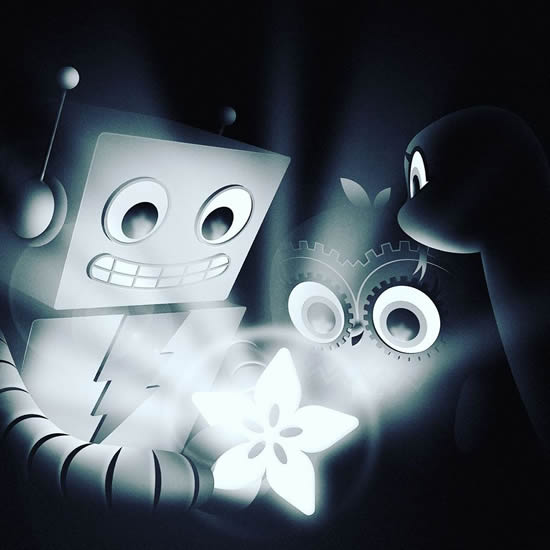](https://www.youtube.com/playlist?list=PLjF7R1fz_OOXRMjM7Sm0J2Xt6H81TdDev)

The wonderful world of Python on hardware! This is our first video-newsletter-podcast that we’ve started! The news comes from the Python community, Discord, Adafruit communities and more. It’s part of the weekly newsletter, then we have a segment on ASK an ENGINEER and this is the video slice from that! The complete Python on Hardware weekly videocast [playlist is here](https://www.youtube.com/playlist?list=PLjF7R1fz_OOXRMjM7Sm0J2Xt6H81TdDev). 

This video podcast is on [iTunes](https://itunes.apple.com/us/podcast/python-on-hardware/id1451685192?mt=2), [YouTube](https://www.youtube.com/playlist?list=PLjF7R1fz_OOXRMjM7Sm0J2Xt6H81TdDev), [IGTV (Instagram TV](https://www.instagram.com/adafruit/channel/)), and [XML](https://itunes.apple.com/us/podcast/python-on-hardware/id1451685192?mt=2).

[Weekly community chat on Adafruit Discord server CircuitPython channel - Audio / Podcast edition](https://itunes.apple.com/us/podcast/circuitpython-weekly-meeting/id1451685016) - Audio from the Discord chat space for CircuitPython, meetings are usually Mondays at 2pm ET, this is the audio version on [iTunes](https://itunes.apple.com/us/podcast/circuitpython-weekly-meeting/id1451685016), Pocket Casts, [Spotify](https://adafru.it/spotify), and [XML feed](https://adafruit-podcasts.s3.amazonaws.com/circuitpython_weekly_meeting/audio-podcast.xml).

And lastly, we are working up a one-spot destination for all things podcast-able here - [podcasts.adafruit.com](https://podcasts.adafruit.com/)

## Codecademy "Learn Hardware Programming with CircuitPython"

Codecademy, an online interactive learning platform used by more than 45 million people, has teamed up with the leading manufacturer in STEAM electronics, Adafruit Industries, to create a coding course, "Learn Hardware Programming with CircuitPython". The course is now available in the [Codecademy catalog](https://www.codecademy.com/learn/learn-circuitpython?utm_source=adafruit&utm_medium=partners&utm_campaign=circuitplayground&utm_content=pythononhardwarenewsletter).

Python is a highly versatile, easy to learn programming language that a wide range of people, from visual effects artists in Hollywood to mission control at NASA, use to quickly solve problems. But you don’t need to be a rocket scientist to accomplish amazing things with it. This new course introduces programmers to Python by way of a microcontroller — CircuitPython — which is a Python-based programming language optimized for use on hardware.

CircuitPython’s hardware-ready design makes it easier than ever to program a variety of single-board computers, and this course gets you from no experience to working prototype faster than ever before. Codecademy’s interactive learning environment, combined with Adafruit's highly rated Circuit Playground Express, present aspiring hardware hackers with a never-before-seen opportunity to learn hardware programming seamlessly online.

Whether for those who are new to programming, or for those who want to expand their skill set to include physical computing, this course will have students getting familiar with Python and creating incredible projects along the way. By the end, students will have built their own bike lights, drum machine, and even a moisture detector that can tell when it's time to water a plant.

Visit Codecademy to access the [Learn Hardware Programming with CircuitPython](https://www.codecademy.com/learn/learn-circuitpython?utm_source=adafruit&utm_medium=partners&utm_campaign=circuitplayground&utm_content=pythononhardwarenewsletter) course and Adafruit to purchase a [Circuit Playground Express](https://www.adafruit.com/product/3333).

Codecademy has helped more than 45 million people around the world upgrade their careers with technology skills. The company’s online interactive learning platform is widely recognized for providing an accessible, flexible, and engaging experience for beginners and experienced programmers alike. Codecademy has raised a total of $43 million from investors including Union Square Ventures, Kleiner Perkins, Index Ventures, Thrive Capital, Naspers, Yuri Milner and Richard Branson, most recently raising its $30 million Series C in July 2016.

## Contribute!

The CircuitPython Weekly Newsletter is a CircuitPython community-run newsletter emailed every Tuesday. The complete [archives are here](https://www.adafruitdaily.com/category/circuitpython/). It highlights the latest CircuitPython related news from around the web including Python and MicroPython developments. To contribute, edit next week's draft [on GitHub](https://github.com/adafruit/circuitpython-weekly-newsletter/tree/gh-pages/_drafts) and [submit a pull request](https://help.github.com/articles/editing-files-in-your-repository/) with the changes. Join our [Discord](https://adafru.it/discord) or [post to the forum](https://forums.adafruit.com/viewforum.php?f=60) for any further questions.
