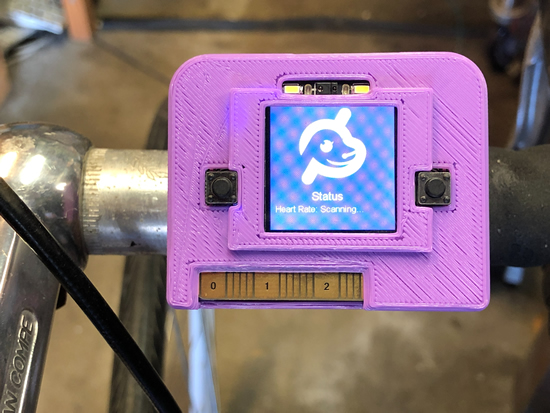
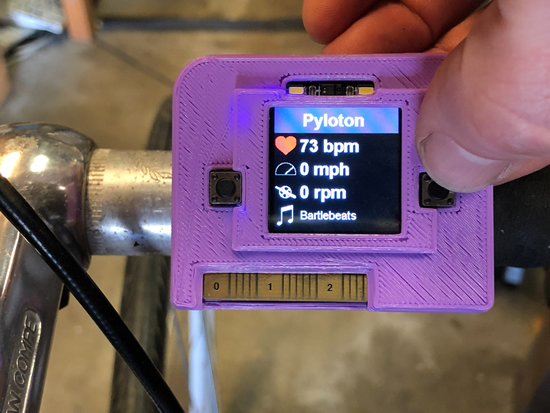
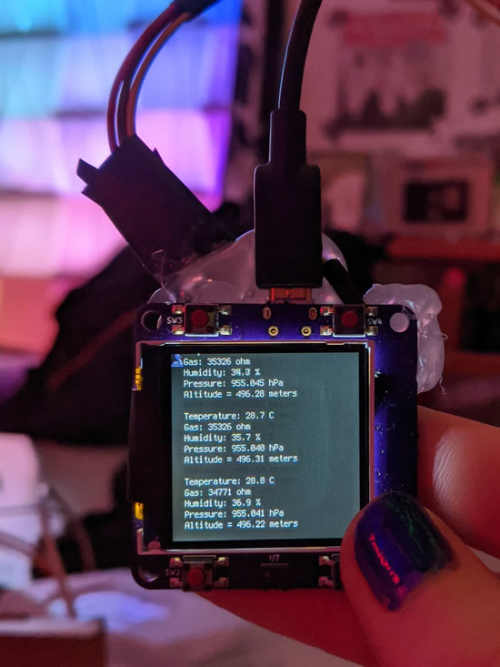
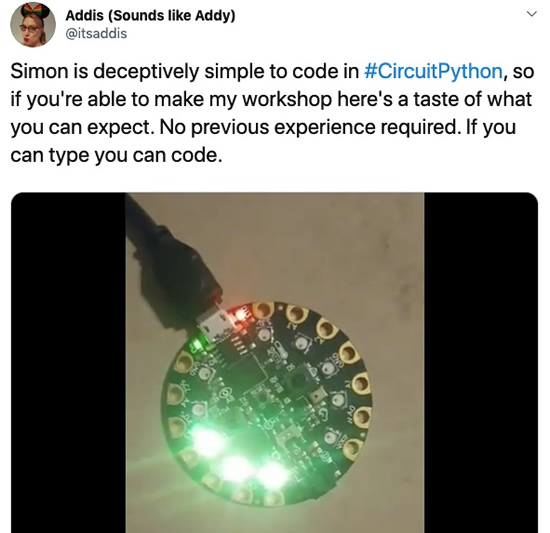
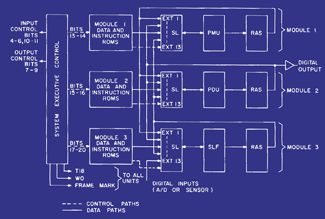
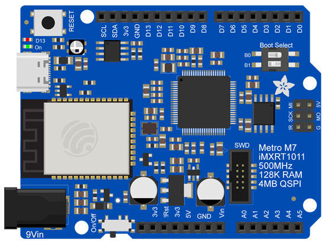
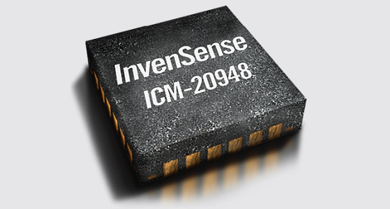
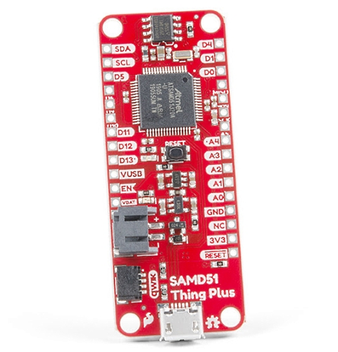
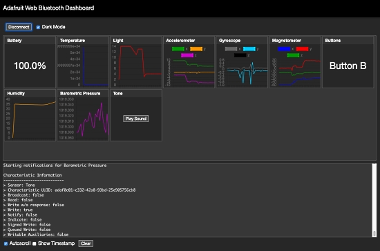

- [ ] update title
- [ ] Feature story
- [ ] Link "View this email in your browser."

[View this email]() in your browser.

Hi everyone! It's the latest Python for Microcontrollers newsletter, brought you by the community! We're on [Discord](https://discord.gg/HYqvREz), [Twitter](https://twitter.com/search?q=circuitpython&src=typed_query&f=live), and for past newsletters - [view them all here](https://www.adafruitdaily.com/category/circuitpython/). If you're reading this on the web, [subscribe here](https://www.adafruitdaily.com/). Let's get started!

## CircuitPython 5.0.0 Release Candidate 0!

**This is a 5.0.0 Release Candidate — please test!** This is release 5.0.0-rc.0 (Release candidate 0). If this release does not have show-stopper issues, it will be re-released as 5.0.0, the first 5.x.x stable release. Read more on [the blog post](https://blog.adafruit.com/2020/02/26/circuitpython-5-0-0-release-candidate-0-adafruit-circuitpython/) and download at [circuitpython.org/downloads](https://circuitpython.org/downloads). Hackster also [has some coverage](https://www.hackster.io/news/circuitpython-5-0-0-nears-completion-first-release-candidate-now-available-to-download-ac8b6cf7ef13)!

## Pyloton: Open-source CircuitPython Cycling Computer

Say hello to the open-source cycling computer that displays heart rate, speed, cadence, and song playback info ([video](https://youtu.be/XeAFPAdH4dI))! [Pyloton](https://learn.adafruit.com/pyloton?view=all) is a CircuitPython bike computer made with the CLUE board. Pyloton measures Bluetooth LE heart rate, speed, and cadence. It also provides Apple Music Service song info, combined on one small device with a sharp display and a 3D printed handlebar mount (or optional wrist mount). 

This project is the culmination of three previous Adafruit Learning System projects, plus some new abilities of our Bluefruit code to connect to multiple peripheral devices! Previously, we created these standalone projects:

*   [Now Playing: Bluetooth LE Apple Media Service Display](https://learn.adafruit.com/now-playing-bluetooth-apple-media-service-display/overview)
*   [BLE Heart Rate Zone Trainer Display](https://learn.adafruit.com/circuitpython-ble-heart-rate-monitor-gizmo/overview)
*   [BLE Cycling Speed & Cadence Sensor Display](https://learn.adafruit.com/bluetooth-bicycle-speed-cadence-sensor-display-with-clue/overview)

You may refer to those guides for additional details on the sensors, libraries, and code. Here, we'll show you how they can all be combined into one device. Learn how to make your own open-source bike computer on [learn.adafruit.com](https://learn.adafruit.com/pyloton?view=all)!

## Latest updates for the Open Hardware Summit 2020 wrist-watch badge

The Open Hardware Summit 2020 wrist-watch badge is CircuitPython powered... and it’s the [100th BOARD in circuitpython/downloads](https://circuitpython.org/board/ohs2020_badge/). Here is the latest update from Drew – [Twitter](https://twitter.com/pdp7/status/1233503461834199042).

*   [Testing of the Open Hardware Summit 2020 wrist-watch badge.](https://blog.adafruit.com/2020/02/15/testing-of-the-open-hardware-summit-2020-wrist-watch-badge-ohsummit-circuitpython-ohsummit20/)
*   [Open Hardware Summit 2020 wrist-watch badge updates.](https://blog.adafruit.com/2020/02/08/open-hardware-summit-2020-wrist-watch-badge-updates-ohsummit-circuitpython-ohsummit20/)
*   [The Open Hardware Summit 2020 badge is CircuitPython powered… and it’s the 100th BOARD!](https://blog.adafruit.com/2020/01/18/the-open-hardware-summit-2020-badge-is-circuitpython-powered-and-its-the-100th-board-ohsummit-circuitpython-ohsummit20/)
*   [2020 Open Hardware Summit #ohsummit20 topic on Adafruit’s Discord AND logos/art for the event with CircuitPython.](https://blog.adafruit.com/2020/01/26/2020-open-hardware-summit-ohsummit20-topic-on-adafruits-discord-and-logos-art-for-the-event-with-circuitpython-ohsummit-discordapp-oshwa-oshw-circuitpython/)
*   2020 Open Hardware Summit - [2020.oshwa.org](https://2020.oshwa.org/)
*   [OH Summit](https://twitter.com/ohsummit) on Twitter.

## News from around the web!

From Addis: _"Simon is deceptively simple to code in CircuitPython"_ - [Twitter](https://twitter.com/itsaddis/status/1233608800151703552).

From GeekMom! [Bright Wearables](https://brightwearables.com/) + [CLUE](https://www.adafruit.com/clue) work together to create a sound-reactive wearable that makes the perfect accessory for a musical evening out - [Instagram](https://www.instagram.com/p/B8-GkxuJ1vr/).

For Doctor Who fans, Psychic Paper using CircuitPython - [Twitter](https://twitter.com/MakerThornhill/status/1232481323970891777).

Bluefruit and Crickit - [Twitter](https://twitter.com/jontaylorCB/status/1232692895116931073).

CircuitPython powered NeoPixel tower to the LA Hardware Happy Hour - [Twitter](https://twitter.com/todbot/status/1232853199142322177) & [MeetUp](https://meetup.com/Hardware-Happy-Hour-3H-Los-Angeles/events/268563251/).

CircuitPython extension for Visual Studio Code - [Twitter](https://twitter.com/joedevivo/status/1233863203869753344).

"Commander" (16MB FLASH/SD/accelerometer/4 buttons/9 LED) running CircuitPython. Goal is for it to "play" keystrokes from a SD card - [Twitter](https://twitter.com/burtyb/status/1233526680288886784).

Kind words sent in via the [learn.adafruit.com](https://learn.adafruit.com/) feedback system for the CircuitPython powered [EZ Make reflow oven](https://learn.adafruit.com/ez-make-oven?view=all)!

[Ghost Frame](https://danthegeek.com/2019/04/04/ghost-frame-display-images-of-people-and-cats-that-dont-exist/): Display Images of People (and Cats) that Don’t Exist.

[Snekboard](https://www.crowdsupply.com/keith-packard/snekboard/updates/now-running-circuitpython): An open-hardware python microcontroller for LEGO, now runs CircuitPython on the current prototypes!

Ritual mask of a predator priest - [Instagram](https://www.instagram.com/p/B89zbZ_ImWf/?igshid=xyw9cfa0r5sf).

[Routed Gothic Font](https://webonastick.com/fonts/routed-gothic/) - [GitHub](https://github.com/dse/routed-gothic).

Sounds of COVID-19 - [shardcore.org](http://www.shardcore.org/shardpress2019/2020/02/28/the-sounds-of-covid-19/)

SweynTooth: Unleashing Mayhem over Bluetooth Low Energy - [GitHub](https://github.com/Matheus-Garbelini/sweyntooth_bluetooth_low_energy_attacks).

Codecademy has already outlived many rivals — is that enough? - [TechCrunch](https://techcrunch.com/2020/02/19/eight-years-later/). Says they have 100,000 paying members and raised $42.5 million over the last 8 years.

And in other news... [Patreon](https://blog.patreon.com/patreon-announces-series-d) is up to over 100,000 online content creators, just raised $60 million and has raised $165 million total since 2013.

Copyright Law for Makers and Educators - [MCU on Eclipse](https://mcuoneclipse.com/2020/02/24/copyright-law-for-makers-and-educators/). A little hard to follow what exactly happened, but a good read.

#ICYDNCI What was the most popular, most clicked link, in [last week's newsletter](https://www.adafruitdaily.com/2020/02/25/circuitpython-measures-up-and-why-circuitpython-is-the-future-of-digital-making-python-adafruit-circuitpython-circuitpython-micropython-thepsf-adafruit/)? [mitutoyo: A library for the Mitutoyo Digimatic (SPC) protocol using CircuitPython](https://github.com/vifino/CircuitPython-mitutoyo).

## Coming soon

Metro M7 RT1011 w/AirLift WiFi. It's not out yet...so don't ask! It was so cold out, we stayed in and worked on the Metro M7 featuring the iMX RT1011 (the lil sister chip to the RT1062 that stars in the Teensy 4). This chip is really fast, clocking at 500 MHz, and has 128K of RAM. For FLASH, it uses an external QSPI chip which we'll share for filesystem use as well. On the left we put an ESP32 footprint, we use the ESP32 as a WiFi co-processor. You can power it over USB C or a 9V DC power jack, we'll probably change out the 3V LDO regulator for a buck, since the current requirements are going to be high on this board. This is only 2 layers, but we think it might be OK.

CircuitSTONKS snakes its way to the NXP iMX RT1011 M7 Feather! Arturo sent us some Feather M7's based on the fancy new RT1011 - this chip runs at 500 MHz but is only a couple $. With plenty of QSPI FLASH on board and RAM, it can make for a nice IoT engine. Here I'm using it with our ESP32 AirLift FeatherWing for WiFi connectivity, and a small color TFT. The code is about 80 lines of CircuitPython - [available here](https://github.com/ladyada/Adafruit_Learning_System_Guides/tree/master/CircuitStonks) and [YouTube](https://youtu.be/KVpkW4LMaVU).

The Wireless Feather Bluefruit Sense test flight with Web Bluetooth! Our new Feather Bluefruit Sense is available in the adafruit shop - its jam-packed with temperature, humidity, pressure, sound, light/color/proximity, and motion/orientation sensors. Even has a lil button! How to test it out? Melissa coded up a dashboard in javascript, using a Chrome browser you can visit the webpage, pair with the Feather and display all this data wirelessly! The dashboard is comin' soon, and you can grab a feather now at [adafruit.com/bluefruitsense](https://www.adafruit.com/bluefruitsense) and [YouTube](https://youtu.be/yJs2y2HMmiw).

## New Learn Guides!

[CircuitPython BLE Advertising Beacons](https://learn.adafruit.com/circuitpython-ble-advertising-beacons).

[Pyloton: CircuitPython Cycling Computer](https://learn.adafruit.com/pyloton).

[Adafruit LIS2MDL Triple Axis Magnetometer](https://learn.adafruit.com/adafruit-lis2mdl-triple-axis-magnetometer).

## CircuitPython Libraries!

CircuitPython support for hardware continues to grow. We are adding support for new sensors and breakouts all the time, as well as improving on the drivers we already have. As we add more libraries and update current ones, you can keep up with all the changes right here!

For the latest drivers, download the [Adafruit CircuitPython Library Bundle](https://circuitpython.org/libraries).

If you'd like to contribute, CircuitPython libraries are a great place to start. Have an idea for a new driver? File an issue on [CircuitPython](https://github.com/adafruit/circuitpython/issues)! Interested in helping with current libraries? Check out the [CircuitPython.org Contributing page](https://circuitpython.org/contributing). We've included open pull requests and issues from the libraries, and details about repo-level issues that need to be addressed. We have a guide on [contributing to CircuitPython with Git and Github](https://learn.adafruit.com/contribute-to-circuitpython-with-git-and-github) if you need help getting started. You can also find us in the #circuitpython channel on the [Adafruit Discord](https://adafru.it/discord). Feel free to contact Kattni (@kattni) with any questions.

You can check out this [list of all the CircuitPython libraries and drivers available](https://github.com/adafruit/Adafruit_CircuitPython_Bundle/blob/master/circuitpython_library_list.md). 

The current number of CircuitPython libraries is **215**!

**New Libraries!**

Here's this week's new CircuitPython libraries:

 * [Adafruit_CircuitPython_HTS221](https://github.com/adafruit/Adafruit_CircuitPython_HTS221)
 * [Adafruit_CircuitPython_Wiznet5k](https://github.com/adafruit/Adafruit_CircuitPython_Wiznet5k)
 * [Adafruit_CircuitPython_BLE_BroadcastNet](https://github.com/adafruit/Adafruit_CircuitPython_BLE_BroadcastNet)

**Updated Libraries!**

Here's this week's updated CircuitPython libraries:

 * [Adafruit_CircuitPython_ATECC](https://github.com/adafruit/Adafruit_CircuitPython_ATECC)
 * [Adafruit_CircuitPython_ADT7410](https://github.com/adafruit/Adafruit_CircuitPython_ADT7410)
 * [Adafruit_CircuitPython_Requests](https://github.com/adafruit/Adafruit_CircuitPython_Requests)
 * [Adafruit_CircuitPython_BLE_Heart_Rate](https://github.com/adafruit/Adafruit_CircuitPython_BLE_Heart_Rate)
 * [Adafruit_CircuitPython_CLUE](https://github.com/adafruit/Adafruit_CircuitPython_CLUE)
 * [Adafruit_CircuitPython_FeatherWing](https://github.com/adafruit/Adafruit_CircuitPython_FeatherWing)
 * [Adafruit_CircuitPython_BluefruitSPI](https://github.com/adafruit/Adafruit_CircuitPython_BluefruitSPI)
 * [Adafruit_CircuitPython_PyBadger](https://github.com/adafruit/Adafruit_CircuitPython_PyBadger)
 * [Adafruit_CircuitPython_ESP32SPI](https://github.com/adafruit/Adafruit_CircuitPython_ESP32SPI)

**PyPI Download Stats!**

We've written a special library called Adafruit Blinka that makes it possible to use CircuitPython Libraries on [Raspberry Pi and other compatible single-board computers](https://learn.adafruit.com/circuitpython-on-raspberrypi-linux/). Adafruit Blinka and all the CircuitPython libraries have been deployed to PyPI for super simple installation on Linux! Here are the top 10 CircuitPython libraries downloaded from PyPI in the last week, including the total downloads for those libraries:

| Library                                                | Last Week   | Total |   
|:-------                                                |:--------:   |:-----:|   
| Adafruit-Blinka                                        | 2022        | 52220 |   
| Adafruit_CircuitPython_BusDevice                       | 1047        | 26512 |   
| Adafruit_CircuitPython_NeoPixel                        | 420         | 8144 |    
| Adafruit_CircuitPython_MCP230xx                        | 344         | 8587 |    
| Adafruit_CircuitPython_Register                        | 241         | 6132 |    
| Adafruit_CircuitPython_PCA9685                         | 160         | 3339 |    
| Adafruit_CircuitPython_Motor                           | 144         | 3479 |    
| Adafruit_CircuitPython_ServoKit                        | 144         | 3126 |    
| Adafruit_CircuitPython_PN532                           | 92          | 1869 |    
| Adafruit_CircuitPython_HT16K33                         | 91          | 1278 |    

## What’s the team up to this week?

What is the team up to this week? Let’s check in!

**Bryan**

Last week I managed to finish both the Arduino and CircuitPython drivers for the HTS221 as well as tester code for it to allow us to verify each and every board as they make their way from the oven to you. I also managed to write guides for both the LPS25 and HTS221. They're both in the cue for manufacturing so keep an eye out for them!

Next up I'm working with the ICM-20948 from invensense. This is a pretty groovy 9-DoF IMU that they [describe](https://www.invensense.com/wp-content/uploads/2016/06/DS-000189-ICM-20948-v1.3.pdf) to be "the World’s Lowest Power 9-Axis MEMS MotionTracking™ Device". It certainly does have lots of neat features that can enable low power operation, so I'm interested to see what it's capable of.

Over the next week I'll be working on libraries, tester code and likely a guide for the ICM-20948.

**Dan**

I finished off the last remaining blocking issues for a CircuitPython 5.0.0 general availability release, and created and released the first (well, zeroth) release candidate. So we hope to have a stable 5.0.0 release soon!

I ended up doing a lot of support over the last week, which brought me back in touch with the kinds of hardware and software issues people are currently encountering. This is helpful in figuring out what to work on next.

**Jeff**

I've continued working on [ulab](https://github.com/v923z/micropython-ulab/) with great ongoing support from its primary author, Zoltán Vörös.  Scott also pitched in by helping us with a problem importing built-in modules whose names contain dots.  There are a number of things to do before it's ready so we anticipate ulab will be in a 5.x.0 release, rather than in 5.0.0.

I also added support for SparkFun's [Thing Plus - SAMD51](https://www.sparkfun.com/products/14713) to CircuitPython.  This board has a similar microcontroller to Adafruit's [Feather M4 Express](https://www.adafruit.com/product/3857), with somewhat less storage for your Python code but a Qwiic connector—compatible with [STEMMA QT](https://learn.adafruit.com/introducing-adafruit-stemma-qt/what-is-stemma) products—built in. This will appear in the next beta or release candidate of CircuitPython.

**Kattni**

This week I continued working with the Adafruit CircuitPython PyBadger library. In preparation for PyCon 2020, I was tasked with creating a simple badge example for CLUE. After deciding I wanted the option to include a preferred pronoun, it became clear what we currently had available wasn't enough. So, I added a custom badge feature to PyBadger. It expands on the Hello-My-Name-Is-style badge to allow you to display multiple lines of text over a color-block or image background. The new feature expands the scope of what PyBadger can do significantly. With only a few lines of code, you can create a custom badge displaying whatever information you're looking to share. The new PyBadger will be available in the [CircuitPython Library Bundle](https://circuitpython.org/libraries) this week, including examples for PyBadge, Pygamer and CLUE. I'm working on a guide page to go with it that explains how to use all the features to make a custom badge on your Adafruit CLUE. Keep an eye out for that update!

**Lucian**

This past week I worked on the PulseIO implementation outside of PWMOut, which is mostly used for IR sensors. This includes PulseOut, which emulates things like TV remotes by sending a carrier signal in a defined set of pulses, and PulseIn, which interprets this information.

I also wrote a guide for getting started with the [Zephyr RTOS](https://learn.adafruit.com/blinking-led-with-zephyr-rtos) this week. Zephyr is on everyone's radar as an infrastructure layer that's being used in [MicroPython](https://github.com/micropython/micropython/tree/master/ports/zephyr) and may eventually be worked into Circuitpython. It was interesting to get to work with a new RTOS aside from my previous mainstay Mbed-OS, and I'm hoping to move a number of my personal projects to it in the future. 

**Melissa**

This past week I've been focusing on creating a Web Bluetooth dashboard that works with the Bluefruit Playground firmware on CLUE and Circuit Playground Bluefruit boards. I started off with learning Web Bluetooth and after getting the basics down, I started programming a dashboard.

It is a dynamically created dashboard written in pure JavaScript that will query the board for available services and display panels in the dashboard according to how the services are setup. I currently have it reading all of the buttons and sensors that there are currently services for and am now working on code to write to services such as the tone generator or being able to set the neopixels to a specific color. One of my favorite things about this dashboard is that it is so easy to change configuration options and change how you want the data to display.

**Scott**

This week I've been working on wrapping up BroadcastNet. I redid the scanning using `hcitool` and `hcidump` because the bluez interface always deduplicates advertisements from a single device. It's been running reliably here at my house so I've committed and released everything. John Park just got it running so expect to see a guide about it soon!

I also collaborated a bit with Dan on bug squashing for the 5.0.0 release candidate. I squashed the bug where leaving a CircuitPython device with the drive ejected but USB plugged in would crash my Mac. I also fixed a safe mode crash when exiting the REPL with CTRL-D.

I'm vacationing the last half of this week in Colorado. Thursday is a bit of work day because I am visiting SparkFun and meeting up with Great Scott Gadget folks to chat about CircuitPython! The rest of the weekend is vacation.

Next week, after the regular CircuitPython Weekly, I'm going to jump into basic power savings so that `time.sleep` will actually sleep the CPU. Hopefully that basic work will give a big energy savings for all of the BroadcastNet sensors and other CircuitPython boards.

## Upcoming events!

[The 2020 Open Hardware Summit](https://2020.oshwa.org/) is March 13th 2020, NYU School of Law, New York USA. [The "badge"](https://hackaday.com/2020/01/21/circuitpython-slithers-into-100th-board-the-ohs-2020-badge/) for the event is CircuitPython powered!

>_"The Open Hardware Summit is the annual conference organized by the Open Source Hardware Association a 501(c)(3) not for profit charity. It is the world’s first comprehensive conference on open hardware; a venue and community in which we discuss and draw attention to the rapidly growing Open Source Hardware movement. Speakers include world renowned leaders from industry, academia, the arts and maker community. Talks cover a wide range of subjects from electronics, mechanics to related fields such as digital fabrication, fashion technology, self-quantification devices, and IP law. As a microcosm of the Open Source Hardware community, the Summit provides an annual friendly forum for the community."_

Additionally, there is a [2020 Open Hardware Summit topic on Discord](https://discord.gg/8RVyqnk) to join before, during, and after! - [Discord](https://discord.gg/8RVyqnk).

April 15-23, 2020, Pittsburgh, Pennsylvania, USA - The PyCon 2020 conference, which will take place in Pittsburgh, is the largest annual gathering for the community using and developing the open-source Python programming language. It is produced and underwritten by the Python Software Foundation, the 501(c)(3) nonprofit organization dedicated to advancing and promoting Python. Through PyCon, the PSF advances its mission of growing the international community of Python programmers - [PyCon 2020](https://us.pycon.org/2020/).

## Latest releases

CircuitPython's stable release is [#.#.#](https://github.com/adafruit/circuitpython/releases/latest) and its unstable release is [#.#.#-##.#](https://github.com/adafruit/circuitpython/releases). New to CircuitPython? Start with our [Welcome to CircuitPython Guide](https://learn.adafruit.com/welcome-to-circuitpython).

[2019####](https://github.com/adafruit/Adafruit_CircuitPython_Bundle/releases/latest) is the latest CircuitPython library bundle.

[v#.#.#](https://micropython.org/download) is the latest MicroPython release. Documentation for it is [here](http://docs.micropython.org/en/latest/pyboard/).

[#.#.#](https://www.python.org/downloads/) is the latest Python release. The latest pre-release version is [#.#.#](https://www.python.org/download/pre-releases/).

[1612 Stars](https://github.com/adafruit/circuitpython/stargazers) Like CircuitPython? [Star it on GitHub!](https://github.com/adafruit/circuitpython)

## Call for help – CircuitPython messaging to other languages!

We [recently posted on the Adafruit blog](https://blog.adafruit.com/2018/08/15/help-bring-circuitpython-messaging-to-other-languages-circuitpython/) about bringing CircuitPython messaging to other languages, one of the exciting features of CircuitPython 4 and later versions is translated control and error messages. Native language messages will help non-native English speakers understand what is happening in CircuitPython even though the Python keywords and APIs will still be in English. If you would like to help, [please post](https://github.com/adafruit/circuitpython/issues/1098) to the main issue on GitHub and join us on [Discord](https://adafru.it/discord).

We made this graphic with translated text, we could use your help with that to make sure we got the text right, please check out the text in the image – if there is anything we did not get correct, please let us know. Dan sent me this [handy site too](http://helloworldcollection.de/#Human).

## jobs.adafruit.com - Find a dream job, find great candidates!

[jobs.adafruit.com](https://jobs.adafruit.com/) has returned and folks are posting their skills (including CircuitPython) and companies are looking for talented makers to join their companies - from Digi-Key, to Hackaday, Microcenter, Raspberry Pi and more.

## 16,702 thanks!

The Adafruit Discord community, where we do all our CircuitPython development in the open, reached over 16,702 humans, thank you! Join today! [https://adafru.it/discord](https://adafru.it/discord)

## We are now in server Discovery! JOIN 16,000+ makers!

YAY! Discord's server Discovery has a bunch of requirements and our community got there together! [The Adafruit's community Discord server](https://discord.gg/adafruit) is now in server Discovery! Here were the requirements!
  
**Safe Environment**  
_Thanks for abiding by our community Guidelines and keeping your server safe!_  
  
**250+ Members**  
_For now, Discovery is limited to only servers with more than 250 members._  
  
**Meets Age Requirement**  
_Servers in Discover have to be at least 8 weeks old._  
  
**Healthy Community**  
_Your community metrics look great! Your members are active and continuously come back to participate._  
  
**No Bad Words**  
_Your server name, description, and channel names looks clean!_  
  
**2FA Requirement For Moderation Enabled**  
_Members with moderation powered (e.g. admins or mods) are required to have 2FA enabled to perform moderation actions._  
  
You can find it by click the magnifying glass and searching for: Adafruit, DIY, electronics, Python, Raspberry Pi, Arduino, and more! Join all 16,000+ makers on the Adafruit Community server! [https://discord.gg/adafruit](https://discord.gg/adafruit)

## ICYMI - In case you missed it

The wonderful world of Python on hardware! This is our first video-newsletter-podcast that we’ve started! The news comes from the Python community, Discord, Adafruit communities and more. It’s part of the weekly newsletter, then we have a segment on ASK an ENGINEER and this is the video slice from that! The complete Python on Hardware weekly videocast [playlist is here](https://www.youtube.com/playlist?list=PLjF7R1fz_OOXRMjM7Sm0J2Xt6H81TdDev). 

This video podcast is on [iTunes](https://itunes.apple.com/us/podcast/python-on-hardware/id1451685192?mt=2), [YouTube](https://www.youtube.com/playlist?list=PLjF7R1fz_OOXRMjM7Sm0J2Xt6H81TdDev), [IGTV (Instagram TV](https://www.instagram.com/adafruit/channel/)), and [XML](https://itunes.apple.com/us/podcast/python-on-hardware/id1451685192?mt=2).

[Weekly community chat on Adafruit Discord server CircuitPython channel - Audio / Podcast edition](https://itunes.apple.com/us/podcast/circuitpython-weekly-meeting/id1451685016) - Audio from the Discord chat space for CircuitPython, meetings are usually Mondays at 2pm ET, this is the audio version on [iTunes](https://itunes.apple.com/us/podcast/circuitpython-weekly-meeting/id1451685016), Pocket Casts, [Spotify](https://adafru.it/spotify), and [XML feed](https://adafruit-podcasts.s3.amazonaws.com/circuitpython_weekly_meeting/audio-podcast.xml).

And lastly, we are working up a one-spot destination for all things podcast-able here - [podcasts.adafruit.com](https://podcasts.adafruit.com/)

## Codecademy "Learn Hardware Programming with CircuitPython"

Codecademy, an online interactive learning platform used by more than 45 million people, has teamed up with the leading manufacturer in STEAM electronics, Adafruit Industries, to create a coding course, "Learn Hardware Programming with CircuitPython". The course is now available in the [Codecademy catalog](https://www.codecademy.com/learn/learn-circuitpython?utm_source=adafruit&utm_medium=partners&utm_campaign=circuitplayground&utm_content=pythononhardwarenewsletter).

Python is a highly versatile, easy to learn programming language that a wide range of people, from visual effects artists in Hollywood to mission control at NASA, use to quickly solve problems. But you don’t need to be a rocket scientist to accomplish amazing things with it. This new course introduces programmers to Python by way of a microcontroller — CircuitPython — which is a Python-based programming language optimized for use on hardware.

CircuitPython’s hardware-ready design makes it easier than ever to program a variety of single-board computers, and this course gets you from no experience to working prototype faster than ever before. Codecademy’s interactive learning environment, combined with Adafruit's highly rated Circuit Playground Express, present aspiring hardware hackers with a never-before-seen opportunity to learn hardware programming seamlessly online.

Whether for those who are new to programming, or for those who want to expand their skill set to include physical computing, this course will have students getting familiar with Python and creating incredible projects along the way. By the end, students will have built their own bike lights, drum machine, and even a moisture detector that can tell when it's time to water a plant.

Visit Codecademy to access the [Learn Hardware Programming with CircuitPython](https://www.codecademy.com/learn/learn-circuitpython?utm_source=adafruit&utm_medium=partners&utm_campaign=circuitplayground&utm_content=pythononhardwarenewsletter) course and Adafruit to purchase a [Circuit Playground Express](https://www.adafruit.com/product/3333).

Codecademy has helped more than 45 million people around the world upgrade their careers with technology skills. The company’s online interactive learning platform is widely recognized for providing an accessible, flexible, and engaging experience for beginners and experienced programmers alike. Codecademy has raised a total of $43 million from investors including Union Square Ventures, Kleiner Perkins, Index Ventures, Thrive Capital, Naspers, Yuri Milner and Richard Branson, most recently raising its $30 million Series C in July 2016.

## Contribute!

The CircuitPython Weekly Newsletter is a CircuitPython community-run newsletter emailed every Tuesday. The complete [archives are here](https://www.adafruitdaily.com/category/circuitpython/). It highlights the latest CircuitPython related news from around the web including Python and MicroPython developments. To contribute, edit next week's draft [on GitHub](https://github.com/adafruit/circuitpython-weekly-newsletter/tree/gh-pages/_drafts) and [submit a pull request](https://help.github.com/articles/editing-files-in-your-repository/) with the changes. Join our [Discord](https://adafru.it/discord) or [post to the forum](https://forums.adafruit.com/viewforum.php?f=60) for any further questions.
